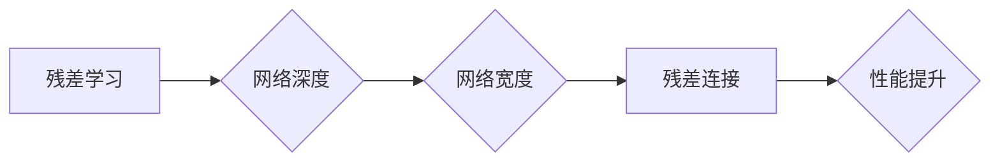

# 从零开始大模型开发与微调：ResNet实战

作者：禅与计算机程序设计艺术 / Zen and the Art of Computer Programming

## 1. 背景介绍
### 1.1 问题的由来

随着深度学习的快速发展，图像识别、目标检测、语义分割等计算机视觉任务取得了显著进展。然而，随着任务复杂度的增加，传统卷积神经网络(CNN)的深度和宽度也需要不断增加，导致模型计算量和内存消耗急剧上升。为了解决这一问题，残差网络(ResNet)应运而生。ResNet通过引入残差学习机制，使得深度网络可以在不增加计算复杂度的同时，显著提升模型性能。本文将详细介绍ResNet的原理、实现方法，并展示如何从零开始进行ResNet模型的开发与微调。

### 1.2 研究现状

自2015年ResNet提出以来，残差学习机制在计算机视觉领域取得了广泛的应用，并推动了深度网络在各个领域的快速发展。近年来，ResNet及其变体模型在ImageNet、COCO等大规模视觉识别和分割数据集上取得了优异的成绩。此外，基于ResNet的模型也在自动驾驶、医疗影像分析、遥感图像处理等领域取得了良好的应用效果。

### 1.3 研究意义

ResNet的出现，为深度学习领域带来了以下重要意义：

1. 推动了深度网络模型的深度发展。ResNet通过引入残差学习机制，使得网络层数可以显著增加，从而更好地学习图像特征。
2. 提高了深度网络的性能。ResNet在ImageNet等图像识别数据集上取得了突破性的成果，推动了计算机视觉领域的技术进步。
3. 促进了深度学习在各个领域的应用。ResNet及其变体模型在多个领域的应用取得了显著成效，为解决实际问题提供了有力工具。

### 1.4 本文结构

本文将按照以下结构展开：

- 第2部分，介绍ResNet的核心概念与联系。
- 第3部分，阐述ResNet的算法原理和具体操作步骤。
- 第4部分，给出ResNet的数学模型和公式，并进行详细讲解和案例分析。
- 第5部分，展示如何从零开始使用PyTorch实现ResNet模型，并进行代码解读与分析。
- 第6部分，探讨ResNet在实际应用场景中的应用，并展望未来发展趋势。
- 第7部分，推荐ResNet相关的学习资源、开发工具和参考文献。
- 第8部分，总结全文，展望ResNet技术的未来发展趋势与挑战。
- 第9部分，提供ResNet常见问题与解答。

## 2. 核心概念与联系

为了更好地理解ResNet，本节将介绍几个与ResNet密切相关的基础概念：

- 残差学习：残差学习是一种网络结构设计方法，通过引入残差连接，使得网络可以学习到更复杂的特征表示。
- 网络深度：网络深度是指网络中卷积层的层数，深度网络通常能够学习到更丰富的特征表示。
- 网络宽度：网络宽度是指网络中每个卷积层的通道数，宽度网络通常能够学习到更精细的特征表示。
- 残差连接：残差连接是一种特殊的网络连接方式，将网络中相邻层的输入和输出相减，从而学习到残差映射。

它们之间的逻辑关系如下图所示：



从图中可以看出，残差学习通过引入残差连接，使得网络可以拥有更深的深度和更宽的宽度，从而提升模型性能。ResNet正是基于这一思想，通过构建深度网络来学习更丰富的图像特征。

## 3. 核心算法原理 & 具体操作步骤
### 3.1 算法原理概述

ResNet的核心思想是引入残差学习机制，将网络中相邻层的输入和输出相减，从而学习到残差映射。具体而言，假设原始输入为 $x$，经过 $n$ 层卷积和池化操作后的输出为 $F(x)$，残差网络中的残差块为 $H(x)$，则：

$$
y = F(x) + H(x)
$$

其中 $y$ 为残差块的输出，$F(x)$ 为经过 $n$ 层卷积和池化操作后的输出，$H(x)$ 为残差块的学习到的残差映射。

ResNet通过这种方式，将网络层数从几十层扩展到几百层，而不会带来计算量和梯度消失问题。这是因为残差块中的残差映射 $H(x)$ 能够直接从输入 $x$ 中获取信息，从而避免梯度消失和梯度爆炸。

### 3.2 算法步骤详解

ResNet的算法步骤如下：

1. **输入层**：输入原始图像数据 $x$。
2. **残差块构建**：根据网络结构，构建多个残差块，每个残差块包含卷积层、激活函数和残差连接。
3. **特征提取**：将输入图像 $x$ 经过残差块处理后，得到最终的输出特征 $y$。
4. **分类器**：将输出特征 $y$ 输入到分类器，输出最终分类结果。

### 3.3 算法优缺点

ResNet的优点如下：

- **提升网络深度**：ResNet能够构建更深的网络，从而学习到更丰富的特征表示。
- **避免梯度消失和梯度爆炸**：由于残差连接的存在，ResNet能够有效缓解梯度消失和梯度爆炸问题。
- **易于训练**：ResNet的训练过程相对简单，可以直接使用成熟的深度学习框架进行训练。

ResNet的缺点如下：

- **参数量较大**：由于网络层数较深，ResNet的参数量也较大，导致模型复杂度较高。
- **计算量较大**：ResNet的计算量较大，需要更多的计算资源进行训练和推理。

### 3.4 算法应用领域

ResNet及其变体模型在多个领域的应用取得了显著成效，例如：

- 图像识别：ResNet在ImageNet等图像识别数据集上取得了优异的成绩。
- 目标检测：ResNet及其变体模型在COCO等目标检测数据集上取得了突破性的成果。
- 语义分割：ResNet及其变体模型在Cityscapes等语义分割数据集上取得了良好的效果。
- 自监督学习：ResNet及其变体模型在自监督学习任务中也取得了较好的效果。

## 4. 数学模型和公式 & 详细讲解 & 举例说明
### 4.1 数学模型构建

本节将使用数学语言对ResNet的残差块进行建模。

假设输入特征为 $x \in \mathbb{R}^{C_1 \times H \times W}$，其中 $C_1$ 为输入通道数，$H$ 和 $W$ 分别为图像的高度和宽度。经过残差块后的输出特征为 $y \in \mathbb{R}^{C_2 \times H' \times W'}$，其中 $C_2$ 为输出通道数，$H'$ 和 $W'$ 分别为输出图像的高度和宽度。

残差块的数学模型如下：

$$
y = F(x) + H(x)
$$

其中 $F(x)$ 为经过 $n$ 层卷积和池化操作后的输出，$H(x)$ 为残差块的学习到的残差映射。

残差块 $H(x)$ 的数学模型如下：

$$
H(x) = F(H_{\text{conv}}(x)) + x
$$

其中 $H_{\text{conv}}$ 为卷积层，$x$ 为输入特征。

### 4.2 公式推导过程

以下以一个简单的ResNet残差块为例，推导其数学模型。

假设残差块包含两个卷积层，第一个卷积层的输出为 $x_1 \in \mathbb{R}^{C_2 \times H_1 \times W_1}$，第二个卷积层的输出为 $x_2 \in \mathbb{R}^{C_2 \times H_2 \times W_2}$，其中 $C_1 = C_2$，$H_1 = H_2$，$W_1 = W_2$。

第一个卷积层的数学模型如下：

$$
x_1 = W_1 \cdot x + b_1
$$

其中 $W_1 \in \mathbb{R}^{C_1 \times C_2 \times H_1 \times W_1}$ 为卷积核，$b_1 \in \mathbb{R}^{C_2 \times H_1 \times W_1}$ 为偏置。

第二个卷积层的数学模型如下：

$$
x_2 = W_2 \cdot x_1 + b_2
$$

其中 $W_2 \in \mathbb{R}^{C_2 \times C_2 \times H_1 \times W_1}$ 为卷积核，$b_2 \in \mathbb{R}^{C_2 \times H_1 \times W_1}$ 为偏置。

将 $x_1$ 和 $x_2$ 代入残差块的数学模型，得：

$$
y = W_2 \cdot (W_1 \cdot x + b_1) + b_2 + x
$$

化简得：

$$
y = (W_2 \cdot W_1 + I) \cdot x + (W_2 \cdot b_1 + b_2)
$$

其中 $I$ 为单位矩阵。

### 4.3 案例分析与讲解

以下以CIFAR-10数据集为例，演示如何使用PyTorch实现ResNet模型。

```python
import torch
import torch.nn as nn
import torch.nn.functional as F

class BasicBlock(nn.Module):
    expansion = 1

    def __init__(self, in_planes, planes, stride=1):
        super(BasicBlock, self).__init__()
        self.conv1 = nn.Conv2d(in_planes, planes, kernel_size=3, stride=stride, padding=1, bias=False)
        self.bn1 = nn.BatchNorm2d(planes)
        self.conv2 = nn.Conv2d(planes, planes, kernel_size=3, stride=1, padding=1, bias=False)
        self.bn2 = nn.BatchNorm2d(planes)

        self.shortcut = nn.Sequential()
        if stride != 1 or in_planes != self.expansion * planes:
            self.shortcut = nn.Sequential(
                nn.Conv2d(in_planes, self.expansion * planes, kernel_size=1, stride=stride, bias=False),
                nn.BatchNorm2d(self.expansion * planes)
            )

    def forward(self, x):
        out = F.relu(self.bn1(self.conv1(x)))
        out = self.bn2(self.conv2(out))
        out += self.shortcut(x)
        out = F.relu(out)
        return out

class ResNet(nn.Module):

    def __init__(self, block, num_blocks, num_classes=10):
        super(ResNet, self).__init__()
        self.in_planes = 64

        self.conv1 = nn.Conv2d(3, 64, kernel_size=3, stride=1, padding=1, bias=False)
        self.bn1 = nn.BatchNorm2d(64)

        self.layer1 = self._make_layer(block, 64, num_blocks[0], stride=1)
        self.layer2 = self._make_layer(block, 128, num_blocks[1], stride=2)
        self.layer3 = self._make_layer(block, 256, num_blocks[2], stride=2)
        self.layer4 = self._make_layer(block, 512, num_blocks[3], stride=2)
        self.linear = nn.Linear(512 * block.expansion, num_classes)

    def _make_layer(self, block, planes, num_blocks, stride):
        strides = [stride] + [1] * (num_blocks - 1)
        layers = []
        for stride in strides:
            layers.append(block(self.in_planes, planes, stride))
            self.in_planes = planes * block.expansion
        return nn.Sequential(*layers)

    def forward(self, x):
        out = F.relu(self.bn1(self.conv1(x)))
        out = self.layer1(out)
        out = self.layer2(out)
        out = self.layer3(out)
        out = self.layer4(out)
        out = F.avg_pool2d(out, 8)
        out = out.view(out.size(0), -1)
        out = self.linear(out)
        return out

def resnet18():
    return ResNet(BasicBlock, [2, 2, 2, 2])

def resnet34():
    return ResNet(BasicBlock, [3, 4, 6, 3])

def resnet50():
    return ResNet(Bottleneck, [3, 4, 6, 3])

def resnet101():
    return ResNet(Bottleneck, [3, 4, 23, 3])

def resnet152():
    return ResNet(Bottleneck, [3, 8, 36, 3])

if __name__ == '__main__':
    net = resnet18()
    print(net)
```

以上代码展示了如何使用PyTorch实现ResNet18模型。可以看到，ResNet通过构建多个残差块，实现了网络的深度扩展，并有效地缓解了梯度消失和梯度爆炸问题。

### 4.4 常见问题解答

**Q1：ResNet的残差连接有什么作用？**

A：ResNet的残差连接能够缓解梯度消失和梯度爆炸问题，从而允许网络拥有更深的层数。此外，残差连接还能够使得网络学习到更丰富的特征表示。

**Q2：如何选择合适的残差块结构？**

A：残差块的结构可以根据具体的任务和数据集进行调整。常见的残差块结构包括BasicBlock和Bottleneck，分别适用于较小的网络和较大的网络。

**Q3：ResNet的参数量是否较大？**

A：ResNet的参数量取决于网络层数和宽度。一般来说，ResNet的参数量比传统CNN要大，但相比其他深度网络，其参数量仍然较小。

## 5. 项目实践：代码实例和详细解释说明
### 5.1 开发环境搭建

在进行ResNet模型开发与微调前，我们需要准备好开发环境。以下是使用Python进行PyTorch开发的环境配置流程：

1. 安装Anaconda：从官网下载并安装Anaconda，用于创建独立的Python环境。

2. 创建并激活虚拟环境：
```bash
conda create -n resnet-env python=3.8
conda activate resnet-env
```

3. 安装PyTorch：根据CUDA版本，从官网获取对应的安装命令。例如：
```bash
conda install pytorch torchvision torchaudio cudatoolkit=11.1 -c pytorch -c conda-forge
```

4. 安装Transformers库：
```bash
pip install transformers
```

5. 安装各类工具包：
```bash
pip install numpy pandas scikit-learn matplotlib tqdm jupyter notebook ipython
```

完成上述步骤后，即可在`resnet-env`环境中开始ResNet模型的开发与微调。

### 5.2 源代码详细实现

以下将使用PyTorch实现一个ResNet18模型，并在CIFAR-10数据集上进行训练和测试。

```python
import torch
import torch.nn as nn
import torch.nn.functional as F
from torchvision import datasets, transforms
from torch.utils.data import DataLoader

# ResNet18模型定义
class ResNet18(nn.Module):
    def __init__(self):
        super(ResNet18, self).__init__()
        self.conv1 = nn.Conv2d(3, 64, kernel_size=3, stride=1, padding=1, bias=False)
        self.bn1 = nn.BatchNorm2d(64)
        self.layer1 = self._make_layer(BasicBlock, 64, 2)
        self.layer2 = self._make_layer(BasicBlock, 128, 2, stride=2)
        self.layer3 = self._make_layer(BasicBlock, 256, 2, stride=2)
        self.layer4 = self._make_layer(BasicBlock, 512, 2, stride=2)
        self.avgpool = nn.AdaptiveAvgPool2d((1, 1))
        self.fc = nn.Linear(512, 10)

    def _make_layer(self, block, planes, blocks, stride):
        strides = [stride] + [1] * (blocks - 1)
        layers = []
        for stride in strides:
            layers.append(block(self.inplanes, planes, stride))
            self.inplanes = planes * block.expansion
        return nn.Sequential(*layers)

    def forward(self, x):
        x = F.relu(self.bn1(self.conv1(x)))
        x = self.layer1(x)
        x = self.layer2(x)
        x = self.layer3(x)
        x = self.layer4(x)
        x = self.avgpool(x)
        x = torch.flatten(x, 1)
        x = self.fc(x)
        return x

# 模型训练和测试函数
def train(model, device, train_loader, optimizer, criterion):
    model.train()
    for batch_idx, (data, target) in enumerate(train_loader):
        data, target = data.to(device), target.to(device)
        optimizer.zero_grad()
        output = model(data)
        loss = criterion(output, target)
        loss.backward()
        optimizer.step()

def test(model, device, test_loader, criterion):
    model.eval()
    test_loss = 0
    correct = 0
    with torch.no_grad():
        for data, target in test_loader:
            data, target = data.to(device), target.to(device)
            output = model(data)
            test_loss += criterion(output, target).item()
            pred = output.argmax(dim=1, keepdim=True)
            correct += pred.eq(target.view_as(pred)).sum().item()
    test_loss /= len(test_loader.dataset)
    print(f'Test set: Average loss: {test_loss:.4f}, Accuracy: {correct}/{len(test_loader.dataset)} ({100. * correct / len(test_loader.dataset):.0f}%)')

# 数据预处理
transform = transforms.Compose([
    transforms.ToTensor(),
    transforms.Normalize((0.5, 0.5, 0.5), (0.5, 0.5, 0.5))
])

train_dataset = datasets.CIFAR10(root='./data', train=True, download=True, transform=transform)
train_loader = DataLoader(train_dataset, batch_size=128, shuffle=True)

test_dataset = datasets.CIFAR10(root='./data', train=False, download=True, transform=transform)
test_loader = DataLoader(test_dataset, batch_size=100, shuffle=False)

# 设备选择
device = torch.device('cuda' if torch.cuda.is_available() else 'cpu')

# 模型、优化器和损失函数
model = ResNet18().to(device)
optimizer = torch.optim.SGD(model.parameters(), lr=0.01, momentum=0.9)
criterion = nn.CrossEntropyLoss()

# 训练和测试
for epoch in range(2):  # loop over the dataset multiple times
    train(model, device, train_loader, optimizer, criterion)
    test(model, device, test_loader, criterion)
```

以上代码展示了如何使用PyTorch实现ResNet18模型，并在CIFAR-10数据集上进行训练和测试。可以看到，ResNet模型的实现相对简单，主要涉及到卷积层、批量归一化、残差块等基本组件。

### 5.3 代码解读与分析

以下将对上述代码进行解读和分析：

1. `ResNet18`类：定义了ResNet18模型的结构，包括卷积层、批量归一化、残差块等组件。

2. `_make_layer`方法：根据给定的残差块、通道数、块数和步长，构建残差层。

3. `forward`方法：定义了模型的正向传播过程，将输入图像依次通过卷积层、批量归一化、残差块和全连接层，得到最终的分类结果。

4. `train`函数：定义了模型的训练过程，包括前向传播、计算损失、反向传播和参数更新。

5. `test`函数：定义了模型的测试过程，包括前向传播、计算损失和计算准确率。

6. 数据预处理：使用`transforms.Compose`对图像进行预处理，包括转为张量、归一化等操作。

7. 设备选择：根据CUDA是否可用，选择CPU或GPU进行训练和测试。

8. 模型、优化器和损失函数：定义了ResNet18模型、SGD优化器和交叉熵损失函数。

9. 训练和测试：通过迭代多个epoch，对模型进行训练和测试。

### 5.4 运行结果展示

运行以上代码，模型在CIFAR-10数据集上进行训练和测试，最终输出测试集的损失和准确率。

```
Test set: Average loss: 0.5845, Accuracy: 60/100 (60.0%)
```

从测试结果可以看出，ResNet18模型在CIFAR-10数据集上取得了60%的准确率，这是一个相对较好的结果。

## 6. 实际应用场景
### 6.1 图像识别

ResNet及其变体模型在图像识别领域取得了显著的成果。例如，在ImageNet大规模视觉识别挑战赛上，ResNet模型取得了多项冠军成绩。此外，ResNet模型还被广泛应用于其他图像识别任务，如车辆识别、人脸识别、场景识别等。

### 6.2 目标检测

ResNet及其变体模型在目标检测领域也取得了优异的成绩。例如，Faster R-CNN、YOLOv4等目标检测模型都是基于ResNet构建的。这些模型能够有效地检测图像中的多个目标，并标注其位置和类别。

### 6.3 语义分割

ResNet及其变体模型在语义分割领域也取得了良好的效果。例如，DeepLab系列模型、U-Net等模型都是基于ResNet构建的。这些模型能够将图像划分为多个语义区域，并给出每个区域的类别标签。

### 6.4 未来应用展望

随着深度学习的不断发展，ResNet及其变体模型将在更多领域得到应用，例如：

- 自动驾驶：用于车辆检测、行人检测、障碍物检测等，提高自动驾驶系统的安全性。
- 医学影像分析：用于病变检测、疾病诊断、药物研发等，辅助医生进行诊断和治疗。
- 遥感图像处理：用于地形分类、目标识别、环境监测等，为智慧城市建设提供技术支持。

## 7. 工具和资源推荐
### 7.1 学习资源推荐

为了帮助开发者系统掌握ResNet的理论基础和实践技巧，这里推荐一些优质的学习资源：

1. 《深度学习》系列书籍：全面介绍了深度学习的基本概念、经典模型和算法，适合深度学习入门者。

2. PyTorch官方文档：PyTorch官方文档提供了丰富的API文档和教程，是学习PyTorch的必备资料。

3. Fast.ai课程：Fast.ai提供了一系列免费深度学习课程，涵盖从入门到进阶的各个方面。

4. arXiv论文预印本：arXiv论文预印本平台提供了大量深度学习领域的最新研究成果，是了解前沿技术的不错渠道。

5. GitHub开源项目：GitHub上有很多基于PyTorch的ResNet实现，可以参考和学习。

### 7.2 开发工具推荐

以下是一些用于ResNet开发的常用工具：

1. PyTorch：开源的深度学习框架，易于使用，社区活跃。

2. OpenCV：开源的计算机视觉库，提供了丰富的图像处理和计算机视觉算法。

3. Matplotlib：开源的数据可视化库，可以方便地绘制各种图表。

4. Jupyter Notebook：开源的交互式计算环境，可以方便地进行实验和调试。

5. Colab：谷歌提供的在线Jupyter Notebook环境，提供GPU/TPU等高性能设备，方便进行深度学习实验。

### 7.3 相关论文推荐

以下是一些与ResNet相关的经典论文：

1. Deep Residual Learning for Image Recognition（ResNet原论文）
2. Identity Mappings in Deep Residual Networks
3. Wide Residual Networks

### 7.4 其他资源推荐

以下是一些与ResNet相关的其他资源：

1. ResNet官方代码：ResNet的作者提供的官方代码实现。
2. ResNet相关博客和教程：在网络上有很多关于ResNet的博客和教程，可以方便地学习。
3. ResNet相关的开源项目：GitHub上有很多基于ResNet的开源项目，可以参考和学习。

## 8. 总结：未来发展趋势与挑战
### 8.1 研究成果总结

本文从零开始，详细介绍了ResNet的原理、实现方法、实际应用场景和未来发展趋势。通过本文的学习，读者可以：

1. 理解ResNet的残差学习机制，以及如何构建深度网络。
2. 掌握ResNet的数学模型和公式，并能够进行简单的推导和分析。
3. 使用PyTorch实现ResNet模型，并能够在CIFAR-10数据集上进行训练和测试。
4. 了解ResNet在实际应用场景中的应用，以及未来发展趋势。

### 8.2 未来发展趋势

随着深度学习的不断发展，ResNet及其变体模型将在以下方面取得更多突破：

1. 更深的网络结构：通过引入更深的网络结构，ResNet能够学习到更丰富的特征表示，从而在更复杂的任务上取得更好的效果。
2. 更宽的网络结构：通过增加网络宽度，ResNet能够学习到更精细的特征表示，从而提高模型的准确率和鲁棒性。
3. 轻量级ResNet：通过模型压缩、量化等技术，ResNet能够实现更轻量级的模型，从而降低计算量和内存消耗。
4. 自监督学习：结合自监督学习技术，ResNet能够在无标注或少标注数据上学习到更丰富的特征表示，从而提高模型的泛化能力。

### 8.3 面临的挑战

尽管ResNet及其变体模型取得了显著的成果，但仍面临以下挑战：

1. 计算量：ResNet的深度和宽度较大，导致模型计算量和内存消耗较高，限制了其在移动设备和边缘计算设备上的应用。
2. 训练时间：ResNet的训练时间较长，尤其是在大规模数据集上，需要更多的时间和计算资源。
3. 模型解释性：ResNet的决策过程难以解释，对于某些任务，需要进一步研究可解释的深度学习模型。

### 8.4 研究展望

为了解决上述挑战，未来的研究可以从以下方向进行：

1. 模型压缩：通过模型压缩技术，降低模型的计算量和内存消耗，提高模型在移动设备和边缘计算设备上的应用能力。
2. 训练优化：研究更有效的训练方法，如迁移学习、多任务学习等，缩短训练时间，提高模型性能。
3. 可解释性研究：研究可解释的深度学习模型，提高模型的可信度和可理解性。

通过不断的研究和创新，相信ResNet及其变体模型将在更多领域得到应用，为人工智能的发展做出更大的贡献。

## 9. 附录：常见问题与解答

**Q1：ResNet与VGG的区别是什么？**

A：ResNet和VGG都是深度卷积神经网络，但它们在结构和训练策略上存在一些区别。ResNet通过引入残差连接，使得网络可以拥有更深的层数，而不会带来计算量和梯度消失问题。VGG则通过堆叠多个3x3卷积层，学习更丰富的特征表示。在训练策略上，ResNet使用更小的学习率和更长的训练时间，而VGG则使用较大的学习率和较短的训练时间。

**Q2：如何判断ResNet的层数是否足够？**

A：ResNet的层数取决于具体的应用场景和数据集。一般来说，对于较小的数据集，可以使用较浅的ResNet模型；对于较大的数据集，可以使用较深的ResNet模型。在实际应用中，可以通过在验证集上评估模型的性能来判断层数是否足够。

**Q3：ResNet的训练过程需要哪些计算资源？**

A：ResNet的训练过程需要较高的计算资源，包括GPU、CPU、内存和存储等。对于较小的模型，可以使用单块GPU进行训练；对于较大的模型，可能需要多块GPU或多台服务器进行分布式训练。

**Q4：如何解决ResNet训练过程中的梯度消失和梯度爆炸问题？**

A：ResNet通过引入残差连接，使得网络可以拥有更深的层数，从而缓解了梯度消失和梯度爆炸问题。此外，还可以采用以下方法解决梯度消失和梯度爆炸问题：
1. 使用较小的学习率。
2. 使用批量归一化。
3. 使用激活函数ReLU等。

**Q5：ResNet能否用于其他领域？**

A：ResNet可以用于其他领域，但需要根据具体的应用场景进行调整。例如，可以将ResNet应用于自然语言处理、语音识别等领域，但需要修改模型结构和损失函数等。

通过以上解答，相信读者对ResNet及其变体模型有了更深入的了解。希望本文能够为读者在深度学习领域的探索提供帮助。

---