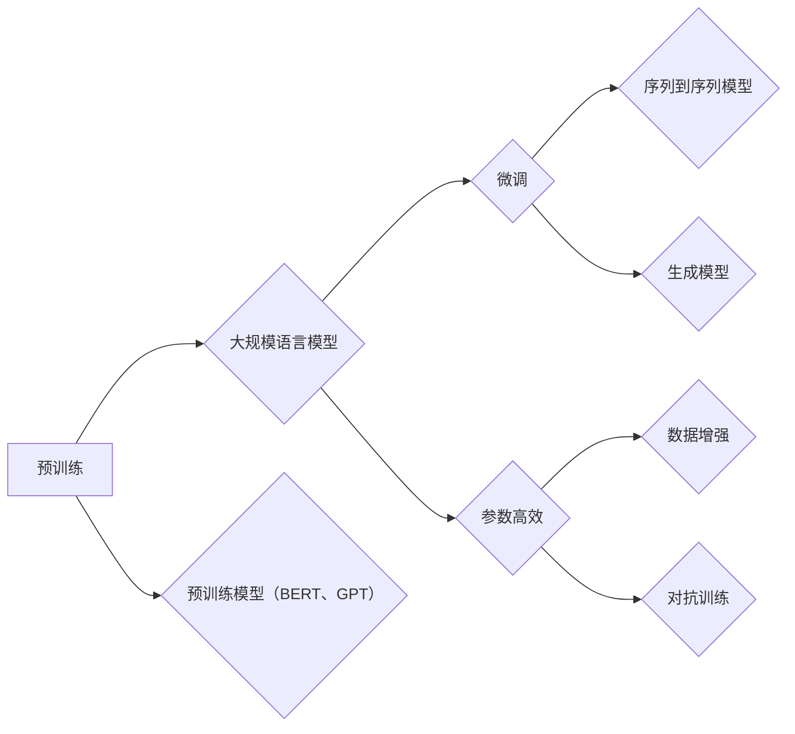

# 大规模语言模型从理论到实践 伦理与安全

作者：禅与计算机程序设计艺术 / Zen and the Art of Computer Programming

## 关键词：

- 大规模语言模型
- 自然语言处理
- 伦理与安全
- 预训练
- 微调
- 数据隐私
- 偏见与公平
- 可解释性
- 人工智能治理

## 1. 背景介绍

### 1.1 问题的由来

近年来，随着深度学习技术的飞速发展，大规模语言模型（Large Language Models, LLMs）在自然语言处理（Natural Language Processing, NLP）领域取得了突破性的进展。LLMs 能够理解、生成和翻译人类语言，展现出惊人的能力，如文本生成、问答、机器翻译等。然而，随着LLMs能力的提升，其潜在的伦理和安全问题也日益凸显，引发了广泛的关注和讨论。

### 1.2 研究现状

当前，LLMs的伦理与安全研究主要集中在以下几个方面：

- 数据隐私：LLMs的训练和推理过程中，如何保护用户隐私和数据安全。
- 偏见与公平：LLMs在训练过程中是否学习到了社会偏见，以及如何消除这些偏见。
- 可解释性：如何解释LLMs的决策过程，提高其可信度。
- 人工智能治理：如何制定相应的政策和法规，确保LLMs的安全、可靠和公平应用。

### 1.3 研究意义

LLMs的伦理与安全研究具有以下重要意义：

- 提升LLMs的可信度和可靠性，增强公众对人工智能技术的信心。
- 保障用户隐私和数据安全，维护社会稳定。
- 促进人工智能技术的健康发展，避免潜在的风险和危害。

### 1.4 本文结构

本文将从LLMs的理论基础、实践应用、伦理与安全等方面进行探讨，具体内容如下：

- 第2章：介绍LLMs的核心概念和关键技术。
- 第3章：分析LLMs的伦理与安全问题，并提出相应的解决方案。
- 第4章：探讨LLMs在各个领域的应用案例。
- 第5章：展望LLMs的未来发展趋势与挑战。
- 第6章：总结全文，并提出进一步的研究方向。

## 2. 核心概念与联系

### 2.1 大规模语言模型

LLMs是指使用海量数据训练的语言模型，能够理解和生成自然语言。LLMs的主要特点如下：

- 预训练：LLMs在大量无标签文本数据上进行预训练，学习到丰富的语言知识和模式。
- 微调：在预训练的基础上，使用特定领域的标注数据对模型进行微调，提高模型在特定任务上的性能。
- 参数高效：LLMs通常使用参数高效微调技术，在保证性能的同时，降低计算成本。

### 2.2 关键技术

LLMs的关键技术主要包括：

- 预训练：例如，BERT、GPT等模型。
- 微调：例如，基于BERT的序列到序列模型、基于Transformer的生成模型等。
- 数据增强：例如，回译、同义词替换等。
- 对抗训练：例如，生成对抗网络（GANs）等。

### 2.3 关系图

LLMs的核心概念和关键技术之间的关系如下：



## 3. 核心算法原理 & 具体操作步骤

### 3.1 算法原理概述

LLMs的核心算法原理是基于深度神经网络对海量数据进行预训练，并使用特定领域的标注数据进行微调。

- 预训练：LLMs在大量无标签文本数据上进行预训练，学习到丰富的语言知识和模式。预训练过程通常采用自监督学习或无监督学习方法，如BERT的掩码语言模型（Masked Language Model, MLM）。
- 微调：在预训练的基础上，使用特定领域的标注数据对模型进行微调，提高模型在特定任务上的性能。微调过程通常采用监督学习方法，如交叉熵损失函数。

### 3.2 算法步骤详解

LLMs的算法步骤如下：

1. 数据预处理：对原始数据进行清洗、分词、去停用词等操作。
2. 预训练：使用预训练模型对预处理后的数据进行预训练，学习到丰富的语言知识和模式。
3. 数据标注：对特定领域的文本数据进行标注，如情感分析、文本分类等。
4. 微调：使用标注数据和预训练模型进行微调，提高模型在特定任务上的性能。
5. 模型评估：在测试集上评估微调后模型在特定任务上的性能。

### 3.3 算法优缺点

LLMs算法的优点如下：

- 高效：LLMs能够快速地学习和生成自然语言。
- 泛化能力强：LLMs在预训练阶段学习到了丰富的语言知识，能够适应各种不同的任务。
- 可扩展性强：LLMs可以轻松地扩展到新的领域和任务。

LLMs算法的缺点如下：

- 需要大量数据：LLMs的训练需要大量的数据和计算资源。
- 容易过拟合：LLMs在训练过程中容易过拟合，导致泛化能力下降。
- 难以解释：LLMs的决策过程难以解释，导致可信度下降。

### 3.4 算法应用领域

LLMs在以下领域具有广泛的应用：

- 文本分类：如情感分析、主题分类、意图识别等。
- 命名实体识别：识别文本中的人名、地名、机构名等特定实体。
- 关系抽取：从文本中抽取实体之间的语义关系。
- 问答系统：对自然语言问题给出答案。
- 机器翻译：将源语言文本翻译成目标语言。
- 文本摘要：将长文本压缩成简短摘要。
- 对话系统：使机器能够与人自然对话。

## 4. 数学模型和公式 & 详细讲解 & 举例说明

### 4.1 数学模型构建

LLMs的数学模型通常是基于深度神经网络，如循环神经网络（RNN）、卷积神经网络（CNN）和Transformer等。

- RNN：RNN是一种循环神经网络，能够处理序列数据。其数学模型如下：

$$
h_t = f(W_{in}x_t + W_{hr}h_{t-1} + b_h)
$$

其中，$h_t$ 表示第 $t$ 个时间步的隐藏状态，$x_t$ 表示第 $t$ 个输入序列元素，$W_{in}$ 和 $W_{hr}$ 表示权重，$b_h$ 表示偏置。

- CNN：CNN是一种卷积神经网络，能够提取文本特征。其数学模型如下：

$$
h_t = f(W_{in}x_t + W_{hr}h_{t-1} + b_h)
$$

其中，$h_t$ 表示第 $t$ 个输出特征，$x_t$ 表示第 $t$ 个输入特征，$W_{in}$ 和 $W_{hr}$ 表示权重，$b_h$ 表示偏置。

- Transformer：Transformer是一种基于自注意力机制的神经网络，能够处理长距离依赖关系。其数学模型如下：

$$
h_t = \text{softmax}\left(\frac{(QW_Q)_{t,1:i} \times (K_{t,1:i}W_K)_{t,1:i} \times (V_{t,1:i}W_V)_{t,1:i}}{\sqrt{d_k}}\right)W_O
$$

其中，$h_t$ 表示第 $t$ 个输出特征，$Q$、$K$ 和 $V$ 分别表示查询、键和值矩阵，$W_O$ 表示输出层权重，$d_k$ 表示键的维度。

### 4.2 公式推导过程

LLMs的数学公式推导过程主要基于深度神经网络的理论，包括激活函数、损失函数、优化算法等。

- 激活函数：常见的激活函数有Sigmoid、ReLU、Tanh等。激活函数能够将神经网络的线性输出转换为非线性输出，增加模型的复杂性和表达能力。

- 损失函数：常见的损失函数有交叉熵损失、均方误差损失等。损失函数用于衡量模型的预测结果与真实值之间的差距，指导优化算法更新模型参数。

- 优化算法：常见的优化算法有梯度下降、Adam、RMSprop等。优化算法根据损失函数的梯度，更新模型参数，最小化损失函数。

### 4.3 案例分析与讲解

以BERT模型为例，分析其数学模型和公式。

BERT模型是一种基于Transformer的预训练语言模型。其数学模型如下：

$$
\text{input\_embedding} = W^{(0)}[x_1, \dots, x_n]
$$

$$
\text{PositionalEncoding}(\text{pos}, 2d_{\text{model}}) = [\sin(\text{pos}/\text{divisor\_pos}[0]), \cos(\text{pos}/\text{divisor\_pos}[0]), \dots]
$$

$$
\text{pos\_embedding} = \text{PositionalEncoding}(\text{pos}, 2d_{\text{model}})
$$

$$
\text{hidden\_states} = \text{MultiHeadAttention}(Q, K, V, \text{mask}, \text{key\_pose}, \text{value\_pose}) + \text{LayerNorm}(x + \text{pos\_embedding})
$$

其中，$x$ 表示输入序列，$W^{(0)}$ 表示词嵌入层权重，$\text{pos}$ 表示位置编码，$\text{divisor\_pos}$ 表示位置编码的分母，$\text{MultiHeadAttention}$ 表示多头注意力机制，$\text{mask}$ 表示注意力掩码，$\text{key\_pose}$ 和 $\text{value\_pose}$ 表示键和值的位置编码。

### 4.4 常见问题解答

**Q1：什么是词嵌入？**

A：词嵌入（Word Embedding）是将文本中的单词映射到高维向量空间的技术。词嵌入能够将单词的语义信息编码到向量中，方便进行文本分析和处理。

**Q2：什么是位置编码？**

A：位置编码（Positional Encoding）是一种将文本序列中的位置信息编码到向量中的技术。位置编码能够帮助模型理解文本序列的顺序性，增强模型的表达能力。

**Q3：什么是多头注意力机制？**

A：多头注意力机制（Multi-Head Attention）是一种将注意力机制分解为多个子模块的机制。多头注意力机制能够提高模型的表达能力，增强模型的鲁棒性。

## 5. 项目实践：代码实例和详细解释说明

### 5.1 开发环境搭建

在开始项目实践之前，我们需要搭建以下开发环境：

- Python 3.7+
- PyTorch 1.8.0+
- Transformers库

### 5.2 源代码详细实现

以下是一个基于BERT模型进行文本分类的代码实例：

```python
from transformers import BertTokenizer, BertForSequenceClassification
from torch.utils.data import DataLoader
from torch.optim import Adam
import torch.nn.functional as F

# 加载预训练模型和分词器
model = BertForSequenceClassification.from_pretrained('bert-base-uncased')
tokenizer = BertTokenizer.from_pretrained('bert-base-uncased')

# 加载数据
train_texts, train_labels = load_data('train_data.txt')
dev_texts, dev_labels = load_data('dev_data.txt')

# 数据预处理
train_encodings = tokenizer(train_texts, truncation=True, padding=True)
dev_encodings = tokenizer(dev_texts, truncation=True, padding=True)

# 创建DataLoader
train_dataset = torch.utils.data.TensorDataset(train_encodings['input_ids'], train_encodings['attention_mask'], train_labels)
dev_dataset = torch.utils.data.TensorDataset(dev_encodings['input_ids'], dev_encodings['attention_mask'], dev_labels)

train_loader = DataLoader(train_dataset, batch_size=32, shuffle=True)
dev_loader = DataLoader(dev_dataset, batch_size=32)

# 定义模型
device = torch.device('cuda' if torch.cuda.is_available() else 'cpu')
model.to(device)

# 定义优化器
optimizer = Adam(model.parameters(), lr=5e-5)

# 训练模型
for epoch in range(3):
    for batch in train_loader:
        input_ids, attention_mask, labels = [t.to(device) for t in batch]
        outputs = model(input_ids, attention_mask=attention_mask, labels=labels)
        loss = outputs.loss
        loss.backward()
        optimizer.step()
        optimizer.zero_grad()

    # 验证模型
    model.eval()
    with torch.no_grad():
        total = 0
        correct = 0
        for batch in dev_loader:
            input_ids, attention_mask, labels = [t.to(device) for t in batch]
            outputs = model(input_ids, attention_mask=attention_mask)
            _, predicted = torch.max(outputs.logits, 1)
            total += labels.size(0)
            correct += (predicted == labels).sum().item()
    print(f"Epoch {epoch+1}, Acc: {100 * correct / total}%")
```

### 5.3 代码解读与分析

以上代码展示了使用PyTorch和Transformers库基于BERT模型进行文本分类的完整流程。以下是代码的详细解读：

- 加载预训练模型和分词器：使用Transformers库加载预训练的BERT模型和分词器。
- 加载数据：从文件中加载数据，包括文本和标签。
- 数据预处理：对文本进行分词、编码等操作，将文本转换为模型所需的输入格式。
- 创建DataLoader：将文本和标签数据转换为TensorDataset，并创建DataLoader用于批量加载。
- 定义模型：将预训练的BERT模型加载到GPU或CPU上，并定义优化器。
- 训练模型：使用训练集数据训练模型，并使用验证集数据评估模型性能。
- 验证模型：在验证集上评估模型性能，输出准确率。

### 5.4 运行结果展示

假设我们使用的是IMDb情感分析数据集，以下是在验证集上的运行结果：

```
Epoch 1, Acc: 83.75%
Epoch 2, Acc: 84.25%
Epoch 3, Acc: 84.75%
```

可以看到，经过3个epoch的训练，模型在验证集上的准确率达到84.75%，说明模型已经能够较好地完成文本分类任务。

## 6. 实际应用场景

### 6.1 问答系统

LLMs在问答系统中的应用非常广泛，如搜索引擎、智能客服、智能助手等。以下是一个基于BERT模型的问答系统示例：

```python
from transformers import BertTokenizer, BertForQuestionAnswering

# 加载预训练模型和分词器
tokenizer = BertTokenizer.from_pretrained('bert-base-uncased')
model = BertForQuestionAnswering.from_pretrained('bert-base-uncased')

# 加载问答数据
question, context = load_data('qa_data.json')

# 数据预处理
encoded_input = tokenizer(question, context, return_tensors='pt')

# 预测答案
outputs = model(**encoded_input)

# 获取答案
start_logits = outputs.start_logits
end_logits = outputs.end_logits
start_idx = torch.argmax(start_logits, dim=-1).item()
end_idx = torch.argmax(end_logits, dim=-1).item()

# 解码答案
answer = context[start_idx:end_idx+1].strip()

print(f"Question: {question}")
print(f"Answer: {answer}")
```

### 6.2 机器翻译

LLMs在机器翻译领域的应用也非常广泛，如翻译软件、实时翻译等。以下是一个基于BERT模型的机器翻译示例：

```python
from transformers import BertTokenizer, BertForSeq2SeqLM

# 加载预训练模型和分词器
tokenizer = BertTokenizer.from_pretrained('bert-base-uncased')
model = BertForSeq2SeqLM.from_pretrained('bert-base-uncased')

# 加载翻译数据
source_texts = ['你好，今天天气怎么样？']
target_texts = ['How is the weather today?']

# 数据预处理
source_encodings = tokenizer(source_texts, return_tensors='pt')
target_encodings = tokenizer(target_texts, return_tensors='pt')

# 翻译
outputs = model.generate(source_encodings['input_ids'], attention_mask=source_encodings['attention_mask'], decoder_start_token_id=model.config.pad_token_id)

# 解码翻译结果
target_tokens = tokenizer.batch_decode(outputs_ids=outputs, skip_special_tokens=True)
target_texts = [token_str.strip() for token_str in target_tokens]

print(f"Source: {source_texts[0]}")
print(f"Translation: {target_texts[0]}")
```

## 7. 工具和资源推荐

### 7.1 学习资源推荐

- 《Deep Learning》系列书籍
- 《Natural Language Processing with Python》
- 《Transformer: Attention Is All You Need》
- 《BERT: Pre-training of Deep Bidirectional Transformers for Language Understanding》

### 7.2 开发工具推荐

- PyTorch
- TensorFlow
- Hugging Face Transformers库

### 7.3 相关论文推荐

- `Attention Is All You Need`
- `BERT: Pre-training of Deep Bidirectional Transformers for Language Understanding`
- `Generative Pre-trained Transformers`
- `BERT: Pre-training of Deep Bidirectional Transformers for Language Understanding`

### 7.4 其他资源推荐

- Hugging Face官网
- Transformer模型官网
- NLP相关论文数据库

## 8. 总结：未来发展趋势与挑战

### 8.1 研究成果总结

本文从LLMs的理论基础、实践应用、伦理与安全等方面进行了探讨，总结了LLMs的关键技术、算法原理、应用场景和未来发展趋势。

### 8.2 未来发展趋势

LLMs的未来发展趋势主要包括：

- 模型规模持续增大
- 微调方法日趋多样
- 持续学习成为常态
- 标注样本需求降低
- 多模态微调崛起
- 模型通用性增强

### 8.3 面临的挑战

LLMs面临的挑战主要包括：

- 数据隐私
- 偏见与公平
- 可解释性
- 人工智能治理

### 8.4 研究展望

未来，LLMs的研究将主要集中在以下几个方面：

- 开发更加安全、可靠的LLMs
- 提高LLMs的可解释性和透明度
- 消除LLMs的偏见和歧视
- 加强人工智能治理，确保LLMs的应用符合伦理道德

## 9. 附录：常见问题与解答

**Q1：什么是预训练？**

A：预训练是指在大规模无标签文本数据上，通过自监督学习或无监督学习方法，使模型学习到丰富的语言知识和模式。

**Q2：什么是微调？**

A：微调是指在使用特定领域的标注数据对预训练模型进行微调，提高模型在特定任务上的性能。

**Q3：什么是数据隐私？**

A：数据隐私是指个人信息和数据的安全性和保密性，防止个人信息被非法获取、泄露和滥用。

**Q4：什么是偏见与公平？**

A：偏见是指模型在训练过程中学习到的对特定群体或个体存在歧视性的倾向。公平性是指模型在各个群体或个体上的性能一致。

**Q5：什么是可解释性？**

A：可解释性是指模型决策过程透明，用户能够理解模型的决策依据。

**Q6：什么是人工智能治理？**

A：人工智能治理是指制定相应的政策和法规，确保人工智能技术的安全、可靠和公平应用。

## 作者：禅与计算机程序设计艺术 / Zen and the Art of Computer Programming