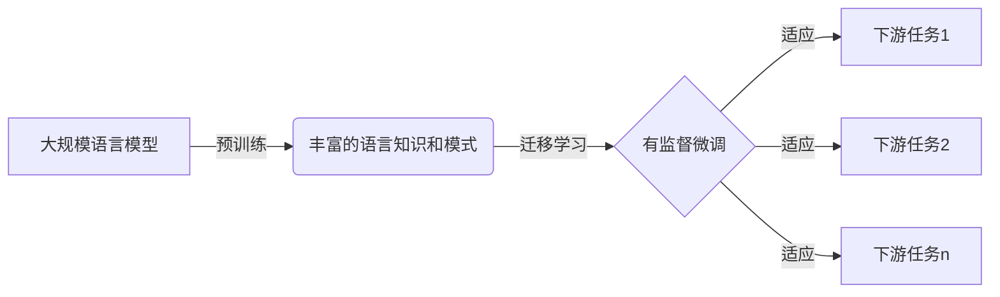

# 大规模语言模型从理论到实践 有监督微调

关键词：大规模语言模型、有监督微调、迁移学习、预训练模型、下游任务

## 1. 背景介绍
### 1.1 问题的由来
近年来，随着深度学习技术的飞速发展，大规模语言模型在自然语言处理领域取得了令人瞩目的成就。从 ELMo、BERT 到 GPT-3，语言模型的规模和性能不断突破，展现出强大的语言理解和生成能力。然而，如何将这些预训练的大规模语言模型应用到实际的下游任务中，并取得优异的性能，仍然是一个值得深入探讨的问题。

### 1.2 研究现状
目前，主流的做法是采用迁移学习的思路，将预训练的大规模语言模型作为基础模型，然后在特定的下游任务上进行有监督的微调。通过微调，可以使语言模型适应特定任务的数据分布和目标，从而提升模型在该任务上的性能。已有大量研究表明，这种有监督微调的方法在各种自然语言处理任务上都取得了显著的效果提升。

### 1.3 研究意义
深入研究大规模语言模型的有监督微调，对于推动自然语言处理技术的发展具有重要意义。一方面，它可以帮助我们更好地理解语言模型的内部机制和泛化能力；另一方面，它为实际应用提供了一种高效、灵活的解决方案，使得我们能够快速构建高性能的自然语言处理系统，应对各种实际场景的需求。

### 1.4 本文结构
本文将围绕大规模语言模型的有监督微调展开深入探讨。首先，我们将介绍相关的核心概念及其联系；然后，重点阐述有监督微调的核心算法原理和具体操作步骤；接着，通过数学模型和公式推导，加深对算法的理解；随后，我们将给出项目实践的代码实例和详细解释；此外，还将讨论有监督微调在实际应用场景中的价值；最后，总结全文并展望未来的发展趋势与挑战。

## 2. 核心概念与联系
在探讨大规模语言模型有监督微调之前，我们需要明确几个核心概念：

- 大规模语言模型：指参数量巨大（通常在亿级别以上）、在大规模文本数据上进行预训练的深度神经网络模型，如 BERT、GPT 等。这些模型通过自监督学习，捕捉到丰富的语言知识和模式。

- 有监督微调：指在特定的下游任务（如文本分类、命名实体识别等）上，使用带标签的数据对预训练的语言模型进行进一步训练，使其适应任务的数据分布和目标。通常只需要相对较少的标注数据和训练步数。

- 迁移学习：指将在某个源任务或领域上学习到的知识，迁移并应用到另一个目标任务或领域中，以提高目标任务的学习效率和性能。大规模语言模型的有监督微调可以看作是一种迁移学习。

- 下游任务：指实际应用中的具体自然语言处理任务，如情感分析、问答系统、机器翻译等。通过有监督微调，可以将大规模语言模型应用于这些任务。

这些概念之间的联系可以用下图表示：



## 3. 核心算法原理 & 具体操作步骤
### 3.1 算法原理概述
大规模语言模型的有监督微调，本质上是一个基于梯度下降的参数优化过程。我们以预训练的语言模型为基础，在下游任务的标注数据上计算损失函数，然后通过反向传播算法更新模型参数，使其逐步适应任务的目标。

### 3.2 算法步骤详解
1. 加载预训练的大规模语言模型，如 BERT、GPT 等。
2. 根据下游任务的特点，设计合适的输入表示方式和输出层。通常需要在预训练模型的顶部添加一些任务特定的层。
3. 准备下游任务的标注数据，对其进行预处理和特征提取。
4. 定义适合下游任务的损失函数，如交叉熵损失、平方损失等。
5. 使用标注数据对模型进行微调训练，通过反向传播算法更新模型参数。通常使用较小的学习率和较少的训练步数。
6. 在验证集上评估微调后的模型性能，根据需要调整超参数。
7. 使用微调后的模型对测试集或实际应用的数据进行预测。

### 3.3 算法优缺点
优点：
- 充分利用了预训练语言模型中蕴含的丰富语言知识，可以显著提升下游任务的性能。
- 相比从头训练，微调所需的标注数据和计算资源更少，训练时间更短。
- 通过迁移学习，可以快速构建适用于不同任务和领域的高性能模型。

缺点：
- 对于某些特定领域或任务，预训练模型中的知识可能与目标任务不完全匹配，需要谨慎选择和调整。
- 微调过程中仍然需要一定量的标注数据，对于标注成本较高的任务可能存在挑战。
- 微调后的模型可能存在一定程度的过拟合风险，需要合理设置正则化策略。

### 3.4 算法应用领域
有监督微调算法可以广泛应用于各种自然语言处理任务，如：
- 文本分类：情感分析、新闻分类、垃圾邮件检测等。
- 序列标注：命名实体识别、词性标注、语义角色标注等。
- 问答系统：基于知识库的问答、阅读理解式问答等。
- 机器翻译：将预训练的语言模型微调为翻译模型。
- 文本生成：如对话生成、故事生成、摘要生成等。

## 4. 数学模型和公式 & 详细讲解 & 举例说明
### 4.1 数学模型构建
我们以文本分类任务为例，介绍有监督微调的数学模型。设输入文本序列为 $\mathbf{x} = (x_1, x_2, \dots, x_n)$，对应的标签为 $y \in \{1, 2, \dots, K\}$，其中 $K$ 为类别数。我们的目标是学习一个分类函数 $f(\mathbf{x}; \theta)$，将输入文本映射到相应的类别标签上。

大规模语言模型可以看作是一个特征提取器，将输入文本 $\mathbf{x}$ 转化为一个高维向量表示 $\mathbf{h} = \text{Encoder}(\mathbf{x}; \theta_e)$。在此基础上，我们添加一个分类器（通常是一个全连接层+softmax），将文本表示 $\mathbf{h}$ 映射为类别概率分布：

$$
\mathbf{p} = \text{softmax}(\mathbf{W}\mathbf{h} + \mathbf{b})
$$

其中，$\mathbf{W}$ 和 $\mathbf{b}$ 是分类器的参数。

### 4.2 公式推导过程
微调的目标是最小化分类器的预测概率分布与真实标签分布之间的差异。我们使用交叉熵损失函数来度量这种差异：

$$
\mathcal{L}(\theta_e, \mathbf{W}, \mathbf{b}) = -\sum_{i=1}^N \log p(y_i|\mathbf{x}_i; \theta_e, \mathbf{W}, \mathbf{b})
$$

其中，$N$ 为训练样本数，$p(y_i|\mathbf{x}_i; \theta_e, \mathbf{W}, \mathbf{b})$ 表示模型对第 $i$ 个样本的预测概率。

我们通过梯度下降算法来最小化损失函数，更新模型参数：

$$
\theta_e \leftarrow \theta_e - \eta \frac{\partial \mathcal{L}}{\partial \theta_e}
$$
$$
\mathbf{W} \leftarrow \mathbf{W} - \eta \frac{\partial \mathcal{L}}{\partial \mathbf{W}}
$$
$$
\mathbf{b} \leftarrow \mathbf{b} - \eta \frac{\partial \mathcal{L}}{\partial \mathbf{b}}
$$

其中，$\eta$ 为学习率。通过反复迭代优化，模型将逐步适应下游任务的数据分布和目标。

### 4.3 案例分析与讲解
以情感分析任务为例，我们使用预训练的 BERT 模型进行有监督微调。输入文本可以是一段用户评论，如"这部电影情节非常吸引人，演员表演也很出色！"，对应的标签为"正面"。

我们首先将输入文本转化为 BERT 的输入格式，即添加 [CLS] 和 [SEP] 标记，并将词转换为相应的词嵌入向量。然后，将输入送入 BERT 模型，得到文本的表示向量 $\mathbf{h}$。

接下来，我们在 BERT 模型的顶部添加一个全连接层和 softmax 激活函数，将文本表示映射为情感类别的概率分布。通过计算交叉熵损失并进行梯度下降优化，模型将学习到如何根据文本内容进行情感分类。

经过微调后，模型可以很好地判断用户评论的情感倾向，如识别出"这部电影太差劲了，完全浪费时间！"为负面评论。

### 4.4 常见问题解答
1. 问：有监督微调需要多少标注数据？
   答：这取决于任务的复杂度和预训练模型的质量。一般来说，微调所需的标注数据远少于从头训练，通常几百到几千个样本就可以取得不错的效果。但对于某些复杂任务，可能需要更多的标注数据。

2. 问：微调时，是否需要更新预训练模型的所有参数？
   答：不一定。根据任务的特点和数据量，可以选择只更新部分层的参数，如只更新顶层的几个 Transformer 块。这样可以减少过拟合的风险，并加快训练速度。

3. 问：微调后的模型是否可以迁移到其他任务上？
   答：可以，但效果可能会有所下降。微调后的模型已经适应了特定任务的数据分布，对于其他任务可能不够通用。如果需要迁移，可以考虑在新任务上进行第二次微调。

## 5. 项目实践：代码实例和详细解释说明
### 5.1 开发环境搭建
首先，我们需要安装必要的开发库，如 PyTorch、Transformers 等。可以使用 pip 进行安装：

```bash
pip install torch transformers
```

### 5.2 源代码详细实现
以下是使用 PyTorch 和 Transformers 库进行有监督微调的示例代码：

```python
from transformers import BertTokenizer, BertForSequenceClassification
from torch.utils.data import DataLoader
from torch.optim import AdamW

# 加载预训练的BERT模型和分词器
tokenizer = BertTokenizer.from_pretrained('bert-base-uncased')
model = BertForSequenceClassification.from_pretrained('bert-base-uncased', num_labels=2)

# 准备数据集
train_texts = [...]  # 训练集文本
train_labels = [...]  # 训练集标签
val_texts = [...]  # 验证集文本
val_labels = [...]  # 验证集标签

# 将文本转化为模型输入
train_encodings = tokenizer(train_texts, truncation=True, padding=True)
val_encodings = tokenizer(val_texts, truncation=True, padding=True)

# 定义数据集和数据加载器
class SentimentDataset(torch.utils.data.Dataset):
    def __init__(self, encodings, labels):
        self.encodings = encodings
        self.labels = labels

    def __getitem__(self, idx):
        item = {key: torch.tensor(val[idx]) for key, val in self.encodings.items()}
        item['labels'] = torch.tensor(self.labels[idx])
        return item

    def __len__(self):
        return len(self.labels)

train_dataset = SentimentDataset(train_encodings, train_labels)