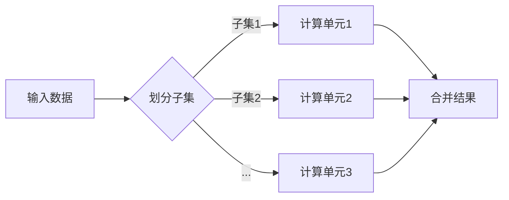
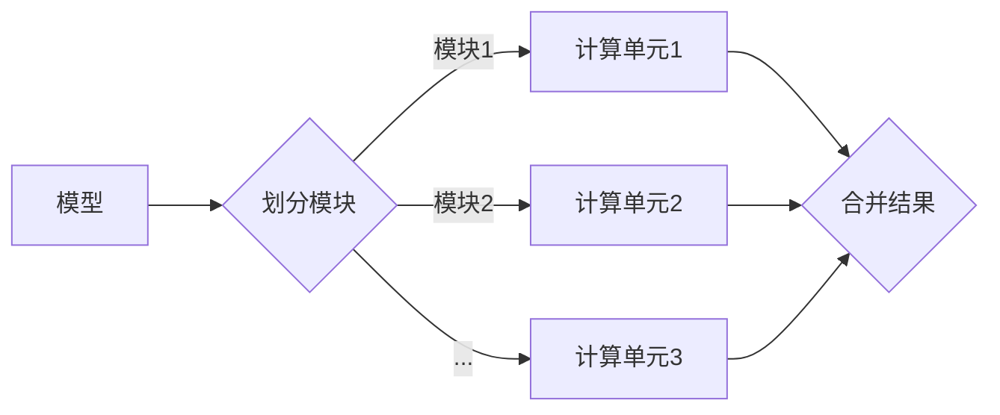
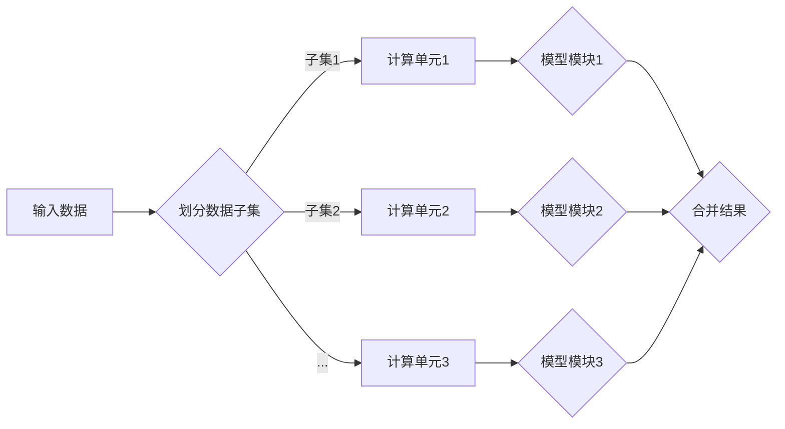

# 大规模语言模型从理论到实践 模型并行

作者：禅与计算机程序设计艺术 / Zen and the Art of Computer Programming

## 1. 背景介绍

### 1.1 问题的由来

随着深度学习技术的不断发展，大规模语言模型（Large Language Models，LLMs）在自然语言处理（Natural Language Processing，NLP）领域取得了显著的成果。然而，LLMs的模型参数量庞大，计算复杂度高，导致其训练和推理过程耗时较长，难以满足实际应用中对速度和效率的要求。为了解决这个问题，模型并行技术应运而生。

### 1.2 研究现状

近年来，模型并行技术逐渐成为研究热点，并在LLMs领域得到了广泛应用。主要的研究方向包括：

- **数据并行**：将模型输入数据划分成多个子集，并行计算每个子集，然后将结果合并得到最终输出。
- **模型并行**：将模型的不同部分划分到不同的计算单元，并行计算各个部分，然后将结果合并得到最终输出。
- **混合并行**：结合数据并行和模型并行，同时并行处理数据和模型。

### 1.3 研究意义

模型并行技术能够显著提高LLMs的训练和推理速度，降低能耗，为LLMs在更多场景下的应用提供技术支持。

### 1.4 本文结构

本文将首先介绍模型并行的核心概念和原理，然后分析其具体操作步骤、优缺点和应用领域，最后探讨其在LLMs领域的未来发展趋势和挑战。

## 2. 核心概念与联系

### 2.1 数据并行

数据并行是将模型输入数据划分成多个子集，并行计算每个子集，然后将结果合并得到最终输出。其流程如图所示：



### 2.2 模型并行

模型并行是将模型的不同部分划分到不同的计算单元，并行计算各个部分，然后将结果合并得到最终输出。其流程如图所示：



### 2.3 混合并行

混合并行是结合数据并行和模型并行的并行计算方式。其流程如图所示：



## 3. 核心算法原理 & 具体操作步骤

### 3.1 算法原理概述

模型并行技术主要涉及以下几个方面：

- **数据划分**：将输入数据划分成多个子集，以支持数据并行。
- **模型划分**：将模型的不同部分划分到不同的计算单元，以支持模型并行。
- **通信策略**：设计高效的通信策略，以保证各个计算单元之间的协同工作。
- **并行优化**：针对并行计算过程进行优化，以提高计算效率和性能。

### 3.2 算法步骤详解

1. **数据划分**：根据硬件资源和工作负载，将输入数据划分成多个子集，并分配到不同的计算单元。
2. **模型划分**：根据计算单元的硬件资源和模型特性，将模型的不同部分划分到不同的计算单元。
3. **通信策略设计**：设计高效的通信策略，以保证各个计算单元之间的协同工作。常见的通信策略包括：
    - **同步通信**：计算单元在计算过程中需要等待其他计算单元完成计算，然后进行通信。
    - **异步通信**：计算单元在计算过程中可以独立工作，并在必要时进行通信。
4. **并行优化**：针对并行计算过程进行优化，以提高计算效率和性能。常见的优化方法包括：
    - **负载均衡**：合理分配计算任务，避免计算单元之间出现严重的负载不均衡现象。
    - **内存优化**：优化内存访问模式，减少内存访问的冲突和延迟。
    - **缓存优化**：优化缓存使用，提高缓存命中率。

### 3.3 算法优缺点

**优点**：

- 提高计算效率和性能，缩短训练和推理时间。
- 降低能耗，减少硬件资源消耗。
- 支持大规模模型训练和推理。

**缺点**：

- 实现复杂，需要考虑数据划分、模型划分、通信策略和并行优化等多个方面。
- 对硬件资源要求较高，需要足够的计算单元和通信资源。
- 难以在单机环境下进行，需要分布式计算环境。

### 3.4 算法应用领域

模型并行技术在LLMs领域有广泛的应用，例如：

- **大规模预训练**：加速LLMs的预训练过程，降低能耗。
- **下游任务推理**：提高LLMs在下游任务推理过程中的速度和效率。
- **模型压缩**：通过模型并行，减小模型尺寸，实现模型压缩。

## 4. 数学模型和公式 & 详细讲解 & 举例说明

### 4.1 数学模型构建

模型并行技术的数学模型主要涉及以下几个方面：

- **数据并行**：将输入数据划分成多个子集，并分配到不同的计算单元。其数学表达式为：

  $$
  \mathbf{x} = \{ \mathbf{x}_1, \mathbf{x}_2, ..., \mathbf{x}_n \}
  $$

  其中，$\mathbf{x}$ 表示输入数据，$\mathbf{x}_i$ 表示第 $i$ 个子集。

- **模型并行**：将模型的不同部分划分到不同的计算单元。其数学表达式为：

  $$
  \mathbf{M} = \{ \mathbf{M}_1, \mathbf{M}_2, ..., \mathbf{M}_n \}
  $$

  其中，$\mathbf{M}$ 表示模型，$\mathbf{M}_i$ 表示第 $i$ 个计算单元的模型。

- **通信策略**：设计高效的通信策略，以保证各个计算单元之间的协同工作。其数学表达式为：

  $$
  \mathbf{C} = \{ \mathbf{C}_1, \mathbf{C}_2, ..., \mathbf{C}_n \}
  $$

  其中，$\mathbf{C}$ 表示通信策略，$\mathbf{C}_i$ 表示第 $i$ 个计算单元的通信策略。

### 4.2 公式推导过程

以下以数据并行为例，介绍公式推导过程。

假设输入数据 $\mathbf{x} = [x_1, x_2, ..., x_n]$，其中 $x_i$ 表示第 $i$ 个数据子集。将输入数据划分成 $m$ 个子集，每个子集包含 $k$ 个数据：

$$
\mathbf{x}_1 = [x_{1,1}, x_{1,2}, ..., x_{1,k}], \quad \mathbf{x}_2 = [x_{2,1}, x_{2,2}, ..., x_{2,k}], ..., \quad \mathbf{x}_m = [x_{m,1}, x_{m,2}, ..., x_{m,k}]
$$

则数据并行的数学表达式为：

$$
\mathbf{y} = \mathbf{M}(\mathbf{x}_1, \mathbf{x}_2, ..., \mathbf{x}_m)
$$

其中，$\mathbf{y}$ 表示输出结果，$\mathbf{M}$ 表示模型。

### 4.3 案例分析与讲解

以下以BERT模型为例，介绍模型并行在LLMs中的应用。

BERT模型主要由两个部分组成：词嵌入层和Transformer编码器。我们将BERT模型划分为两个部分进行并行计算。

- **词嵌入层**：将输入的文本序列转换成词向量。
- **Transformer编码器**：对词向量进行编码，提取文本中的语义信息。

**数据并行**：

将输入的文本序列划分成多个子集，每个子集包含多个句子。将每个子集的词向量输入到词嵌入层，并行计算得到子集的词向量表示。

**模型并行**：

将Transformer编码器划分成两个部分：编码层和注意力层。将编码层和注意力层分别划分到不同的计算单元，并行计算得到输出结果。

**通信策略**：

将子集的词向量表示从词嵌入层发送到Transformer编码器的计算单元，然后将编码层和注意力层的输出结果合并得到最终的输出结果。

### 4.4 常见问题解答

**Q1：模型并行是否会影响模型的性能**？

A：模型并行本身不会影响模型的性能，但需要根据具体任务和硬件资源进行合理的设计和优化。如果设计不当，可能会降低模型的性能。

**Q2：如何选择合适的模型并行方案**？

A：选择合适的模型并行方案需要考虑以下因素：

- **硬件资源**：计算单元的数量、性能和通信带宽。
- **模型结构**：模型的大小、复杂度和并行计算难度。
- **任务特性**：任务的计算量和数据量。

## 5. 项目实践：代码实例和详细解释说明

### 5.1 开发环境搭建

为了演示模型并行在LLMs中的应用，我们需要搭建以下开发环境：

1. 操作系统：Linux
2. 编程语言：Python
3. 框架：TensorFlow或PyTorch
4. 模型：BERT

### 5.2 源代码详细实现

以下使用TensorFlow框架演示BERT模型的模型并行实现。

```python
import tensorflow as tf

def model_parallel_transformer():
  # ... (BERT模型的构建代码)
  pass

def parallel_forward():
  # ... (数据并行和模型并行的实现代码)
  pass

# ... (其他代码)

# 创建模型并行BERT模型
model_parallel_model = model_parallel_transformer()
# 执行并行前向计算
parallel_output = parallel_forward()

# ... (其他代码)
```

### 5.3 代码解读与分析

以上代码展示了BERT模型的模型并行实现过程。首先，构建BERT模型，然后实现数据并行和模型并行的前向计算过程，最后执行并行前向计算。

### 5.4 运行结果展示

运行上述代码，可以得到BERT模型的并行前向计算结果。

## 6. 实际应用场景

### 6.1 智能问答系统

模型并行技术可以加速智能问答系统的推理过程，提高问答系统的响应速度，提升用户体验。

### 6.2 文本摘要

模型并行技术可以加速文本摘要任务的推理过程，提高文本摘要系统的效率。

### 6.3 情感分析

模型并行技术可以加速情感分析任务的推理过程，提高情感分析系统的实时性。

### 6.4 未来应用展望

随着模型并行技术的不断发展，其在LLMs领域的应用将更加广泛，例如：

- **知识图谱推理**：加速知识图谱推理任务的推理过程，提高知识图谱的应用效率。
- **机器翻译**：加速机器翻译任务的推理过程，提高机器翻译系统的效率。
- **语音识别**：加速语音识别任务的推理过程，提高语音识别系统的性能。

## 7. 工具和资源推荐

### 7.1 学习资源推荐

- 《深度学习》系列书籍：介绍了深度学习的基本原理和常用算法，为学习模型并行技术打下基础。
- 《TensorFlow: The Definitive Guide》：介绍了TensorFlow框架的使用方法和应用技巧，为使用TensorFlow进行模型并行开发提供参考。
- 《PyTorch: Deep Learning from Scratch》：介绍了PyTorch框架的使用方法和应用技巧，为使用PyTorch进行模型并行开发提供参考。

### 7.2 开发工具推荐

- TensorFlow：开源的深度学习框架，支持模型并行开发。
- PyTorch：开源的深度学习框架，支持模型并行开发。
- Horovod：TensorFlow的分布式训练库，支持模型并行开发。

### 7.3 相关论文推荐

- "Accurate and Efficient Distributed Training with Tensor Processing Units"，2017，Google AI Team。
- "Distributed Training Strategies for Deep Learning"，2019，ShuffleNet作者团队。
- "Efficient Training of Deep Networks with Non-Local Parallelism"，2020，Facebook AI Research。

### 7.4 其他资源推荐

- Hugging Face：提供丰富的预训练模型和模型并行开发工具。
- TensorFlow官网：提供TensorFlow框架的文档和教程。
- PyTorch官网：提供PyTorch框架的文档和教程。

## 8. 总结：未来发展趋势与挑战

### 8.1 研究成果总结

本文对大规模语言模型模型并行技术进行了全面系统的介绍，包括核心概念、原理、操作步骤、优缺点、应用领域等。通过实际案例和代码实例，展示了模型并行技术在LLMs领域的应用价值。

### 8.2 未来发展趋势

未来，模型并行技术在LLMs领域的应用将呈现以下趋势：

- **硬件加速**：随着硬件技术的不断发展，模型并行将更好地适应更加强大的计算资源。
- **算法优化**：算法优化将进一步提升模型并行的性能和效率。
- **跨平台支持**：模型并行将支持更多平台和框架，提高其通用性。

### 8.3 面临的挑战

模型并行技术在LLMs领域仍面临以下挑战：

- **算法复杂性**：模型并行的算法设计复杂，需要深入了解并行计算原理。
- **资源消耗**：模型并行需要大量的计算资源和通信资源。
- **性能优化**：模型并行需要不断优化算法和硬件，以提升性能。

### 8.4 研究展望

未来，模型并行技术在LLMs领域的研究将主要集中在以下几个方面：

- **算法创新**：探索更有效的模型并行算法，提高其性能和效率。
- **硬件优化**：开发更高效的并行计算硬件，降低模型并行的资源消耗。
- **跨平台支持**：提高模型并行的通用性，支持更多平台和框架。

通过不断的研究和探索，相信模型并行技术将在LLMs领域发挥更大的作用，推动人工智能技术的发展。

## 9. 附录：常见问题与解答

**Q1：模型并行和模型压缩有什么区别**？

A：模型并行和模型压缩都是模型优化技术，但它们的目的和实现方式不同。

- 模型并行旨在通过并行计算提高模型训练和推理速度，降低能耗。
- 模型压缩旨在减小模型尺寸，降低模型存储和计算资源消耗。

**Q2：模型并行是否适用于所有深度学习模型**？

A：模型并行技术适用于大多数深度学习模型，特别是参数量较大的模型，如神经网络、卷积神经网络等。

**Q3：如何评估模型并行的性能**？

A：评估模型并行的性能可以从以下几个方面进行：

- 训练和推理速度：评估模型并行对训练和推理速度的影响。
- 能耗：评估模型并行对能耗的影响。
- 精度：评估模型并行对模型精度的影响。

**Q4：模型并行是否会导致模型精度下降**？

A：模型并行本身不会导致模型精度下降，但需要合理的设计和优化。如果设计不当，可能会降低模型的精度。

**Q5：如何选择合适的模型并行方案**？

A：选择合适的模型并行方案需要考虑以下因素：

- **硬件资源**：计算单元的数量、性能和通信带宽。
- **模型结构**：模型的大小、复杂度和并行计算难度。
- **任务特性**：任务的计算量和数据量。

通过以上解答，相信大家对模型并行技术有了更深入的了解。在实际应用中，需要根据具体任务和硬件资源选择合适的模型并行方案，以达到最佳的性能和效果。

---

作者：禅与计算机程序设计艺术 / Zen and the Art of Computer Programming