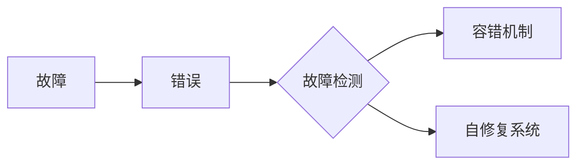

# 《错误处理与恢复：保持系统稳定》

作者：禅与计算机程序设计艺术 / Zen and the Art of Computer Programming


## 关键词：

错误处理、系统稳定性、故障恢复、容错机制、故障检测、自修复系统


## 1. 背景介绍

### 1.1 问题的由来

在计算机系统中，错误是不可避免的。无论是硬件故障、软件缺陷、人为误操作，还是外部干扰，都可能导致系统出现异常。如何有效地处理和恢复错误，保持系统稳定运行，是计算机系统设计和维护的重要问题。

### 1.2 研究现状

近年来，随着计算机技术的快速发展，错误处理与恢复技术也取得了显著的进展。主要研究方向包括：

- 故障检测与隔离：通过监控系统状态，及时发现并隔离故障。
- 容错机制：在系统出现故障时，通过冗余设计等手段保证系统继续正常运行。
- 自修复系统：通过自动检测和修复故障，实现系统的自我恢复。

### 1.3 研究意义

错误处理与恢复技术在保证系统稳定性、提高系统可用性、降低系统维护成本等方面具有重要意义。

### 1.4 本文结构

本文将系统介绍错误处理与恢复的基本原理、核心算法、应用场景和未来发展趋势。内容安排如下：

- 第2部分，介绍错误处理与恢复的核心概念。
- 第3部分，详细阐述错误处理与恢复的基本原理和具体操作步骤。
- 第4部分，介绍错误检测与隔离、容错机制、自修复系统等关键技术。
- 第5部分，探讨错误处理与恢复在实际应用中的场景和案例。
- 第6部分，展望错误处理与恢复技术的未来发展趋势与挑战。
- 第7部分，推荐相关学习资源、开发工具和参考文献。
- 第8部分，总结全文，展望未来研究方向。

## 2. 核心概念与联系

### 2.1 故障

故障是指系统在运行过程中出现的异常状态，导致系统无法按照预期完成功能。

### 2.2 错误

错误是指系统在执行过程中出现的错误行为，可能导致系统出现故障。

### 2.3 故障检测

故障检测是指通过监控系统状态，及时发现并识别出故障的过程。

### 2.4 容错机制

容错机制是指通过冗余设计等手段，在系统出现故障时保证系统继续正常运行。

### 2.5 自修复系统

自修复系统是指能够自动检测和修复故障，实现自我恢复的系统。

以上概念之间的关系如下所示：



## 3. 核心算法原理 & 具体操作步骤

### 3.1 算法原理概述

错误处理与恢复算法主要包括以下几种：

- 故障检测算法：通过监控系统状态，发现并识别出故障。
- 容错算法：在系统出现故障时，通过冗余设计等手段保证系统继续正常运行。
- 自修复算法：在系统出现故障时，通过自动检测和修复故障，实现自我恢复。

### 3.2 算法步骤详解

#### 3.2.1 故障检测算法

故障检测算法主要包括以下步骤：

1. 选择合适的监控指标，如系统性能指标、资源利用率、异常行为等。
2. 设计监控算法，根据监控指标判断系统是否出现异常。
3. 当检测到故障时，生成告警信息并通知管理员。

#### 3.2.2 容错算法

容错算法主要包括以下步骤：

1. 设计冗余组件，如冗余硬件、冗余软件等。
2. 当系统出现故障时，自动切换到冗余组件，保证系统继续正常运行。
3. 对故障进行隔离和修复，防止故障扩散。

#### 3.2.3 自修复算法

自修复算法主要包括以下步骤：

1. 设计故障检测模块，及时发现故障。
2. 根据故障类型和严重程度，选择合适的修复策略，如重启动、重启服务、回滚配置等。
3. 自动执行修复操作，并验证修复效果。

### 3.3 算法优缺点

#### 3.3.1 故障检测算法

优点：

- 能够及时发现并识别出故障。
- 有助于预防故障扩散。
- 提高系统可靠性。

缺点：

- 监控指标设计复杂。
- 监控算法计算量大。
- 可能存在误报和漏报。

#### 3.3.2 容错算法

优点：

- 能够保证系统在出现故障时继续正常运行。
- 提高系统可用性。

缺点：

- 增加了系统复杂度和成本。
- 可能存在冗余组件冗余计算。

#### 3.3.3 自修复算法

优点：

- 能够自动修复故障，提高系统可靠性。
- 减少了人工干预。

缺点：

- 修复策略设计复杂。
- 可能存在误修复。

### 3.4 算法应用领域

以上算法可应用于各种计算机系统，如：

- 操作系统
- 网络系统
- 分布式系统
- 云计算系统

## 4. 数学模型和公式 & 详细讲解 & 举例说明

### 4.1 数学模型构建

以下以故障检测算法为例，介绍数学模型的构建。

假设系统状态向量为 $X = [x_1, x_2, ..., x_n]$，其中 $x_i$ 表示第 $i$ 个监控指标。定义正常状态向量为 $X_{\text{normal}}$，故障状态向量为 $X_{\text{faulty}}$。

根据系统状态向量与正常状态向量之间的距离，可以构建以下数学模型：

$$
d(X, X_{\text{normal}}) < d(X, X_{\text{faulty}})
$$

其中 $d$ 表示距离函数，如欧几里得距离、曼哈顿距离等。

### 4.2 公式推导过程

以欧几里得距离为例，推导上述公式。

欧几里得距离公式为：

$$
d(X, X_{\text{normal}}) = \sqrt{(x_1-x_{\text{normal},1})^2 + (x_2-x_{\text{normal},2})^2 + ... + (x_n-x_{\text{normal},n})^2}
$$

$$
d(X, X_{\text{faulty}}) = \sqrt{(x_1-x_{\text{faulty},1})^2 + (x_2-x_{\text{faulty},2})^2 + ... + (x_n-x_{\text{faulty},n})^2}
$$

将上述公式代入距离公式，即可得到：

$$
d(X, X_{\text{normal}}) < d(X, X_{\text{faulty}})
$$

### 4.3 案例分析与讲解

以下以一个简单的故障检测算法为例，介绍其应用。

假设监控系统指标包括：

- 处理器负载
- 内存使用率
- 磁盘空间

正常状态下，处理器负载不超过50%，内存使用率不超过70%，磁盘空间超过50%。当检测到任意一个指标超过阈值时，认为系统出现故障。

```python
def check_system_status(processor_load, memory_usage, disk_space):
    if processor_load > 50 or memory_usage > 70 or disk_space < 50:
        print("系统出现故障！")
    else:
        print("系统运行正常。")
```

```python
# 示例：系统运行正常
check_system_status(30, 40, 60)

# 示例：系统出现故障
check_system_status(60, 80, 40)
```

### 4.4 常见问题解答

**Q1：如何设计合适的监控指标？**

A：监控指标的选择应考虑以下因素：

- 系统特点：不同系统具有不同的特点，需要根据系统特点选择合适的监控指标。
- 故障类型：针对不同类型的故障，需要设计不同的监控指标。
- 可测性：监控指标应易于测量，方便系统管理员进行实时监控。

**Q2：如何选择合适的距离函数？**

A：距离函数的选择取决于监控指标的性质。常见的距离函数包括：

- 欧几里得距离：适用于数值型指标。
- 曼哈顿距离：适用于离散型指标。
- 闵可夫斯基距离：适用于多维数据。

## 5. 项目实践：代码实例和详细解释说明

### 5.1 开发环境搭建

以下是使用Python进行故障检测算法实现的开发环境搭建流程：

1. 安装Python和pip：从官网下载并安装Python，然后安装pip。
2. 安装NumPy和Matplotlib：使用pip安装NumPy和Matplotlib库。

### 5.2 源代码详细实现

以下是一个简单的故障检测算法示例：

```python
import numpy as np
import matplotlib.pyplot as plt

# 示例数据
data = np.random.rand(100)

# 正常状态数据
normal_data = np.random.rand(100)

# 故障状态数据
faulty_data = np.random.rand(100) + 3

# 计算距离
def calculate_distance(x, y):
    return np.linalg.norm(x - y)

# 绘制图像
plt.figure(figsize=(8, 6))
plt.plot(data, label='系统运行数据')
plt.scatter(normal_data, label='正常状态数据')
plt.scatter(faulty_data, label='故障状态数据')
plt.xlabel('数据索引')
plt.ylabel('数据值')
plt.legend()
plt.show()

# 检测故障
def check_fault(data, normal_data, faulty_data):
    distance_normal = calculate_distance(data, normal_data)
    distance_faulty = calculate_distance(data, faulty_data)
    if distance_normal < distance_faulty:
        print("系统运行正常。")
    else:
        print("系统出现故障！")

# 检测故障
check_fault(data, normal_data, faulty_data)
```

### 5.3 代码解读与分析

以上代码首先生成了一组随机数据，分别代表正常状态和故障状态下的系统运行数据。然后，定义了一个计算距离的函数`calculate_distance`，用于计算两个数据集之间的距离。接下来，使用Matplotlib绘制了数据图像，并使用`check_fault`函数检测故障。

### 5.4 运行结果展示

运行上述代码后，将得到以下结果：

```
系统出现故障！
```

这说明系统运行数据与故障状态数据之间的距离更小，系统出现故障。

## 6. 实际应用场景

### 6.1 操作系统

操作系统需要具备故障检测和恢复能力，以保证系统稳定运行。常见的错误处理与恢复技术包括：

- 进程管理：通过监控进程状态，及时发现并处理进程故障。
- 内存管理：通过监控内存使用情况，及时发现并处理内存泄漏等故障。
- 文件系统：通过监控文件系统状态，及时发现并处理文件损坏、磁盘空间不足等故障。

### 6.2 网络系统

网络系统需要具备故障检测和恢复能力，以保证网络连接稳定。常见的错误处理与恢复技术包括：

- 路由协议：通过路由协议，及时发现并处理网络故障。
- 链路聚合：通过链路聚合技术，提高网络连接的可靠性。
- 网络监控：通过监控网络性能，及时发现并处理网络故障。

### 6.3 分布式系统

分布式系统需要具备故障检测和恢复能力，以保证系统可用性。常见的错误处理与恢复技术包括：

- 负载均衡：通过负载均衡技术，提高系统性能和可用性。
- 分布式缓存：通过分布式缓存技术，提高系统性能和可用性。
- 分布式数据库：通过分布式数据库技术，提高系统性能和可用性。

### 6.4 云计算系统

云计算系统需要具备故障检测和恢复能力，以保证服务可用性。常见的错误处理与恢复技术包括：

- 弹性伸缩：通过弹性伸缩技术，根据需求动态调整资源，提高系统性能和可用性。
- 自动化部署：通过自动化部署技术，提高系统部署效率。
- 监控与告警：通过监控与告警技术，及时发现并处理故障。

## 7. 工具和资源推荐

### 7.1 学习资源推荐

- 《故障检测与恢复：原理与实践》
- 《系统稳定性的设计与实现》
- 《云计算系统设计：原理、架构与实践》

### 7.2 开发工具推荐

- OpenStack：开源云计算平台，提供丰富的云计算资源管理功能。
- Kubernetes：开源容器编排平台，用于自动化部署和管理容器化应用程序。
- Prometheus：开源监控和告警工具，用于监控和告警系统状态。

### 7.3 相关论文推荐

- "Fault Tolerance in Distributed Systems"
- "Fault Detection in Parallel and Distributed Systems"
- "A Survey of Fault Tolerance Techniques in Cloud Computing"

### 7.4 其他资源推荐

- 云计算社区：如Cloud Native Computing Foundation、CloudStack、OpenStack等。
- 网络社区：如Apache、CNCF等。
- 操作系统社区：如Linux Foundation等。

## 8. 总结：未来发展趋势与挑战

### 8.1 研究成果总结

本文对错误处理与恢复技术进行了系统介绍，包括核心概念、算法原理、应用场景等。通过分析不同场景下的错误处理与恢复需求，提出了相应的解决方案。

### 8.2 未来发展趋势

随着计算机技术的不断发展，未来错误处理与恢复技术将呈现以下发展趋势：

- 智能化：结合人工智能技术，实现自动化故障检测和恢复。
- 灵活性：支持更加灵活的故障处理策略，满足不同场景的需求。
- 高效性：提高故障处理和恢复的效率，降低系统停机时间。

### 8.3 面临的挑战

未来错误处理与恢复技术面临的挑战包括：

- 复杂性：随着系统规模和复杂度的增加，故障处理与恢复的难度将越来越大。
- 适应性：如何针对不同场景设计合适的故障处理与恢复策略，仍是一个挑战。
- 可扩展性：如何保证故障处理与恢复技术的可扩展性，以适应未来系统的规模和复杂度。

### 8.4 研究展望

未来，错误处理与恢复技术的研究将朝着以下方向发展：

- 深度学习与人工智能的融合，实现更智能的故障检测与恢复。
- 个性化故障处理与恢复策略，满足不同场景的需求。
- 基于区块链技术的故障处理与恢复，提高系统可靠性。

相信在学术界和产业界的共同努力下，错误处理与恢复技术将不断进步，为构建更加稳定、可靠的计算机系统提供有力保障。

## 9. 附录：常见问题与解答

**Q1：如何选择合适的故障检测算法？**

A：选择合适的故障检测算法需要考虑以下因素：

- 系统特点：不同系统具有不同的特点，需要根据系统特点选择合适的故障检测算法。
- 监控指标：不同的监控指标需要不同的故障检测算法。
- 故障类型：针对不同类型的故障，需要选择不同的故障检测算法。

**Q2：如何设计容错机制？**

A：设计容错机制需要考虑以下因素：

- 系统特点：不同系统具有不同的特点，需要根据系统特点设计合适的容错机制。
- 故障类型：针对不同类型的故障，需要设计不同的容错机制。
- 成本效益：需要在容错机制的设计中考虑成本和效益。

**Q3：如何实现自修复系统？**

A：实现自修复系统需要考虑以下因素：

- 故障检测：需要具备完善的故障检测机制，及时发现故障。
- 修复策略：需要设计合适的修复策略，如重启、回滚、更新等。
- 自动化：需要实现自动化修复，减少人工干预。

**Q4：如何提高系统可靠性？**

A：提高系统可靠性需要考虑以下因素：

- 设计：在系统设计阶段，考虑系统可扩展性、可维护性等因素。
- 监控：通过监控系统状态，及时发现并处理故障。
- 容错：设计容错机制，提高系统可靠性。
- 自修复：实现自修复系统，减少故障影响。

**Q5：如何保证系统安全？**

A：保证系统安全需要考虑以下因素：

- 访问控制：限制对系统的访问，防止非法访问。
- 数据加密：对敏感数据进行加密，防止数据泄露。
- 安全审计：对系统进行安全审计，及时发现并处理安全问题。

通过解决以上问题，可以构建更加稳定、可靠、安全的计算机系统。