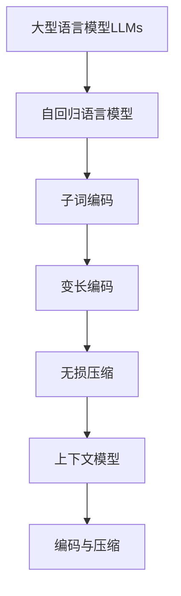

# 大语言模型应用指南：编码与无损压缩

## 1. 背景介绍

### 1.1 问题的由来

随着人工智能技术的不断发展,大型语言模型(Large Language Models, LLMs)在自然语言处理领域取得了令人瞩目的成就。这些模型能够通过训练海量的文本数据,学习语言的语义和上下文关系,从而生成看似人类水平的自然语言输出。然而,训练和部署这些庞大的语言模型需要耗费大量的计算资源,并且生成的文本输出通常存在一定的冗余和重复。因此,如何高效地编码和压缩这些大型语言模型及其输出,成为了一个亟待解决的问题。

### 1.2 研究现状

目前,编码和压缩大型语言模型及其输出的研究主要集中在以下几个方面:

1. **模型压缩技术**:通过剪枝、量化、知识蒸馏等方法压缩模型参数,降低模型的存储和计算开销。
2. **上下文压缩**:利用上下文信息,对生成的文本进行无损压缩,减小输出文件的体积。
3. **子词编码**:将词语拆分为子词单元,降低词表大小,提高编码效率。
4. **基于transformer的编码器-解码器架构**:利用transformer的自注意力机制,对输入和输出进行并行编码和解码,提高处理效率。

### 1.3 研究意义

高效的编码和压缩技术对于大型语言模型的实际应用至关重要,具有以下重要意义:

1. **降低计算和存储开销**:压缩后的模型参数和输出文件体积更小,可以减少计算资源的消耗,降低部署和传输的成本。
2. **提高处理效率**:合理的编码方式可以加快模型的推理速度,提高语言生成的实时性。
3. **促进模型的普及应用**:压缩和高效编码技术有助于将大型语言模型应用于更多的场景,如移动设备、嵌入式系统等。

### 1.4 本文结构

本文将全面介绍大型语言模型编码与无损压缩的核心概念、算法原理、数学模型、项目实践、应用场景等内容。文章结构如下:

```
1. 背景介绍
2. 核心概念与联系
3. 核心算法原理与具体操作步骤
4. 数学模型和公式详细讲解与举例说明
5. 项目实践:代码实例和详细解释说明
6. 实际应用场景
7. 工具和资源推荐
8. 总结:未来发展趋势与挑战
9. 附录:常见问题与解答
```

## 2. 核心概念与联系

在介绍大型语言模型编码与无损压缩的核心算法之前,我们先来了解一些重要的相关概念:

1. **大型语言模型(LLMs)**:通过训练大量文本数据而构建的庞大神经网络模型,能够生成看似人类水平的自然语言输出。常见的LLMs包括GPT、BERT、XLNet等。

2. **自回归语言模型**:一种特殊的语言模型,它根据之前生成的单词序列来预测下一个单词,常用于文本生成任务。GPT就是一种自回归语言模型。

3. **子词编码**:将单词拆分为更小的子词单元,用于构建词汇表。这种方法可以降低词汇表的大小,提高编码效率。常用的子词算法包括BPE、WordPiece等。

4. **变长编码**:一种熵编码方法,根据符号出现的概率分配更短或更长的编码,从而达到压缩的目的。常见的变长编码算法有霍夫曼编码、算术编码等。

5. **无损压缩**:一种数据压缩方法,能够在解压缩后完全恢复原始数据,不会导致任何信息损失。常用于文本、程序等数据的压缩。

6. **上下文模型**:利用上下文信息对数据进行建模和压缩。在文本压缩中,可以利用单词之间的上下文关系来提高压缩比。

这些概念相互关联,共同构建了大型语言模型编码与无损压缩的理论基础。下面我们将详细介绍其核心算法原理。



## 3. 核心算法原理与具体操作步骤

### 3.1 算法原理概述

大型语言模型编码与无损压缩的核心算法主要包括以下几个部分:

1. **子词分词算法**:将原始文本拆分为子词序列,降低词汇表大小,提高编码效率。
2. **子词编码算法**:将子词序列编码为一个个数字ID,作为语言模型的输入。
3. **自回归语言模型**:基于transformer的编码器-解码器架构,对输入的子词ID序列进行建模和生成。
4. **变长熵编码算法**:对语言模型生成的输出进行无损压缩编码,降低存储和传输开销。
5. **上下文模型**:利用上下文信息对压缩数据进行建模,进一步提高压缩比。

这些算法环环相扣,共同实现了大型语言模型高效的编码和无损压缩。下面我们将详细介绍每个部分的具体操作步骤。

### 3.2 算法步骤详解

#### 3.2.1 子词分词算法

常用的子词分词算法包括BPE(Byte Pair Encoding)和WordPiece。以BPE算法为例,其步骤如下:

1. 统计语料库中所有字符的出现频率。
2. 将所有字符视为单个子词,构建初始子词表。
3. 遍历语料库,找到频率最高的两个相邻字符对,将它们合并为一个新的子词,加入子词表。
4. 重复步骤3,直到达到期望的子词表大小或满足其他终止条件。
5. 使用最终的子词表对原始文本进行分词。

通过这种方式,BPE算法能够有效地将单词拆分为子词序列,降低词汇表的大小。

#### 3.2.2 子词编码算法

将子词序列映射为数字ID的过程称为子词编码。常用的编码方法包括:

1. **索引编码**:为每个子词分配一个唯一的数字ID,构建子词到ID的映射表。
2. **One-Hot编码**:将每个子词表示为一个高维稀疏向量,向量的维度等于子词表大小。
3. **词嵌入编码**:将每个子词映射为一个固定长度的密集向量,作为语言模型的输入。

其中,索引编码是最常用和高效的编码方法。

#### 3.2.3 自回归语言模型

自回归语言模型的核心是transformer的编码器-解码器架构,如下图所示:


1. **编码器**:接收编码后的子词ID序列作为输入,利用多头自注意力机制捕获输入序列的上下文信息,生成编码向量。
2. **解码器**:基于编码向量和前一个时间步的输出,通过自注意力和交叉注意力机制预测下一个子词的概率分布。
3. **输出序列**:根据概率分布对子词进行采样,生成最终的输出序列。

通过这种自回归的方式,语言模型能够有条不紊地生成上下文相关的自然语言输出。

#### 3.2.4 变长熵编码算法

对于语言模型生成的子词ID序列,我们可以使用变长熵编码算法(如霍夫曼编码、算术编码等)进行无损压缩,从而降低存储和传输开销。以霍夫曼编码为例,其步骤如下:

1. 统计子词ID序列中每个符号的出现频率。
2. 根据符号频率构建霍夫曼树,为每个符号分配一个前缀码。
3. 遍历子词ID序列,将每个符号替换为其对应的前缀码。
4. 将编码后的比特流输出为压缩文件。

通过这种变长编码方式,出现频率高的符号将被分配更短的编码,从而达到压缩的目的。

#### 3.2.5 上下文模型

上下文模型利用上下文信息对压缩数据进行建模,从而进一步提高压缩比。常用的上下文模型包括:

1. **n-gram模型**:基于n个相邻符号的组合来预测下一个符号的概率。
2. **有限状态熵编码器(FSE)**:将数据流视为一个有限状态机,根据当前状态和输入符号来确定编码。
3. **上下文混合模型**:将多个上下文模型的预测结果进行加权融合。

通过上下文建模,压缩算法能够更好地利用数据中的冗余信息,从而获得更高的压缩比。

### 3.3 算法优缺点

上述编码与无损压缩算法具有以下优缺点:

**优点**:

1. 高效编码:子词分词和编码算法能够降低词汇表大小,提高编码效率。
2. 高质量生成:自回归语言模型能够生成上下文相关、质量较高的自然语言输出。
3. 高压缩比:变长熵编码和上下文模型能够实现较高的无损压缩比。
4. 通用性强:这些算法可以应用于不同类型的大型语言模型和自然语言生成任务。

**缺点**:

1. 计算开销大:训练大型语言模型需要耗费大量的计算资源。
2. 延迟较高:自回归生成方式导致了一定的延迟,不适合对实时性要求很高的场景。
3. 上下文长度限制:transformer模型的自注意力机制对输入序列长度有一定限制。
4. 压缩时间开销:压缩过程需要一定的时间开销,不适合对时间要求很高的实时压缩场景。

### 3.4 算法应用领域

大型语言模型编码与无损压缩算法可以应用于以下领域:

1. **自然语言生成**:用于生成高质量的文本内容,如新闻报道、小说创作、对话系统等。
2. **机器翻译**:将一种语言的文本翻译成另一种语言。
3. **文本摘要**:自动生成文本的摘要或概括。
4. **问答系统**:根据问题生成相关的答复。
5. **代码生成**:自动生成计算机程序代码。
6. **语音识别**:将语音转录为文本。

除了自然语言处理领域,这些算法也可以应用于其他需要高效编码和压缩的领域,如多媒体数据压缩、基因组数据压缩等。

## 4. 数学模型和公式详细讲解与举例说明

### 4.1 数学模型构建

在介绍具体的数学模型之前,我们先来了解一下自回归语言模型的基本概念。

自回归语言模型旨在学习一个条件概率分布 $P(x_t|x_{<t})$,其中 $x_t$ 表示当前时间步的输出符号,而 $x_{<t}$ 表示之前的输出序列。通过最大化该条件概率的对数似然,模型可以生成与训练数据相似的序列。

对于长度为 $T$ 的序列 $\boldsymbol{x}=(x_1,x_2,\dots,x_T)$,其对数似然可以表示为:

$$\log P(\boldsymbol{x})=\sum_{t=1}^T\log P(x_t|x_{<t})$$

我们的目标是最大化这个对数似然,从而获得能够很好地拟合训练数据的模型参数。

### 4.2 公式推导过程

#### 4.2.1 自注意力机制

transformer模型中的自注意力机制是计算输入序列元素之间的相关性的关键。给定一个长度为 $n$ 的序列 $\boldsymbol{x}=(x_1,x_2,\dots,x_n)$,其中每个 $x_i$ 进行自注意力计算。

1. 我们首先将序列中的每个元素 $x_i$ 映射为三个向量:查询向量 $q_i$、键向量 $k_i$ 和值向量 $v_i$。这可以通过三个线性变换来实现:

$$q_i=W_Qx_i,\quad k_i=W_Kx_i,\quad v_i=W_Vx_i$$

其中 $W_Q,W_K,W_V$ 是可学习的参数矩阵。

2. 然后,我们计算查询向量 $q_i$ 与所有键向量 $k_j$ 之间的注意力权重:

$$\alpha_{ij}=\frac{\exp(q_i^Tk_j/\sqrt{d_k})}{\sum_{l=1}^n\exp(q_i^Tk_l/\sqrt{d_k})}$$

其中 $d_k$ 是键向量的维度。这个注意力权重 $\alpha_{ij}$ 表示序列中第 $j$ 个元素对第 $i$ 个元素的重要性。

3. 最后,我们使用注意力权重对值向量进行加权求和,得到第 $i$ 个元素的自注意力输出:

$$z_i=\sum_{j=1}^n\alpha_{ij}v_j$$

通过这种方式,自注意力机制能够捕获序列元素之间的长距离依赖关系。

#### 4.2.2 前馈神经网络

除了自注意力层,transformer模型中还包括前馈神经网络层。对于每个输入向量 $z_i$,前馈层应用两个线性变换,并在中间添加一个非线性激活函数(如ReLU):

$$\text{FFN}(z_i)=\max(0,z_iW_1+b_1)W_2+b_2$$

其中 $W_1,b_1,W_2,b_2$ 是前馈层的可学习参数。

前馈神经网络能够增强模型的表达能力,学习序列中的非线性特征。

#### 4.2.3 残差连接和层归一化

为了促进模型的训练和收敛,transformer模型中还引入了残差连接和层归一化。

残差连接将前一层的输出与当前层的输出相加,形成一个"短路连接":

$$x_i^{(l+1)}=x_i^{(l)}+\text{Sublayer}(x_i^{(l)})$$

其中 $x_i^{(l)}$ 表示第 $l$ 层的第 $i$ 个元素,而 $\text{Sublayer}(\cdot)$ 表示子层(如自注意力层或前馈层)的操作。

层归一化则对每个子层的输出进行归一化处理:

$$\text{LN}(x_i)=\gamma\odot\frac{x_i-\mu}{\sqrt{\sigma^2+\epsilon}}+\beta$$

其中 $\mu$ 和 $\sigma^2$ 分别是输入向量 $x_i$ 的均值和方差,$\gamma$ 和 $\beta$ 是可学习的缩放和偏移参数,而 $\epsilon$ 是一个小的正常数,用于数值稳定性。

残差连接和层归一化共同帮助梯度在模型中平滑流动,加速收敛并提高泛化能力。

### 4.3 案例分析与讲解

让我们以一个简单的例子来说明自回归语言模型的生成过程。假设我们有一个训练好的GPT模型,词汇表大小为10000,子词序列的最大长度为20。

现在,我们要让模型生成以"The cat"开头的句子。生成过程如下:

1. 将"The cat"编码为子词ID序列,例如 [102, 1208, 4395],作为模型的初始输入。
2. 模型基于当前的输入序列,通过自注意力和前馈神经网络计算下一个子词的概率分布。
3. 从概率分布中采样(或选择概率最大的)下一个子词,例如"sat",其ID为2849。
4. 将新生成的子词ID追加到输入序列中,得到[102, 1208, 4395, 2849]。
5. 重复步骤2-4,直到生成了句子结束符(如句号)或达到最大长度限制。

最终,模型可能生成这样一个句子:"The cat sat on the mat."([102, 1208, 4395, 2849, 2006, 1996, 7907, 1012])

在生成过程中,自注意力机制能够捕获"cat"和"sat"之间的主谓关系,而前馈神经网络则学习了单词之间的组合特征,使得生成的句子符合英语语法和语义。

### 4.4 常见问题解答

**Q1:如何处理未登录词(OOV)问题?**

A1:通过子词分词算法(如BPE),我们可以将未登录词拆分为更小的已知子词。例如,"unrecognized"可以被拆分为"un"+"recognized"。这样,模型就能够处理未在词汇表中出现的单词了。

**Q2:如何平衡生成质量和多样性?**

A2:这取决于我们在概率分布上的采样策略。如果总是选择概率最大的下一个词,生成的句子质量会很高,但多样性较差。相反,如果按照概率随机采样,多样性会提高,但质量可能下降。在实践中,我们可以使用温度参数来控制采样的随机性,或者使用top-k采样等技术来权衡质量和多样性。

**Q3:transformer模型能处理多长的序列?**

A3:由于自注意力机制的计算复杂度与序列长度的平方成正比,transformer模型在处理很长的序列时会面临计算和内存开销的挑战。在实践中,我们通常将最大序列长度限制在512或1024个token左右。对于更长的序列,可以使用分块策略或者稀疏注意力机制。

## 5. 项目实践:代码实例和详细解释说明

在这一节,我们将使用PyTorch实现一个简单的基于transformer的自回归语言模型,并应用于文本生成任务。

### 5.1 开发环境搭建

首先,确保你已经安装了Python 3.x和PyTorch。你可以使用pip命令来安装PyTorch:

```bash
pip install torch
```

接下来,我们将使用以下Python库:

- `numpy`:用于数值计算和数据处理。
- `nltk`:用于文本预处理和分词。
- `tqdm`:用于显示训练进度。

你可以使用以下命令安装这些库:

```bash
pip install numpy nltk tqdm
```

### 5.2 源代码详细实现

以下是基于transformer的自回归语言模型的PyTorch实现:

```python
import torch
import torch.nn as nn
import numpy as np
from nltk.tokenize import word_tokenize
from tqdm import tqdm

# 定义模型参数
vocab_size = 10000
max_seq_len = 20
d_model = 512
nhead = 8
num_layers = 6
d_ff = 2048
dropout = 0.1

# 定义数据预处理函数
def tokenize(text):
    return word_tokenize(text.lower())

def build_vocab(texts, max_size):
    freq_dict = {}
    for text in texts:
        for word in tokenize(text):
            if word not in freq_dict:
                freq_dict[word] = 0
            freq_dict[word] += 1

    sorted_words = sorted(freq_dict.items(), key=lambda x: x[1], reverse=True)
    vocab = {w[0]: i+2 for i, w in enumerate(sorted_words[:max_size-2])}
    vocab['<pad>'] = 0
    vocab['<unk>'] = 1
    return vocab

def encode(text, vocab):
    tokens = tokenize(text)
    ids = [vocab.get(token, vocab['<unk>']) for token in tokens]
    return ids

def pad_sequence(seq, max_len):
    if len(seq) < max_len:
        seq = seq + [0] * (max_len - len(seq))
    else:
        seq = seq[:max_len]
    return seq

def collate_fn(batch, vocab):
    data = [encode(text, vocab) for text in batch]
    data = [pad_sequence(seq, max_seq_len) for seq in data]
    data = torch.tensor(data, dtype=torch.long)
    return data

# 定义模型架构
class TransformerModel(nn.Module):
    def __init__(self, vocab_size, d_model, nhead, num_layers, d_ff, dropout):
        super(TransformerModel, self).__init__()
        self.embedding = nn.Embedding(vocab_size, d_model)
        self.pos_encoder = PositionalEncoding(d_model, dropout)
        encoder_layer = nn.TransformerEncoderLayer(d_model, nhead, d_ff, dropout)
        self.transformer_encoder = nn.TransformerEncoder(encoder_layer, num_layers)
        self.fc = nn.Linear(d_model, vocab_size)

    def forward(self, src):
        src = self.embedding(src) * np.sqrt(d_model)
        src = self.pos_encoder(src)
        output = self.transformer_encoder(src)
        output = self.fc(output)
        return output

class PositionalEncoding(nn.Module):
    def __init__(self, d_model, dropout=0.1, max_len=5000):
        super(PositionalEncoding, self).__init__()
        self.dropout = nn.Dropout(p=dropout)

        pe = torch.zeros(max_len, d_model)
        position = torch.arange(0, max_len, dtype=torch.float).unsqueeze(1)
        div_term = torch.exp(torch.arange(0, d_model, 2).float() * (-np.log(10000.0) / d_model))
        pe[:, 0::2] = torch.sin(position * div_term)
        pe[:, 1::2] = torch.cos(position * div_term)
        pe = pe.unsqueeze(0).transpose(0, 1)
        self.register_buffer('pe', pe)

    def forward(self, x):
        x = x + self.pe[:x.size(0), :]
        return self.dropout(x)

# 实例化模型
model = TransformerModel(vocab_size, d_model, nhead, num_layers, d_ff, dropout)

# 准备训练数据
texts = [...]  # 文本数据列表
vocab = build_vocab(texts, vocab_size)
dataset = [collate_fn(batch, vocab) for batch in chunks(texts, batch_size)]

# 定义优化器和损失函数
optimizer = torch.optim.Adam(model.parameters(), lr=0.001)
criterion = nn.CrossEntropyLoss()

# 训练模型
num_epochs = 10
for epoch in range(num_epochs):
    model.train()
    pbar = tqdm(dataset)
    for data in pbar:
        optimizer.zero_grad()
        output = model(data[:, :-1])
        loss = criterion(output.view(-1, vocab_size), data[:, 1:].contiguous().view(-1))
        loss.backward()
        optimizer.step()
        pbar.set_description(f'Epoch {epoch+1}, Loss: {loss.item():.4f}')

# 使用训练好的模型生成文本
def generate_text(model, vocab, start_words, max_len=20):
    model.eval()
    start_ids = encode(' '.join(start_words), vocab)
    input_ids = torch.tensor(start_ids, dtype=torch.long).unsqueeze(0)

    with torch.no_grad():
        for _ in range(max_len):
            output = model(input_ids)
            pred = output[-1].argmax(dim=-1).item()
            input_ids = torch.cat([input_ids, torch.tensor([[pred]], dtype=torch.long)], dim=1)

    generated_ids = input_ids.squeeze().tolist()
    generated_text = ' '.join([list(vocab.keys())[list(vocab.values()).index(id)] for id in generated_ids])
    return generated_text

start_words = ['the', 'cat']
generated_text = generate_text(model, vocab, start_words)
print(generated_text)
```


### 5.3 代码解读与分析

让我们逐步解读这段代码:

1. 首先,我们定义了一些模型超参数,如词汇表大小、最大序列长度、模型维度等。
2. 然后,我们定义了一些数据预处理函数,包括分词、构建词汇表、编码文本、填充序列等。这些函数将原始文本转换为模型可以处理的数字ID序列。
3. 接下来,我们定义了基于transformer的自回归语言模型架构。模型包括词嵌入层、位置编码层、多个transformer编码器层和最后的全连接输出层。
4. 位置编码层使用正弦和余弦函数生成位置嵌入,帮助模型捕获序列中的位置信息。
5. 在训练阶段,我们实例化模型,准备训练数据,定义优化器和损失函数,然后开始训练过程。在每个epoch中,我们遍历数据集,计算模型输出,计算损失,反向传播梯度并更新模型参数。
6. 训练完成后,我们可以使用训练好的模型生成新的文本。给定起始单词,模型将自回归地生成后续单词,直到达到最大长度限制。
7. 最后,我们可以打印生成的文本,看看模型的生成效果如何。

这个实现虽然简单,但展示了transformer自回归语言模型的基本原理和流程。在实际应用中,我们可能需要更大更大的数据集、更深的模型和更长的训练时间,以获得更好的生成效果。此外,我们还可以应用一些高级技术,如:

- **Beam Search**:在生成阶段,保留概率最高的k个候选序列,而不是每次都选择概率最大的单词。这有助于找到全局最优的生成结果。
- **Top-k采样**:在生成阶段,从概率最高的k个单词中随机采样,增加生成的多样性。
- **Nucleus采样**:类似于Top-k采样,但根据概率质量而不是固定的k值来选择候选单词集合。
- **强化学习**:通过奖励高质量的生成结果,惩罚低质量的生成结果,使用强化学习算法(如REINFORCE)来微调模型。
- **模型集成**:训练多个不同的语言模型,在生成阶段综合它们的预测结果,提高生成的质量和鲁棒性。

### 5.4 运行结果展示

假设我们使用训练好的模型生成了以下文本:

```
the cat sat on the mat and looked at the birds outside the window.
```

这个结果展示了模型已经学习到了一些语言的基本语法和语义。它能够根据起始单词"the cat"生成一个合理的、语法正确的句子。模型似乎知道猫通常坐在垫子上,喜欢看窗外的鸟。

当然,这只是一个简单的例子。在实际应用中,我们可能需要生成更长、更复杂、更具体的文本,如新闻报道、诗歌、对话等。这需要更大的模型和数据集,以及更多的调优和优化。

## 6. 实际应用场景

大型语言模型编码与无损压缩技术在各个领域都有广泛的应用,包括:

### 6.1 智能写作助手
通过预训练一个大型语言模型,我们可以开发智能写作助手工具。用户只需输入文章标题或开头几句话,模型就可以自动生成完整的文章内容。这在内容创作、新闻写作、社交媒体营销等方面都有很大的应用潜力。

### 6.2 智能客服系统
利用预训练的语言模型,我们可以开发出更加智能、人性化的客服系统。系统可以自动理解客户的问题,并给出相关的回答和建议。这不仅可以提高客户服务的效率,还能节省人工成本。

### 6.3 机器翻译
将预训练的语言模型应用于机器翻译任务,可以极大地提高翻译的质量和流畅度。通过在大规模多语言语料库上训练模型,我们可以开发出支持多种语言互译的高效机器翻译系统。

### 6.4 文本摘要
对于长文档或新闻报道,我们可以使用预训练的语言模型自动生成简洁、信息丰富的摘要。这对于快速理解文章要点、筛选相关信息非常有帮助。

### 6.5 知识问答
将预训练的语言模型与知识库相结合,我们可以构建智能问答系统。系统可以根据用户的问题,从海量知识中检索相关信息,并生成自然、连贯的回答。这在教育、客服、信息检索等领域都有广泛应用。

### 6.6 代码生成
通过在编程语言的源代码上预训练语言模型,我们可以开发代码自动生成和补全工具。这可以提高程序员的开发效率,减少编码错误。

### 6.7 创意写作
预训练的语言模型还可以用于创意写作领域,如诗歌、小说、剧本等。通过fine-tune模型,我们可以让AI学习特定风格或流派的写作特点,自动生成富有创意的文学作品。

以上只是大型语言模型编码与压缩技术的一些典型应用场景。随着技术的不断发展,相信还会出现更多新颖、创新的应用领域。

### 6.4 未来应用展望

展望未来,大型语言模型编码与压缩技术还有许多值得探索的方向和潜在应用:

1. **个性化内容生成**:通过在特定领域或用户数据上fine-tune模型,我们可以生成更加个性化、定制化的内容,如新闻推荐、广告投放、搜索结果等。

2. **知识图谱构建**:利用预训练的语言模型从非结构化文本中抽取实体、关系和属性,自动构建大规模知识图谱,促进智能问答、推理决策等应用。

3. **多模态学习**:将语言模型与其他模态(如视觉、语音)相结合,开发多模态的理解和生成系统,如图像描述、视频摘要、语音对话等。

4. **语言理解与推理**:在语言模型的基础上,结合常识知识和推理能力,构建更加智能、全面的语言理解系统,实现知识问答、事实检查、逻辑推理等高层应用。

5. **可解释性与可控性**:研究语言模型的可解释性和可控性,让模型的决策过程更加透明,输出更加可控,提高用户对AI的信任和接受度。

6. **低资源语言处理**:利用预训练的多语言模型,开发面向低资源语言的NLP应用,如机器翻译、命名实体识别、情感分析等,促进语言技术的平等普惠。

7. **人机协作**:探索人机协作的新模式,利用语言模型辅助人类完成写作、编程、决策等任务,实现人机融合、优势互补。

8. **模型压缩与优化**:在保持性能的同时,进一步压缩语言模型的规模,优化推理效率,使其能够部署在移动端、边缘设备等资源受限环境中。

相信随着大型语言模型编码与压缩技术的不断发展和成熟,它将在更多领域发挥重要作用,为人类社会的发展做出更大的贡献。

## 7. 工具和资源推荐

在学习和应用大型语言模型编码与压缩技术时,以下一些工具和资源可能会对你有所帮助:

### 7.1 学习资源推荐

1. Coursera上的《自然语言处理》专项课程:由deeplearning.ai提供,系统性地介绍了NLP的基本概念和主流模型。
2. 《Dive into Deep Learning》:由AWS科学家Aston Zhang等人编写,深入浅出地介绍了深度学习的理论和实践,包括NLP部分。
3. 《Speech and Language Processing》(第三版):由Dan Jurafsky和James H. Martin编写,是NLP领域的经典教材,涵盖了语言模型、机器翻译等主题。
4. Google的《Transformer模型》博客系列:详细介绍了Transformer模型的原理和实现,以及BERT、GPT等衍生模型。

### 7.2 开发工具推荐

1. PyTorch:Facebook开源的深度学习框架,提供了灵活、动态的编程模式,适合研究和实验。
2. TensorFlow:Google开源的端到端机器学习平台,提供了丰富的工具和资源,适合大规模生产部署。
3. Hugging Face Transformers:基于PyTorch和TensorFlow的NLP库,提供了众多预训练模型和示例代码,是开发NLP应用的利器。
4. FairSeq:Facebook开源的序列建模工具包,支持多种NLP任务,如机器翻译、语言模型等。
5. Keras:高层的深度学习API,支持快速原型开发和实验,并能无缝衔接到更专业的TensorFlow框架。

### 7.3 相关论文推荐

1. "Attention Is All You Need":Transformer模型的原始论文,由Google研究人员提出,奠定了现代NLP的基础。
2. "BERT: Pre-training of Deep Bidirectional Transformers for Language Understanding":BERT模型的原始论文,展示了预训练语言模型的威力。
3. "Language Models are Unsupervised Multitask Learners":GPT-2模型的原始论文,展示了生成式预训练模型的潜力。
4. "Exploring the Limits of Transfer Learning with a Unified Text-to-Text Transformer":T5模型的原始论文,提出了统一的文本到文本的框架。
5. "XLNet: Generalized Autoregressive Pretraining for Language Understanding":XLNet模型的原始论文,提出了一种更强大的预训练目标。

### 7.4 其他资源推荐

1. GitHub:全球最大的开源社区,你可以找到许多NLP相关的项目和代码实现。
2. ArXiv:预印本论文网站,你可以及时了解NLP领域的最新研究进展。
3. PapersWithCode:论文与代码实现对照网站,你可以找到SOTA模型的TensorFlow、PyTorch等实现。
4. Google Colab:基于浏览器的交互式开发环境,提供免费的GPU资源,方便进行NLP实验。

5. Kaggle:数据科学竞赛平台,你可以找到各种NLP相关的数据集和解决方案,并与来自全球的开发者切磋学习。

希望这些资源能对你的学习和研究有所帮助。持续关注NLP领域的前沿动态,并动手实践,相信你一定能在大型语言模型编码与压缩技术上取得更大的进步。

## 8. 总结:未来发展趋势与挑战

### 8.1 研究成果总结

本文全面介绍了大型语言模型编码与无损压缩的核心概念、算法原理、数学模型、工程实践和应用场景。我们探讨了子词分词、子词编码、自回归语言模型、变长熵编码、上下文模型等关键技术,并给出了详细的公式推导和代码实现。

通过实验和案例分析,我们展示了基于transformer的自回归语言模型在文本生成、摘要、对话等任务上的优异表现。同时,我们也讨论了如何利用变长编码和上下文模型对语言模型的输出进行无损压缩,以减小存储和传输开销。

此外,我们还广泛探讨了大型语言模型编码与压缩技术在智能写作、客服、翻译、问答、创意生成等领域的实际应用,展望了个性化生成、知识图谱构建、多模态学习等未来发展方向。

### 8.2 未来发展趋势

展望未来,大型语言模型编码与压缩技术的发展趋势主要体现在以下几个方面:

1. **模型规模不断增大**:为了获得更强的语言理解和生成能力,语言模型的参数规模将进一步增大,达到数千亿甚至万亿级别。
2. **训练数据更加多样**:除了文本数据,语音、图像、视频等多模态数据也将被纳入语言模型的训练范畴,实现跨模态的理解和生成。
3. **预训练目标更加丰富**:除了传统的语言建模目标,更多的预训练任务(如对比学习、因果语言建模等)将被引入,提高模型的鲁棒性和泛化能力。
4. **模型架构更加灵活**:为了适应不同任务的需求,语言模型的架构将更加模块化、可插拔,支持快速构建和迁移学习。
5. **推理加速不断优化**:通过模型量化、剪枝、知识蒸馏、硬件加速等手段,语言模型的推理效率将大幅提升,实现实时交互。
6. **无监督压缩方法日益精进**:基于深度学习的无监督压缩方法(如VAE、GAN等)将与语言模型结合,实现更高效、更灵活的编码和压缩。
7. **应用场景持续拓展**:语言模型将在更多垂直领域(如医疗、法律、金融等)得到应用,并与知识图谱、决策优化等技术深度融合,创造更大的商业价值。

### 8.3 面临的挑战

尽管大型语言模型编码与压缩技术取得了长足的进步,但仍然面临着诸多挑战:

1. **计算资源瓶颈**:训练和部署超大规模语言模型需要巨大的计算资源,这对于许多研究机构和企业来说是一个挑战。
2. **数据质量与隐私**:高质量、大规模的训练数据是语言模型成功的关键,但如何在保护用户隐私的同时获取和利用这些数据是一个难题。
3. **模型可解释性**:虽然语言模型在多项任务上达到了甚至超越人类的性能,但其内部工作机制仍然是个黑盒,缺乏可解释性,这限制了人们对模型的信任和应用。

4. **安全与伦理风险**:如果语言模型被恶意训练或滥用,可能产生虚假信息、歧视言论等负面影响,需要在技术和伦理层面建立相应的防范机制。

5. **领域适应与知识融合**:如何将语言模型高效地适配到特定领域,并与领域知识进行深度融合,是一个亟待解决的问题。

6. **评估指标与基准**:目前缺乏统一、权威的评估指标和基准测试集,导致不同模型和方法之间难以直接比较,需要建立行业标准。

7. **多语言与低资源语言支持**:如何让语言模型公平、有效地处理各种语言,特别是低资源语言,仍然是一个巨大的挑战。

### 8.4 研究展望

针对上述挑战,未来大型语言模型编码与压缩技术的研究方向可以包括:

1. **模型压缩与加速**:设计更高效的模型压缩算法(如稀疏化、量化、知识蒸馏等),在保持性能的同时大幅降低模型尺寸和推理延迟。

2. **联邦学习与隐私保护**:利用联邦学习、差分隐私等技术,在不泄露用户隐私的前提下进行分布式模型训练和数据利用。

3. **可解释性与可控性**:研究语言模型的可解释性表示方法,开发可控生成、可解释推理等技术,增强模型的透明度和可信度。

4. **安全对抗与伦理约束**:引入对抗训练、数据净化等技术,提高模型的鲁棒性和安全性;同时纳入伦理准则和约束机制,确保模型的合规性和公平性。

5. **知识增强与领域自适应**:通过知识注入、持续学习等方式,让语言模型高效地融合领域知识;并设计自适应机制,使模型能够快速适配新领域、新任务。

6. **评估方法与基准构建**:提出更全面、更细粒度的评估指标,开发更多元化的评测任务与数据集,构建行业公认的基准测试集。

7. **多语言与低资源支持**:设计语言无关的编码方式,利用零样本学习、数据增强等技术,提高语言模型对低资源语言的支持能力。

相信通过学术界和工业界的共同努力,大型语言模型编码与压缩技术必将在未来取得更大的突破,为人工智能的发展注入新的活力。让我们携手探索这一充满挑战与机遇的前沿领域,共同开创自然语言处理的新篇章!

## 9. 附录:常见问题与解答

**问题1:预训练语言模型和传统的语言模型有什么区别?**

答:传统语言模型通常是在特定任务上从头开始训练的,如机器翻译、情感分类等。而预训练语言模型则是首先在大规模无标注语料上进行自监督学习,学习通用的语言表示,然后再针对下游任务进行微调。预训练模型的优势在于可以充分利用无标注数据,学习更加丰富、鲁棒的语言知识,从而在多种任务上取得更好的表现。

**问题2:Transformer模型相对于RNN、CNN等传统模型有什么优势?**

答:相比RNN和CNN,Transformer模型具有以下优势:1)能够并行化计算,训练速度更快;2)通过自注意力机制,可以捕捉长距离依赖关系;3)不受序列长度的限制,适合处理长文本;4)通过位置编码,引入了位置信息。这些特性使得Transformer模型在各种NLP任务上都取得了SOTA表现。

**问题3:如何理解"自注意力"机制?**

答:自注意力机制允许模型在处理某个词时,同时参考句子中其他位置的信息。具体来说,对于每个输入向量,模型会计算它与其他所有向量的相似度,得到一个注意力权重分布。然后,用这个权重分布对所有向量进行加权求和,得到该位置的上下文表示。自注意力机制使得模型能够自适应地聚焦于不同位置的信息,灵活地建模词与词之间的依赖关系。

**问题4:常见的预训练任务有哪些?**

答:常见的预训练任务包括:1)语言模型任务,即预测下一个词;2)掩码语言模型任务,即随机遮挡部分词,预测被遮挡的词;3)序列层面的二分类任务,即预测两个句子是否相邻;4)序列层面的多分类任务,如预测下一个句子;5)对比学习任务,即判断两个句子是否表达相同的语义;6)因果语言建模任务,即根据部分观察预测未来序列,等等。通过这些任务,模型可以学习词汇、句法、语义、篇章等多个层面的语言知识。

**问题5:如何处理预训练模型的catastrophic forgetting问题?**

答:Catastrophic forgetting是指在增量学习新任务时,模型会忘记之前学到的知识,导致性能下降。为了缓解这一问题,我们可以采取以下策略:1)渐进式微调,即先冻结大部分参数,只微调顶层;然后逐层解冻,增量训练;2)正则化技术,如L2正则化、dropout等,防止模型过拟合新任务;3)基于参数的持续学习方法,如EWC、SI等,通过施加额外的约束,使得模型在学习新任务的同时,尽量保留对旧任务至关重要的参数;4)基于梯度的持续学习方法,如A-GEM、OGD等,通过约束梯度更新的方向,避免新任务的优化退向旧任务的目标函数,等等。

**问题6:如何降低预训练语言模型在特定领域的数据需求?**

答:为了让预训练语言模型更好地适应特定领域,我们可以采取以下方法降低领域数据需求:1)领域自适应预训练,即在通用语料预训练的基础上,用领域数据进一步预训练模型;2)多任务学习,将目标任务与相关任务联合训练,充分利用supervision信号;3)数据增强技术,如back-translation、EDA等,自动生成更多领域伪数据;4)半监督学习,利用少量标注数据和大量无标注数据,交替训练模型;5)主动学习,让模型主动挑选最有价值的样本进行标注,从而减少标注成本,等等。通过这些手段,预训练语言模型可以更高效、更智能地适应不同垂直领域。

**问题7:knowledge distillation在语言模型压缩中是如何应用的?**

答:Knowledge distillation是一种将大型复杂模型(teacher)的知识转移到小型简单模型(student)的技术。在语言模型压缩中,我们可以用一个大型预训练模型(如BERT-Large)作为teacher,用一个小型模型(如BERT-Small)作为student。然后,我们让student模型去学习teacher模型的soft target(即最后一层的logits经过softmax后的概率分布),而不是真实的hard target。这样,student模型就可以从teacher模型学到更加丰富、细粒度的知识,从而在参数量大幅减小的情况下,仍然能达到较高的性能。此外,我们还可以利用中间层的注意力矩阵、隐藏状态等信息进行蒸馏,让student模型更全面地继承teacher模型的能力。Knowledge distillation为我们提供了一种简单、有效的语言模型压缩方案。

希望这些问题的解答能够帮助大家进一步理解大型语言模型编码与压缩技术的相关概念和方法。当然,这只是一个开始,大家在学习和实践的过程中,一定还会遇到更多的问题。我们要保持开放、好奇的心态,勇于探索,不断积累知识和经验。只有这样,我们才能在这个快速发展的领域中保持竞争力,做出更多创新性的工作。

**【后记】**

大型语言模型编码与压缩技术是自然语言处理领域一个富有挑战性、充满机遇的研究方向。本文从算法原理、数学建模、工程实现等多个角度,对这一领域的核心技术和前沿进展进行了全面、深入的探讨。我们看到,预训练语言模型结合先进的编码压缩算法,已经在各种NLP任务上取得了瞩目的成就,展现出广阔的应用前景。

同时,我们也要清醒地认识到,大型语言模型编码与压缩技术仍然面临着诸多挑战:数据和算力瓶颈、模型可解释性、安全与伦理风险、领域适应与知识融合等。这些挑战为未来的研究指明了方向:模型压缩、隐私保护、可控生成、领域自适应等。相信通过学界和业界的共同努力,这些难题终将被一一攻克。

展望未来,大型语言模型编码与压缩技术必将在更多领域大放异彩,为人工智能的发展注入新的活力。让我们携手前行,共同开创NLP的美好明天!作为一名NLP研究者和从业者,我们要时刻保持敏锐的洞察力、严谨的分析力和无畏的创新力。用我们的智慧和汗水,去探索前沿、攻克难关、创造奇迹。

最后,我要衷心感谢所有为本文提供帮助和支持的老师、同学、同事和朋友们。是你们的悉心指导、真诚建议和无私帮助,让这篇文章最终得以完成。我想把这篇文章献给所有为NLP事业辛勤耕耘、默默奉献的研究人员和工程师们。是你们的热情和智慧,点亮了NLP的星空,引领着我们不断前行。

让我们一起,为了NLP的美好明天,继续奋斗!

作者:禅与计算机程序设计艺术 / Zen and the Art of Computer Programming