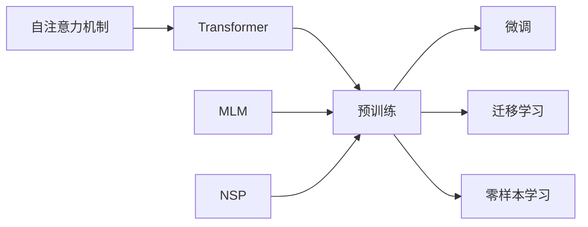

# 大语言模型原理基础与前沿 不需要额外训练即可利用预训练模型

关键词：大语言模型、预训练模型、迁移学习、零样本学习、Transformer、自然语言处理

## 1. 背景介绍
### 1.1  问题的由来
随着人工智能技术的快速发展,自然语言处理(NLP)领域取得了巨大的进步。传统的NLP任务通常需要大量的标注数据和专门的模型训练,这使得NLP应用的开发和部署面临诸多挑战。近年来,预训练语言模型的出现为NLP领域带来了革命性的变化。通过在大规模无监督语料上进行预训练,这些模型能够学习到丰富的语言知识和通用的语言表示,从而可以在下游任务中进行微调或直接应用,无需额外的训练。这种利用预训练模型的范式极大地简化了NLP任务的开发流程,提高了模型的性能和泛化能力。

### 1.2  研究现状
目前,大语言模型已经成为NLP领域的研究热点。从2018年的BERT(Bidirectional Encoder Representations from Transformers)开始,各种大语言模型如雨后春笋般涌现,如GPT系列(Generative Pre-trained Transformer)、XLNet、RoBERTa等。这些模型在多个NLP任务上取得了显著的性能提升,甚至在某些任务上超越了人类的表现。同时,大语言模型的应用也不断拓展,从传统的文本分类、命名实体识别等任务,到问答系统、对话生成、文本摘要等更加复杂的任务。大语言模型正在重塑整个NLP领域的格局。

### 1.3  研究意义
研究大语言模型原理和利用预训练模型的方法具有重要的理论和实践意义。从理论角度来看,探索大语言模型的内在机制有助于我们深入理解人类语言的本质和规律,推动认知科学和人工智能的发展。从实践角度来看,利用预训练模型可以大幅降低NLP应用的开发成本,提高模型的性能和鲁棒性,促进NLP技术在各个领域的应用。同时,研究如何更好地利用预训练模型,如何进行高效的迁移学习和零样本学习,也是当前NLP领域的重要课题。

### 1.4  本文结构
本文将围绕大语言模型原理和利用预训练模型展开论述。首先,我们将介绍大语言模型的核心概念和基本原理。然后,重点阐述利用预训练模型的算法和操作步骤。接着,我们将从数学角度对大语言模型进行建模和推导。在实践部分,我们将给出具体的代码实例和详细解释。此外,我们还将讨论大语言模型的实际应用场景,并推荐相关的工具和资源。最后,我们将总结大语言模型的研究现状和未来发展趋势,并探讨其面临的挑战和机遇。

## 2. 核心概念与联系
大语言模型的核心概念包括:

1. 预训练(Pre-training):在大规模无监督语料上进行自监督学习,学习通用的语言表示。
2. 微调(Fine-tuning):在特定任务的标注数据上对预训练模型进行微调,使其适应任务的需求。
3. 迁移学习(Transfer Learning):将预训练模型学习到的知识迁移到下游任务中,提高任务的性能。
4. 零样本学习(Zero-shot Learning):直接利用预训练模型进行推理,无需在任务数据上进行微调。
5. Transformer:大语言模型的主流架构,基于自注意力机制和前馈神经网络。
6. 自注意力机制(Self-Attention):一种捕捉序列内部依赖关系的机制,是Transformer的核心组件。
7. 掩码语言模型(Masked Language Model, MLM):一种预训练任务,通过随机遮挡部分词语,预测被遮挡的词语。
8. 下一句预测(Next Sentence Prediction, NSP):一种预训练任务,预测两个句子是否相邻。

这些概念之间存在着紧密的联系。预训练是大语言模型的基础,通过在大规模语料上学习,模型能够获得丰富的语言知识。微调和迁移学习是利用预训练模型的两种主要方式,前者在任务数据上进行训练,后者直接将预训练模型应用于任务。零样本学习是一种更加理想的利用方式,无需任何任务数据即可完成推理。Transformer架构和自注意力机制是大语言模型的核心,决定了模型的表达能力和泛化能力。MLM和NSP是BERT等模型常用的预训练任务,有助于模型学习更加全面的语言表示。

下图展示了这些概念之间的关系:

## 3. 核心算法原理 & 具体操作步骤
### 3.1  算法原理概述
利用预训练模型的核心算法可以概括为两个步骤:预训练和下游任务应用。在预训练阶段,模型在大规模无监督语料上进行自监督学习,通过设计合适的预训练任务(如MLM和NSP),学习通用的语言表示。在下游任务应用阶段,可以采用微调、特征提取或零样本学习等方式,将预训练模型应用于具体的NLP任务。

### 3.2  算法步骤详解
1. 预训练阶段:
   - 准备大规模无监督语料,进行必要的预处理(如分词、构建词表等)。
   - 构建预训练模型(如BERT),设计预训练任务(如MLM和NSP)。
   - 在语料上进行预训练,通过最小化预训练任务的损失函数,学习通用的语言表示。
   - 保存预训练模型的参数,用于下游任务的应用。

2. 下游任务应用阶段(以微调为例):
   - 准备下游任务的标注数据,进行必要的预处理。
   - 加载预训练模型的参数,构建适用于下游任务的模型(如在BERT的基础上添加分类器)。
   - 在标注数据上进行微调,通过最小化任务的损失函数,使模型适应任务的需求。
   - 在测试集上评估模型的性能,进行必要的调优。

### 3.3  算法优缺点
利用预训练模型的算法具有以下优点:
1. 减少对标注数据的依赖,降低了NLP任务的开发成本。
2. 提高了模型的性能和泛化能力,在许多任务上取得了显著的效果提升。
3. 简化了NLP任务的开发流程,使得研究人员和工程师可以更加专注于任务本身。

同时,该算法也存在一些缺点:
1. 预训练模型通常规模庞大,训练和推理的计算开销较高。
2. 预训练语料的质量和数量对模型性能有较大影响,获取高质量的语料可能存在挑战。
3. 对于某些特定领域的任务,预训练模型的知识迁移能力可能有限。

### 3.4  算法应用领域
利用预训练模型的算法已经在NLP的各个领域得到广泛应用,包括但不限于:
1. 文本分类:如情感分析、新闻分类等。
2. 命名实体识别:识别文本中的人名、地名、机构名等。
3. 问答系统:根据给定的问题和上下文,生成或检索答案。
4. 机器翻译:将一种语言的文本翻译成另一种语言。
5. 文本摘要:自动生成文本的摘要或关键句。
6. 对话系统:构建智能对话系统,实现人机交互。

## 4. 数学模型和公式 & 详细讲解 & 举例说明
### 4.1  数学模型构建
大语言模型可以用数学形式表示为一个条件概率分布:

$$P(w_1, w_2, ..., w_n) = \prod_{i=1}^n P(w_i | w_1, w_2, ..., w_{i-1})$$

其中,$w_1, w_2, ..., w_n$表示一个长度为$n$的文本序列,$P(w_i | w_1, w_2, ..., w_{i-1})$表示在给定前$i-1$个词的条件下,第$i$个词为$w_i$的条件概率。

大语言模型的目标是学习这个条件概率分布,即最大化文本序列的似然概率:

$$\mathcal{L}(\theta) = \sum_{i=1}^n \log P(w_i | w_1, w_2, ..., w_{i-1}; \theta)$$

其中,$\theta$表示模型的参数。

### 4.2  公式推导过程
以BERT为例,其预训练任务之一是MLM。给定一个文本序列$\mathbf{x} = [x_1, x_2, ..., x_n]$,随机遮挡其中的一些词,得到遮挡后的序列$\mathbf{\hat{x}} = [\hat{x}_1, \hat{x}_2, ..., \hat{x}_n]$。MLM的目标是最大化被遮挡词的条件概率:

$$\mathcal{L}_{MLM}(\theta) = \sum_{i=1}^n m_i \log P(x_i | \mathbf{\hat{x}}; \theta)$$

其中,$m_i$是一个二值变量,表示第$i$个词是否被遮挡。

另一个预训练任务是NSP。给定两个文本序列$\mathbf{x}_1$和$\mathbf{x}_2$,NSP的目标是最大化它们是否相邻的条件概率:

$$\mathcal{L}_{NSP}(\theta) = \log P(y | \mathbf{x}_1, \mathbf{x}_2; \theta)$$

其中,$y$是一个二值变量,表示两个序列是否相邻。

BERT的总体预训练目标是最大化MLM和NSP的联合似然概率:

$$\mathcal{L}(\theta) = \mathcal{L}_{MLM}(\theta) + \mathcal{L}_{NSP}(\theta)$$

### 4.3  案例分析与讲解
以一个简单的例子来说明MLM的工作原理。假设我们有以下文本序列:

"The quick brown fox jumps over the lazy dog."

随机遮挡其中的两个词,得到:

"The quick [MASK] fox [MASK] over the lazy dog."

MLM的目标是预测被遮挡的词。模型将根据上下文信息,计算每个词的条件概率。例如,对于第一个[MASK],模型可能给出以下预测:

$P(brown | \text{The quick [MASK] fox}) = 0.6$
$P(red | \text{The quick [MASK] fox}) = 0.2$
$P(big | \text{The quick [MASK] fox}) = 0.1$

对于第二个[MASK],模型可能给出以下预测:

$P(jumps | \text{The quick [MASK] fox [MASK] over}) = 0.8$
$P(runs | \text{The quick [MASK] fox [MASK] over}) = 0.1$
$P(walks | \text{The quick [MASK] fox [MASK] over}) = 0.05$

通过最大化被遮挡词的条件概率,模型可以学习到词语之间的依赖关系和语义信息。

### 4.4  常见问题解答
1. 问:预训练模型的参数规模通常有多大?
   答:预训练模型的参数规模通常在亿级别,如BERT-base有1.1亿个参数,GPT-3有1750亿个参数。

2. 问:预训练语料的规模对模型性能有何影响?
   答:预训练语料的规模对模型性能有显著影响。通常来说,语料规模越大,模型学习到的语言知识就越丰富,在下游任务上的性能也越好。

3. 问:如何处理预训练语料中的噪声和低质量数据?
   答:可以采用一些数据清洗和过滤的技术,如去除过短或过长的文本,去除包含错别字或非法字符的文本,去除重复或低质量的文本等。

## 5. 项目实践：代码实例和详细解释说明
### 5.1  开发环境搭建
本节将介绍利用预训练模型进行文本分类任务的代码实践。首先,我们需要搭建开发环境。以Python为例,主要需要安装以下库: