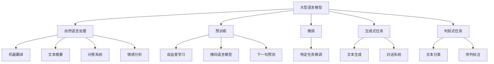

# 大语言模型应用指南：入门

## 1. 背景介绍

### 1.1 问题的由来

在过去几年中,大型语言模型(Large Language Models, LLMs)在自然语言处理(NLP)领域取得了令人瞩目的进展。这些模型通过在海量文本数据上进行预训练,学习了丰富的语言知识和上下文信息,从而在广泛的自然语言任务中展现出卓越的性能。

然而,尽管取得了巨大成就,大型语言模型的应用仍面临诸多挑战。其中,模型的可解释性、安全性、效率和可控性等问题备受关注。此外,如何将这些先进的模型有效地应用于实际场景,也是一个亟需解决的问题。

### 1.2 研究现状

目前,大型语言模型的研究主要集中在以下几个方面:

1. **模型优化**:通过改进模型架构、训练策略和数据预处理等方式,提高模型的性能和效率。
2. **可解释性**:探索模型内部机理,增强模型的透明度和可解释性。
3. **安全性**:防止模型生成有害或不当内容,确保模型输出的安全性和可靠性。
4. **控制性**:开发技术以更好地控制模型的输出,使其符合特定的任务需求或约束条件。
5. **应用探索**:将大型语言模型应用于各种实际场景,如机器翻译、问答系统、文本生成等。

### 1.3 研究意义

大型语言模型的研究具有重要的理论和实践意义:

- **理论意义**:有助于深入理解人类语言的本质,探索语言模型的内在机制,推动自然语言处理领域的发展。
- **实践意义**:大型语言模型在各种自然语言任务中展现出优异的性能,有望为众多实际应用带来革命性的变革,如智能助手、内容创作、信息检索等。

### 1.4 本文结构

本文将全面介绍大型语言模型的相关知识,内容包括:

1. 核心概念与联系
2. 核心算法原理与具体操作步骤
3. 数学模型和公式详细讲解与案例分析
4. 项目实践:代码实例和详细解释说明
5. 实际应用场景
6. 工具和资源推荐
7. 总结:未来发展趋势与挑战
8. 附录:常见问题与解答

## 2. 核心概念与联系

大型语言模型(LLMs)是一种基于深度学习的自然语言处理模型,通过在大规模语料库上进行预训练,学习丰富的语言知识和上下文信息。这种预训练方式被称为自监督学习,常用的预训练任务包括掩码语言模型(Masked Language Modeling)和下一句预测(Next Sentence Prediction)等。

预训练完成后,大型语言模型可以通过微调(Fine-tuning)的方式,针对特定的自然语言任务进行进一步训练,从而获得优异的性能表现。大型语言模型可以应用于广泛的自然语言处理任务,包括生成式任务(如文本生成、对话系统)和判别式任务(如文本分类、序列标注)。

在自然语言处理领域,大型语言模型已经取得了卓越的成就,推动了机器翻译、文本摘要、问答系统、情感分析等多个任务的发展。

## 3. 核心算法原理 & 具体操作步骤

### 3.1 算法原理概述

大型语言模型的核心算法是基于Transformer架构的自注意力机制(Self-Attention Mechanism)。自注意力机制允许模型捕捉输入序列中任意两个位置之间的关系,从而更好地建模长距离依赖关系。

Transformer架构主要由编码器(Encoder)和解码器(Decoder)两个部分组成。编码器负责处理输入序列,而解码器则根据编码器的输出生成目标序列。两者都由多个相同的层组成,每一层都包含多头自注意力子层(Multi-Head Attention Sublayer)和前馈神经网络子层(Feed-Forward Neural Network Sublayer)。

### 3.2 算法步骤详解

大型语言模型的训练过程可以分为以下几个主要步骤:

1. **数据预处理**:对原始文本数据进行清洗、标记化、构建词表等预处理操作。

2. **模型初始化**:初始化Transformer模型的参数,包括embedding层、注意力层和前馈网络层等。

3. **模型预训练**:
   - **掩码语言模型(Masked Language Modeling, MLM)**: 随机掩码部分输入tokens,模型需要预测掩码位置的tokens。
   - **下一句预测(Next Sentence Prediction, NSP)**: 给定两个句子,模型需要预测它们是否为连续的句子。

4. **模型微调**:在预训练的基础上,根据特定的下游任务对模型进行微调,以获得更好的性能。

5. **模型评估**:在验证集或测试集上评估模型的性能,根据不同的任务使用不同的评估指标。

6. **模型部署**:将训练好的模型部署到实际的应用系统中,用于执行特定的自然语言处理任务。

### 3.3 算法优缺点

**优点**:

- 通过预训练,大型语言模型能够学习到丰富的语言知识和上下文信息,在广泛的自然语言任务中表现出色。
- 自注意力机制能够有效捕捉输入序列中任意两个位置之间的关系,从而更好地建模长距离依赖关系。
- 通过转移学习(Transfer Learning),大型语言模型可以快速适应新的任务领域,减少了从头开始训练的时间和计算成本。

**缺点**:

- 大型语言模型通常包含数十亿甚至上百亿个参数,训练和推理过程计算量巨大,对硬件资源要求高。
- 模型的可解释性较差,内部机理较为黑箱,难以解释模型的决策过程。
- 存在潜在的安全和隐私风险,如生成有害内容、泄露隐私信息等。
- 模型的输出可能存在偏差和不确定性,需要进一步的控制和优化。

### 3.4 算法应用领域

大型语言模型在自然语言处理领域有广泛的应用,包括但不限于:

- **机器翻译**:将一种语言的文本翻译成另一种语言。
- **文本摘要**:自动生成文本的摘要或概括。
- **问答系统**:根据给定的问题,从知识库中检索相关信息并生成答案。
- **对话系统**:与人类进行自然语言对话交互。
- **文本生成**:根据给定的提示或上下文,自动生成连贯、流畅的文本内容。
- **情感分析**:识别文本中表达的情感倾向,如积极、消极或中性等。
- **命名实体识别**:识别文本中的人名、地名、组织机构名等实体。
- **关系抽取**:从文本中抽取实体之间的语义关系。

## 4. 数学模型和公式 & 详细讲解 & 举例说明

### 4.1 数学模型构建

大型语言模型的核心是基于Transformer架构的自注意力机制。我们首先介绍自注意力机制的数学模型。

给定一个长度为 $n$ 的输入序列 $\boldsymbol{x} = (x_1, x_2, \dots, x_n)$,其中每个 $x_i$ 是一个 $d$ 维向量,表示该位置的输入embedding。自注意力机制的目标是计算一个新的序列 $\boldsymbol{z} = (z_1, z_2, \dots, z_n)$,其中每个 $z_i$ 是一个 $d$ 维向量,表示对应位置的输出表示。

自注意力机制的计算过程如下:

$$z_i = \sum_{j=1}^n \alpha_{ij}(x_j W^V)$$

其中 $W^V \in \mathbb{R}^{d \times d_v}$ 是一个可学习的权重矩阵,用于将输入embedding映射到值空间(Value space)。$\alpha_{ij}$ 是注意力权重,表示第 $i$ 个位置对第 $j$ 个位置的注意力程度。注意力权重的计算方式如下:

$$\alpha_{ij} = \frac{\exp(e_{ij})}{\sum_{k=1}^n \exp(e_{ik})}$$

$$e_{ij} = \frac{(x_i W^Q)(x_j W^K)^T}{\sqrt{d_k}}$$

其中 $W^Q \in \mathbb{R}^{d \times d_q}$ 和 $W^K \in \mathbb{R}^{d \times d_k}$ 分别是查询(Query)和键(Key)的可学习权重矩阵。$d_q$、$d_k$ 和 $d_v$ 分别是查询、键和值的维度。通过缩放点积注意力(Scaled Dot-Product Attention)的方式计算注意力权重,可以有效缓解较长输入序列时的梯度消失问题。

### 4.2 公式推导过程

我们进一步推导自注意力机制的数学表达式,以更好地理解其内在原理。

首先,我们定义三个投影矩阵 $W^Q$、$W^K$ 和 $W^V$,将输入embedding $\boldsymbol{x}$ 映射到查询(Query)、键(Key)和值(Value)空间:

$$Q = x W^Q, \quad K = x W^K, \quad V = x W^V$$

其中 $Q \in \mathbb{R}^{n \times d_q}$、$K \in \mathbb{R}^{n \times d_k}$ 和 $V \in \mathbb{R}^{n \times d_v}$ 分别表示查询、键和值的矩阵表示。

接下来,我们计算查询 $Q$ 和键 $K$ 的点积,得到一个注意力分数矩阵 $E \in \mathbb{R}^{n \times n}$:

$$E = QK^T$$

其中,每个元素 $e_{ij}$ 表示第 $i$ 个查询向量与第 $j$ 个键向量之间的相似性分数。为了防止较长的输入序列导致梯度消失或爆炸问题,我们对分数矩阵 $E$ 进行缩放:

$$\tilde{E} = \frac{E}{\sqrt{d_k}}$$

然后,我们对缩放后的分数矩阵 $\tilde{E}$ 应用 Softmax 函数,得到注意力权重矩阵 $A \in \mathbb{R}^{n \times n}$:

$$A = \text{Softmax}(\tilde{E}) = \begin{bmatrix}
    \alpha_{11} & \alpha_{12} & \cdots & \alpha_{1n} \
    \alpha_{21} & \alpha_{22} & \cdots & \alpha_{2n} \
    \vdots & \vdots & \ddots & \vdots \
    \alpha_{n1} & \alpha_{n2} & \cdots & \alpha_{nn}
\end{bmatrix}$$

其中,每个元素 $\alpha_{ij}$ 表示第 $i$ 个查询向量对第 $j$ 个值向量的注意力权重。

最后,我们将注意力权重矩阵 $A$ 与值矩阵 $V$ 相乘,得到自注意力机制的输出矩阵 $Z \in \mathbb{R}^{n \times d_v}$:

$$Z = AV$$

每一行 $z_i$ 表示第 $i$ 个位置的输出表示,是所有值向量的加权和,权重由对应的注意力权重决定。

通过上述推导,我们可以看出自注意力机制的核心思想是允许每个输出位置关注整个输入序列的不同部分,并根据注意力权重对这些部分进行加权求和,从而捕捉长距离依赖关系。

### 4.3 案例分析与