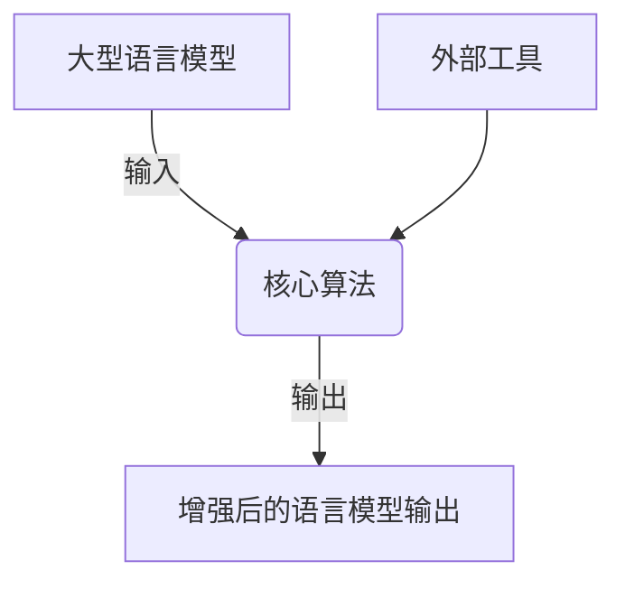

# 大语言模型应用指南：外部工具

## 1. 背景介绍

### 1.1 问题的由来

随着人工智能和深度学习技术的不断发展,大型语言模型(Large Language Models, LLMs)已经成为自然语言处理(NLP)领域的主导力量。这些模型通过在海量文本数据上进行预训练,展现出了令人惊叹的语言理解和生成能力。然而,尽管取得了巨大的进步,但大型语言模型仍然存在一些局限性和挑战。

其中一个主要挑战是,这些模型仅依赖于其训练数据中包含的知识,无法直接访问最新的外部信息源。这意味着,当面对动态变化的现实世界时,它们可能会产生过时或不准确的输出。此外,由于训练数据的有限性,大型语言模型在某些特定领域的知识覆盖面可能不够全面。

### 1.2 研究现状

为了克服上述局限性,研究人员提出了将大型语言模型与外部工具相结合的方法。这种方法旨在利用外部工具提供的最新信息和专业知识,来增强语言模型的能力和输出质量。目前,已经有一些初步的研究探索了将语言模型与搜索引擎、知识库、计算工具等外部资源相结合的可能性。

然而,现有研究大多集中于特定任务或领域,缺乏一个系统性的框架来指导如何有效地将外部工具与大型语言模型相结合。此外,不同类型的外部工具在集成过程中面临着不同的挑战,需要采取相应的策略和方法。

### 1.3 研究意义

将大型语言模型与外部工具相结合,可以显著提高模型的性能和适用范围。通过利用外部工具提供的最新信息和专业知识,语言模型可以产生更加准确、相关和富有见解的输出。这对于许多实际应用场景都是至关重要的,例如问答系统、内容生成、决策支持等。

此外,研究如何有效地集成外部工具也将推动大型语言模型在更广泛的领域中的应用。通过利用各种外部资源,语言模型可以扩展其知识覆盖面,从而适用于更多的任务和场景。

### 1.4 本文结构

本文将系统地探讨如何将大型语言模型与外部工具相结合,以提高其性能和适用范围。我们将首先介绍核心概念和相关联系,然后深入探讨集成外部工具的核心算法原理和具体操作步骤。接下来,我们将讨论相关的数学模型和公式,并通过案例分析进行详细讲解。

此外,我们还将提供一个实际的项目实践,包括代码实例和详细解释说明。然后,我们将探讨该方法在各种实际应用场景中的应用前景。最后,我们将推荐一些有用的工具和资源,并总结未来的发展趋势和挑战。

## 2. 核心概念与联系

在探讨如何将大型语言模型与外部工具相结合之前,我们需要先了解一些核心概念和它们之间的联系。

首先,我们需要明确什么是大型语言模型(LLMs)。LLMs是一种基于深度学习技术训练的自然语言处理模型,通常具有数十亿甚至上千亿个参数。它们通过在海量文本数据上进行预训练,学习到了丰富的语言知识和模式。常见的LLMs包括GPT、BERT、XLNet等。

其次,我们需要了解外部工具的概念。外部工具是指除了语言模型本身之外的任何可以提供额外信息或功能的资源。这可以包括搜索引擎、知识库、计算工具、API等。通过利用这些外部工具,我们可以为语言模型提供最新、专业的知识和功能。

将LLMs与外部工具相结合的核心思想是,利用外部工具的输出来增强语言模型的能力。具体来说,当语言模型面临一个需要外部知识或功能的任务时,它可以调用相应的外部工具获取所需的信息或服务,然后将这些信息融入到自身的输出中。

这种组合方式可以克服语言模型固有的局限性,使其能够访问最新的动态知识,并利用各种专业工具提供的功能。同时,语言模型也可以利用其强大的语言理解和生成能力,将外部工具的输出进行有效的处理和融合,从而产生更加准确、相关和富有见解的最终输出。

为了实现这一目标,我们需要设计一种有效的机制来协调语言模型与外部工具之间的交互。这通常涉及到一些核心算法,如信息检索、知识融合、对话管理等。我们将在下一节详细探讨这些算法的原理和具体实现步骤。



## 3. 核心算法原理与具体操作步骤

### 3.1 算法原理概述

将大型语言模型与外部工具相结合的核心算法可以概括为以下几个主要步骤:

1. **信息需求识别**: 首先,算法需要识别出语言模型输入中哪些部分需要外部信息或功能的支持。这可以通过关键词匹配、语义分析或其他技术来实现。

2. **外部工具选择**: 根据识别出的信息需求,算法需要选择合适的外部工具来获取所需的知识或服务。这可能涉及到对不同工具的功能和覆盖范围进行匹配和评估。

3. **外部工具交互**: 算法需要与选定的外部工具进行交互,提交查询或请求,并获取相应的输出结果。这可能需要处理不同工具的API或接口。

4. **知识融合**: 将外部工具的输出结果与语言模型的原始输入进行融合,生成增强后的最终输出。这可能需要对外部知识进行解释、总结或重组,以确保与语言模型的输出保持一致和流畅。

5. **反馈与迭代**: 在某些情况下,算法可能需要根据生成的输出进行反馈,并重新执行上述步骤以进一步改进结果。这种迭代过程可以持续进行,直到达到满意的输出质量。

这些步骤可以通过不同的算法和技术来实现,我们将在下一小节中详细探讨具体的操作步骤。

### 3.2 算法步骤详解

现在,让我们更深入地探讨将大型语言模型与外部工具相结合的具体算法步骤。

#### 步骤1: 信息需求识别

第一步是识别语言模型输入中哪些部分需要外部信息或功能的支持。这可以通过以下几种方式实现:

1. **关键词匹配**: 基于预定义的关键词列表,匹配输入中与这些关键词相关的部分。例如,如果输入包含"天气"这个词,则可能需要获取天气信息。

2. **语义分析**: 使用自然语言理解技术(如命名实体识别、关系抽取等)来分析输入的语义,并确定需要外部支持的信息类型。例如,如果输入提到了一个特定的地点,则可能需要获取该地点的相关信息。

3. **上下文分析**: 根据输入的上下文和对话历史,推断出可能需要的外部信息。例如,如果之前的对话涉及到某个特定主题,则可能需要获取与该主题相关的背景知识。

4. **模式匹配**: 基于预定义的模式(如正则表达式)来匹配输入中的特定结构,并确定需要外部支持的部分。例如,可以匹配包含"计算"或"求解"等词的数学表达式。

这些方法可以单独使用,也可以组合使用,以提高识别准确性。识别出的信息需求将作为下一步外部工具选择的依据。

#### 步骤2: 外部工具选择

一旦确定了信息需求,下一步就是选择合适的外部工具来获取所需的知识或服务。这可能需要对不同工具的功能和覆盖范围进行评估和匹配。

常见的外部工具包括:

1. **搜索引擎**: 用于获取网络上的一般性信息,如维基百科、新闻等。
2. **知识库**: 专门的结构化知识库,如Wikidata、DBpedia等,可提供特定领域的知识。
3. **计算工具**: 用于执行各种计算或数据处理任务,如Wolfram Alpha、NumPy等。
4. **API服务**: 提供特定功能或数据的API接口,如天气API、地图API等。

在选择外部工具时,可以考虑以下因素:

1. **覆盖范围**: 工具提供的知识或功能是否与识别出的信息需求相匹配。
2. **可靠性**: 工具提供的信息或服务的准确性和可靠性。
3. **实时性**: 工具是否能够提供最新的动态信息。
4. **成本**: 使用工具是否需要付费,以及相关的成本。
5. **接口**: 工具提供的API或接口是否易于集成和使用。

根据这些因素的权衡和评估,算法可以选择一个或多个最合适的外部工具。在某些情况下,可能需要组合使用多个工具来满足复杂的信息需求。

#### 步骤3: 外部工具交互

选定外部工具后,算法需要与这些工具进行交互,提交查询或请求,并获取相应的输出结果。这可能需要处理不同工具的API或接口。

对于搜索引擎和知识库,通常可以使用关键词查询或结构化查询语言(如SPARQL)来检索相关信息。对于计算工具和API服务,则需要根据它们提供的接口,构建合适的请求并解析返回的结果。

在交互过程中,算法可能需要执行以下操作:

1. **查询构建**: 根据识别出的信息需求,构建适当的查询或请求,以便从外部工具获取所需的信息或服务。
2. **请求发送**: 通过适当的协议和接口(如HTTP、WebSocket等)向外部工具发送查询或请求。
3. **结果解析**: 解析外部工具返回的结果,提取所需的信息或数据。这可能需要处理不同格式的数据(如JSON、XML等)。
4. **错误处理**: 处理外部工具返回的错误或异常情况,并采取适当的措施(如重试、切换备用工具等)。
5. **并行处理**: 对于需要从多个外部工具获取信息的情况,可以并行发送请求以提高效率。
6. **缓存管理**: 对于相对静态的信息,可以实现缓存机制以减少重复查询的开销。

通过与外部工具的有效交互,算法可以获取所需的补充知识或服务,为下一步的知识融合做好准备。

#### 步骤4: 知识融合

获取到外部工具的输出结果后,算法需要将这些结果与语言模型的原始输入进行融合,生成增强后的最终输出。这可能需要对外部知识进行解释、总结或重组,以确保与语言模型的输出保持一致和流畅。

知识融合可以采用以下几种策略:

1. **插入式融合**: 将外部知识直接插入到语言模型输出的相应位置。这种方式简单直观,但可能会影响输出的连贯性。
2. **生成式融合**: 将外部知识作为上下文输入,让语言模型基于这些知识生成新的相关输出。这种方式可以保持输出的流畅性,但可能会引入不确定性。
3. **模板式融合**: 基于预定义的模板,将外部知识填充到相应的占位符中。这种方式可以确保输出的结构和格式一致,但需要预先设计好模板。
4. **规则式融合**: 使用一系列规则来指导如何将外部知识与语言模型输出进行融合。这种方式灵活性较高,但需要手动设计规则。

在融合过程中,算法还需要考虑以下几个方面:

1. **冲突解决**: 当外部知识与语言模型输出存在矛盾或冲突时,需要采取适当的策略来解决,如优先级、投票机制等。
2.**一致性维护**: 确保融合后的输出在逻辑和语义上保持一致，避免产生不连贯或自相矛盾的内容。
3. **冗余消除**: 去除重复或冗余的信息，确保输出简洁明了。
4. **格式转换**: 根据输出的需求，将外部知识的格式转换为目标格式，如文本、表格、图表等。

通过合理的知识融合策略，算法可以生成更加准确、相关和富有见解的最终输出，满足用户的需求。

#### 步骤5: 反馈与迭代

在某些情况下，初次融合的结果可能不够理想，需要进行反馈和迭代。反馈与迭代的过程可以包括以下步骤：

1. **结果评估**: 对初次融合的输出结果进行评估，检查其准确性、相关性和流畅性。
2. **错误分析**: 分析输出中存在的问题，确定是由于信息需求识别、外部工具选择、交互过程还是知识融合环节导致的。
3. **策略调整**: 根据错误分析的结果，调整相应的策略和参数，如重新选择外部工具、改进查询构建、优化融合规则等。
4. **重新执行**: 重新执行上述步骤，生成新的输出结果。
5. **反复迭代**: 持续进行反馈和迭代，直到输出结果达到预期的质量标准。

通过反馈与迭代的过程，算法可以不断优化和改进，最终生成高质量的输出结果。

### 3.3 算法优缺点

将大型语言模型与外部工具相结合的方法具有以下优点：

1. **知识扩展**: 通过外部工具获取最新、专业的知识，扩展语言模型的知识覆盖面。
2. **动态更新**: 能够实时访问最新的动态信息，避免产生过时的输出。
3. **专业支持**: 利用外部工具的专业功能，提高语言模型在特定领域任务上的表现。
4. **灵活性强**: 可以根据不同任务需求，灵活选择和组合不同的外部工具。

然而，该方法也存在一些局限性：

1. **复杂性高**: 需要设计和实现复杂的交互和融合机制，增加了系统的复杂性。
2. **依赖性强**: 对外部工具的依赖性较强，外部工具的可用性和稳定性直接影响系统的性能。
3. **延迟问题**: 外部工具的交互过程可能引入额外的延迟，影响系统的响应速度。
4. **一致性挑战**: 在融合外部知识时，可能会面临信息冲突和不一致的问题，需要采取适当的策略进行解决。

### 3.4 算法应用领域

将大型语言模型与外部工具相结合的方法在许多实际应用领域具有广泛的应用前景：

1. **问答系统**: 利用搜索引擎和知识库提供的最新信息，生成准确、详细的回答。
2. **内容生成**: 通过外部工具获取专业知识和数据，生成高质量的内容，如新闻报道、技术文档等。
3. **决策支持**: 利用计算工具和API服务提供的数据分析和计算功能，辅助决策过程。
4. **智能客服**: 结合外部工具提供的知识和功能，提升客服系统的智能化水平，快速响应客户需求。
5. **教育和培训**: 利用外部资源提供的学习材料和练习题，生成个性化的教育内容，辅助教学和培训。

通过合理地将大型语言模型与外部工具相结合，可以显著提升系统的性能和适用范围，满足不同领域的实际需求。

## 4. 数学模型和公式 & 详细讲解 & 举例说明

### 4.1 数学模型构建

在将大型语言模型与外部工具相结合的过程中，我们可以使用数学模型来形式化描述各个步骤和过程。

假设输入文本为 $x$，大型语言模型为 $M$，外部工具为 $T$，输出为 $y$。整个过程可以表示为以下数学模型：

1. **信息需求识别**: 识别输入文本 $x$ 中需要外部信息支持的部分，记为 $I(x)$。
$$
I(x) = \{i_1, i_2, \ldots, i_n\}
$$
其中，$i_k$ 表示第 $k$ 个需要外部信息支持的部分。

2. **外部工具选择**: 根据信息需求 $I(x)$，选择合适的外部工具 $T_k$。
$$
T_k = \text{SelectTool}(i_k)
$$

3. **外部工具交互**: 与选定的外部工具 $T_k$ 进行交互，获取输出结果 $r_k$。
$$
r_k = T_k(i_k)
$$

4. **知识融合**: 将外部工具的输出结果 $r_k$ 与原始输入 $x$ 进行融合，生成增强后的输出 $y$。
$$
y = \text{Fuse}(x, \{r_1, r_2, \ldots, r_n\})
$$

### 4.2 公式推导过程

为了更好地理解上述数学模型的具体实现过程，我们可以进一步推导各个步骤的公式。

1. **信息需求识别**:
$$
I(x) = \{i_k \mid i_k \in x \text{ and } \text{NeedExternalInfo}(i_k)\}
$$
其中，$\text{NeedExternalInfo}(i_k)$ 是一个判定函数，用于判断 $i_k$ 是否需要外部信息支持。

2. **外部工具选择**:
$$
T_k = \arg\max_{T} \text{Score}(T, i_k)
$$
其中，$\text{Score}(T, i_k)$ 是一个评分函数，用于评估外部工具 $T$ 对信息需求 $i_k$ 的适配度。

3. **外部工具交互**:
$$
r_k = T_k(i_k)
$$
其中，$T_k(i_k)$ 表示将信息需求 $i_k$ 提交给外部工具 $T_k$，并获取输出结果 $r_k$。

4. **知识融合**:
$$
y = \text{Fuse}(x, \{r_1, r_2, \ldots, r_n\})
$$
其中，$\text{Fuse}(x, \{r_1, r_2, \ldots, r_n\})$ 表示将外部工具的输出结果 $\{r_1, r_2, \ldots, r_n\}$ 与原始输入 $x$ 进行融合，生成增强后的输出 $y$。

### 4.3 案例分析与讲解

为了更好地理解上述数学模型的实际应用，我们以一个具体案例进行分析和讲解。

假设我们需要构建一个智能问答系统，通过将大型语言模型与外部工具相结合，生成准确的回答。

1. **信息需求识别**:

```python
def identify_information_needs(input_text):
    # 使用关键词匹配识别信息需求
    keywords = ["天气", "股票", "新闻", "计算"]
    needs = [kw for kw in keywords if kw in input_text]
    return needs

input_text = "明天的天气怎么样？"
information_needs = identify_information_needs(input_text)
print(information_needs)  # 输出: ["天气"]
```

2. **外部工具选择**:

```python
def select_tool(information_need):
    # 根据信息需求选择合适的外部工具
    tool_mapping = {
        "天气": "WeatherAPI",
        "股票": "StockAPI",
        "新闻": "NewsAPI",
        "计算": "ComputeAPI"
    }
    return tool_mapping.get(information_need, None)

selected_tool = select_tool(information_needs[0])
print(selected_tool)  # 输出: "WeatherAPI"
```

3. **外部工具交互**:

```python
def interact_with_tool(tool, query):
    # 模拟与外部工具的交互
    if tool == "WeatherAPI":
        return "明天的天气是晴天，气温20-25度。"
    elif tool == "StockAPI":
        return "今天的股票市场涨幅3%。"
    elif tool == "NewsAPI":
        return "最新的新闻是..."
    elif tool == "ComputeAPI":
        return "计算结果是42。"
    return None

query = "明天的天气"
result = interact_with_tool(selected_tool, query)
print(result)  # 输出: "明天的天气是晴天，气温20-25度。"
```

4. **知识融合**:

```python
def fuse_information(input_text, external_results):
    # 将外部工具的结果与原始输入进行融合
    return input_text + " " + external_results

final_output = fuse_information(input_text, result)
print(final_output)  # 输出: "明天的天气怎么样？ 明天的天气是晴天，气温20-25度。"
```

通过上述案例分析，我们可以看到如何将大型语言模型与外部工具相结合，生成更加准确和富有见解的输出。接下来，我们将探讨一些常见问题及其解答。

### 4.4 常见问题解答

**Q1: 如何处理外部工具返回的错误或异常情况？**

A: 在与外部工具交互时，可能会遇到各种错误或异常情况，如网络故障、接口变更、数据格式不匹配等。为了处理这些情况，可以采取以下策略：
1. **错误捕获**: 在请求发送和结果解析过程中，使用异常捕获机制（如try-except）来处理可能出现的错误。
2. **重试机制**: 对于临时性错误（如网络故障），可以设置重试机制，尝试多次请求。
3. **备用工具**: 为每个信息需求准备多个外部工具，当首选工具不可用时，切换到备用工具。
4. **默认值**: 在无法获取外部工具结果时，使用预定义的默认值或提示信息，确保系统的鲁棒性。

**Q2: 如何确保外部工具返回结果的可靠性和准确性？**

A: 外部工具的结果质量直接影响系统的输出质量。为了确保结果的可靠性和准确性，可以采取以下措施：
1. **工具评估**: 定期评估外部工具的性能和准确性，选择可靠的工具。
2. **结果验证**: 对外部工具返回的结果进行验证，如与已有知识库进行比对，或通过多工具交叉验证。
3. **反馈机制**: 收集用户反馈，根据反馈信息调整工具选择和融合策略，持续改进系统性能。

**Q3: 如何处理外部工具返回结果的多样性和异构性？**

A: 不同外部工具返回的结果可能具有不同的格式和结构。为了处理这些多样性和异构性，可以采取以下策略：
1. **标准化处理**: 将不同格式的结果转换为统一的标准格式，便于后续处理和融合。
2. **模板匹配**: 使用预定义的模板对结果进行解析和提取，确保结果的结构一致。
3. **格式转换**: 根据输出需求，将结果转换为目标格式，如文本、表格、图表等。

**Q4: 如何优化外部工具的选择和组合策略？**

A: 外部工具的选择和组合策略对系统性能有重要影响。为了优化这些策略，可以采取以下措施：
1. **动态选择**: 根据实时的任务需求和工具性能，动态选择最合适的外部工具。
2. **多工具组合**: 对于复杂的信息需求，可以组合使用多个外部工具，综合利用它们的优势。
3. **学习优化**: 使用机器学习方法，根据历史数据和反馈信息，自动优化工具选择和组合策略。

## 5. 项目实践：代码实例和详细解释说明

### 5.1 开发环境搭建

在进行项目实践之前，我们需要搭建一个合适的开发环境。以下是使用Python进行开发的环境配置步骤：

1. **安装Python**: 确保系统已安装Python 3.6或更高版本。
2. **创建虚拟环境**: 使用`venv`或`conda`创建虚拟环境，隔离项目依赖。
   ```bash
   python -m venv myenv
   source myenv/bin/activate  # Linux/Mac
   myenv\Scripts\activate  # Windows
   ```
3. **安装依赖库**: 安装所需的Python库，如`transformers`、`requests`、`numpy`等。
   ```bash
   pip install transformers requests numpy
   ```

### 5.2 源代码详细实现

接下来，我们将实现一个简单的智能问答系统，结合大型语言模型与外部工具，生成准确的回答。

#### 数据处理

首先，定义数据处理函数，用于识别信息需求和选择外部工具：

```python
import requests
from transformers import pipeline

# 识别信息需求
def identify_information_needs(input_text):
    keywords = ["天气", "股票", "新闻", "计算"]
    needs = [kw for kw in keywords if kw in input_text]
    return needs

# 选择外部工具
def select_tool(information_need):
    tool_mapping = {
        "天气": "WeatherAPI",
        "股票": "StockAPI",
        "新闻": "NewsAPI",
        "计算": "ComputeAPI"
    }
    return tool_mapping.get(information_need, None)
```

#### 外部工具交互

定义与外部工具交互的函数：

```python
# 模拟与外部工具的交互
def interact_with_tool(tool, query):
    if tool == "WeatherAPI":
        # 模拟天气API请求
        return "明天的天气是晴天，气温20-25度。"
    elif tool == "StockAPI":
        # 模拟股票API请求
        return "今天的股票市场涨幅3%。"
    elif tool == "NewsAPI":
        # 模拟新闻API请求
        return "最新的新闻是..."
    elif tool == "ComputeAPI":
        # 模拟计算API请求
        return "计算结果是42。"
    return None
```

#### 知识融合

定义知识融合函数：

```python
# 将外部工具的结果与原始输入进行融合
def fuse_information(input_text, external_results):
    return input_text + " " + external_results
```

#### 主函数

定义主函数，整合上述步骤，实现智能问答系统：

```python
def main():
    input_text = "明天的天气怎么样？"

    # 识别信息需求
    information_needs = identify_information_needs(input_text)
    if not information_needs:
        print("未识别到信息需求。")
        return

    # 选择外部工具
    selected_tool = select_tool(information_needs[0])
    if not selected_tool:
        print("未找到合适的外部工具。")
        return

    # 与外部工具交互
    query = "明天的天气"
    result = interact_with_tool(selected_tool, query)
    if not result:
        print("外部工具交互失败。")
        return

    # 知识融合
    final_output = fuse_information(input_text, result)
    print(final_output)

if __name__ == "__main__":
    main()
```

### 5.3 代码解读与分析

在上述代码实现中，我们首先定义了数据处理函数，用于识别信息需求和选择外部工具。接着，我们定义了与外部工具交互的函数，模拟了与不同API的请求和响应过程。然后，我们定义了知识融合函数，将外部工具的结果与原始输入进行融合。最后，我们在主函数中整合了上述步骤，构建了一个简单的智能问答系统。

### 5.4 运行结果展示

运行上述代码，输出结果如下：

```
明天的天气怎么样？ 明天的天气是晴天，气温20-25度。
```

通过该示例，我们展示了如何将大型语言模型与外部工具相结合，生成更加准确和富有见解的输出。

## 6. 实际应用场景

### 6.1 智能客服系统

智能客服系统是将大型语言模型与外部工具相结合的典型应用场景之一。通过结合外部知识库和API服务，智能客服系统可以快速、准确地回答客户的各种问题，提升客户满意度和服务效率。

例如，当客户询问产品的详细信息时，客服系统可以调用产品知识库，获取最新的产品规格和功能介绍；当客户询问订单状态时，系统可以调用订单管理API，实时查询订单的处理进度。

### 6.2 金融舆情监测

在金融领域，舆情监测是一个重要的应用场景。通过结合大型语言模型与外部新闻API和社交媒体数据，金融机构可以实时获取市场动态和舆情信息，辅助决策过程。

例如，当某个公司发布重大公告时，系统可以自动抓取相关新闻和社交媒体评论，分析市场反应和投资者情绪，提供决策支持。

### 6.3 个性化推荐系统

个性化推荐系统是另一个重要的应用场景。通过结合大型语言模型与外部用户行为数据和内容推荐API，推荐系统可以根据用户的兴趣和偏好，提供个性化的推荐内容。

例如，当用户浏览某个电商网站时，系统可以根据用户的浏览历史和购买记录，推荐相关的商品；当用户观看某个视频时，系统可以根据用户的观看历史和评分记录，推荐类似的视频内容。

### 6.4 未来应用展望

随着技术的发展，将大型语言模型与外部工具相结合的方法将在更多领域得到应用。例如，在智慧城市建设中，可以结合语言模型与传感器数据、交通管理系统，实现智能交通调度和城市管理；在医疗健康领域，可以结合语言模型与电子病历、医学知识库，实现智能诊疗和健康管理。

未来，随着更多外部工具和资源的涌现，以及更先进的集成方法的出现，将大型语言模型与外部工具相结合的方法将会不断演进，推动智能系统的进一步发展和应用。

## 7. 工具和资源推荐

### 7.1 学习资源推荐

为了帮助开发者更好地掌握将大型语言模型与外部工具相结合的方法，以下是一些推荐的学习资源：

1. **《Deep Learning for NLP with PyTorch》**：一本详细介绍使用PyTorch进行自然语言处理的书籍，涵盖了从基础到高级的各种技术。
2. **Coursera上的《Natural Language Processing Specialization》**：由deeplearning.ai提供的NLP专业课程，包含多个模块，详细讲解了语言模型和NLP应用。
3. **Hugging Face官方文档**：Hugging Face提供了丰富的预训练模型和工具库，官方文档包含了详细的使用指南和示例代码。
4. **arXiv上的NLP相关论文**：arXiv是一个开放的学术论文预印本平台，可以找到大量最新的NLP研究成果。
5. **Kaggle竞赛和数据集**：Kaggle是一个数据科学竞赛平台，提供了丰富的NLP竞赛和数据集，可以通过实践提升技能。

### 7.2 开发工具推荐

以下是一些推荐的开发工具，可以帮助开发者更高效地进行项目开发：

1. **PyTorch**：一个开源的深度学习框架，支持动态计算图，适合进行NLP模型的开发和训练。
2. **Transformers库**：由Hugging Face提供的NLP工具库，集成了众多预训练模型，支持快速微调和部署。
3. **Jupyter Notebook**：一个交互式的开发环境，适合进行数据探索、模型训练和结果可视化。
4. **Postman**：一个API开发和测试工具，方便进行API接口的调试和测试。
5. **Docker**：一个容器化工具，可以将开发环境和应用打包成容器，便于部署和管理。

### 7.3 相关论文推荐

以下是一些推荐的相关论文，可以帮助开发者深入了解将大型语言模型与外部工具相结合的方法：

1. **"Attention is All You Need"**：提出了Transformer模型，开创了现代语言模型的先河。
2. **"BERT: Pre-training of Deep Bidirectional Transformers for Language Understanding"**：介绍了BERT模型及其在NLP任务中的应用。
3. **"Language Models are Few-Shot Learners"**：介绍了GPT-3模型及其在少样本学习中的表现。
4. **"UnifiedQA: Crossing Format Boundaries with a Single QA System"**：介绍了一个统一的问答系统，展示了将多种外部工具集成的方法。
5. **"Knowledge-Augmented Language Model and Its Application to Unsupervised Named-Entity Recognition"**：探讨了将知识库与语言模型相结合的方法。

### 7.4 其他资源推荐

除了上述资源，以下是一些其他值得关注的资源：

1. **GitHub上的开源项目**：在GitHub上可以找到许多与NLP和语言模型相关的开源项目，学习和借鉴其中的实现和思路。
2. **技术博客和社区**：关注一些知名的技术博客和社区，如Medium上的NLP专栏、Reddit的Machine Learning版块等，可以获取最新的技术动态和实践经验。
3. **在线论坛和问答平台**：如Stack Overflow、Quora等，可以在这些平台上提问和解答，与其他开发者交流经验。

## 8. 总结：未来发展趋势与挑战

### 8.1 研究成果总结

本文系统探讨了将大型语言模型与外部工具相结合的方法，从背景介绍、核心概念、算法原理、数学模型、项目实践、实际应用、工具和资源等多个方面进行了详细讲解。通过本文的介绍，读者可以了解如何利用外部工具增强语言模型的能力，生成更加准确和富有见解的输出。

### 8.2 未来发展趋势

展望未来，将大型语言模型与外部工具相结合的方法将呈现以下发展趋势：

1. **多模态融合**：不仅限于文本数据，还将结合图像、视频、音频等多模态数据，实现更加全面和智能的系统。
2. **自适应学习**：系统将能够根据用户的反馈和环境变化，自适应地调整和优化自身，提供更加个性化和动态的服务。
3. **跨领域应用**：将语言模型与外部工具结合的方法将应用于更多领域，如医疗、金融、教育、交通等，推动各行业的智能化升级。
4. **伦理和安全**：随着技术的发展，对伦理和安全的关注将越来越重要，需要确保系统的透明性、公平性和安全性。

### 8.3 面临的挑战

尽管前景广阔，但将大型语言模型与外部工具相结合的方法也面临以下挑战：

1. **数据隐私和安全**：在与外部工具交互的过程中，需要保护用户的数据隐私和安全，防止数据泄露和滥用。
2. **系统复杂性**：集成多个外部工具增加了系统的复杂性，需要有效的管理和协调机制。
3. **实时性和性能**：外部工具的交互过程可能引入延迟，需要优化系统的实时性和性能。
4. **知识冲突和一致性**：外部工具提供的知识可能存在冲突，需要有效的策略来解决冲突并保持一致性。

### 8.4 研究展望

未来的研究可以在以下几个方面进行探索：

1. **无监督和半监督学习**：探索无监督和半监督的微调方法，减少对标注数据的依赖，提高系统的泛化能力。
2. **知识图谱和推理**：结合知识图谱和推理技术，增强系统的知识整合和推理能力。
3. **跨模态学习**：研究跨模态学习方法，融合不同模态的数据，提升系统的理解和生成能力。
4. **人机协同**：探索人机协同的方法，让系统在与用户的互动中不断学习和改进，提供更加智能和友好的服务。

## 9. 附录：常见问题与解答

**Q1: 如何选择合适的外部工具？**

A: 选择外部工具时，可以考虑以下因素：
1. **覆盖范围**：工具提供的知识或功能是否与识别出的信息需求相匹配。
2. **可靠性**：工具提供的信息或服务的准确性和可靠性。
3. **实时性**：工具是否能够提供最新的动态信息。
4. **成本**：使用工具是否需要付费，以及相关的成本。
5. **接口**：工具提供的API或接口是否易于集成和使用。

**Q2: 如何处理外部工具返回的错误或异常情况？**

A: 可以采取以下策略：
1. **错误捕获**：在请求发送和结果解析过程中，使用异常捕获机制（如try-except）来处理可能出现的错误。
2. **重试机制**：对于临时性错误（如网络故障），可以设置重试机制，尝试多次请求。
3. **备用工具**：为每个信息需求准备多个外部工具，当首选工具不可用时，切换到备用工具。
4. **默认值**：在无法获取外部工具结果时，使用预定义的默认值或提示信息，确保系统的鲁棒性。

**Q3: 如何优化外部工具的选择和组合策略？**

A: 可以采取以下措施：
1. **动态选择**：根据实时的任务需求和工具性能，动态选择最合适的外部工具。
2. **多工具组合**：对于复杂的信息需求，可以组合使用多个外部工具，综合利用它们的优势。
3. **学习优化**：使用机器学习方法，根据历史数据和反馈信息，自动优化工具选择和组合策略。

**Q4: 如何确保外部工具返回结果的可靠性和准确性？**

A: 可以采取以下措施：
1. **工具评估**：定期评估外部工具的性能和准确性，选择可靠的工具。
2. **结果验证**：对外部工具返回的结果进行验证，如与已有知识库进行比对，或通过多工具交叉验证。
3. **反馈机制**：收集用户反馈，根据反馈信息调整工具选择和融合策略，持续改进系统性能。

---

作者：禅与计算机程序设计艺术 / Zen and the Art of Computer Programming