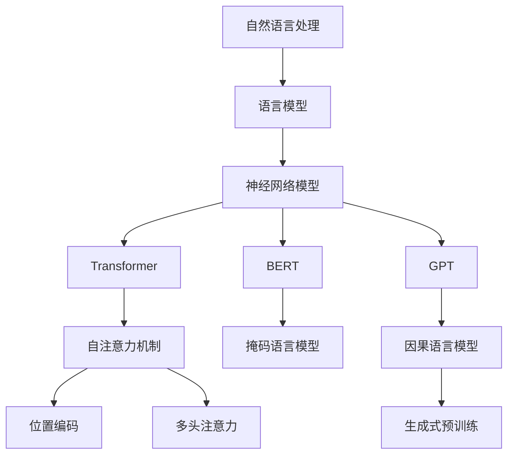

以下是《大语言模型原理基础与前沿 具身化与落地》的技术博客文章正文内容：

# 大语言模型原理基础与前沿 具身化与落地

## 1. 背景介绍

### 1.1 问题的由来

近年来,大型语言模型(Large Language Model, LLM)在自然语言处理(Natural Language Processing, NLP)领域取得了令人瞩目的成就。这些模型通过在大规模语料库上进行预训练,展现出惊人的语言理解和生成能力。然而,现有的大语言模型仍然存在一些局限性和挑战,例如缺乏真正的理解和推理能力、容易产生不一致和有害的输出、难以将知识迁移到下游任务等。因此,探索大语言模型的原理基础,并推动其在实际应用中的具身化和落地,成为当前研究的重点方向。

### 1.2 研究现状

目前,大语言模型的研究主要集中在以下几个方面:

1. **模型架构优化**: 探索更高效和可扩展的模型架构,如Transformer、Mixture-of-Experts等。
2. **预训练策略改进**: 采用更有效的预训练目标和策略,如自回归语言模型、对比学习等。
3. **知识注入**: 将外部知识库或结构化数据注入模型,增强其理解和推理能力。
4. **可解释性和可控性**: 提高模型的透明度和可控性,避免产生不一致或有害的输出。
5. **下游任务迁移**: 探索将预训练模型有效迁移到下游任务的方法。
6. **具身化和落地**: 将大语言模型应用于实际场景,解决现实世界的问题。

### 1.3 研究意义

大语言模型的研究具有重要的理论和实践意义:

1. **理论层面**: 有助于深入理解语言的本质,揭示语言学习和理解的基本原理。
2. **技术层面**: 推动自然语言处理技术的发展,为各种语言智能应用提供强大的基础模型。
3. **应用层面**: 大语言模型可应用于多个领域,如机器翻译、问答系统、文本生成、信息检索等,为人类带来便利。

### 1.4 本文结构

本文将全面探讨大语言模型的原理基础和前沿发展,内容包括:

1. 核心概念与联系
2. 核心算法原理和具体操作步骤
3. 数学模型和公式详细讲解与案例分析
4. 项目实践:代码实例和详细解释
5. 实际应用场景
6. 工具和资源推荐
7. 总结:未来发展趋势与挑战
8. 附录:常见问题与解答

## 2. 核心概念与联系

大语言模型涉及多个核心概念,它们相互关联,构成了完整的理论体系。下面将介绍这些核心概念及其联系:

1. **自然语言处理(NLP)**: 研究计算机处理和理解人类语言的理论和方法。
2. **语言模型(Language Model)**: 用于捕捉语言的统计规律,估计一个序列的概率分布。
3. **神经网络模型(Neural Network Model)**: 采用深度学习方法构建的语言模型,具有强大的表示能力。
4. **Transformer**: 一种全新的基于自注意力机制的序列到序列模型架构。
5. **BERT**: 基于Transformer的掩码语言模型,通过预训练实现语义理解。
6. **GPT**: 基于Transformer的因果语言模型,通过预训练实现文本生成。
7. **自注意力机制(Self-Attention)**: Transformer的核心,能够捕捉序列中任意位置之间的依赖关系。
8. **位置编码(Positional Encoding)**: 为序列中的每个位置赋予唯一的位置信息。
9. **多头注意力(Multi-Head Attention)**: 将多个注意力子空间的信息进行融合。
10. **掩码语言模型(Masked Language Model)**: 通过预测被掩码的词来学习双向语义表示。
11. **因果语言模型(Causal Language Model)**: 通过预测下一个词来学习单向语义表示。
12. **生成式预训练(Generative Pre-training)**: 在大规模语料库上预训练语言模型,获取通用的语言知识。

上述概念相互关联,共同构建了大语言模型的理论基础和技术体系。

## 3. 核心算法原理 & 具体操作步骤

### 3.1 算法原理概述

大语言模型的核心算法主要基于**Transformer**架构和**自注意力机制**。Transformer通过完全依赖自注意力机制来建模序列中任意两个位置之间的依赖关系,从而避免了传统序列模型中的递归计算和有限的上下文窗口问题。

Transformer的编码器(Encoder)和解码器(Decoder)都由多个相同的层组成,每一层包含两个子层:

1. **多头自注意力子层(Multi-Head Self-Attention Sublayer)**
2. **前馈神经网络子层(Feed-Forward Neural Network Sublayer)**

多头自注意力子层能够捕捉序列中任意两个位置之间的依赖关系,而前馈神经网络子层则对每个位置的表示进行非线性映射。残差连接(Residual Connection)和层归一化(Layer Normalization)机制被应用于每个子层,以帮助模型训练和提高性能。

### 3.2 算法步骤详解

以下是Transformer的自注意力机制的具体计算步骤:

1. **线性映射**:将输入序列$X$通过线性映���分别得到查询(Query)向量$Q$、键(Key)向量$K$和值(Value)向量$V$:

$$Q = XW^Q, K = XW^K, V = XW^V$$

其中$W^Q$、$W^K$、$W^V$分别为查询、键和值的线性映射矩阵。

2. **计算注意力分数**:计算查询$Q$与所有键$K$之间的点积,得到注意力分数矩阵$S$:

$$S = \frac{QK^T}{\sqrt{d_k}}$$

其中$d_k$为缩放因子,用于防止点积值过大导致梯度消失或爆炸。

3. **软最大化**:对注意力分数矩阵$S$进行软最大化操作(SoftMax),得到注意力权重矩阵$A$:

$$A = \text{softmax}(S) = \text{softmax}(\frac{QK^T}{\sqrt{d_k}})$$

4. **加权求和**:将注意力权重矩阵$A$与值向量$V$相乘,得到输出向量$O$:

$$O = AV$$

上述过程即为单头自注意力的计算方式。在实际应用中,通常会使用多头注意力机制,将多个注意力子空间的信息进行融合,从而提高模型的表示能力。

### 3.3 算法优缺点

**优点**:

1. **长期依赖建模**:自注意力机制能够直接捕捉序列中任意两个位置之间的依赖关系,有效解决了传统序列模型中的长期依赖问题。
2. **并行计算**:Transformer的计算过程可以高度并行化,提高了训练和推理的效率。
3. **灵活的输入输出**:Transformer能够处理可变长度的输入和输出序列,适用于多种任务场景。

**缺点**:

1. **计算复杂度高**:自注意力机制需要计算查询与所有键之间的注意力分数,计算复杂度为$O(n^2)$,对于长序列来说,计算开销较大。
2. **位置信息缺失**:Transformer本身无法捕捉序列的位置信息,需要额外引入位置编码。
3. **预训练成本高**:训练大型语言模型需要消耗大量的计算资源和数据,成本较高。

### 3.4 算法应用领域

Transformer及其变体已被广泛应用于自然语言处理的各个领域,包括但不限于:

1. **机器翻译**: 将源语言序列翻译为目标语言序列。
2. **文本生成**: 根据给定的上下文生成连贯、流畅的文本。
3. **文本摘要**: 自动生成文本的摘要或概述。
4. **问答系统**: 根据给定的问题从知识库中检索相关答案。
5. **自然语言理解**: 理解自然语言的语义和意图,如情感分析、命名实体识别等。
6. **代码生成**: 根据给定的需求或注释自动生成代码。

## 4. 数学模型和公式 & 详细讲解 & 举例说明

### 4.1 数学模型构建

大语言模型的数学模型主要基于**概率图模型**和**神经网络模型**。概率图模型用于描述语言的概率分布,而神经网络模型则用于从数据中学习这种概率分布的参数。

对于一个长度为$n$的词序列$\boldsymbol{x} = (x_1, x_2, \dots, x_n)$,我们可以将其概率分解为一个条件概率的乘积:

$$P(\boldsymbol{x}) = \prod_{t=1}^n P(x_t | x_1, \dots, x_{t-1})$$

这就是**语言模型**的基本思想,即根据前面的词来预测下一个词的概率。传统的语言模型通常采用**n-gram**或**最大熵模型**等统计方法来估计上述条件概率。

而神经网络语言模型则使用**神经网络**来参数化条件概率分布,其中一种常见的模型是**循环神经网络(RNN)**:

$$h_t = \text{RNN}(x_t, h_{t-1})$$
$$P(x_t | x_1, \dots, x_{t-1}) = \text{softmax}(W_o h_t + b_o)$$

其中$h_t$为时间步$t$的隐状态向量,通过递归地计算上一时间步的隐状态$h_{t-1}$和当前输入$x_t$而获得。$W_o$和$b_o$分别为输出层的权重矩阵和偏置向量。

虽然RNN能够有效地捕捉序列的上下文信息,但它存在梯度消失/爆炸的问题,难以建模长期依赖关系。为了解决这个问题,**长短期记忆网络(LSTM)**和**门控循环单元(GRU)**等变体被提出,通过引入门控机制来更好地捕捉长期依赖。

### 4.2 公式推导过程

接下来,我们将详细推导**Transformer**中的**缩放点积注意力**公式。

首先,我们定义查询向量$\boldsymbol{q}$、键向量$\boldsymbol{k}$和值向量$\boldsymbol{v}$,它们分别表示查询、键和值的向量表示。注意力分数则定义为查询向量与键向量之间的点积:

$$\text{score}(\boldsymbol{q}, \boldsymbol{k}) = \boldsymbol{q}^\top \boldsymbol{k}$$

为了获得注意力权重,我们需要对注意力分数进行softmax归一化:

$$\alpha(\boldsymbol{q}, \boldsymbol{k}) = \frac{\exp(\text{score}(\boldsymbol{q}, \boldsymbol{k}))}{\sum_{\boldsymbol{k}' \in \mathcal{K}} \exp(\text{score}(\boldsymbol{q}, \boldsymbol{k}'))}$$

其中$\mathcal{K}$表示所有键向量的集合。

然后,我们可以计算加权和来获得注意力输出:

$$\text{attn}(\boldsymbol{q}, \mathcal{K}, \mathcal{V}) = \sum_{\boldsymbol{k} \in \mathcal{K}} \alpha(\boldsymbol{q}, \boldsymbol{k}) \boldsymbol{v}$$

其中$\mathcal{V}$表示所有值向量的集合。

在实际应用中,为了避免点积值过大导致梯度消失或爆炸,我们通常会对点积进行缩放:

$$\text{score}(\boldsymbol{q}, \boldsymbol{k}) = \frac{\boldsymbol{q}^\top \boldsymbol{k