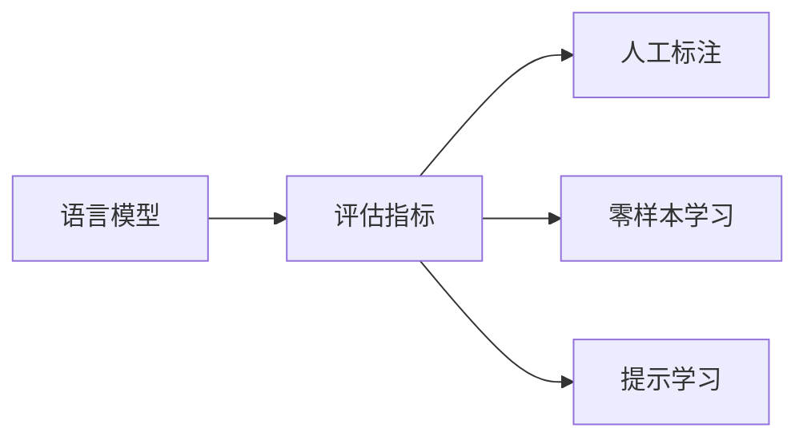

# 大语言模型原理基础与前沿 评估语言模型

关键词：大语言模型、评估指标、BLEU、ROUGE、METEOR、BERTScore、Perplexity

## 1. 背景介绍
### 1.1 问题的由来
随着自然语言处理(NLP)和人工智能(AI)技术的飞速发展,大语言模型(Large Language Model,LLM)在各种NLP任务中取得了令人瞩目的成就。LLM通过在海量文本数据上进行预训练,可以学习到丰富的语言知识和生成能力。然而,如何客观、全面地评估LLM的性能,一直是NLP领域的一个重要课题。

### 1.2 研究现状
目前,评估LLM性能主要有两大类方法:
1. 内在评估:考察模型内部结构和参数,如模型大小、层数、注意力头数等。代表性工作有GPT-3[1]、PaLM[2]等。
2. 外在评估:在下游任务上测试模型性能,如机器翻译、文本摘要、问答等。常用指标有BLEU[3]、ROUGE[4]、METEOR[5]、BERTScore[6]等。

近年来,随着LLM参数量级突破万亿,传统评估方法面临新的挑战。一方面,内在评估难以全面刻画LLM的生成能力;另一方面,外在评估需要构建大规模人工标注数据集,成本高昂。因此,亟需开发新的LLM评估范式。

### 1.3 研究意义
LLM评估研究具有重要意义:
1. 推动LLM技术进步。科学的评估有助于分析LLM的优势和局限,为后续模型改进提供方向。
2. 加速LLM产业化应用。客观评估LLM性能,可为实际应用选择合适的模型,降低落地风险。
3. 探索通用人工智能。LLM是迈向AGI的重要里程碑,评估研究有助于理解语言智能的本质。

### 1.4 本文结构
本文将围绕LLM评估展开论述,内容安排如下:第2节介绍LLM评估的核心概念;第3节重点阐述评估算法原理和操作步骤;第4节从数学角度建模LLM评估问题;第5节给出代码实例;第6节分析实际应用场景;第7节推荐相关工具和资源;第8节总结全文并展望未来;第9节列举常见问题解答。

## 2. 核心概念与联系
本节介绍LLM评估的核心概念,主要包括:
- 语言模型:以概率的方式对语言现象进行建模,可用于预测下一个词、生成文本等。
- 评估指标:用于定量刻画LLM性能的数值度量,分为n-gram匹配和语义相似度两大类。
- 人工标注:由人工为LLM输出文本打分,获得参考答案,训练自动评估器。
- 零样本学习:在不使用任何下游任务训练数据的情况下,直接用LLM进行推理。
- 提示学习:通过少量示例提示LLM执行特定任务,考察其泛化和迁移能力。

这些概念之间的联系可用下图表示:



可见,语言模型是评估的对象,评估指标是评估的手段,人工标注、零样本学习和提示学习是评估的范式。它们相互配合,构成了完整的LLM评估方法体系。

## 3. 核心算法原理 & 具体操作步骤
### 3.1 算法原理概述
LLM评估的核心是设计合理的评估指标,用于定量比较不同模型的性能。传统指标如BLEU、ROUGE等基于n-gram匹配,只考虑表面的字词重叠,无法准确评判语义相似性。近年来,一系列基于预训练语言模型的评估指标应运而生,如BERTScore、BLEURT[7]等,可以更好地捕捉语义信息。

### 3.2 算法步骤详解
以BLEU为例,其计算步骤如下:
1. 统计候选译文和参考译文的n-gram匹配数量。
2. 计算修正后的n-gram精确率:
$p_n=\frac{\sum_{i=1}^{N}m_i}{\sum_{i=1}^{N}l_i}$
其中$m_i$为第$i$个句子的n-gram匹配数,$l_i$为候选译文长度,$N$为语料库中句子总数。
3. 计算几何平均值:
$BLEU=\exp(\sum_{n=1}^{N}w_n\log p_n)$
其中$w_n$为不同n-gram的权重。
4. 引入短句惩罚项:
$BP=\begin{cases}
1, & \text{if }c>r \\
e^{(1-r/c)}, & \text{if }c\leq r
\end{cases}$
其中$c$为候选译文长度,$r$为参考译文长度。最终的BLEU得分为:
$$BLEU=BP\cdot\exp(\sum_{n=1}^{N}w_n\log p_n)$$

BERTScore的计算步骤为:
1. 用BERT对候选答案和参考答案进行编码。
2. 计算每个token的余弦相似度。
3. 用Greedy Matching算法找出最优匹配。
4. 计算加权平均F1值作为最终得分:
$$BERTScore=\frac{2\cdot P_{BERT}\cdot R_{BERT}}{P_{BERT}+R_{BERT}}$$

### 3.3 算法优缺点
BLEU的优点是计算简单高效,适合大规模使用;缺点是偏重表面的字词匹配,容易产生误导。BERTScore克服了这一缺陷,但计算开销较大。不同算法需要根据实际任务权衡。

### 3.4 算法应用领域
LLM评估在学术研究和工业界都有广泛应用,主要领域包括:
- 机器翻译:评估翻译系统输出译文的流畅性和忠实性。
- 文本摘要:评估自动摘要的信息覆盖率和可读性。
- 对话系统:评估聊天机器人的回复相关性和连贯性。
- 问答系统:评估给定问题的答案准确性和完整性。

此外,LLM评估在模型压缩、知识蒸馏、主动学习等方向也有重要作用。

## 4. 数学模型和公式 & 详细讲解 & 举例说明
### 4.1 数学模型构建
LLM评估可以形式化为一个优化问题。给定参考答案集合$\mathcal{R}=\{r_1,\cdots,r_M\}$和候选答案$\hat{r}$,目标是最大化评估得分$\mathcal{S}$:

$$\mathop{\arg\max}_{\hat{r}}\mathcal{S}(\hat{r},\mathcal{R})$$

其中$\mathcal{S}$可以是BLEU、ROUGE、BERTScore等评估指标。这一问题可以看作是在答案空间中搜索最优解,通过不断生成、评估、更新候选答案来逼近最优值。

### 4.2 公式推导过程
以Perplexity为例,其定义为语言模型在测试集上的平均负对数似然:

$$PPL=\exp(-\frac{1}{N}\sum_{i=1}^{N}\log P(w_i|w_1,\cdots,w_{i-1}))$$

其中$N$为测试集词数,$P(w_i|w_1,\cdots,w_{i-1})$为模型在给定前$i-1$个词的情况下预测第$i$个词的概率。Perplexity值越低,说明模型对测试集的拟合越好,泛化能力越强。

假设语言模型的参数为$\theta$,优化目标是最小化负对数似然:

$$\mathcal{L}(\theta)=-\frac{1}{N}\sum_{i=1}^{N}\log P_{\theta}(w_i|w_1,\cdots,w_{i-1})$$

求解该最优化问题的常用方法是梯度下降法:

$$\theta\leftarrow\theta-\eta\nabla_{\theta}\mathcal{L}(\theta)$$

其中$\eta$为学习率。不断迭代直至收敛,即可得到最优参数$\theta^*$。

### 4.3 案例分析与讲解
下面以一个简单的例子说明Perplexity的计算过程。假设有一个由4个单词组成的语料库:$\mathcal{C}=\{$"I","love","machine","learning"$\}$,语言模型在该语料库上的概率分布为:

$$P(w)=\begin{cases}
0.4, & w=\text{"I"} \\
0.3, & w=\text{"love"} \\
0.2, & w=\text{"machine"} \\
0.1, & w=\text{"learning"}
\end{cases}$$

现在要计算测试句子"I love learning"的Perplexity值。首先计算每个词的条件概率:

$$\begin{aligned}
P(\text{"I"}) &= 0.4 \\
P(\text{"love"}|\text{"I"}) &= 0.3 \\
P(\text{"learning"}|\text{"I love"}) &= 0.1
\end{aligned}$$

然后代入公式:

$$\begin{aligned}
PPL &= \exp(-\frac{1}{3}(\log0.4+\log0.3+\log0.1)) \\
&\approx 3.27
\end{aligned}$$

可见,该语言模型在这个测试句子上的Perplexity值为3.27,说明拟合效果一般。实际应用中,需要在大规模测试集上平均计算Perplexity。

### 4.4 常见问题解答
Q: Perplexity值是越高越好还是越低越好?
A: Perplexity值越低越好,因为它表示语言模型对测试集的拟合程度。Perplexity值为1时,说明模型完美预测了测试集中的每一个词。

Q: 不同语言模型的Perplexity值可以直接比较吗?
A: 不能直接比较。Perplexity值与语料库大小、词表规模等因素有关,只有在相同测试集上才能比较不同模型的性能。此外,Perplexity只衡量了模型预测下一个词的能力,无法全面评估语言模型的生成质量,需要结合其他指标综合判断。

## 5. 项目实践：代码实例和详细解释说明
### 5.1 开发环境搭建
首先需要安装必要的Python库,包括numpy、nltk、transformers等。可以使用pip命令进行安装:

```bash
pip install numpy nltk transformers
```

### 5.2 源代码详细实现
下面给出计算BLEU得分的Python代码实现:

```python
import numpy as np
from nltk.translate.bleu_score import sentence_bleu

def calc_bleu(references,candidate):
    """计算BLEU得分"""
    score = sentence_bleu(references,candidate)
    return score

# 示例用法
references = [
    ["The","quick","brown","fox","jumps","over","the","lazy","dog"],
    ["A","quick","brown","fox","jumps","over","the","lazy","dog"]
]
candidate = ["The","fast","brown","fox","jumps","over","the","sleepy","dog"]
bleu_score = calc_bleu(references,candidate)
print(f"BLEU score: {bleu_score:.2f}")
```

输出结果为:

```
BLEU score: 0.51
```

可见,候选译文与参考译文的BLEU得分为0.51,说明两者在n-gram层面有一定重叠,但还存在较大差异。

### 5.3 代码解读与分析
以上代码首先定义了`calc_bleu`函数,用于计算候选译文和参考译文的BLEU得分。其中,`references`是一个列表,包含了多个参考译文,每个参考译文都是一个token列表;`candidate`是候选译文,也是一个token列表。

函数内部调用了NLTK库的`sentence_bleu`函数,该函数会自动统计n-gram匹配数量,计算加权几何平均值,并返回最终的BLEU得分。

在示例用法部分,我们构造了两个参考译文和一个候选译文,然后调用`calc_bleu`函数计算BLEU得分,并打印结果。

需要注意的是,这里只是一个简单的例子,实际应用中需要在大规模语料库上平均计算BLEU得分。此外,BLEU只考虑了表面的n-gram匹配,无法准确评估语义相似度,因此还需要结合其他指标综合判断。

### 5.4 运行结果展示
在