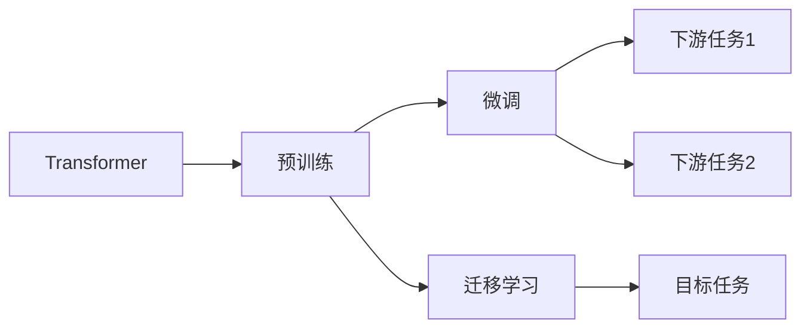

# 大语言模型原理与工程实践：案例运行

关键词：大语言模型、Transformer、BERT、GPT、预训练、微调、迁移学习、自然语言处理

## 1. 背景介绍
### 1.1 问题的由来
随着互联网的飞速发展,海量的文本数据正在以前所未有的速度增长。如何有效地处理和利用这些文本数据,成为自然语言处理领域亟待解决的问题。传统的自然语言处理方法难以应对如此庞大的数据规模和复杂的语言现象。大语言模型的出现为解决这一难题提供了新的思路。

### 1.2 研究现状
近年来,以Transformer为代表的大语言模型取得了显著的进展。从BERT到GPT系列模型,大语言模型在多个自然语言处理任务上取得了state-of-the-art的表现,展现出强大的语言理解和生成能力。越来越多的研究者和企业开始关注和投入大语言模型的研究与应用。

### 1.3 研究意义
大语言模型的研究具有重要的理论和实践意义。从理论角度看,大语言模型为探索人类语言认知机制提供了新的视角,有助于揭示语言的本质规律。从实践角度看,大语言模型可以广泛应用于智能问答、机器翻译、文本摘要、情感分析等领域,极大地提升自然语言处理系统的性能,创造巨大的商业价值。

### 1.4 本文结构
本文将全面介绍大语言模型的原理与工程实践。第2部分阐述大语言模型的核心概念;第3部分详细讲解大语言模型的核心算法原理与具体操作步骤;第4部分建立大语言模型的数学模型并给出公式推导与案例分析;第5部分通过代码实例演示大语言模型的项目实践;第6部分探讨大语言模型的实际应用场景;第7部分推荐大语言模型的学习资源与开发工具;第8部分总结大语言模型的研究现状并展望未来发展方向。

## 2. 核心概念与联系
大语言模型的核心概念包括:

- Transformer:一种基于自注意力机制的神经网络结构,是大语言模型的基础架构。
- 预训练:在大规模无标注语料上进行自监督学习,让模型自动学习语言的统计规律和结构特征。
- 微调:在下游任务的标注数据上对预训练模型进行监督学习,使其适应特定任务。
- 迁移学习:将在源任务上学到的知识迁移到目标任务,减少目标任务所需的标注数据。

这些概念环环相扣,共同构成了大语言模型的理论和方法体系。Transformer是基石,奠定了模型的基本结构;预训练是利器,赋予了模型强大的语言理解能力;微调是法宝,让模型得以灵活应用于不同任务;迁移学习是秘诀,使模型能够高效地适应新领域、新任务。



## 3. 核心算法原理 & 具体操作步骤
### 3.1 算法原理概述
大语言模型的核心算法可以概括为"预训练-微调"范式。首先,在大规模无标注语料上对模型进行自监督预训练,学习语言的一般性知识;然后,在下游任务的标注数据上对模型进行监督微调,使其适应特定任务。预训练阶段一般采用掩码语言模型(Masked Language Model, MLM)和自回归语言模型(Auto-Regressive Language Model, ALM)等方式,微调阶段根据任务类型的不同可以采用分类、序列标注、生成等方式。

### 3.2 算法步骤详解
以BERT为例,其预训练和微调的具体步骤如下:

预训练阶段:
1. 构建大规模无标注语料库,进行文本清洗和预处理。
2. 随机掩盖(mask)部分词元,让模型预测被掩盖词元。
3. 引入下一句预测(Next Sentence Prediction, NSP)任务,让模型判断两个句子是否前后相接。
4. 使用Transformer Encoder对输入序列进行编码。
5. 通过掩码语言模型和NSP任务计算损失,并使用Adam优化器更新模型参数。

微调阶段:
1. 根据下游任务准备标注数据集。
2. 在预训练模型的基础上,添加任务特定的输出层。
3. 将标注数据输入微调后的模型,计算任务损失函数。
4. 使用Adam优化器更新整个模型的参数。
5. 在验证集上评估模型性能,并根据需要调整超参数。

### 3.3 算法优缺点
大语言模型的优点包括:
- 通过预训练学习语言的一般性知识,减少了对标注数据的依赖。
- Transformer结构能够有效捕捉长距离依赖,生成更加连贯、流畅的文本。
- 可以灵活地应用于各种自然语言处理任务,具有很好的通用性和迁移性。

大语言模型的缺点包括:
- 模型参数量巨大,训练和推理成本高昂,对计算资源要求较高。
- 模型容量有限,难以记忆和理解所有的世界知识。
- 模型可能放大训练数据中的偏见,产生不公平、有害的结果。

### 3.4 算法应用领域
大语言模型已经在多个自然语言处理任务上取得了state-of-the-art的表现,主要应用领域包括:

- 智能问答:通过大语言模型理解问题并生成答案,构建聊天机器人、智能客服等应用。
- 机器翻译:利用大语言模型进行端到端的序列到序列翻译,显著提升翻译质量。
- 文本摘要:使用大语言模型自动生成文本摘要,助力信息检索和知识总结。
- 情感分析:基于大语言模型的语义表示进行情感极性判别,挖掘用户情感倾向。
- 命名实体识别:用大语言模型捕捉词汇和上下文特征,识别文本中的实体名称。
- 文本分类:将大语言模型作为文本特征提取器,再结合分类器进行文本分类。

## 4. 数学模型和公式 & 详细讲解 & 举例说明
### 4.1 数学模型构建
大语言模型的数学模型可以用概率图模型来表示。设输入文本序列为$\mathbf{x}=(x_1,\cdots,x_T)$,其中$x_t$为第$t$个词元,模型的目标是最大化如下似然函数:

$$\mathcal{L}(\theta)=\sum_{t=1}^T \log P(x_t|\mathbf{x}_{<t};\theta)$$

其中$\theta$为模型参数,$\mathbf{x}_{<t}$表示$x_t$之前的所有词元。在Transformer结构下,模型可以并行计算所有位置的条件概率分布$P(x_t|\mathbf{x}_{<t};\theta)$。

### 4.2 公式推导过程
以BERT的掩码语言模型为例,假设被掩盖的词元位置为$\mathcal{M}$,掩码概率为0.15,其损失函数可以表示为:

$$\mathcal{L}_{MLM}(\theta)=-\frac{1}{|\mathcal{M}|}\sum_{t\in\mathcal{M}}\log P(x_t|\mathbf{x}_{\backslash t};\theta)$$

其中$\mathbf{x}_{\backslash t}$表示将$x_t$掩盖后的输入序列。假设词表大小为$|\mathcal{V}|$,模型在位置$t$的输出向量为$\mathbf{h}_t\in\mathbb{R}^H$,其中$H$为隐藏层维度,则有:

$$P(x_t=w|\mathbf{x}_{\backslash t};\theta)=\frac{\exp(\mathbf{e}_w^T\mathbf{h}_t)}{\sum_{w'\in\mathcal{V}}\exp(\mathbf{e}_{w'}^T\mathbf{h}_t)}$$

其中$\mathbf{e}_w\in\mathbb{R}^H$为词$w$的嵌入向量。在实践中,通常使用负采样等技巧来近似计算分母项,以提高训练效率。

### 4.3 案例分析与讲解
我们以一个简单的例子来说明BERT的掩码语言模型。假设输入序列为"The man went to the [MASK] to buy some [MASK]."，其中[MASK]表示被掩盖的词元。经过BERT编码后,我们得到每个位置的输出向量。对于第一个[MASK],模型可能输出"store"的概率最大;对于第二个[MASK],模型可能输出"food"的概率最大。因此,模型预测的完整句子为"The man went to the store to buy some food."。通过这种自监督学习方式,BERT可以学到词元之间的依赖关系和句法语义知识。

### 4.4 常见问题解答
Q: 预训练和微调的区别是什么?
A: 预训练是在大规模无标注语料上进行自监督学习,让模型自动学习语言的统计规律和结构特征;微调是在下游任务的标注数据上对预训练模型进行监督学习,使其适应特定任务。预训练是通用的,微调是专用的。

Q: 为什么要使用Transformer结构?
A: 相比RNN和CNN,Transformer结构具有以下优势:1)可以并行计算,训练效率更高;2)通过自注意力机制,可以捕捉长距离依赖;3)通过位置编码,可以引入序列信息。因此,Transformer更加适合建模长文本序列。

Q: 掩码语言模型的作用是什么?
A: 掩码语言模型通过随机掩盖部分词元,让模型根据上下文预测被掩盖词元,从而学习词元之间的依赖关系和上下文表示。这种自监督学习方式可以有效利用无标注语料,为下游任务提供通用的语言理解能力。

## 5. 项目实践：代码实例和详细解释说明
### 5.1 开发环境搭建
首先,我们需要搭建大语言模型的开发环境。这里以PyTorch版BERT为例,主要依赖包括:

- Python 3.6+
- PyTorch 1.1+
- NumPy
- Transformers

可以通过以下命令安装依赖:

```bash
pip install torch numpy transformers
```

### 5.2 源代码详细实现
接下来,我们使用Hugging Face的Transformers库来实现BERT的微调和推理。以文本分类任务为例,核心代码如下:

```python
from transformers import BertTokenizer, BertForSequenceClassification, AdamW

# 加载预训练模型和分词器
model = BertForSequenceClassification.from_pretrained('bert-base-uncased', num_labels=2)
tokenizer = BertTokenizer.from_pretrained('bert-base-uncased')

# 准备数据集
train_texts = [...]  # 训练集文本
train_labels = [...]  # 训练集标签
test_texts = [...]  # 测试集文本
test_labels = [...]  # 测试集标签

# 将文本转换为输入特征
train_encodings = tokenizer(train_texts, truncation=True, padding=True)
test_encodings = tokenizer(test_texts, truncation=True, padding=True)

# 定义优化器和损失函数
optimizer = AdamW(model.parameters(), lr=1e-5)
loss_fn = torch.nn.CrossEntropyLoss()

# 微调模型
for epoch in range(3):
    for batch in train_dataloader:
        input_ids = batch['input_ids']
        attention_mask = batch['attention_mask']
        labels = batch['labels']
        
        outputs = model(input_ids, attention_mask=attention_mask, labels=labels)
        loss = outputs.loss
        
        optimizer.zero_grad()
        loss.backward()
        optimizer.step()

# 在测试集上评估模型
model.eval()
preds = []
for batch in test_dataloader:
    input_ids = batch['input_ids']
    attention_mask = batch['attention_mask']
    
    with torch.no_grad():
        outputs = model(input_ids, attention_mask=attention_mask)
        logits = outputs.logits
        preds.extend(torch.argmax(logits, dim=1).tolist())

# 计算准确率
acc = accuracy_score(test_labels, preds)
print(f'Accuracy: {acc:.4f}')
```