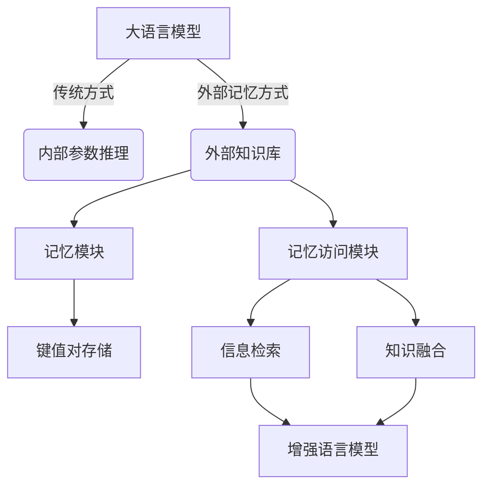

# 大语言模型原理基础与前沿 外部记忆

## 1. 背景介绍

### 1.1 问题的由来

在过去几年中,大型语言模型(Large Language Models, LLMs)在自然语言处理(Natural Language Processing, NLP)领域取得了令人瞩目的成就。这些模型通过在大规模文本语料库上进行预训练,学习了丰富的语言知识和上下文信息,从而能够生成高质量、连贯的自然语言输出。然而,传统的语言模型存在一个关键缺陷:它们只能基于内部参数进行推理,无法直接访问和利用外部知识库中的结构化信息。

随着人工智能系统在越来越多的领域得到应用,模型需要能够高效地集成和利用各种形式的外部知识。例如,在问答系统中,模型需要从知识库中查找相关事实;在对话系统中,模型需要根据用户个人资料进行个性化响应;在决策支持系统中,模型需要结合数据库中的数据进行决策。因此,赋予语言模型外部记忆访问能力,使其能够灵活地融合内部知识和外部知识,成为了一个重要的研究课题。

### 1.2 研究现状

为了解决上述问题,研究人员提出了多种方法,试图将外部知识库与语言模型相结合。其中,一种流行的方法是将外部知识表示为键值对(Key-Value Pair)的形式,并将其作为额外的记忆模块与语言模型相连接。这种方法被称为"外部记忆"(External Memory)。

外部记忆模型通常由两个主要组件组成:

1. **记忆模块**:存储外部知识的键值对数据库。
2. **记忆访问模块**:负责从记忆模块中检索相关信息,并将其融合到语言模型的输出中。

目前,已经提出了多种不同的外部记忆架构,如Memory Network、Dynamic Memory Network、Key-Value Memory Network等。这些架构在记忆表示、访问机制和模型训练方式上存在一些差异,但都旨在赋予语言模型更强的知识融合能力。

### 1.3 研究意义

外部记忆语言模型具有广泛的应用前景,可以显著提升人工智能系统在各个领域的性能。例如:

- **问答系统**:通过访问知识库,模型能够回答更多种类的问题,提供更准确、更全面的答复。
- **对话系统**:融合用户个人资料和背景知识,实现更加个性化和情景化的对话交互。
- **决策支持系统**:结合数据库中的数据,为决策过程提供更可靠的依据。
- **内容生成**:利用外部知识库丰富内容,生成更加信息丰富、内容丰富的文本。

此外,外部记忆语言模型还可以促进人工智能系统的可解释性和可控性。通过明确地将外部知识与模型输出相关联,我们可以更好地理解模型的推理过程,从而提高系统的透明度和可信度。

### 1.4 本文结构

本文将全面介绍外部记忆语言模型的基础理论和前沿研究进展。我们将从以下几个方面进行阐述:

1. **核心概念与联系**:阐释外部记忆语言模型的核心思想,并与相关概念进行联系。
2. **核心算法原理与具体操作步骤**:深入探讨外部记忆模型的核心算法原理,并详细说明其具体实现步骤。
3. **数学模型和公式详细讲解**:介绍外部记忆模型的数学表示形式,并详细推导和解释相关公式。
4. **项目实践:代码实例和详细解释**:提供外部记忆模型的代码实现示例,并进行详细的解释和分析。
5. **实际应用场景**:探讨外部记忆模型在不同领域的实际应用,如问答系统、对话系统等。
6. **工具和资源推荐**:推荐相关的学习资源、开发工具和论文,方便读者进一步学习和研究。
7. **总结:未来发展趋势与挑战**:总结外部记忆模型的研究成果,展望未来发展趋势,并讨论需要解决的挑战。
8. **附录:常见问题与解答**:针对外部记忆模型的常见问题进行解答,帮助读者更好地理解和掌握这一领域。

## 2. 核心概念与联系

外部记忆语言模型(External Memory Language Model)是一种新兴的语言模型架构,旨在赋予语言模型直接访问和利用外部知识库的能力。传统的语言模型仅依赖于内部参数进行推理,而外部记忆模型则通过引入额外的记忆模块和记忆访问模块,实现了对外部知识的灵活融合。

**外部知识库**通常以键值对(Key-Value Pair)的形式存储在**记忆模块**中。**记忆访问模块**则负责从记忆模块中检索相关信息,并将其与语言模型的输出进行融合。这种架构使得语言模型不仅可以利用内部学习到的知识,还能够灵活地引入外部知识,从而提高模型的泛化能力和适应性。

外部记忆语言模型与以下几个相关概念存在密切联系:

1. **记忆增强神经网络(Memory Augmented Neural Networks, MANNs)**: 外部记忆语言模型属于记忆增强神经网络的一种特例。记忆增强神经网络是一类通过引入外部记忆模块来增强神经网络能力的模型架构。

2. **知识库问答(Knowledge Base Question Answering, KBQA)**: 外部记忆语言模型可以被视为一种知识库问答系统,其中记忆模块存储了结构化的知识库,而模型的目标是根据查询(问题)从知识库中检索相关信息并生成答复。

3. **多模态学习(Multimodal Learning)**: 外部记忆语言模型可以被扩展到融合多种模态的信息,如图像、视频等。在这种情况下,记忆模块不仅存储文本知识,还可以存储其他模态的数据。

4. **元学习(Meta-Learning)**: 外部记忆语言模型的训练过程可以被视为一种元学习过程,模型需要学习如何有效地从记忆模块中检索和利用相关知识。

通过上述概念的联系,我们可以更好地理解外部记忆语言模型的本质和广阔的应用前景。

## 3. 核心算法原理 & 具体操作步骤

### 3.1 算法原理概述

外部记忆语言模型的核心算法原理可以概括为以下几个关键步骤:

1. **记忆表示**: 将外部知识库表示为一系列键值对,并存储在记忆模块中。
2. **记忆寻址**: 根据当前的输入(如查询或上下文),从记忆模块中检索相关的键值对。
3. **记忆读取**: 从检索到的键值对中读取相应的值(即知识信息)。
4. **知识融合**: 将读取到的知识信息与语言模型的内部表示相融合,生成最终的输出。

这个过程可以被视为一种"读写分离"(Read-Write Separation)的架构,其中记忆模块充当了只读存储器的角色,而语言模型则充当了读写控制器的角色。通过这种分离,语言模型可以专注于从记忆模块中读取和融合知识,而无需直接修改记忆模块的内容。

### 3.2 算法步骤详解

我们将详细介绍外部记忆语言模型算法的具体实现步骤。为了便于说明,我们以一个基于注意力机制的外部记忆模型为例进行阐述。

#### 步骤1: 记忆表示

首先,我们需要将外部知识库转换为键值对的形式,并存储在记忆模块中。每个键值对由一个键(key)和一个值(value)组成,其中键通常是一个向量表示,用于唯一标识该知识单元,而值则是该知识单元的具体内容(如文本、图像等)。

对于文本知识库,我们可以使用预训练的语言模型(如BERT)对每个知识单元进行编码,得到其对应的键和值向量表示。例如,对于一个知识三元组 (subject, relation, object),我们可以将其拼接为一个序列 `[CLS] subject [SEP] relation [SEP] object [SEP]`,然后使用BERT对该序列进行编码,得到其对应的键向量和值向量。

$$
\begin{aligned}
\text{key}_i &= \text{BERT}_\text{key}([\text{CLS}] \text{subject} [\text{SEP}] \text{relation} [\text{SEP}] \text{object} [\text{SEP}]) \\
\text{value}_i &= \text{BERT}_\text{value}([\text{CLS}] \text{subject} [\text{SEP}] \text{relation} [\text{SEP}] \text{object} [\text{SEP}])
\end{aligned}
$$

其中 $i$ 表示第 $i$ 个知识单元, $\text{BERT}_\text{key}$ 和 $\text{BERT}_\text{value}$ 分别表示用于编码键和值的BERT模型。

对于其他类型的知识库(如图像、视频等),我们可以使用相应的编码器(如卷积神经网络、Transformer等)对知识单元进行编码,得到其对应的键值对表示。

#### 步骤2: 记忆寻址

在获取了输入(如查询或上下文)的表示向量后,我们需要根据该向量从记忆模块中检索相关的键值对。这一步骤被称为"记忆寻址"(Memory Addressing)。

常见的记忆寻址机制包括基于内容的寻址(Content-Based Addressing)和基于位置的寻址(Location-Based Addressing)。前者根据输入向量与记忆模块中每个键向量的相似度来确定相关性,而后者则直接根据输入向量预测出相关键值对的位置索引。

以基于内容的寻址为例,我们可以使用注意力机制来计算输入向量与每个键向量之间的相关性分数:

$$
e_i = \text{score}(\text{query}, \text{key}_i) = \text{query}^\top \text{key}_i
$$

其中 $\text{query}$ 表示输入的查询向量, $\text{key}_i$ 表示第 $i$ 个键向量。然后,我们将这些相关性分数通过 Softmax 函数归一化,得到每个键值对的注意力权重:

$$
\alpha_i = \frac{\exp(e_i)}{\sum_j \exp(e_j)}
$$

#### 步骤3: 记忆读取

在获取了每个键值对的注意力权重后,我们可以根据这些权重从记忆模块中读取相应的值向量,并将它们加权求和,得到最终的记忆读取向量:

$$
\text{memory}_\text{read} = \sum_i \alpha_i \text{value}_i
$$

这个记忆读取向量 $\text{memory}_\text{read}$ 就是我们从记忆模块中获取的相关知识信息的表示。

#### 步骤4: 知识融合

最后一步是将读取到的记忆信息与语言模型的内部表示相融合,生成最终的输出。具体的融合方式可以根据不同的任务而有所不同。

在序列生成任务(如机器翻译、文本摘要等)中,我们可以将记忆读取向量 $\text{memory}_\text{read}$ 与解码器的隐状态向量 $\text{decoder}_\text{state}$ 进行拼接,作为解码器的新的输入:

$$
\text{decoder}_\text{input} = [\text{decoder}_\text{state} \; \Vert \; \text{memory}_\text{read}]
$$

在分类任务(如文本分类、情感分析等)中,我们可以将记忆读取向量与输入表示向量进行拼接,作为分类器的输入:

$$
\text{classifier}_\text{input} = [\text{input}_\text{repr} \; \Vert \; \text{memory}_\text{read}]
$$