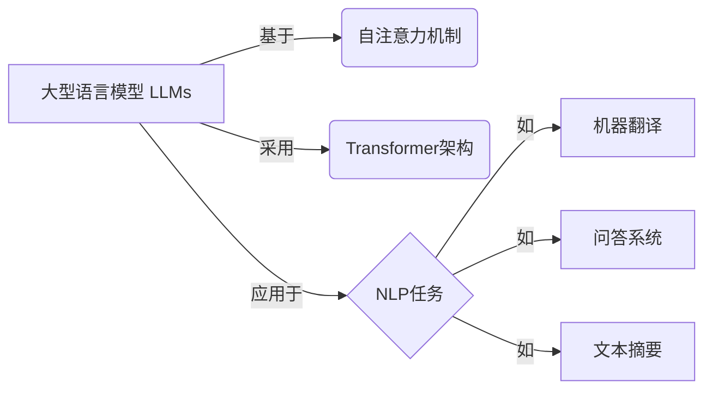
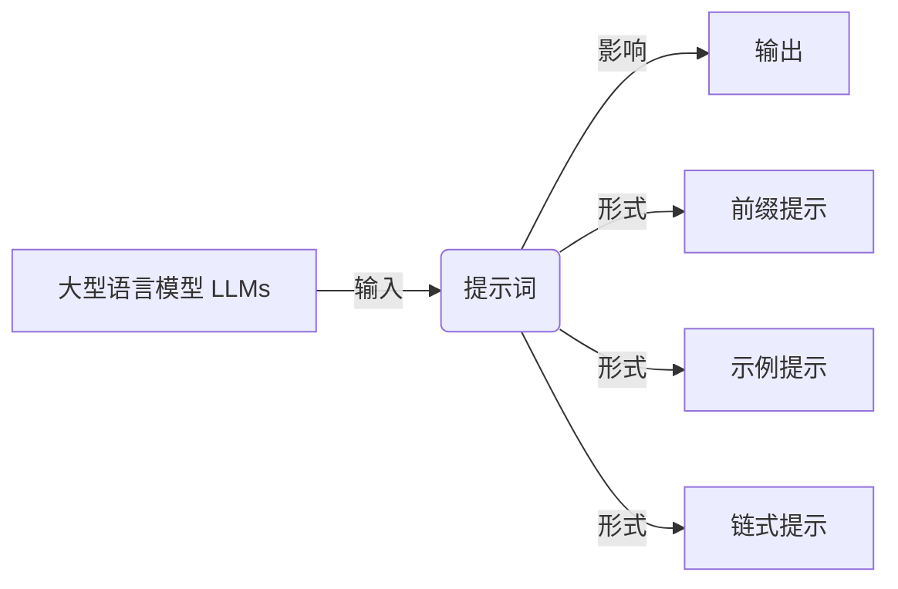
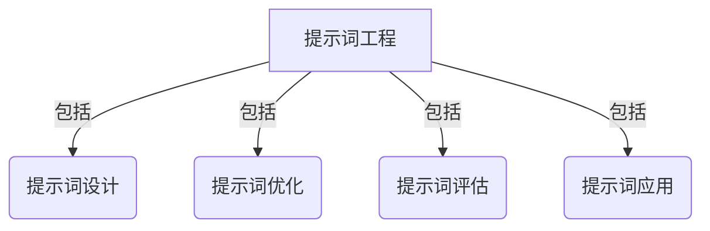
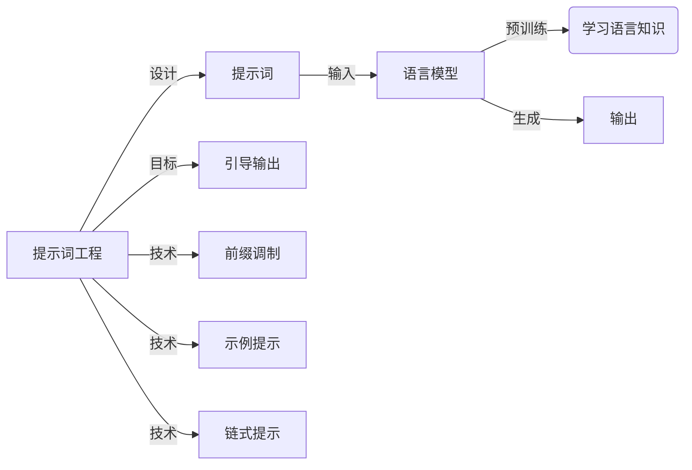
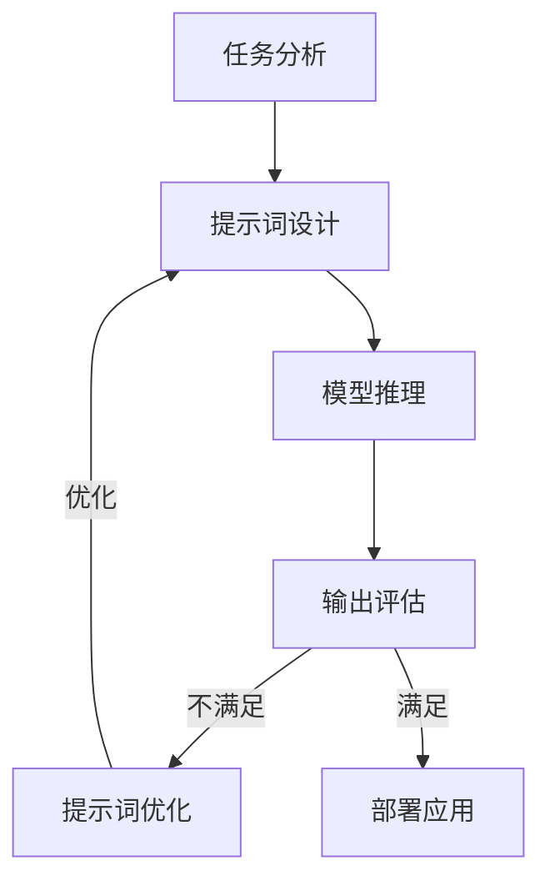

以下是根据要求撰写的技术博客文章正文内容:

# 大语言模型原理与工程实践：提示词的基础要素

## 1. 背景介绍

### 1.1 问题的由来

在过去几年中,大型语言模型(Large Language Models,LLMs)凭借其强大的自然语言理解和生成能力,在自然语言处理(NLP)领域掀起了一场革命。这些模型通过在海量文本数据上进行预训练,学习了丰富的语言知识,并可以应用于广泛的下游任务,如机器翻译、问答系统、文本摘要等。

然而,尽管LLMs展现出了令人印象深刻的性能,但它们在实际应用中仍然面临着一些挑战。其中一个主要挑战是如何有效地控制模型的输出,使其符合特定的需求和约束。这就引出了提示词(Prompts)的概念,它为指导LLMs的输出提供了一种强大的机制。

### 1.2 研究现状

提示词是一段人工构造的文本,用于向LLM提供上下文信息和指令,从而影响其输出。通过精心设计的提示词,我们可以指导模型生成符合预期的文本,包括特定的风格、主题、情感等。近年来,提示词工程(Prompt Engineering)已成为LLM研究和应用的一个热门领域。

研究人员已经提出了多种提示词设计技术,如前缀调制(Prefix Tuning)、示例提示(Few-shot Prompting)、链式提示(Chain-of-Thought Prompting)等。这些技术旨在提高提示词的有效性和可控性,从而增强LLM在各种任务中的表现。

### 1.3 研究意义

提示词工程对于充分发挥LLM的潜力至关重要。通过有效的提示词设计,我们可以:

1. **提高输出质量**: 引导LLM生成更加准确、相关和连贯的文本。
2. **增强可控性**: 确保模型输出符合特定的约束和要求,如风格、主题、情感等。
3. **扩展应用范围**: 将LLM应用于更广泛的领域,如创意写作、代码生成、知识推理等。
4. **提升效率**: 通过精心设计的提示词,减少对大规模微调或重新训练的需求,从而节省计算资源。

因此,深入研究提示词的基础要素对于充分发挥LLM的潜力,并推动其在实际应用中的广泛采用具有重要意义。

### 1.4 本文结构

本文将全面探讨提示词工程的基础要素,包括:

1. 核心概念与联系
2. 核心算法原理与具体操作步骤
3. 数学模型和公式详细讲解与案例分析
4. 项目实践:代码实例和详细解释说明
5. 实际应用场景
6. 工具和资源推荐
7. 总结:未来发展趋势与挑战
8. 附录:常见问题与解答

## 2. 核心概念与联系

在深入探讨提示词工程之前,我们需要先了解一些核心概念及其相互关系。

### 2.1 大型语言模型(LLMs)

大型语言模型(LLMs)是一类基于自然语言的深度学习模型,通过在海量文本数据上进行预训练而获得丰富的语言知识。常见的LLM包括GPT(Generative Pre-trained Transformer)、BERT(Bidirectional Encoder Representations from Transformers)、XLNet等。

这些模型通常采用自注意力机制(Self-Attention Mechanism)和Transformer架构,能够捕捉文本中的长程依赖关系,从而更好地理解和生成自然语言。LLMs在广泛的NLP任务中展现出了出色的性能,如机器翻译、问答系统、文本摘要等。

### 2.2 提示词(Prompts)

提示词是一段人工构造的文本,用于向LLM提供上下文信息和指令,从而影响其输出。通过精心设计的提示词,我们可以指导模型生成符合预期的文本,包括特定的风格、主题、情感等。

提示词可以采用不同的形式,如:

- **前缀提示(Prefix Prompts)**: 在输入文本的开头添加一段提示,指导模型生成特定类型的输出。
- **示例提示(Few-shot Prompts)**: 提供一些示例输入-输出对,让模型学习并生成类似的输出。
- **链式提示(Chain-of-Thought Prompts)**: 引导模型逐步推理并解释其思路,以生成更加可解释的输出。

### 2.3 提示词工程(Prompt Engineering)

提示词工程是一个新兴的研究领域,旨在设计和优化提示词,以最大限度地发挥LLM的潜力。它涉及多个方面,包括:

- **提示词设计**: 构造有效的提示词,以引导模型生成符合预期的输出。
- **提示词优化**: 通过自动化技术或人工调整,改进提示词的性能。
- **提示词评估**: 建立评估标准,衡量提示词的有效性和可控性。
- **提示词应用**: 将优化后的提示词应用于实际场景,解决实际问题。

通过提示词工程,我们可以充分发挥LLM的潜力,提高其在各种NLP任务中的性能和可控性。

## 3. 核心算法原理与具体操作步骤

### 3.1 算法原理概述

提示词工程的核心算法原理是基于语言模型的生成性能。LLM通过在大规模文本数据上进行预训练,学习了丰富的语言知识和模式。当输入一个提示词时,模型会根据提示词和已学习的知识,生成与提示词相关的连续文本。

提示词工程的目标是设计出能够引导模型生成符合预期的输出的提示词。这可以通过多种技术来实现,如前缀调制、示例提示、链式提示等。这些技术利用了不同的策略来构造提示词,从而影响模型的输出。

### 3.2 算法步骤详解

提示词工程的具体算法步骤可以概括为以下几个阶段:

1. **任务分析**: 首先,需要明确目标任务及其要求,包括期望的输出类型、风格、主题等。

2. **提示词设计**: 根据任务要求,构造初始的提示词。这可以采用不同的技术,如前缀提示、示例提示或链式提示。

3. **模型推理**: 将设计好的提示词输入到LLM中,让模型基于提示词生成输出。

4. **输出评估**: 评估模型生成的输出是否符合预期,如果不满足要求,则需要调整提示词。

5. **提示词优化**: 根据评估结果,通过自动化技术或人工调整,优化提示词的设计。

6. **迭代改进**: 重复步骤3-5,直到输出满足要求为止。

7. **部署应用**: 将优化后的提示词应用于实际场景,解决实际问题。

### 3.3 算法优缺点

提示词工程算法具有以下优缺点:

**优点**:

- **灵活性**: 通过构造不同的提示词,可以引导LLM生成各种类型的输出,满足不同的需求。
- **高效性**: 相比于从头训练或微调整个模型,提示词工程通常更加高效,节省计算资源。
- **可解释性**: 一些提示词技术(如链式提示)可以提高模型输出的可解释性。

**缺点**:

- **有限性**: 提示词只能在一定程度上引导模型输出,无法完全控制模型的行为。
- **设计挑战**: 构造有效的提示词需要一定的技巧和经验,存在一定的挑战。
- **评估困难**: 评估提示词的有效性和可控性仍然是一个开放的研究问题。

### 3.4 算法应用领域

提示词工程算法可以应用于各种NLP任务,包括但不限于:

- **文本生成**: 通过提示词引导模型生成特定风格、主题或情感的文本,如创意写作、广告文案等。
- **问答系统**: 设计提示词以获得更加准确和相关的问题回答。
- **代码生成**: 利用提示词指导模型生成特定功能或风格的代码。
- **知识推理**: 通过链式提示等技术,引导模型进行逐步推理和解释。
- **数据增强**: 使用提示词生成额外的训练数据,以提高模型在特定任务上的性能。

## 4. 数学模型和公式详细讲解与举例说明

### 4.1 数学模型构建

提示词工程算法的数学模型基于语言模型的生成过程。让我们考虑一个自回归(Autoregressive)语言模型,它根据给定的上下文(Context)生成连续的标记(Tokens)序列。

给定上下文$C = (c_1, c_2, ..., c_n)$和已生成的标记序列$Y = (y_1, y_2, ..., y_t)$,模型的目标是预测下一个最可能的标记$y_{t+1}$。这可以表示为:

$$P(y_{t+1} | C, Y) = \text{Model}(C, Y)$$

其中,Model表示语言模型的函数。

在提示词工程中,我们将提示词$P$作为模型的额外输入,以影响生成过程。因此,生成概率可以重写为:

$$P(y_{t+1} | C, Y, P) = \text{Model}(C, Y, P)$$

通过优化提示词$P$,我们可以最大化生成所需输出$Y^*$的概率:

$$\max_{P} P(Y^* | C, P) = \max_{P} \prod_{t=1}^{|Y^*|} P(y_t^* | C, y_1^*, ..., y_{t-1}^*, P)$$

这个优化问题通常是非凸的,需要采用启发式或近似算法来求解。

### 4.2 公式推导过程

接下来,我们将推导一种基于前缀调制(Prefix Tuning)的提示词优化方法。

前缀调制的思想是,将提示词$P$表示为一系列连续的虚拟标记$(p_1, p_2, ..., p_m)$,并将其与上下文$C$连接作为模型的输入。因此,生成概率可以重写为:

$$P(y_{t+1} | C, Y, P) = P(y_{t+1} | C \oplus P, Y)$$

其中,$\oplus$表示将提示词前缀与上下文连接的操作。

我们可以定义一个损失函数来衡量生成输出$Y^*$与目标输出$Y^{gt}$之间的差异:

$$\mathcal{L}(P) = -\log P(Y^{gt} | C, P) = -\sum_{t=1}^{|Y^{gt}|} \log P(y_t^{gt} | C, P, y_1^{gt}, ..., y_{t-1}^{gt})