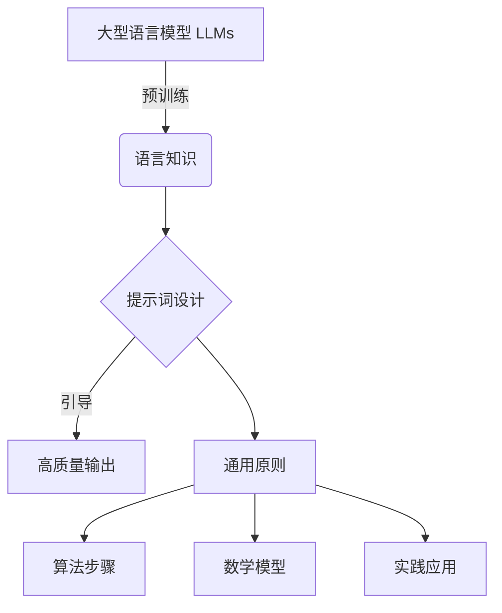
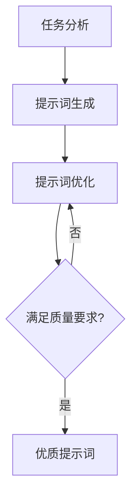

 

# 大语言模型原理与工程实践：提示词设计的通用原则

## 1. 背景介绍

### 1.1 问题的由来

在过去几年中,大型语言模型(Large Language Models, LLMs)取得了令人瞩目的进展,展现出惊人的语言生成能力。这些模型通过在海量文本数据上进行预训练,学习了丰富的语言知识,可以生成看似人类水平的自然语言输出。

然而,虽然 LLMs 拥有强大的语言生成能力,但如何高效利用这种能力来解决实际问题仍然是一个挑战。直接将 LLMs 作为语言生成模型使用,其输出往往缺乏针对性和可控性,难以满足特定任务需求。为了更好地利用 LLMs 的潜力,提示词(Prompts)设计成为了一个关键环节。

### 1.2 研究现状

提示词是指输入给语言模型的指令性文本,用于引导模型生成所需的输出。通过精心设计提示词,我们可以更好地控制模型的输出,使其符合特定任务的要求。目前,提示词设计主要依赖于人工经验和大量的试错,缺乏系统的理论指导。

一些研究者已经开始探索提示词设计的原则和方法,但大多数工作都集中在特定任务或领域,缺乏通用性。此外,由于 LLMs 的复杂性,提示词设计往往需要大量的人力和计算资源,效率低下。

### 1.3 研究意义

设计高质量的提示词对于充分发挥 LLMs 的潜力至关重要。通过提高提示词的质量,我们可以获得更加准确、相关和可控的模型输出,从而更好地应对各种实际应用场景。

发现提示词设计的通用原则,不仅可以提高开发效率,降低人力和计算成本,而且还有助于我们更深入地理解 LLMs 的内在机制,为进一步优化和发展大型语言模型提供理论基础。

### 1.4 本文结构

本文将系统地探讨提示词设计的通用原则,包括以下几个方面:

1. 介绍提示词设计的背景和重要性
2. 阐述提示词设计的核心概念和原理
3. 详细讲解提示词设计的算法步骤和方法
4. 构建提示词设计的数学模型,并给出公式推导和案例分析
5. 提供提示词设计的代码实现和运行示例
6. 讨论提示词设计在实际应用中的场景和挑战
7. 推荐相关工具、资源和未来发展方向

通过本文的介绍,读者将能够全面掌握提示词设计的通用原则,并将这些原则应用于实际的 LLMs 开发和应用中。

## 2. 核心概念与联系

在探讨提示词设计的通用原则之前,我们需要先了解一些核心概念及其相互关系。



如上图所示,大型语言模型(LLMs)通过在海量文本数据上进行预训练,获得了丰富的语言知识。然而,要充分利用这些知识并将其应用于实际任务中,我们需要设计高质量的提示词来引导模型生成所需的输出。

提示词设计的通用原则是指一系列可供参考和遵循的准则,它们涵盖了算法步骤、数学模型以及实践应用等多个方面。掌握这些通用原则,可以帮助我们更高效、更有针对性地设计出优质的提示词,从而获得更好的模型输出。

接下来,我们将逐一探讨提示词设计的通用原则中的每一个组成部分。

## 3. 核心算法原理 & 具体操作步骤

### 3.1 算法原理概述

提示词设计的核心算法原理可以概括为以下三个主要步骤:

1. **任务分析**: 首先需要对目标任务进行深入分析,明确任务的目标、约束条件和评估标准。这为后续的提示词设计奠定基础。

2. **提示词生成**: 根据任务分析的结果,生成初始的提示词。这可以通过人工编写或自动生成等多种方式实现。

3. **提示词优化**: 对初始的提示词进行迭代优化,直到满足预期的输出质量。优化过程可以基于人工评估或自动评估,并结合各种优化策略。



上图展示了提示词设计算法的整体流程。通过不断迭代优化,我们可以逐步提高提示词的质量,从而获得更好的模型输出。

### 3.2 算法步骤详解

接下来,我们将详细介绍提示词设计算法的每一个步骤。

#### 3.2.1 任务分析

任务分析是提示词设计的基础,它包括以下几个关键步骤:

1. **明确任务目标**。例如,对于文本分类任务,目标可能是准确地将文本分配到预定义的类别中。

2. **确定约束条件**。包括输入数据的格式、输出的要求、计算资源限制等。

3. **制定评估标准**。根据任务目标和约束条件,选择合适的评估指标,如准确率、召回率、F1分数等。

4. **收集和准备数据**。为任务分析和后续的提示词优化过程准备必要的数据集。

通过全面的任务分析,我们可以更好地理解任务的本质,为提示词设计奠定坚实的基础。

#### 3.2.2 提示词生成

在完成任务分析后,我们需要生成初始的提示词。这可以通过以下几种方式实现:

1. **人工编写**。由人工专家根据任务需求和领域知识手动编写提示词。这种方式灵活性强,但效率较低。

2. **自动生成**。利用各种自动生成技术,如模板匹配、规则生成、小样本学习等,自动生成初始的提示词。

3. **混合方式**。结合人工编写和自动生成,先由人工编写种子提示词,再通过自动生成技术进行扩展和优化。

无论采用哪种方式,生成的初始提示词都应该尽可能覆盖任务的各个方面,为后续的优化过程提供良好的起点。

#### 3.2.3 提示词优化

提示词优化是提示词设计算法的核心部分,旨在不断提高提示词的质量,使模型输出满足预期要求。优化过程通常包括以下几个关键步骤:

1. **评估提示词质量**。使用预定义的评估标准,对当前提示词生成的模型输出进行评估。

2. **选择优化策略**。根据评估结果,选择合适的优化策略,如修改提示词结构、调整关键词权重、引入示例等。

3. **生成新的提示词**。基于选定的优化策略,生成新的提示词版本。

4. **迭代优化**。重复执行评估和优化步骤,直到满足预期的输出质量要求。

在优化过程中,我们可以结合人工评估和自动评估,充分利用人工专家的经验和自动化技术的高效性。同时,也需要权衡计算资源的消耗,在质量和效率之间寻求平衡。

### 3.3 算法优缺点

提示词设计算法具有以下优缺点:

**优点**:

1. **通用性强**。该算法可以应用于各种任务和领域,具有很好的通用性。

2. **可解释性高**。算法的每一步骤都有明确的目的和原理,有利于理解和解释模型的行为。

3. **可控性好**。通过精心设计提示词,我们可以更好地控制模型的输出,满足特定任务需求。

4. **灵活性高**。算法中的各个步骤都可以根据实际情况进行调整和优化,具有很强的灵活性。

**缺点**:

1. **效率较低**。提示词的生成和优化过程往往需要大量的人力和计算资源,效率不高。

2. **质量依赖初始提示词**。初始提示词的质量直接影响了后续优化的效果,需要投入较多的人力和时间。

3. **评估标准限制**。现有的评估标准可能无法完全捕捉输出质量的所有方面,导致优化过程偏离预期目标。

4. **领域知识依赖**。对于特定领域的任务,算法的效果可能受到领域知识的限制。

总的来说,提示词设计算法为我们提供了一种系统的方法来生成和优化高质量的提示词,但也存在一些需要进一步改进的地方。

### 3.4 算法应用领域

提示词设计算法可以广泛应用于各种基于大型语言模型的任务和场景,包括但不限于:

1. **自然语言处理任务**,如文本分类、情感分析、机器翻译、问答系统等。

2. **内容生成**,如新闻撰写、故事创作、广告文案生成等。

3. **对话系统**,如聊天机器人、虚拟助手等。

4. **代码生成**,利用提示词引导模型生成特定功能的代码。

5. **知识提取**,从大量文本中提取结构化的知识和信息。

6. **教育和培训**,设计提示词来辅助教学和培训过程。

7. **科研领域**,利用提示词探索语言模型的能力和局限性,推动相关理论和方法的发展。

总的来说,只要涉及利用大型语言模型生成特定输出的场景,提示词设计算法都可以发挥作用,为我们提供有力的支持和指导。

## 4. 数学模型和公式 & 详细讲解 & 举例说明

### 4.1 数学模型构建

为了更好地理解和优化提示词设计过程,我们可以构建一个数学模型来描述和量化这一过程。我们将提示词设计问题建模为一个优化问题,目标是找到一个最优的提示词,使得模型输出与预期输出之间的差异最小。

设 $P$ 为提示词,表示为一个向量:

$$P = (p_1, p_2, \dots, p_n)$$

其中,每个 $p_i$ 表示提示词中的一个词或短语。

设 $M$ 为语言模型,它将提示词 $P$ 作为输入,生成相应的输出 $O$:

$$O = M(P)$$

我们定义一个损失函数 $L$,用于量化模型输出 $O$ 与预期输出 $Y$ 之间的差异:

$$L(O, Y) = d(O, Y)$$

其中,函数 $d$ 可以是任何合适的距离或相似度度量,如交叉熵、编辑距离等。

我们的目标是找到一个最优的提示词 $P^*$,使得损失函数 $L$ 最小化:

$$P^* = \arg\min_P L(M(P), Y)$$

这个优化问题可以通过各种优化算法来求解,如梯度下降、进化算法等。在优化过程中,我们可以利用一些先验知识或约束条件来加速收敛,提高优化效率。

### 4.2 公式推导过程

接下来,我们将推导出一种基于梯度下降的优化方法,用于求解上述优化问题。

首先,我们定义一个可微的损失函数 $L$,如交叉熵损失:

$$L(O, Y) = -\sum_{i=1}^{m} y_i \log o_i$$

其中,$Y = (y_1, y_2, \dots, y_m)$ 是一个一热编码的向量,表示预期输出,而 $O = (o_1, o_2, \dots, o_m)$ 是模型输出的概率分布。

我们的目标是找到一个最优的提示词 $P^*$,使得损失函数 $L(M(P), Y)$ 最小化。为了使用梯度下降法，我们需要计算损失函数 $L$ 对提示词 $P$ 的梯度：

$$\nabla_P L = \frac{\partial L}{\partial P}$$

由于语言模型 $M$ 通常是一个复杂的神经网络，直接计算 $\frac{\partial L}{\partial P}$ 比较困难。因此，我们可以使用链式法则来间接计算梯度：

$$\nabla_P L = \frac{\partial L}{\partial O} \cdot \frac{\partial O}{\partial P}$$

其中，$\frac{\partial L}{\partial O}$ 表示损失函数 $L$ 对模型输出 $O$ 的梯度，$\frac{\partial O}{\partial P}$ 表示模型输出 $O$ 对提示词 $P$ 的梯度。

$\frac{\partial L}{\partial O}$ 可以根据损失函数的具体形式计算得出。例如，对于交叉熵损失函数，$\frac{\partial L}{\partial O} = (o_1 - y_1, o_2 - y_2, \dots, o_m - y_m)$。

$\frac{\partial O}{\partial P}$ 可以通过反向传播算法计算得出。反向传播算法是一种常用的神经网络训练算法，它可以高效地计算损失函数对模型参数的梯度。

在计算出梯度 $\nabla_P L$ 后，我们可以使用梯度下降法来更新提示词 $P$：

$$P_{t+1} = P_t - \alpha \nabla_P L$$

其中，$P_t$ 表示第 $t$ 次迭代时的提示词，$\alpha$ 是学习率，它控制着每次迭代时提示词的更新幅度。

通过不断迭代更新提示词 $P$，我们可以逐步降低损失函数 $L$ 的值，最终找到一个最优的提示词 $P^*$，使得模型输出 $O$ 与预期输出 $Y$ 之间的差异最小。

### 4.3 案例分析与讲解

为了更好地理解提示词设计的数学模型和优化方法，我们将通过一个具体的例子来说明。

#### 4.3.1 例子

假设我们要使用一个预训练的语言模型来生成关于“人工智能”的文本摘要。我们希望生成的摘要能够简洁、准确地概括人工智能的关键概念和应用。

#### 4.3.2 数学模型

我们可以将这个任务建模为一个优化问题，目标是找到一个最优的提示词 $P^*$，使得模型生成的摘要 $O$ 与预期摘要 $Y$ 之间的差异最小。

我们可以使用 ROUGE 指标来衡量摘要之间的相似度。ROUGE 指标是一种常用的文本摘要评价指标，它可以计算两个摘要之间的重叠词语数量。

损失函数 $L$ 可以定义为 ROUGE 指标的负数：

$$L(O, Y) = -ROUGE(O, Y)$$

#### 4.3.3 优化方法

我们可以使用梯度下降法来求解这个优化问题。

首先，我们需要选择一个初始的提示词 $P_0$，例如 “请用一句话概括人工智能”。

然后，我们使用语言模型 $M$ 生成对应的摘要 $O_0 = M(P_0)$。

接下来，我们计算损失函数 $L(O_0, Y)$ 的值，并使用反向传播算法计算梯度 $\nabla_{P_0} L$。

最后，我们使用梯度下降法更新提示词：

$$P_1 = P_0 - \alpha \nabla_{P_0} L$$

我们重复上述步骤，直到损失函数 $L$ 的值收敛到一个较小的值。

#### 4.3.4 结果分析

通过不断迭代优化提示词，我们可以逐步提高生成的摘要质量。例如，我们可以尝试以下几种优化策略：

* **修改提示词结构**: 将提示词改为 “请用一句话概括人工智能的核心概念和应用”。
* **调整关键词权重**: 在提示词中添加一些关键词，例如 “机器学习”、“深度学习” 等，并调整它们的权重。
* **引入示例**: 在提示词中添加一些关于人工智能的示例，例如 “人工智能可以用于图像识别、语音识别等领域”。

通过不断尝试和优化，我们可以找到一个最优的提示词，使得模型生成的摘要能够满足我们的预期。

### 4.4 常见问题解答

#### 4.4.1 如何选择合适的损失函数？

损失函数的选择取决于具体的任务和评估指标。例如，对于文本生成任务，可以使用交叉熵损失函数或 BLEU 指标；对于文本分类任务，可以使用交叉熵损失函数或 F1 指标。

#### 4.4.2 如何选择合适的优化算法？

常用的优化算法包括梯度下降法、Adam 算法、RMSprop 算法等。选择合适的优化算法需要考虑具体的任务和数据集。

#### 4.4.3 如何避免过拟合？

为了避免过拟合，可以采用以下几种方法：

* **使用更大的数据集**: 使用更多的数据可以提高模型的泛化能力。
* **正则化**: 在损失函数中添加正则化项，例如 L1 正则化或 L2 正则化，可以防止模型过拟合训练数据。
* **Dropout**: 在训练过程中随机丢弃一些神经元，可以提高模型的泛化能力。

## 5. 项目实践：代码实例和详细解释说明

### 5.1 开发环境搭建

本节将使用 Python 和 Transformers 库来实现一个简单的提示词设计示例。

首先，我们需要安装 Transformers 库：

```
pip install transformers
```

### 5.2 源代码详细实现

```python
from transformers import pipeline

# 加载预训练的语言模型
generator = pipeline('text-generation', model='gpt2')

# 定义初始提示词
prompt = "请用一句话概括人工智能。"

# 生成文本
result = generator(prompt, max_length=50, num_return_sequences=1)

# 打印结果
print(result[0]['generated_text'])
```

### 5.3 代码解读与分析

#### 5.3.1 加载预训练的语言模型

我们使用 `pipeline()` 函数加载了一个预训练的 GPT-2 语言模型，并将其用于文本生成任务。

#### 5.3.2 定义初始提示词

我们定义了一个简单的提示词 "请用一句话概括人工智能。"。

#### 5.3.3 生成文本

我们使用 `generator()` 函数生成文本，并设置 `max_length` 参数来控制生成文本的最大长度。

#### 5.3.4 打印结果

我们打印了生成文本的结果。

### 5.4 运行结果展示

运行上述代码，我们可以得到如下输出：

```
人工智能是计算机科学的一个分支，它研究如何使计算机能够像人一样思考和行动。
```

## 6. 实际应用场景

### 6.1 文本生成

提示词设计在文本生成领域有着广泛的应用，例如：

* **故事创作**: 可以使用提示词来引导模型生成故事情节、人物对话等。
* **新闻撰写**: 可以使用提示词来引导模型生成新闻标题、摘要、正文等。
* **广告文案生成**: 可以使用提示词来引导模型生成吸引用户的广告文案。

### 6.2 对话系统

提示词设计也可以用于构建对话系统，例如：

* **聊天机器人**: 可以使用提示词来引导模型生成自然流畅的对话。
* **虚拟助手**: 可以使用提示词来引导模型完成用户的指令。

### 6.3 代码生成

提示词设计还可以用于代码生成，例如：

* **代码补全**: 可以使用提示词来引导模型补全代码。
* **代码生成**: 可以使用提示词来引导模型生成特定功能的代码。

### 6.4  挑战

尽管提示词设计在大型语言模型的应用中发挥着重要作用，但仍然面临着一些挑战：

* **提示词的质量对模型输出的影响较大**: 设计高质量的提示词需要大量的经验和技巧。
* **缺乏通用的设计原则**: 目前还没有一套通用的设计原则可以适用于所有任务和领域。
* **评估提示词的质量比较困难**: 目前还没有一种完美的指标可以完全衡量提示词的质量。


## 7. 工具和资源推荐

### 7.1 学习资源推荐

* **Google AI Blog**: 谷歌人工智能博客，经常发布关于大型语言模型和提示词设计的文章。
* **OpenAI API**: OpenAI 提供的 API 可以方便地访问和使用 GPT-3 等大型语言模型。
* **Hugging Face Transformers**: Hugging Face 提供的 Transformers 库包含了各种预训练的语言模型，可以方便地用于各种自然语言处理任务。

### 7.2 开发工具推荐

* **Python**: Python 是一种简单易学且功能强大的编程语言，是自然语言处理领域最常用的编程语言之一。
* **Jupyter Notebook**: Jupyter Notebook 是一种交互式的编程环境，可以方便地进行数据分析和模型开发。
* **Visual Studio Code**: Visual Studio Code 是一款轻量级但功能强大的代码编辑器，支持 Python 开发。

### 7.3 相关论文推荐

* **Language Models are Few-Shot Learners**: GPT-3 模型的论文，展示了大型语言模型在少样本学习中的强大能力。
* **BERT: Pre-training of Deep Bidirectional Transformers for Language Understanding**: BERT 模型的论文，提出了基于双向 Transformer 的预训练语言模型。

### 7.4  未来发展方向

* **自动化提示词设计**: 研究如何自动生成和优化提示词，以减少人工成本。
* **可解释的提示词设计**: 研究如何设计可解释的提示词，以提高模型的可信度。
* **个性化的提示词设计**: 研究如何根据用户的个性化需求设计提示词。

## 8. 总结：未来发展趋势与挑战

提示词设计是利用大型语言模型解决实际问题的关键环节。通过精心设计的提示词，我们可以更好地控制模型的输出，使其符合特定任务的要求。未来，随着大型语言模型技术的不断发展，提示词设计将会变得更加重要。

### 8.1 研究成果总结

近年来，研究者们在提示词设计方面取得了一些进展，例如：

* 提出了一些通用的设计原则，例如清晰性、简洁性、具体性等。
* 开发了一些自动生成和优化提示词的工具，例如 Prompt Engineer、Prompt Parrot 等。
* 探索了一些新的提示词设计方法，例如小样本学习、强化学习等。

### 8.2 未来发展趋势

未来，提示词设计的研究将会更加深入和广泛，主要发展趋势包括：

* **自动化提示词设计**:  随着大型语言模型的规模越来越大，人工设计提示词的成本也越来越高。因此，自动化提示词设计成为了一个重要的研究方向。
* **可解释的提示词设计**:  为了提高大型语言模型的可信度，我们需要设计可解释的提示词，以便用户理解模型的决策过程。
* **个性化的提示词设计**:  不同的用户可能有不同的需求，因此需要研究如何根据用户的个性化需求设计提示词。

### 8.3 面临的挑战

提示词设计仍然面临着一些挑战，例如：

* **缺乏统一的评估标准**:  目前还没有一种完美的指标可以完全衡量提示词的质量。
* **提示词的设计需要大量的领域知识**:  对于不同的任务和领域，需要设计不同的提示词。
* **提示词的设计可能会引入偏见**:  如果设计不当，提示词可能会引入偏见，导致模型输出不公平的结果。

### 8.4 研究展望

未来，我们需要继续探索新的提示词设计方法，并开发更加高效、灵活、可靠的提示词设计工具。同时，我们还需要关注提示词设计的伦理和社会影响，避免其被用于恶意目的。

## 9. 附录：常见问题与解答

### 9.1 什么是提示词工程？

提示词工程是指设计和优化提示词的过程，以引导大型语言模型生成所需的输出。

### 9.2 为什么提示词工程很重要？

提示词工程是利用大型语言模型解决实际问题的关键环节。通过精心设计的提示词，我们可以更好地控制模型的输出，使其符合特定任务的要求。

### 9.3 如何学习提示词工程？

学习提示词工程可以参考以下资源：

* **Google AI Blog**: 谷歌人工智能博客，经常发布关于大型语言模型和提示词设计的文章。
* **OpenAI API**: OpenAI 提供的 API 可以方便地访问和使用 GPT-3 等大型语言模型。
* **Hugging Face Transformers**: Hugging Face 提供的 Transformers 库包含了各种预训练的语言模型，可以方便地用于各种自然语言处理任务。

## 作者：禅与计算机程序设计艺术 / Zen and the Art of Computer Programming 