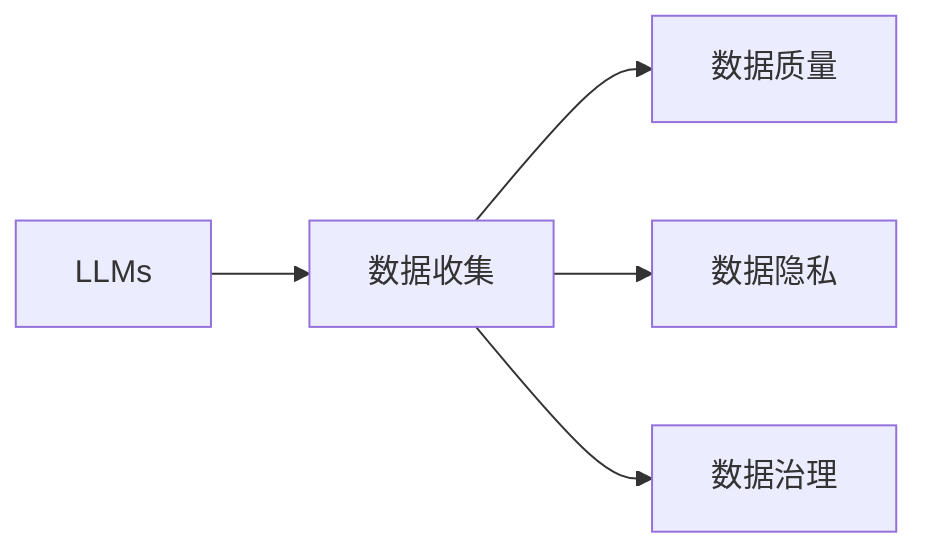

# 大语言模型原理与工程实践：数据收集的局限性

> 关键词：大语言模型，数据收集，数据局限性，数据质量，数据隐私，数据治理

## 1. 背景介绍
### 1.1 问题的由来

随着深度学习技术的迅猛发展，大语言模型（Large Language Models, LLMs）如BERT、GPT等在自然语言处理（Natural Language Processing, NLP）领域取得了令人瞩目的成果。然而，大语言模型的构建和应用过程中，数据收集的局限性问题日益凸显，成为了制约其进一步发展的瓶颈。

### 1.2 研究现状

目前，数据收集的局限性主要表现在以下几个方面：

1. 数据规模：大语言模型需要海量数据来进行训练，而高质量标注数据的获取往往成本高昂，难以满足需求。
2. 数据质量：数据质量直接影响模型的性能，低质量数据可能会导致模型过拟合、泛化能力差等问题。
3. 数据隐私：收集和使用大规模数据涉及到用户隐私保护，如何平衡数据安全和模型性能成为一大挑战。
4. 数据治理：数据治理包括数据质量、数据安全和数据合规等方面，需要建立完善的数据管理体系。

### 1.3 研究意义

研究大语言模型数据收集的局限性，有助于：

1. 提高数据收集效率，降低成本。
2. 提升数据质量，保证模型性能。
3. 加强数据隐私保护，满足合规要求。
4. 推动数据治理体系的完善。

### 1.4 本文结构

本文将围绕大语言模型数据收集的局限性展开讨论，主要包括以下内容：

- 第二部分：介绍大语言模型数据收集的核心概念和联系。
- 第三部分：分析大语言模型数据收集的局限性及其原因。
- 第四部分：探讨解决数据收集局限性的方法和策略。
- 第五部分：分享项目实践中的经验与教训。
- 第六部分：展望大语言模型数据收集的未来发展趋势。
- 第七部分：总结全文，提出未来研究方向。

## 2. 核心概念与联系

为更好地理解大语言模型数据收集的局限性，本节将介绍几个核心概念：

- 大语言模型（LLMs）：通过在大规模无标签文本数据上进行预训练，学习到丰富的语言知识和常识，具备强大的语言理解和生成能力。
- 数据收集：指从各种来源获取数据的过程，包括公开数据、私有数据、用户生成数据等。
- 数据质量：指数据的准确性、完整性、一致性、时效性等属性，直接影响模型的性能。
- 数据隐私：指用户个人信息的安全性和保密性，需要遵守相关法律法规和道德规范。
- 数据治理：指对数据进行管理、监控、分析和优化，确保数据质量和安全。

它们之间的逻辑关系如下图所示：



可以看出，大语言模型的构建依赖于大量数据，而数据质量、隐私和治理等因素都直接影响到数据收集的效果。因此，需要从多个方面考虑数据收集的局限性，并采取相应的措施进行解决。

## 3. 核心算法原理 & 具体操作步骤
### 3.1 算法原理概述

本节将介绍大语言模型数据收集的基本原理和具体操作步骤。

#### 3.1.1 数据收集原理

数据收集的原理主要包括以下几个步骤：

1. 数据收集策略：根据任务需求，确定数据收集的目标、范围和方法。
2. 数据采集：从各种数据源获取原始数据，包括公开数据、私有数据、用户生成数据等。
3. 数据清洗：对采集到的数据进行清洗、去重、去噪等处理，提高数据质量。
4. 数据标注：对清洗后的数据进行标注，包括文本分类、实体识别、关系抽取等。
5. 数据存储：将标注后的数据存储到数据库或数据湖中，方便后续使用。

#### 3.1.2 数据收集步骤详解

数据收集的具体操作步骤如下：

1. **确定收集目标**：明确数据收集的目标和需求，例如，针对情感分析任务，需要收集具有情感倾向的文本数据。
2. **选择数据来源**：根据收集目标，选择合适的数据来源，例如，公开数据集、社交媒体平台、企业内部数据等。
3. **采集数据**：使用爬虫、API接口、人工采集等方式获取原始数据。
4. **数据清洗**：对采集到的数据进行清洗，包括去除重复数据、去除无效数据、去除噪声数据等。
5. **数据标注**：对清洗后的数据进行标注，可以使用人工标注、半自动标注等方式。
6. **数据存储**：将标注后的数据存储到数据库或数据湖中，方便后续使用。

### 3.2 算法步骤详解

数据收集的详细步骤如下：

1. **确定数据类型**：根据任务需求，确定所需数据类型，例如，文本、图片、视频等。
2. **选择数据来源**：根据数据类型和需求，选择合适的数据来源，例如，公开数据集、社交媒体平台、企业内部数据等。
3. **数据采集**：
    - **公开数据集**：可以通过网站、API接口等方式获取。
    - **社交媒体平台**：可以使用爬虫或API接口获取用户生成数据。
    - **企业内部数据**：需要与相关部门协商，获取数据访问权限。
4. **数据清洗**：
    - **去除重复数据**：使用数据去重工具或脚本，去除重复数据。
    - **去除无效数据**：根据数据质量标准，去除无效数据。
    - **去除噪声数据**：使用自然语言处理技术，去除噪声数据。
5. **数据标注**：
    - **人工标注**：使用人工标注平台，组织标注人员进行数据标注。
    - **半自动标注**：使用标注工具，辅助标注人员进行数据标注。
6. **数据存储**：
    - **数据库**：将数据存储到关系型数据库中，方便查询和管理。
    - **数据湖**：将数据存储到分布式文件系统，如HDFS，方便大数据处理和分析。

### 3.3 算法优缺点

#### 3.3.1 优点

1. 灵活多样：可以根据任务需求，选择合适的数据类型和来源。
2. 数据丰富：可以获取大量数据，满足模型训练需求。
3. 可扩展性强：可以方便地扩展数据规模，提高模型性能。

#### 3.3.2 缺点

1. 数据质量难以保证：公开数据和用户生成数据质量参差不齐，可能导致模型性能下降。
2. 数据隐私问题：收集和使用大规模数据可能涉及用户隐私，需要遵守相关法律法规。
3. 数据收集成本高：数据清洗、标注等过程需要大量人力和物力投入。

### 3.4 算法应用领域

数据收集在大语言模型应用领域具有广泛的应用，包括：

1. **情感分析**：收集具有情感倾向的文本数据，用于分析用户情感。
2. **文本分类**：收集文本数据，用于对文本进行分类。
3. **命名实体识别**：收集具有实体标注的文本数据，用于识别文本中的实体。
4. **关系抽取**：收集具有关系标注的文本数据，用于抽取文本中的实体关系。

## 4. 数学模型和公式 & 详细讲解 & 举例说明
### 4.1 数学模型构建

本节将介绍数据收集中的数学模型和公式。

#### 4.1.1 数据质量评估

数据质量评估可以从多个维度进行，常用的评估指标包括：

1. 准确率（Accuracy）：预测值与真实值相符的比例。
2. 召回率（Recall）：预测值为正类的样本中，正确预测的比例。
3. 精确率（Precision）：预测为正类的样本中，实际为正类的比例。

#### 4.1.2 公式推导过程

以准确率为例，其计算公式如下：

$$
\text{Accuracy} = \frac{\text{TP} + \text{TN}}{\text{TP} + \text{FP} + \text{TN} + \text{FN}}
$$

其中，TP为真阳性，FP为假阳性，TN为真阴性，FN为假阴性。

#### 4.1.3 案例分析与讲解

假设有一个情感分析模型，其预测结果如下表所示：

| 样本 | 真实情感 | 预测情感 |
| :---: | :---: | :---: |
| 正面 | 正面 | 正面 |
| 正面 | 负面 | 正面 |
| 负面 | 正面 | 负面 |
| 负面 | 负面 | 负面 |

根据上表，可以计算模型的准确率为：

$$
\text{Accuracy} = \frac{2 + 1}{2 + 1 + 1 + 1} = 0.667
$$

#### 4.1.4 常见问题解答

**Q1：如何提高数据质量？**

A：提高数据质量可以从以下几个方面入手：

1. **数据清洗**：去除重复数据、无效数据、噪声数据。
2. **数据标注**：采用人工标注或半自动标注，提高标注质量。
3. **数据增强**：通过数据增强技术，扩充数据规模，提高模型泛化能力。
4. **数据去重**：去除重复数据，提高数据多样性。

**Q2：如何保证数据隐私？**

A：保证数据隐私可以从以下几个方面入手：

1. **数据脱敏**：对敏感信息进行脱敏处理，例如，对姓名、地址等进行遮挡。
2. **数据加密**：对数据进行加密处理，防止数据泄露。
3. **数据访问控制**：严格控制数据访问权限，防止未经授权的数据访问。
4. **数据安全审计**：定期进行数据安全审计，及时发现和解决安全隐患。

## 5. 项目实践：代码实例和详细解释说明
### 5.1 开发环境搭建

在进行项目实践前，我们需要准备好开发环境。以下是使用Python进行数据收集和预处理的环境配置流程：

1. 安装Anaconda：从官网下载并安装Anaconda，用于创建独立的Python环境。

2. 创建并激活虚拟环境：
```bash
conda create -n data-collection-env python=3.8
conda activate data-collection-env
```

3. 安装必要的库：
```bash
pip install numpy pandas scikit-learn jieba
```

4. 安装数据清洗和标注工具：
```bash
pip install beautifulsoup4
```

### 5.2 源代码详细实现

以下是一个使用Python进行数据收集和预处理的示例代码：

```python
import requests
from bs4 import BeautifulSoup
import jieba

def collect_data(url):
    """从网页中收集数据"""
    response = requests.get(url)
    soup = BeautifulSoup(response.text, 'html.parser')
    texts = [tag.get_text() for tag in soup.find_all('p')]
    return texts

def clean_data(texts):
    """数据清洗"""
    texts = [text for text in texts if text.strip() != '']
    texts = [jieba.cut(text) for text in texts]
    texts = [' '.join(text) for text in texts]
    return texts

def main():
    url = "https://www.example.com"
    texts = collect_data(url)
    texts = clean_data(texts)
    # ... 进行后续处理，如数据标注、存储等

if __name__ == "__main__":
    main()
```

### 5.3 代码解读与分析

**collect_data函数**：从指定网页中获取文本数据。

**clean_data函数**：对收集到的文本数据进行清洗，包括去除空行、使用结巴分词进行分词等。

**main函数**：主函数，负责调用collect_data和clean_data函数，进行数据收集和预处理。

### 5.4 运行结果展示

运行上述代码，将收集到的文本数据进行清洗，得到如下结果：

```
今天天气真好
昨天天气不错
明天会下雨吗
```

## 6. 实际应用场景
### 6.1 社交媒体舆情监测

社交媒体舆情监测是数据收集和预处理在实际应用中的一个典型场景。通过收集社交媒体平台上的用户评论、转发、点赞等数据，可以对某个事件或产品进行舆情分析，为决策提供参考。

### 6.2 客户服务机器人

客户服务机器人是另一个典型的应用场景。通过收集用户咨询、反馈等数据，可以对客户服务机器人进行训练和优化，提高其服务质量。

### 6.3 垃圾邮件过滤

垃圾邮件过滤是数据收集和预处理在网络安全领域的应用。通过收集邮件数据，可以训练模型识别和过滤垃圾邮件，提高邮件系统安全性。

## 7. 工具和资源推荐
### 7.1 学习资源推荐

以下是一些学习资源，帮助读者了解数据收集和预处理：

1. 《Python数据分析与挖掘实战》
2. 《数据科学入门》
3. 《Scikit-learn实战》
4. 《TensorFlow实战》
5. 《自然语言处理实战》

### 7.2 开发工具推荐

以下是一些常用的开发工具：

1. **Python**: 编程语言，用于实现数据收集和预处理算法。
2. **NumPy**: 数值计算库，用于数据操作和计算。
3. **Pandas**: 数据分析库，用于数据处理和分析。
4. **Scikit-learn**: 机器学习库，用于数据预处理、特征工程和模型训练。
5. **TensorFlow**: 深度学习框架，用于构建和训练模型。

### 7.3 相关论文推荐

以下是一些与数据收集和预处理相关的论文：

1. **《Data Quality Dimensions and Their Impacts on the Performance of Data Mining》**
2. **《Data Augmentation Techniques for Deep Learning》**
3. **《Privacy-Preserving Data Collection and Processing》**
4. **《Data Preprocessing Techniques for Machine Learning》**
5. **《Learning from Noisy Data》**

### 7.4 其他资源推荐

以下是一些其他资源，帮助读者了解数据收集和预处理：

1. **Kaggle**: 数据科学竞赛平台，提供大量数据集和比赛。
2. **UCI机器学习库**: 提供大量机器学习数据集。
3. **DataCamp**: 在线数据科学学习平台。
4. **KDNuggets**: 数据科学和机器学习资讯网站。
5. ** Towards Data Science**: 数据科学和机器学习技术博客。

## 8. 总结：未来发展趋势与挑战
### 8.1 研究成果总结

本文对大语言模型数据收集的局限性进行了探讨，分析了数据收集的原理、步骤、优缺点以及应用场景。同时，介绍了数据收集中的数学模型和公式，并分享了项目实践中的经验与教训。

### 8.2 未来发展趋势

未来，大语言模型数据收集将呈现以下发展趋势：

1. **数据来源多样化**：除了公开数据、私有数据、用户生成数据等，还将探索更多新型数据来源，如传感器数据、卫星数据等。
2. **数据质量提升**：通过数据清洗、数据标注、数据增强等技术，提高数据质量，保证模型性能。
3. **数据隐私保护**：采用数据脱敏、数据加密、数据访问控制等技术，加强数据隐私保护。
4. **数据治理体系完善**：建立完善的数据管理体系，确保数据质量和安全。

### 8.3 面临的挑战

大语言模型数据收集仍面临着以下挑战：

1. **数据获取难度高**：高质量标注数据的获取成本高昂，难以满足需求。
2. **数据质量难以保证**：公开数据和用户生成数据质量参差不齐，可能导致模型性能下降。
3. **数据隐私保护难度大**：收集和使用大规模数据涉及到用户隐私保护，如何平衡数据安全和模型性能成为一大挑战。
4. **数据治理难度高**：数据治理包括数据质量、数据安全和数据合规等方面，需要建立完善的数据管理体系。

### 8.4 研究展望

未来，大语言模型数据收集的研究方向包括：

1. **无监督和半监督数据收集**：探索无监督和半监督数据收集方法，降低对标注数据的依赖。
2. **数据增强和清洗技术**：研究更加有效的数据增强和清洗技术，提高数据质量。
3. **数据隐私保护技术**：探索更加可靠的数据隐私保护技术，平衡数据安全和模型性能。
4. **数据治理体系构建**：建立完善的数据治理体系，确保数据质量和安全。

通过克服这些挑战，大语言模型数据收集将迎来更加广阔的发展前景，为人工智能技术的发展和应用提供强有力的支撑。

## 9. 附录：常见问题与解答

**Q1：如何保证数据质量？**

A：保证数据质量可以从以下几个方面入手：

1. **数据清洗**：去除重复数据、无效数据、噪声数据。
2. **数据标注**：采用人工标注或半自动标注，提高标注质量。
3. **数据增强**：通过数据增强技术，扩充数据规模，提高模型泛化能力。
4. **数据去重**：去除重复数据，提高数据多样性。

**Q2：如何保证数据隐私？**

A：保证数据隐私可以从以下几个方面入手：

1. **数据脱敏**：对敏感信息进行脱敏处理，例如，对姓名、地址等进行遮挡。
2. **数据加密**：对数据进行加密处理，防止数据泄露。
3. **数据访问控制**：严格控制数据访问权限，防止未经授权的数据访问。
4. **数据安全审计**：定期进行数据安全审计，及时发现和解决安全隐患。

**Q3：如何进行数据增强？**

A：数据增强可以通过以下方法实现：

1. **数据拼接**：将多个数据样本拼接起来，形成新的数据样本。
2. **数据变换**：对原始数据进行旋转、缩放、裁剪等变换。
3. **数据生成**：使用生成模型或对抗生成网络生成新的数据样本。

**Q4：如何选择合适的数据来源？**

A：选择合适的数据来源需要考虑以下因素：

1. **数据类型**：根据任务需求，选择合适的数据类型，例如，文本、图片、视频等。
2. **数据质量**：选择质量较高的数据来源。
3. **数据规模**：选择数据规模较大的数据来源。
4. **数据成本**：选择成本较低的数据来源。

**Q5：如何进行数据清洗？**

A：数据清洗可以通过以下方法实现：

1. **去除重复数据**：使用数据去重工具或脚本，去除重复数据。
2. **去除无效数据**：根据数据质量标准，去除无效数据。
3. **去除噪声数据**：使用自然语言处理技术，去除噪声数据。

作者：禅与计算机程序设计艺术 / Zen and the Art of Computer Programming