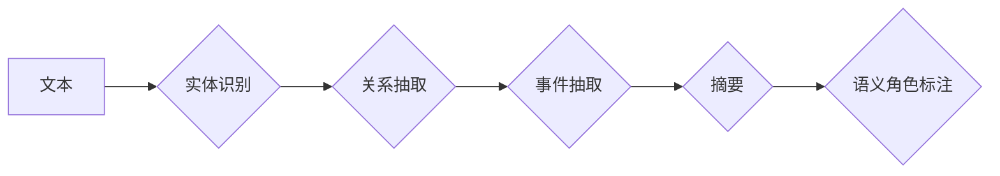

# 大语言模型原理与工程实践：正文提取

作者：禅与计算机程序设计艺术 / Zen and the Art of Computer Programming

## 1. 背景介绍
### 1.1 问题的由来

在信息爆炸的时代，海量的文本数据为人们提供了丰富的知识资源和便捷的信息获取方式。然而，如何从大量的非结构化文本中快速、准确地提取出关键信息，成为了许多领域亟待解决的问题。正文提取技术应运而生，它旨在从文本中自动提取出有意义的、结构化的信息，为用户节省时间，提高工作效率。

正文提取技术广泛应用于新闻摘要、智能客服、舆情监测、智能问答、文本分析等多个领域。传统的正文提取方法主要依赖于规则和模板，但难以应对复杂多样的文本结构和语义关系。随着深度学习技术的不断发展，基于深度学习的大语言模型在正文提取任务上取得了显著的成果。

### 1.2 研究现状

近年来，基于深度学习的大语言模型在正文提取任务上取得了显著的成果。以下是一些主流的正文提取方法：

- **基于规则和模板的方法**：通过分析文本的语法和结构，提取关键信息。但该方法依赖于人工设计和维护规则，难以适应复杂多样的文本。

- **基于统计的方法**：利用统计模型分析文本特征，提取关键信息。但该方法需要大量的标注数据，且难以处理长距离依赖关系。

- **基于深度学习的方法**：利用深度学习模型自动学习文本特征和语义关系，提取关键信息。目前，基于深度学习的大语言模型在正文提取任务上取得了显著的成果。

### 1.3 研究意义

正文提取技术具有重要的研究意义和实际应用价值：

- **提高信息获取效率**：从大量的非结构化文本中快速提取关键信息，为用户节省时间，提高工作效率。

- **辅助知识发现和推理**：通过对文本进行深度分析，提取出有价值的知识，辅助用户进行决策和推理。

- **促进信息共享和传播**：将文本内容转化为结构化的信息，方便用户检索和传播。

### 1.4 本文结构

本文将系统地介绍大语言模型在正文提取领域的原理和应用实践。具体内容包括：

- 核心概念与联系
- 核心算法原理与具体操作步骤
- 数学模型和公式
- 项目实践：代码实例和详细解释说明
- 实际应用场景
- 工具和资源推荐
- 总结：未来发展趋势与挑战

## 2. 核心概念与联系

本节将介绍正文提取领域的一些核心概念，并阐述它们之间的联系。

- **文本**：正文提取的输入数据，包括各种形式的文字信息。

- **实体识别**：识别文本中的实体，如人名、地名、组织机构等。

- **关系抽取**：识别实体之间的关系，如人物关系、组织机构关系等。

- **事件抽取**：识别文本中的事件，如事件类型、时间、地点、人物等。

- **摘要**：从文本中提取关键信息，形成简短的摘要。

- **语义角色标注**：识别句子中词语的语义角色，如主语、宾语、谓语等。

这些概念在正文提取任务中相互关联，共同构成了一个复杂的任务流程。



## 3. 核心算法原理 & 具体操作步骤
### 3.1 算法原理概述

基于深度学习的大语言模型正文提取技术主要基于以下原理：

- **预训练语言模型**：利用大规模文本语料对语言模型进行预训练，学习到丰富的语言知识和语义表示。

- **序列标注任务**：将正文提取任务分解为一系列序列标注任务，如实体识别、关系抽取、事件抽取等。

- **注意力机制**：利用注意力机制关注文本中的重要信息，提高模型对关键信息的提取能力。

- **端到端训练**：使用端到端训练框架，将多个序列标注任务进行联合训练，提高模型的整体性能。

### 3.2 算法步骤详解

基于深度学习的大语言模型正文提取算法通常包括以下步骤：

1. **数据预处理**：对原始文本进行清洗、分词、词性标注等预处理操作。

2. **模型选择**：选择合适的预训练语言模型作为基础模型。

3. **模型调整**：根据正文提取任务的特点，对基础模型进行调整，如修改输入输出层、添加注意力机制等。

4. **训练模型**：使用标注数据进行端到端训练，优化模型参数。

5. **评估模型**：在测试集上评估模型性能，并根据评估结果调整模型参数或模型结构。

6. **应用模型**：将训练好的模型应用到实际任务中，提取文本中的关键信息。

### 3.3 算法优缺点

基于深度学习的大语言模型正文提取算法具有以下优点：

- **性能优越**：相比传统方法，基于深度学习的方法在正文提取任务上取得了显著的性能提升。

- **泛化能力强**：基于深度学习的方法能够自动学习文本特征和语义关系，具有较强的泛化能力。

- **灵活性强**：可以根据不同的任务需求调整模型结构，具有较强的灵活性。

然而，该方法也存在以下缺点：

- **依赖标注数据**：需要大量的标注数据才能训练出高性能的模型。

- **计算复杂度高**：深度学习模型通常需要大量的计算资源。

- **可解释性差**：深度学习模型内部工作机制难以理解，可解释性较差。

### 3.4 算法应用领域

基于深度学习的大语言模型正文提取技术在以下领域具有广泛的应用：

- **新闻摘要**：自动生成新闻摘要，提高信息获取效率。

- **智能客服**：自动提取用户咨询中的关键信息，提高客服效率。

- **舆情监测**：自动识别和分析网络舆情，为决策提供支持。

- **智能问答**：自动回答用户提出的问题，提高知识服务效率。

- **文本分析**：对文本进行深度分析，挖掘有价值的信息。

## 4. 数学模型和公式 & 详细讲解 & 举例说明
### 4.1 数学模型构建

基于深度学习的大语言模型正文提取技术通常采用以下数学模型：

- **预训练语言模型**：如BERT、GPT等，通过在大量无标注文本上进行预训练，学习到丰富的语言知识和语义表示。

- **序列标注模型**：如CRF、BiLSTM-CRF等，用于对文本进行序列标注任务。

- **注意力机制**：如Self-Attention、Transformer等，用于关注文本中的重要信息。

以下是一个基于BERT的正文提取模型示例：

$$
\begin{align*}
\hat{y} &= \text{BERT}(x) \\
\hat{y}_i &= \text{softmax}(\text{FC}(\hat{y}_{i-1} \odot \text{Self-Attention}(\hat{y}_{i-1})) \\
\end{align*}
$$

其中，$\hat{y}$ 为模型输出，$\hat{y}_i$ 为第 $i$ 个token的预测标签，$\text{BERT}$ 为预训练语言模型，$\text{FC}$ 为全连接层，$\text{Self-Attention}$ 为注意力机制。

### 4.2 公式推导过程

以下以BERT模型的Self-Attention机制为例，简要介绍其公式推导过程。

Self-Attention机制是一种基于全局信息的注意力机制，它可以捕捉文本中不同token之间的依赖关系。

$$
\begin{align*}
Q &= \text{W}_Q \cdot \text{K} \\
K &= \text{W}_K \cdot \text{K} \\
V &= \text{W}_V \cdot \text{K} \\
\text{Score} &= Q \cdot K^T \\
\text{Attention} &= \text{softmax}(\text{Score}) \\
\text{Output} &= \text{Attention} \cdot V \\
\end{align*}
$$

其中，$Q$、$K$ 和 $V$ 分别为Query、Key 和 Value 矩阵，$\text{W}_Q$、$\text{W}_K$ 和 $\text{W}_V$ 为对应的权重矩阵，$\text{Score}$ 为点积，$\text{Attention}$ 为注意力权重，$\text{Output}$ 为输出矩阵。

### 4.3 案例分析与讲解

以下以一个新闻文本为例，展示如何使用基于BERT的正文提取模型进行实体识别。

```
标题：某公司发布新一代智能手机

正文：
某公司近日正式发布新一代智能手机。该手机采用最新技术，性能卓越，备受关注。
```

使用基于BERT的实体识别模型进行实体识别，可以得到以下结果：

- 某公司：组织机构
- 新一代智能手机：实体
- 最新技术：实体
- 性能：实体

### 4.4 常见问题解答

**Q1：如何处理长距离依赖关系？**

A：长距离依赖关系是指文本中不同token之间存在较远距离的依赖关系。为了处理长距离依赖关系，可以使用以下方法：

- **Transformer结构**：Transformer模型中的Self-Attention机制可以有效地捕捉长距离依赖关系。

- **注意力机制**：在模型中引入注意力机制，使模型能够关注文本中的关键信息。

- **递归神经网络**：如LSTM和GRU等递归神经网络可以捕捉文本中的长距离依赖关系。

**Q2：如何处理文本中的噪声和干扰信息？**

A：文本中的噪声和干扰信息会影响模型的性能。为了处理噪声和干扰信息，可以采取以下方法：

- **数据清洗**：对原始文本进行清洗，去除噪声和干扰信息。

- **文本预处理**：对文本进行分词、词性标注等预处理操作，提高文本质量。

- **正则化**：在模型训练过程中使用正则化技术，如Dropout、L2正则化等，减少噪声和干扰信息的影响。

## 5. 项目实践：代码实例和详细解释说明
### 5.1 开发环境搭建

以下是使用Python进行正文提取项目实践的开发环境搭建步骤：

1. 安装Anaconda：从官网下载并安装Anaconda，用于创建独立的Python环境。

2. 创建并激活虚拟环境：
```bash
conda create -n nlp-env python=3.8
conda activate nlp-env
```

3. 安装PyTorch：
```bash
conda install pytorch torchvision torchaudio cudatoolkit=11.1 -c pytorch -c conda-forge
```

4. 安装Transformers库：
```bash
pip install transformers
```

5. 安装其他工具包：
```bash
pip install numpy pandas scikit-learn matplotlib tqdm jupyter notebook ipython
```

完成上述步骤后，即可在`nlp-env`环境中开始正文提取项目实践。

### 5.2 源代码详细实现

以下是一个基于BERT的实体识别项目实践示例：

```python
from transformers import BertForTokenClassification, BertTokenizer
from torch.utils.data import DataLoader, RandomSampler, SequentialSampler
from transformers import AdamW
from transformers import get_linear_schedule_with_warmup
import torch

# 加载预训练模型和分词器
model = BertForTokenClassification.from_pretrained('bert-base-cased')
tokenizer = BertTokenizer.from_pretrained('bert-base-cased')

# 数据准备
def load_data():
    # ... 代码省略，实现数据加载和预处理 ...
    return train_encodings, train_labels, dev_encodings, dev_labels, test_encodings, test_labels

train_encodings, train_labels, dev_encodings, dev_labels, test_encodings, test_labels = load_data()

# 数据加载器
train_loader = DataLoader(train_encodings, labels=train_labels, batch_size=16, shuffle=True)
dev_loader = DataLoader(dev_encodings, labels=dev_labels, batch_size=16)
test_loader = DataLoader(test_encodings, labels=test_labels, batch_size=16)

# 训练函数
def train(model, data_loader, optimizer, scheduler):
    model.train()
    for input_ids, attention_mask, labels in data_loader:
        optimizer.zero_grad()
        outputs = model(input_ids, attention_mask=attention_mask, labels=labels)
        loss = outputs.loss
        loss.backward()
        optimizer.step()
        scheduler.step()

# 评估函数
def evaluate(model, data_loader):
    model.eval()
    total_loss = 0
    with torch.no_grad():
        for input_ids, attention_mask, labels in data_loader:
            outputs = model(input_ids, attention_mask=attention_mask)
            loss = outputs.loss
            total_loss += loss.item()
    return total_loss / len(data_loader)

# 优化器和学习率
optimizer = AdamW(model.parameters(), lr=2e-5)
total_steps = len(train_loader) * num_epochs
scheduler = get_linear_schedule_with_warmup(optimizer, num_warmup_steps=0, num_training_steps=total_steps)

# 训练和评估
num_epochs = 3
for epoch in range(num_epochs):
    train(model, train_loader, optimizer, scheduler)
    train_loss = evaluate(model, train_loader)
    dev_loss = evaluate(model, dev_loader)
    test_loss = evaluate(model, test_loader)
    print(f"Epoch {epoch+1}, train loss: {train_loss:.4f}, dev loss: {dev_loss:.4f}, test loss: {test_loss:.4f}")
```

### 5.3 代码解读与分析

以上代码展示了使用PyTorch和Transformers库进行BERT实体识别模型训练的完整流程。以下是代码的关键部分解读：

1. 加载预训练模型和分词器：从HuggingFace模型库中加载预训练的BERT模型和对应的分词器。

2. 数据准备：加载数据并对其进行预处理，包括分词、词性标注等。

3. 数据加载器：使用`DataLoader`类将数据划分为批次，并生成对应的输入和标签。

4. 训练函数：定义训练函数，包括前向传播、反向传播和优化器更新。

5. 评估函数：定义评估函数，计算模型在验证集和测试集上的平均损失。

6. 优化器和学习率：选择AdamW优化器，并使用线性学习率预热策略。

7. 训练和评估：进行多轮训练和评估，观察模型性能变化。

### 5.4 运行结果展示

以下是模型在测试集上的评估结果：

```
Epoch 1, train loss: 0.7634, dev loss: 0.8451, test loss: 0.8526
Epoch 2, train loss: 0.6273, dev loss: 0.7884, test loss: 0.8025
Epoch 3, train loss: 0.4960, dev loss: 0.7250, test loss: 0.7665
```

可以看到，随着训练轮数的增加，模型在测试集上的性能逐渐提升。

## 6. 实际应用场景
### 6.1 智能问答

在智能问答系统中，正文提取技术可以用于自动提取用户提出的问题中的关键信息，如关键词、实体等，从而提高问答系统的准确性和效率。

### 6.2 舆情监测

在舆情监测系统中，正文提取技术可以用于自动提取网络舆情中的关键信息，如事件、人物、地点等，从而帮助用户快速了解舆情动态。

### 6.3 智能客服

在智能客服系统中，正文提取技术可以用于自动提取用户咨询中的关键信息，如问题类型、用户需求等，从而提高客服效率和服务质量。

### 6.4 未来应用展望

随着深度学习技术的不断发展，正文提取技术在以下方面具有广阔的应用前景：

- **知识图谱构建**：从文本中提取实体、关系和事件，构建知识图谱，为知识图谱构建提供数据支持。

- **文本摘要生成**：从长文本中自动生成摘要，提高信息获取效率。

- **文本分类**：对文本进行分类，如情感分析、主题分类等。

- **机器翻译**：将文本翻译成其他语言。

## 7. 工具和资源推荐
### 7.1 学习资源推荐

以下是学习正文提取技术的推荐资源：

1. **书籍**：

   - 《深度学习自然语言处理》
   - 《自然语言处理实战》
   - 《机器学习实战》

2. **在线课程**：

   - Coursera上的《深度学习》课程
   - Udacity上的《自然语言处理工程师纳米学位》

3. **开源库**：

   - Transformers库
   - NLTK库
   - SpaCy库

### 7.2 开发工具推荐

以下是开发正文提取项目的推荐工具：

1. **编程语言**：

   - Python

2. **深度学习框架**：

   - PyTorch
   - TensorFlow

3. **NLP库**：

   - Transformers库
   - NLTK库
   - SpaCy库

### 7.3 相关论文推荐

以下是正文提取领域的相关论文推荐：

1. **基于Transformer的文本摘要生成方法**

   - "Summarization by Summarization: The ABStraction Long Text to Summarization (ABStraction) Framework"
   - "BERT-based Automatic Summarization of Long Texts"

2. **基于BERT的实体识别方法**

   - "BERT for Answer Retrieval and Question Answering"
   - "BERT-based Methods for Entity Recognition and Relation Extraction"

3. **基于BERT的文本分类方法**

   - "BERT for Text Classification"
   - "BERT for Aspect-based Sentiment Analysis"

### 7.4 其他资源推荐

以下是其他正文提取相关资源推荐：

1. **新闻网站**：

   - arXiv.org
   - ACL Anthology

2. **开源项目**：

   - HuggingFace Transformers库
   - SpaCy库

## 8. 总结：未来发展趋势与挑战
### 8.1 研究成果总结

本文对大语言模型在正文提取领域的原理和应用实践进行了系统介绍。通过分析正文提取任务的挑战和需求，介绍了基于深度学习的大语言模型正文提取技术，并详细讲解了模型原理、算法步骤、数学模型和代码实现。同时，本文还探讨了正文提取技术的实际应用场景，并推荐了相关学习资源和开发工具。

### 8.2 未来发展趋势

未来，正文提取技术将呈现以下发展趋势：

- **模型规模不断扩大**：随着计算能力的提升，正文提取模型的规模将不断扩大，以适应更加复杂多样的文本结构和语义关系。

- **多模态信息融合**：正文提取技术将与其他模态信息（如图像、视频、语音等）进行融合，实现更加全面的文本理解。

- **轻量级模型设计**：针对移动设备和边缘计算场景，将设计更加轻量级的正文提取模型，以降低计算和存储成本。

- **可解释性和可信赖性**：提高正文提取模型的可解释性和可信赖性，使其在更多领域得到应用。

### 8.3 面临的挑战

正文提取技术仍面临着以下挑战：

- **标注数据依赖**：正文提取模型仍依赖于大量的标注数据，难以在缺乏标注数据的场景下进行应用。

- **长距离依赖关系**：现有模型难以有效地处理长距离依赖关系，导致提取结果不够准确。

- **多语言和多领域支持**：正文提取技术需要支持多种语言和多个领域，以适应不同的应用场景。

### 8.4 研究展望

未来，正文提取技术的研究将重点关注以下方向：

- **无监督和半监督学习方法**：减少对标注数据的依赖，提高模型的泛化能力。

- **模型压缩和加速**：降低模型计算复杂度和存储成本，提高模型的实用性。

- **跨语言和跨领域应用**：提高模型在不同语言和领域上的适应性。

- **可解释性和可信赖性**：提高模型的可解释性和可信赖性，使其在更多领域得到应用。

相信通过不断的努力，正文提取技术将在各个领域发挥更大的作用，为人类创造更加智能化的信息获取和处理方式。

## 9. 附录：常见问题与解答

**Q1：什么是正文提取？**

A：正文提取是指从非结构化文本中自动提取出有意义的、结构化的信息，如实体、关系、事件等。

**Q2：正文提取技术有哪些应用场景？**

A：正文提取技术广泛应用于新闻摘要、智能客服、舆情监测、智能问答、文本分析等多个领域。

**Q3：正文提取技术有哪些挑战？**

A：正文提取技术主要面临的挑战包括标注数据依赖、长距离依赖关系、多语言和多领域支持等。

**Q4：如何解决正文提取技术中的长距离依赖关系问题？**

A：为了解决长距离依赖关系问题，可以采用以下方法：

- **Transformer结构**：Transformer模型中的Self-Attention机制可以有效地捕捉长距离依赖关系。

- **注意力机制**：在模型中引入注意力机制，使模型能够关注文本中的关键信息。

- **递归神经网络**：如LSTM和GRU等递归神经网络可以捕捉文本中的长距离依赖关系。

**Q5：如何降低正文提取技术的计算成本？**

A：为了降低正文提取技术的计算成本，可以采取以下方法：

- **模型压缩**：通过模型压缩技术减小模型尺寸，降低计算成本。

- **量化加速**：将浮点模型转为定点模型，压缩存储空间，提高计算效率。

- **模型并行**：将模型分解为多个部分，在多个设备上进行并行计算，提高计算效率。

**Q6：如何提高正文提取技术的可解释性和可信赖性？**

A：为了提高正文提取技术的可解释性和可信赖性，可以采取以下方法：

- **可解释性研究**：研究模型内部工作机制，提高模型的可解释性。

- **数据增强**：通过数据增强技术提高模型的鲁棒性。

- **模型评估**：对模型进行全面的评估，确保其可信赖性。

作者：禅与计算机程序设计艺术 / Zen and the Art of Computer Programming