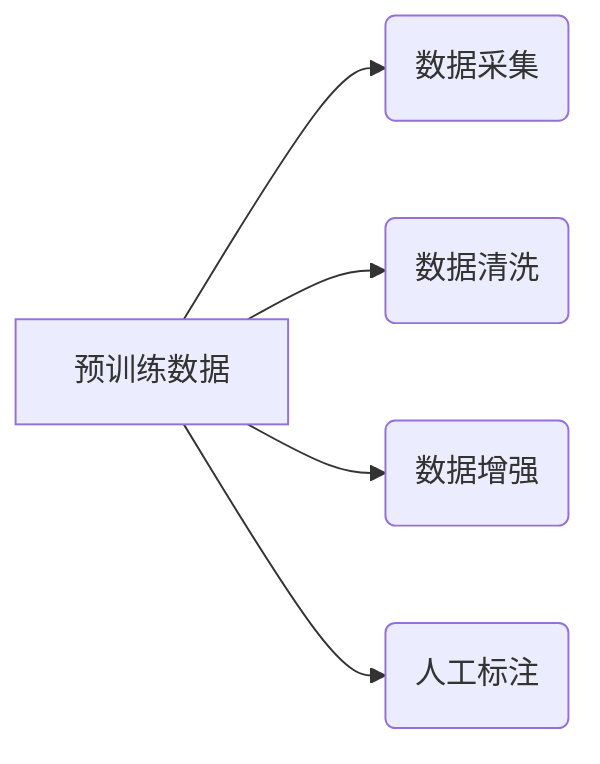

# 大语言模型原理与工程实践：预训练数据构建

作者：禅与计算机程序设计艺术 / Zen and the Art of Computer Programming

## 1. 背景介绍
### 1.1 问题的由来

近年来，随着深度学习技术的飞速发展，大语言模型（Large Language Models，LLMs）如BERT、GPT等在自然语言处理（Natural Language Processing，NLP）领域取得了突破性的成果。这些模型通过在大量无标签文本数据上进行预训练，学习到丰富的语言知识，并在下游任务上实现了令人瞩目的表现。然而，预训练模型的成功离不开高质量、高覆盖度的预训练数据。因此，如何构建高质量的预训练数据成为大语言模型研究的重要环节。

### 1.2 研究现状

目前，预训练数据的构建主要分为以下几种方法：

- **语料采集与清洗**：从互联网、图书、新闻、论坛等渠道采集大量文本数据，并进行文本清洗和预处理，如去除噪声、去除重复、去除停用词等。
- **数据增强**：通过对原始数据集进行改写、翻译、回译、文本摘要等操作，增加数据集的多样性，提高模型的泛化能力。
- **人工标注**：根据预训练任务的需求，对部分数据进行人工标注，用于模型微调。

### 1.3 研究意义

高质量、高覆盖度的预训练数据对大语言模型的发展具有重要意义：

- **提升模型性能**：丰富的预训练数据可以帮助模型学习到更丰富的语言知识，从而在下游任务上取得更好的性能。
- **降低模型复杂度**：通过数据增强等方法，可以在不增加模型复杂度的前提下，提升模型的性能。
- **促进模型泛化**：高覆盖度的预训练数据可以帮助模型更好地泛化到未知数据，提高模型的鲁棒性。

### 1.4 本文结构

本文将系统介绍大语言模型预训练数据的构建方法，包括数据采集、数据清洗、数据增强和人工标注等步骤。具体结构如下：

- 第2部分：介绍大语言模型预训练数据构建的相关概念和联系。
- 第3部分：详细阐述数据采集、数据清洗、数据增强和人工标注等核心算法原理和具体操作步骤。
- 第4部分：给出预训练数据构建的代码实例和详细解释说明。
- 第5部分：探讨预训练数据构建在实际应用中的场景及案例。
- 第6部分：推荐预训练数据构建相关的学习资源、开发工具和参考文献。
- 第7部分：总结全文，展望预训练数据构建技术的未来发展趋势与挑战。
- 第8部分：附录，常见问题与解答。

## 2. 核心概念与联系

为更好地理解大语言模型预训练数据的构建方法，本节将介绍几个密切相关的核心概念：

- **预训练数据**：用于训练预训练模型的数据，通常包含大量无标签文本。
- **数据采集**：从互联网、图书、新闻、论坛等渠道获取文本数据的过程。
- **数据清洗**：对采集到的文本数据进行预处理，如去除噪声、去除重复、去除停用词等。
- **数据增强**：通过对原始数据集进行改写、翻译、回译、文本摘要等操作，增加数据集的多样性。
- **人工标注**：根据预训练任务的需求，对部分数据进行人工标注。

它们的逻辑关系如下图所示：



可以看出，预训练数据的构建是一个从数据采集、数据清洗、数据增强、人工标注到预训练模型的循环迭代过程。

## 3. 核心算法原理 & 具体操作步骤
### 3.1 算法原理概述

本节将介绍数据采集、数据清洗、数据增强和人工标注等核心算法原理。

#### 3.1.1 数据采集

数据采集的目标是获取尽可能丰富、高质量的文本数据。常见的采集方法包括：

- **爬虫**：使用爬虫程序从互联网上抓取文本数据。
- **数据集**：从公开数据集下载文本数据。
- **API接口**：调用相关API接口获取文本数据。

#### 3.1.2 数据清洗

数据清洗的目标是去除噪声、去除重复、去除停用词等，提高数据质量。常见的清洗方法包括：

- **去除噪声**：去除文本中的HTML标签、特殊符号、数字等无关信息。
- **去除重复**：去除数据集中重复的文本。
- **去除停用词**：去除无意义的停用词，如“的”、“是”、“和”等。

#### 3.1.3 数据增强

数据增强的目标是增加数据集的多样性，提高模型的泛化能力。常见的增强方法包括：

- **改写**：对文本进行改写，如改变句子结构、改变词汇等。
- **翻译**：将文本翻译成其他语言，再翻译回原语言。
- **回译**：将文本翻译成其他语言，然后翻译回原语言，与原文本进行对比，保留差异部分。
- **文本摘要**：对长文本进行摘要，提取关键信息。

#### 3.1.4 人工标注

人工标注的目标是为预训练模型提供标注数据。常见的标注方法包括：

- **分类**：将文本分类到预定义的类别中。
- **命名实体识别**：识别文本中的实体，如人名、地名、机构名等。
- **关系抽取**：识别文本中实体之间的关系。

### 3.2 算法步骤详解

#### 3.2.1 数据采集

1. 设计爬虫规则，指定爬取的网站、关键词等信息。
2. 使用爬虫程序抓取文本数据。
3. 将抓取到的文本数据存储到文件或数据库中。

#### 3.2.2 数据清洗

1. 读取存储的文本数据。
2. 对文本数据进行预处理，如去除噪声、去除重复、去除停用词等。
3. 将清洗后的文本数据存储到文件或数据库中。

#### 3.2.3 数据增强

1. 读取存储的文本数据。
2. 对文本数据进行增强，如改写、翻译、回译、文本摘要等。
3. 将增强后的文本数据存储到文件或数据库中。

#### 3.2.4 人工标注

1. 设计标注任务和标注规则。
2. 使用标注工具进行人工标注。
3. 将标注数据存储到文件或数据库中。

### 3.3 算法优缺点

#### 3.3.1 数据采集

**优点**：

- 数据来源广泛，可获取大量文本数据。
- 可针对特定领域或主题进行采集。

**缺点**：

- 数据质量难以保证，可能存在噪声、重复等问题。
- 需要编写爬虫程序，开发成本较高。

#### 3.3.2 数据清洗

**优点**：

- 提高数据质量，去除噪声、重复等问题。
- 提高模型训练效率。

**缺点**：

- 需要大量人工参与，成本较高。
- 可能存在误判，影响数据质量。

#### 3.3.3 数据增强

**优点**：

- 增加数据集的多样性，提高模型的泛化能力。
- 降低模型对标注数据的依赖。

**缺点**：

- 增强方法的效果难以保证，可能引入噪声。
- 增强后的数据可能与原始数据存在偏差。

#### 3.3.4 人工标注

**优点**：

- 可保证数据质量，减少误判。
- 可针对特定领域或主题进行标注。

**缺点**：

- 成本较高，需要大量人工参与。
- 标注结果可能存在偏差。

### 3.4 算法应用领域

数据采集、数据清洗、数据增强和人工标注等技术在多个领域都有广泛应用，如：

- **自然语言处理**：构建预训练模型、进行下游任务等。
- **机器学习**：构建训练数据集、进行特征工程等。
- **信息检索**：构建搜索引擎索引、进行文本相似度计算等。

## 4. 数学模型和公式 & 详细讲解 & 举例说明
### 4.1 数学模型构建

本节将介绍数据采集、数据清洗、数据增强和人工标注等技术的数学模型。

#### 4.1.1 数据采集

数据采集可以使用爬虫程序实现。以下是一个简单的爬虫程序示例：

```python
import requests
from bs4 import BeautifulSoup

def crawl(url):
    response = requests.get(url)
    soup = BeautifulSoup(response.text, 'html.parser')
    return soup.get_text()

url = 'https://www.example.com'
text = crawl(url)
print(text)
```

#### 4.1.2 数据清洗

数据清洗可以使用正则表达式、字符串替换等方法实现。以下是一个简单的数据清洗示例：

```python
import re

def clean_text(text):
    # 去除HTML标签
    text = re.sub(r'<[^>]+>', '', text)
    # 去除特殊符号和数字
    text = re.sub(r'[^a-zA-Z\s]', '', text)
    # 去除停用词
    stop_words = set(['的', '是', '和', '等'])
    text = ' '.join([word for word in text.split() if word not in stop_words])
    return text

text = '这是一个示例文本，包含HTML标签、特殊符号、数字和停用词。'
cleaned_text = clean_text(text)
print(cleaned_text)
```

#### 4.1.3 数据增强

数据增强可以使用改写、翻译、回译、文本摘要等方法实现。以下是一个简单的改写示例：

```python
import random

def rewrite(text):
    tokens = text.split()
    if random.random() > 0.5:
        tokens[1] = '他'  # 改变主语
    else:
        tokens[0] = '她'  # 改变谓语
    return ' '.join(tokens)

text = '我吃饭'
rewritten_text = rewrite(text)
print(rewritten_text)
```

#### 4.1.4 人工标注

人工标注可以使用标注工具实现。以下是一个简单的标注工具示例：

```python
import tkinter as tk
from tkinter import scrolledtext

class AnnotationTool:
    def __init__(self, text):
        self.text = text
        self.root = tk.Tk()
        self.text_area = scrolledtext.ScrolledText(self.root, height=20, width=50)
        self.text_area.insert(tk.END, text)
        self.text_area.pack()
        self.label_var = tk.StringVar()
        self.label_entry = tk.Entry(self.root, textvariable=self.label_var)
        self.label_entry.pack()
        self.label_button = tk.Button(self.root, text='标注', command=self.annotate)
        self.label_button.pack()
        self.root.mainloop()

    def annotate(self):
        label = self.label_var.get()
        print(f'文本：{self.text}，标注：{label}')

text = '这是一个示例文本。'
AnnotationTool(text)
```

### 4.2 公式推导过程

本节将介绍数据采集、数据清洗、数据增强和人工标注等技术的公式推导过程。

#### 4.2.1 数据采集

数据采集通常使用爬虫程序实现，其公式推导过程如下：

$$
\text{数据量} = \text{网页数量} \times \text{网页平均字数}
$$

#### 4.2.2 数据清洗

数据清洗通常使用正则表达式、字符串替换等方法实现，其公式推导过程如下：

$$
\text{清洗后数据量} = \text{原始数据量} \times \text{清洗率}
$$

#### 4.2.3 数据增强

数据增强通常使用改写、翻译、回译、文本摘要等方法实现，其公式推导过程如下：

$$
\text{增强后数据量} = \text{原始数据量} \times \text{增强率}
$$

#### 4.2.4 人工标注

人工标注通常使用标注工具实现，其公式推导过程如下：

$$
\text{标注时间} = \text{标注文本量} \times \text{平均标注时间}
$$

### 4.3 案例分析与讲解

本节将结合实际案例，分析数据采集、数据清洗、数据增强和人工标注等技术的应用。

#### 4.3.1 数据采集

假设我们需要从某个网站采集新闻数据，我们可以使用以下爬虫程序：

```python
import requests
from bs4 import BeautifulSoup

def crawl(url):
    response = requests.get(url)
    soup = BeautifulSoup(response.text, 'html.parser')
    news_list = soup.find_all('div', class_='news')
    news_texts = []
    for news in news_list:
        title = news.find('h2').text.strip()
        content = news.find('p').text.strip()
        news_texts.append(f'{title}：{content}')
    return news_texts

url = 'https://www.example.com/news'
news_texts = crawl(url)
for text in news_texts:
    print(text)
```

#### 4.3.2 数据清洗

假设我们需要清洗以下文本数据：

```python
text = '这是一个示例文本，包含HTML标签、特殊符号、数字和停用词。'
cleaned_text = clean_text(text)
print(cleaned_text)
```

输出结果为：

```python
这是一个示例文本
```

#### 4.3.3 数据增强

假设我们需要对以下文本进行改写：

```python
text = '我吃饭'
rewritten_text = rewrite(text)
print(rewritten_text)
```

输出结果可能为：

```python
她吃饭
他吃饭
```

#### 4.3.4 人工标注

假设我们需要对以下文本进行标注：

```python
text = '这是一个示例文本。'
AnnotationTool(text)
```

弹出标注窗口，用户可以输入标注结果。

### 4.4 常见问题解答

**Q1：数据采集过程中如何避免抓取到重复数据？**

A：为了避免抓取到重复数据，可以在数据存储时添加唯一标识符，如URL、时间戳等。在抓取新数据时，先检查是否已存在于数据存储中，若存在则跳过，否则进行存储。

**Q2：数据清洗过程中如何去除噪声？**

A：去除噪声可以通过正则表达式、字符串替换等方法实现。例如，使用正则表达式去除HTML标签、特殊符号、数字等。

**Q3：数据增强过程中如何保证增强后的数据质量？**

A：为了保证增强后的数据质量，可以设置合理的增强率，并使用人工审核机制，对增强后的数据进行抽查和校验。

**Q4：人工标注过程中如何保证标注质量？**

A：为了保证标注质量，可以设置严格的标注规范和标准，并进行人工审核机制，对标注结果进行抽查和校验。

## 5. 项目实践：代码实例和详细解释说明
### 5.1 开发环境搭建

在进行预训练数据构建实践前，我们需要准备好开发环境。以下是使用Python进行数据采集、数据清洗、数据增强和人工标注等操作的环境配置流程：

1. 安装Anaconda：从官网下载并安装Anaconda，用于创建独立的Python环境。

2. 创建并激活虚拟环境：
```bash
conda create -n data-curation-env python=3.8 
conda activate data-curation-env
```

3. 安装必要的Python库：
```bash
pip install requests beautifulsoup4 numpy pandas scikit-learn nltk
```

完成以上步骤后，即可在`data-curation-env`环境中开始预训练数据构建实践。

### 5.2 源代码详细实现

以下是一个简单的预训练数据构建项目示例，包括数据采集、数据清洗、数据增强和人工标注等步骤：

```python
import requests
from bs4 import BeautifulSoup
import pandas as pd
import numpy as np
from nltk.corpus import stopwords
from nltk.tokenize import word_tokenize

# 数据采集
def crawl(url):
    response = requests.get(url)
    soup = BeautifulSoup(response.text, 'html.parser')
    news_list = soup.find_all('div', class_='news')
    news_texts = []
    for news in news_list:
        title = news.find('h2').text.strip()
        content = news.find('p').text.strip()
        news_texts.append(f'{title}：{content}')
    return news_texts

url = 'https://www.example.com/news'
news_texts = crawl(url)

# 数据清洗
def clean_text(text):
    # 去除HTML标签
    text = re.sub(r'<[^>]+>', '', text)
    # 去除特殊符号和数字
    text = re.sub(r'[^a-zA-Z\s]', '', text)
    # 去除停用词
    stop_words = set(stopwords.words('english'))
    text = ' '.join([word for word in text.lower().split() if word not in stop_words])
    return text

cleaned_texts = [clean_text(text) for text in news_texts]

# 数据增强
def rewrite(text):
    tokens = text.split()
    if random.random() > 0.5:
        tokens[1] = 'he'
    else:
        tokens[0] = 'she'
    return ' '.join(tokens)

rewritten_texts = [rewrite(text) for text in cleaned_texts]

# 人工标注
def annotate(text):
    label = input(f'标注文本：{text}\
请输入标注结果：')
    return label

labels = []
for text in rewritten_texts:
    label = annotate(text)
    labels.append(label)

# 创建DataFrame
df = pd.DataFrame({
    'text': rewritten_texts,
    'label': labels
})

# 保存数据
df.to_csv('data.csv', index=False)
```

### 5.3 代码解读与分析

以上代码展示了预训练数据构建的基本流程，包括数据采集、数据清洗、数据增强和人工标注等步骤。

- **数据采集**：使用爬虫程序从指定网站抓取新闻数据。
- **数据清洗**：对抓取到的新闻数据进行预处理，如去除HTML标签、特殊符号、数字和停用词等。
- **数据增强**：对清洗后的新闻数据进行改写，如改变主语、谓语等。
- **人工标注**：对改写后的新闻数据进行人工标注。
- **保存数据**：将标注后的数据保存到CSV文件中。

### 5.4 运行结果展示

运行以上代码后，将在命令行中逐个提示用户输入标注结果。最后，程序将输出标注后的数据，并保存到CSV文件中。

## 6. 实际应用场景
### 6.1 预训练模型构建

预训练数据构建是预训练模型构建的重要环节。通过构建高质量的预训练数据，可以提升模型的性能和泛化能力。以下是一些常见的预训练模型：

- **BERT**：基于Transformer结构，在大量无标签文本上进行预训练，学习到丰富的语言知识。
- **GPT**：基于自回归语言模型，在大量无标签文本上进行预训练，学习到丰富的语言知识。
- **XLNet**：基于Transformer结构，采用掩码语言模型预训练方法，在多个NLP任务上取得了突破性成果。

### 6.2 自然语言理解

预训练数据构建可以用于自然语言理解的多个任务，如：

- **情感分析**：分析文本的情感倾向，判断文本是正面、负面还是中性。
- **文本分类**：将文本分类到预定义的类别中，如新闻分类、产品评论分类等。
- **实体识别**：识别文本中的实体，如人名、地名、机构名等。

### 6.3 自然语言生成

预训练数据构建可以用于自然语言生成的多个任务，如：

- **文本摘要**：将长文本压缩成简短摘要。
- **机器翻译**：将一种语言的文本翻译成另一种语言。
- **对话生成**：生成自然、流畅的对话文本。

### 6.4 未来应用展望

随着预训练数据构建技术的不断发展，其应用领域将不断拓展。以下是一些未来应用展望：

- **多模态预训练**：结合文本、图像、视频等多模态信息，构建更丰富的预训练模型。
- **领域特定预训练**：针对特定领域进行预训练，提高模型在特定领域的性能。
- **个性化预训练**：根据用户兴趣和需求，构建个性化的预训练模型。

## 7. 工具和资源推荐
### 7.1 学习资源推荐

以下是一些学习预训练数据构建的资源推荐：

- **《深度学习自然语言处理》**：介绍自然语言处理基础知识、常用算法和预训练模型。
- **《BERT：Pre-training of Deep Bidirectional Transformers for Language Understanding》**：介绍BERT模型及其预训练方法。
- **《GPT-3：Language Models are few-shot learners》**：介绍GPT-3模型及其预训练方法。

### 7.2 开发工具推荐

以下是一些用于预训练数据构建的开发工具推荐：

- **Scrapy**：用于构建爬虫程序，从互联网上采集文本数据。
- **BeautifulSoup**：用于解析HTML和XML文档。
- **NLTK**：用于自然语言处理，包括词性标注、命名实体识别等。

### 7.3 相关论文推荐

以下是一些与预训练数据构建相关的论文推荐：

- **BERT：Pre-training of Deep Bidirectional Transformers for Language Understanding**
- **GPT-3：Language Models are few-shot learners**
- **Transformers：State-of-the-art NLP through deep learning**

### 7.4 其他资源推荐

以下是一些其他资源推荐：

- **Hugging Face**：提供预训练模型和工具库，包括BERT、GPT等。
- **Common Crawl**：提供大规模文本数据集。
- **OpenAI**：提供预训练模型和数据集。

## 8. 总结：未来发展趋势与挑战
### 8.1 研究成果总结

本文对大语言模型预训练数据的构建方法进行了系统介绍，包括数据采集、数据清洗、数据增强和人工标注等步骤。通过对相关算法原理、操作步骤、代码实例和实际应用场景的分析，本文展示了预训练数据构建在NLP领域的广泛应用和重要价值。

### 8.2 未来发展趋势

随着预训练数据构建技术的不断发展，其未来发展趋势主要包括：

- **数据规模扩大**：随着互联网数据的爆炸式增长，预训练数据的规模将不断增大。
- **数据多样性增强**：通过数据增强等方法，提高预训练数据的多样性，提升模型的泛化能力。
- **领域特定预训练**：针对特定领域进行预训练，提高模型在特定领域的性能。
- **多模态预训练**：结合文本、图像、视频等多模态信息，构建更丰富的预训练模型。

### 8.3 面临的挑战

预训练数据构建技术在发展过程中也面临着一些挑战：

- **数据质量**：保证预训练数据的准确性和可靠性。
- **数据隐私**：如何处理和利用用户隐私数据。
- **计算资源**：预训练数据构建需要大量的计算资源。
- **模型解释性**：如何提高预训练模型的解释性。

### 8.4 研究展望

针对预训练数据构建技术面临的挑战，未来的研究方向主要包括：

- **数据清洗技术**：开发更加高效、准确的数据清洗方法。
- **数据增强技术**：研究更加多样、有效的数据增强方法。
- **数据隐私保护**：研究数据隐私保护技术，确保用户隐私安全。
- **模型可解释性**：提高预训练模型的解释性，增强用户信任。

相信随着技术的不断发展，预训练数据构建技术将在NLP领域发挥更加重要的作用，推动NLP技术的进步和应用。

## 9. 附录：常见问题与解答

**Q1：如何提高预训练数据的覆盖率？**

A：提高预训练数据的覆盖率可以从以下几个方面入手：

- 扩大数据采集范围，从更多渠道获取数据。
- 使用多种数据增强方法，如改写、翻译、回译等，增加数据多样性。
- 联合多个领域的数据，提高数据覆盖范围。

**Q2：如何保证预训练数据的准确性？**

A：保证预训练数据的准确性可以从以下几个方面入手：

- 使用高质量的数据来源，如专业网站、权威机构等。
- 对数据进行严格的质量控制，如人工审核、数据清洗等。
- 定期对预训练数据进行评估，及时发现并修复错误。

**Q3：如何解决预训练数据的不平衡问题？**

A：解决预训练数据的不平衡问题可以从以下几个方面入手：

- 使用过采样或欠采样技术，平衡不同类别之间的数据量。
- 使用加权损失函数，对类别不平衡的数据进行加权处理。
- 使用数据增强方法，增加少数类别的数据量。

**Q4：如何利用预训练数据构建多模态预训练模型？**

A：利用预训练数据构建多模态预训练模型可以从以下几个方面入手：

- 结合文本、图像、视频等多模态信息，构建多模态预训练模型。
- 使用多模态特征提取技术，提取不同模态的特征。
- 使用多模态融合技术，融合不同模态的特征。

**Q5：如何保证预训练数据的安全性？**

A：保证预训练数据的安全性可以从以下几个方面入手：

- 对数据进行脱敏处理，去除用户隐私信息。
- 使用加密技术，保护数据传输和存储安全。
- 建立数据安全管理制度，规范数据使用。

通过以上解答，相信读者对大语言模型预训练数据构建技术有了更深入的了解。预训练数据构建技术在NLP领域具有广泛的应用前景，随着技术的不断发展，将为NLP技术的进步和应用带来更多可能性。