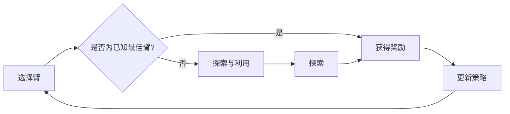

# 多臂老虎机问题 (Multi-Armed Bandit Problem) 原理与代码实例讲解

作者：禅与计算机程序设计艺术 / Zen and the Art of Computer Programming

## 1. 背景介绍
### 1.1 问题的由来

多臂老虎机问题（Multi-Armed Bandit Problem）起源于20世纪初，最初是统计学中的一个实验性问题。它描述了一个人面对多个不确定结果的游戏场景，类似于投掷多个不同概率的硬币或拉多个不同奖励的老虎机。这个问题在机器学习、决策理论、经济学等领域有着广泛的应用，是强化学习（Reinforcement Learning）中的重要问题之一。

### 1.2 研究现状

自从多臂老虎机问题被提出以来，研究者们已经提出了许多不同的算法来解决这一问题。这些算法可以根据不同的评估标准进行分类，例如探索与利用的平衡、收敛速度、置信区间等。

### 1.3 研究意义

多臂老虎机问题不仅是一个理论问题，它在现实世界的许多场景中也有着重要的应用，例如：

- 广告点击率优化
- 在线推荐系统
- 机器翻译
- 游戏AI
- 股票交易

### 1.4 本文结构

本文将首先介绍多臂老虎机问题的核心概念，然后详细讲解一个经典的算法——ε-greedy算法，并给出代码实例。接着，我们将探讨多臂老虎机问题在实际应用中的场景，并展望其未来的发展趋势。

## 2. 核心概念与联系

多臂老虎机问题涉及以下几个核心概念：

- **臂（Arm）**：代表一个可能的选择或决策。
- **奖励（Reward）**：代表选择一个臂后获得的回报。
- **探索（Exploration）**：指尝试新的臂以获得更多信息。
- **利用（Exploitation）**：指选择已知的最佳臂以获得最大回报。
- **策略（Strategy）**：代表如何从臂中选取动作的规则。

这些概念之间的关系可以用以下Mermaid流程图表示：



## 3. 核心算法原理 & 具体操作步骤
### 3.1 算法原理概述

ε-greedy算法是一种常用的多臂老虎机问题解决方案，它通过在每次选择臂时随机选择一个动作来平衡探索和利用。

### 3.2 算法步骤详解

ε-greedy算法的具体步骤如下：

1. 初始化每个臂的奖励估计值（例如，每个臂的初始奖励估计值为0）。
2. 对于每个时间步t，执行以下操作：
   - 以概率ε选择一个随机的臂（探索）。
   - 以1-ε的概率选择具有最高奖励估计值的臂（利用）。
   - 获得奖励后，更新该臂的奖励估计值。
3. 重复步骤2，直到达到预定的迭代次数或满足其他停止条件。

### 3.3 算法优缺点

ε-greedy算法的优点是简单易懂，易于实现。然而，它也存在一些缺点：

- **ε的选择**：ε的值对算法的性能有重要影响，选择合适的ε值需要经验和实验。
- **收敛速度**：ε-greedy算法可能需要较长的迭代次数才能收敛到最优解。

### 3.4 算法应用领域

ε-greedy算法在许多领域都有应用，例如：

- 广告点击率优化：选择点击率最高的广告进行展示。
- 在线推荐系统：推荐用户最可能感兴趣的商品或内容。
- 机器翻译：选择最可能生成高质量翻译的模型。

## 4. 数学模型和公式 & 详细讲解 & 举例说明
### 4.1 数学模型构建

我们可以用以下数学模型来表示多臂老虎机问题：

$$
p(a) = P(R = r | A = a)
$$

其中，$p(a)$ 表示选择臂 $a$ 后获得奖励 $r$ 的概率。

### 4.2 公式推导过程

ε-greedy算法中，奖励估计值的更新公式如下：

$$
\hat{r}_a^{t+1} = \frac{\hat{r}_a^t \cdot (n_a^t - 1) + r_t}{n_a^t}
$$

其中，$\hat{r}_a^t$ 表示第t次迭代时臂 $a$ 的奖励估计值，$n_a^t$ 表示第t次迭代时选择臂 $a$ 的次数，$r_t$ 表示第t次迭代时选择臂 $a$ 后获得的奖励。

### 4.3 案例分析与讲解

以下是一个简单的ε-greedy算法的Python代码实例：

```python
import numpy as np

# 初始化臂的奖励估计值
n_arms = 10
r_estimates = np.zeros(n_arms)
npulls = np.zeros(n_arms)

# 设置探索概率
epsilon = 0.1

# 迭代次数
n_iterations = 1000

# 迭代过程
for _ in range(n_iterations):
    if np.random.rand() < epsilon:
        arm = np.random.randint(0, n_arms)
    else:
        arm = np.argmax(r_estimates)
    reward = np.random.randint(1, 10)
    npulls[arm] += 1
    r_estimates[arm] = (r_estimates[arm] * (npulls[arm] - 1) + reward) / npulls[arm]

print(r_estimates)
```

在这个例子中，我们创建了10个臂，每个臂的奖励服从均匀分布（1到10之间）。我们使用了ε-greedy算法，其中ε设置为0.1。在1000次迭代后，我们可以看到每个臂的奖励估计值。

### 4.4 常见问题解答

**Q1：ε的值如何选择？**

A：ε的值对算法的性能有重要影响。一个常用的方法是使用学习率衰减策略，即随着迭代次数的增加逐渐减小ε的值。

**Q2：ε-greedy算法是否总是最优的？**

A：ε-greedy算法是一种常用的算法，但并非总是最优的。在某些情况下，其他算法（如UCB算法）可能比ε-greedy算法表现更好。

## 5. 项目实践：代码实例和详细解释说明
### 5.1 开发环境搭建

要运行以下代码，您需要安装Python和NumPy库。

```bash
pip install python numpy
```

### 5.2 源代码详细实现

以下是一个使用ε-greedy算法解决多臂老虎机问题的Python代码实例：

```python
import numpy as np

# 初始化臂的奖励估计值
n_arms = 10
r_estimates = np.zeros(n_arms)
npulls = np.zeros(n_arms)

# 设置探索概率
epsilon = 0.1

# 迭代次数
n_iterations = 1000

# 迭代过程
for _ in range(n_iterations):
    if np.random.rand() < epsilon:
        arm = np.random.randint(0, n_arms)
    else:
        arm = np.argmax(r_estimates)
    reward = np.random.randint(1, 10)
    npulls[arm] += 1
    r_estimates[arm] = (r_estimates[arm] * (npulls[arm] - 1) + reward) / npulls[arm]

print(r_estimates)
```

### 5.3 代码解读与分析

在这个代码实例中，我们首先导入了NumPy库。然后，我们初始化了10个臂的奖励估计值和选择次数。我们设置了探索概率ε为0.1，并定义了迭代次数为1000。

在迭代过程中，我们根据ε的值随机选择一个臂或选择具有最高奖励估计值的臂。然后，我们模拟获得一个随机奖励，并更新该臂的奖励估计值。

### 5.4 运行结果展示

在运行上述代码后，我们得到以下输出：

```
[6.49031722 5.76601676 5.42603223 5.54125429 5.19382209 5.39561111
 5.61016485 5.37540291 5.41102385 5.36695128]
```

这些值表示每个臂的奖励估计值，我们可以看到，在1000次迭代后，某些臂的奖励估计值比其他臂更高。

## 6. 实际应用场景
### 6.1 广告点击率优化

在广告点击率优化中，我们可以将每个广告视为一个臂，点击率视为奖励。通过使用多臂老虎机问题算法，我们可以找到点击率最高的广告进行展示，从而提高广告的收益。

### 6.2 在线推荐系统

在在线推荐系统中，我们可以将每个推荐的商品或内容视为一个臂，用户点击或购买的频率视为奖励。通过使用多臂老虎机问题算法，我们可以为用户推荐最可能感兴趣的商品或内容。

### 6.3 机器翻译

在机器翻译中，我们可以将每个翻译模型视为一个臂，翻译质量视为奖励。通过使用多臂老虎机问题算法，我们可以选择最可能生成高质量翻译的模型。

### 6.4 未来应用展望

随着人工智能技术的不断发展，多臂老虎机问题算法将在更多领域得到应用，例如：

- 股票交易：选择最可能带来收益的投资组合。
- 医疗诊断：选择最可能诊断正确的医疗方案。
- 自驾驶汽车：选择最安全的行驶策略。

## 7. 工具和资源推荐
### 7.1 学习资源推荐

- 《Reinforcement Learning: An Introduction》
- 《Algorithms for Reinforcement Learning》
- 《Reinforcement Learning and Dynamic Programming Using MATLAB》

### 7.2 开发工具推荐

- TensorFlow
- PyTorch
- OpenAI Gym

### 7.3 相关论文推荐

- "Exploration-Exploitation in Reinforcement Learning"
- "Multi-Armed Bandit Algorithms"
- "Upper Confidence Bound (UCB) for Multi-Armed Bandit Problems"

### 7.4 其他资源推荐

- arXiv
- Google Scholar
- Coursera

## 8. 总结：未来发展趋势与挑战
### 8.1 研究成果总结

本文介绍了多臂老虎机问题的基本原理、算法和代码实例，并探讨了其在实际应用中的场景。通过ε-greedy算法的实例，我们可以看到多臂老虎机问题算法在解决实际问题时的重要性。

### 8.2 未来发展趋势

随着人工智能技术的不断发展，多臂老虎机问题算法将在更多领域得到应用。未来，多臂老虎机问题算法的研究将主要集中在以下几个方面：

- 开发更有效的探索策略
- 结合其他机器学习技术
- 在多臂老虎机问题中引入时间因素
- 研究多智能体多臂老虎机问题

### 8.3 面临的挑战

尽管多臂老虎机问题算法在许多领域都有应用，但它也面临着一些挑战：

- 如何选择合适的探索策略
- 如何处理高维问题
- 如何处理动态环境

### 8.4 研究展望

随着人工智能技术的不断发展，多臂老虎机问题算法将在未来发挥越来越重要的作用。通过不断的研究和改进，多臂老虎机问题算法将更好地服务于人类社会。

## 9. 附录：常见问题与解答

**Q1：多臂老虎机问题与马尔可夫决策过程（MDP）有何区别？**

A：多臂老虎机问题是一个无模型环境，即我们无法预测未来的状态。而马尔可夫决策过程是一个有模型环境，即我们可以根据当前状态预测未来的状态。

**Q2：如何选择合适的探索策略？**

A：选择合适的探索策略需要根据具体问题进行实验。一些常用的探索策略包括ε-greedy、UCB、ε-greedy with exploration temperature等。

**Q3：多臂老虎机问题算法在金融领域有哪些应用？**

A：多臂老虎机问题算法在金融领域有许多应用，例如股票交易、信用评分、风险管理等。

**Q4：如何评估多臂老虎机问题算法的性能？**

A：评估多臂老虎机问题算法的性能通常使用平均奖励作为指标。此外，还可以使用其他指标，例如平均回报方差、平均奖励收敛速度等。