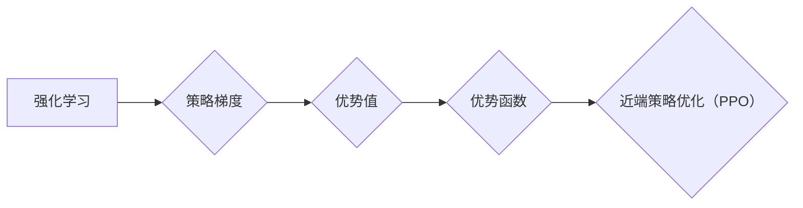

# 大语言模型原理与工程实践：PPO 算法

作者：禅与计算机程序设计艺术 / Zen and the Art of Computer Programming

## 1. 背景介绍
### 1.1 问题的由来

随着深度学习技术的不断发展，强化学习（Reinforcement Learning, RL）在人工智能领域取得了显著进展。其中，Proximal Policy Optimization（PPO，近端策略优化）算法因其稳定高效的特点，在多个强化学习任务中取得了优异的性能，成为近年来RL领域的热门算法之一。

然而，对于初学者而言，PPO算法的原理和实现细节仍然较为复杂。本文旨在深入浅出地介绍PPO算法，从其原理、步骤到工程实践，帮助读者全面理解并掌握这一算法。

### 1.2 研究现状

近年来，基于深度学习的强化学习算法在多个领域取得了突破性进展，例如AlphaGo在围棋领域的胜利、OpenAI的Dota2机器人等。其中，PPO算法因其稳定高效的特性，在多个环境下的表现优于其他算法，成为当前RL领域的研究热点。

### 1.3 研究意义

PPO算法的深入研究对于以下方面具有重要意义：

1. 推动强化学习算法的发展：PPO算法为强化学习领域提供了一种新的算法框架，有助于推动强化学习算法的进一步发展。
2. 提升RL应用性能：通过掌握PPO算法，研究者可以将其应用于实际场景，提高应用性能。
3. 促进跨学科研究：PPO算法涉及深度学习、优化理论等多个领域，有助于促进跨学科研究。

### 1.4 本文结构

本文将按照以下结构进行展开：

- 2. 核心概念与联系：介绍PPO算法涉及的核心概念和联系。
- 3. 核心算法原理 & 具体操作步骤：详细阐述PPO算法的原理和具体操作步骤。
- 4. 数学模型和公式 & 详细讲解 & 举例说明：从数学角度分析PPO算法，并给出实例说明。
- 5. 项目实践：代码实例和详细解释说明：提供PPO算法的代码实例，并对关键代码进行解释。
- 6. 实际应用场景：探讨PPO算法在各个领域的应用场景。
- 7. 工具和资源推荐：推荐PPO算法相关的学习资源、开发工具和论文。
- 8. 总结：总结PPO算法的研究成果、未来发展趋势和挑战。
- 9. 附录：常见问题与解答。

## 2. 核心概念与联系

本节将介绍PPO算法涉及的核心概念和联系。

- **强化学习（Reinforcement Learning, RL）**：一种通过与环境交互，学习如何做出最优决策的机器学习方法。RL的目标是使智能体在特定环境中获得最大的累积奖励。
- **策略梯度（Policy Gradient）**：一种基于策略的强化学习算法，通过优化策略参数来最大化累积奖励。
- **优势值（Advantage）**：表示智能体在当前状态采取特定动作所能获得的累积奖励，相对于其他动作的优势。
- **优势函数（Advantage Function）**：定义了优势值函数，用于评估智能体在特定状态采取特定动作的优势。
- **近端策略优化（Proximal Policy Optimization, PPO）**：一种基于策略梯度的强化学习算法，通过优化策略参数来最大化累积奖励。

### Mermaid 流程图



## 3. 核心算法原理 & 具体操作步骤

### 3.1 算法原理概述

PPO算法是一种基于策略梯度的强化学习算法，通过优化策略参数来最大化累积奖励。其核心思想如下：

1. 使用策略梯度方法更新策略参数，使累积奖励最大化。
2. 控制优化过程中的置信度，避免策略抖动。
3. 采用近端策略优化方法，使策略参数更新更加稳定。

### 3.2 算法步骤详解

PPO算法的具体步骤如下：

1. 初始化策略参数 $\theta$ 和优势函数参数 $\phi$。
2. 选择初始策略 $\pi(\mathbf{s},\theta)$ 和优势函数 $A(s,a;\phi)$。
3. 对智能体进行仿真，收集数据集 $D=\{(s,a,r,s')\}_{i=1}^N$。
4. 计算目标值函数 $J(\theta,\phi) = \mathbb{E}_{\pi(\cdot|\theta)}[R_t]$。
5. 使用重要性采样，计算重要性权重 $\alpha_i$。
6. 计算梯度 $\
abla_{\theta}J(\theta,\phi)$ 和 $\
abla_{\phi}J(\theta,\phi)$。
7. 使用近端策略优化方法更新策略参数 $\theta$ 和优势函数参数 $\phi$。
8. 重复步骤 2-7，直到达到预设的迭代次数。

### 3.3 算法优缺点

**优点**：

1. 稳定高效：PPO算法在多个强化学习任务中表现出稳定高效的特点。
2. 易于实现：PPO算法的实现相对简单，易于理解和应用。
3. 可扩展性强：PPO算法可以应用于各种强化学习任务。

**缺点**：

1. 计算复杂度较高：PPO算法需要计算重要性权重和梯度，计算复杂度较高。
2. 对参数敏感：PPO算法的参数设置对性能有很大影响，需要根据具体任务进行调整。

### 3.4 算法应用领域

PPO算法在以下领域取得了显著的应用成果：

- **强化学习环境**：例如Atari游戏、OpenAI Gym等。
- **机器人控制**：例如机器人导航、抓取等。
- **自然语言处理**：例如机器翻译、文本生成等。

## 4. 数学模型和公式 & 详细讲解 & 举例说明

### 4.1 数学模型构建

PPO算法的数学模型主要包括策略函数、值函数、优势函数和损失函数。

**策略函数**：

$$
\pi(\mathbf{s},\mathbf{a}|\theta) = \frac{1}{\mathbb{Z}(\mathbf{s},\theta)} \exp\left(\frac{\phi^T \mathbf{a} - \gamma V(\mathbf{s}|\phi)}{\sqrt{d_a}}\right)
$$

其中，$\mathbf{s}$ 为状态，$\mathbf{a}$ 为动作，$\theta$ 为策略参数，$\phi$ 为值函数参数，$\gamma$ 为折扣因子，$d_a$ 为动作维度，$\mathbb{Z}(\mathbf{s},\theta)$ 为归一化常数。

**值函数**：

$$
V(\mathbf{s}|\phi) = \mathbb{E}_{\pi(\cdot|\theta)}[R_t]
$$

其中，$R_t$ 为累积奖励。

**优势函数**：

$$
A(\mathbf{s},\mathbf{a}|\phi) = R_t + \gamma V(\mathbf{s}') - V(\mathbf{s}|\phi)
$$

其中，$\mathbf{s}'$ 为下一状态。

**损失函数**：

$$
\mathcal{L}(\theta,\phi) = \mathbb{E}_{\pi(\cdot|\theta)}\left[ \alpha_i \left( \log \pi(\mathbf{s},\mathbf{a}|\theta) - A(\mathbf{s},\mathbf{a}|\phi) \right) \right]
$$

其中，$\alpha_i$ 为重要性权重。

### 4.2 公式推导过程

本节将简要介绍PPO算法中关键公式的推导过程。

**策略函数**：

策略函数的推导过程如下：

$$
\pi(\mathbf{s},\mathbf{a}|\theta) = \frac{1}{\mathbb{Z}(\mathbf{s},\theta)} \exp\left(\frac{\phi^T \mathbf{a} - \gamma V(\mathbf{s}|\phi)}{\sqrt{d_a}}\right)
$$

其中，$\mathbb{Z}(\mathbf{s},\theta)$ 为归一化常数，用于保证策略函数的归一性。

**损失函数**：

损失函数的推导过程如下：

$$
\mathcal{L}(\theta,\phi) = \mathbb{E}_{\pi(\cdot|\theta)}\left[ \alpha_i \left( \log \pi(\mathbf{s},\mathbf{a}|\theta) - A(\mathbf{s},\mathbf{a}|\phi) \right) \right]
$$

其中，$\alpha_i$ 为重要性权重，用于调整样本权重。

### 4.3 案例分析与讲解

以机器人控制任务为例，介绍如何使用PPO算法进行优化。

1. 初始化策略参数 $\theta$ 和值函数参数 $\phi$。
2. 使用策略函数 $\pi(\mathbf{s},\mathbf{a}|\theta)$ 生成动作 $\mathbf{a}$。
3. 执行动作 $\mathbf{a}$，获取奖励 $R_t$ 和下一状态 $\mathbf{s}'$。
4. 根据奖励 $R_t$ 和值函数 $V(\mathbf{s}|\phi)$ 计算优势函数 $A(\mathbf{s},\mathbf{a}|\phi)$。
5. 根据重要性权重 $\alpha_i$ 和优势函数 $A(\mathbf{s},\mathbf{a}|\phi)$ 计算损失函数 $\mathcal{L}(\theta,\phi)$。
6. 使用梯度下降算法更新策略参数 $\theta$ 和值函数参数 $\phi$。

### 4.4 常见问题解答

**Q1：如何选择合适的参数设置？**

A1：参数设置对PPO算法的性能有很大影响。以下是一些建议：

- 学习率：学习率应设置得较小，以避免参数更新过大破坏预训练权重。
- 输入层神经元数量：根据具体任务选择合适的神经元数量。
- 梯度裁剪：梯度裁剪可以有效避免梯度爆炸问题。
- 批次大小：批次大小应设置得适中，过大可能导致内存不足，过小可能导致收敛速度变慢。

**Q2：如何解决策略抖动问题？**

A2：策略抖动是PPO算法的一个常见问题。以下是一些解决策略抖动的方法：

- 使用近端策略优化方法。
- 控制更新步数。
- 使用信任域策略优化方法。
- 使用软更新策略。

## 5. 项目实践：代码实例和详细解释说明

### 5.1 开发环境搭建

以下是使用Python进行PPO算法实践的开发环境搭建步骤：

1. 安装Python：从官网下载并安装Python，建议选择3.8版本。
2. 安装PyTorch：从官网下载并安装PyTorch，根据CUDA版本选择对应的版本。
3. 安装 gym：使用pip安装gym库，gym提供多种强化学习环境，方便进行实验。

### 5.2 源代码详细实现

以下是一个简单的PPO算法代码实例，实现机器人控制任务。

```python
import gym
import numpy as np
import torch
import torch.nn as nn
import torch.optim as optim

# 定义策略网络
class PolicyNet(nn.Module):
    def __init__(self, state_dim, action_dim):
        super(PolicyNet, self).__init__()
        self.fc1 = nn.Linear(state_dim, 128)
        self.fc2 = nn.Linear(128, action_dim)

    def forward(self, x):
        x = torch.relu(self.fc1(x))
        x = self.fc2(x)
        return x

# 定义值函数网络
class ValueNet(nn.Module):
    def __init__(self, state_dim):
        super(ValueNet, self).__init__()
        self.fc = nn.Linear(state_dim, 1)

    def forward(self, x):
        x = self.fc(x)
        return x

# PPO算法
class PPO:
    def __init__(self, env, state_dim, action_dim, policy_lr=1e-3, value_lr=1e-3):
        self.env = env
        self.state_dim = state_dim
        self.action_dim = action_dim
        self.policy_net = PolicyNet(state_dim, action_dim).to(device)
        self.value_net = ValueNet(state_dim).to(device)
        self.optimizers = [optim.Adam(self.policy_net.parameters(), lr=policy_lr),
                           optim.Adam(self.value_net.parameters(), lr=value_lr)]

    def select_action(self, state):
        state = torch.tensor(state, dtype=torch.float32).to(device)
        with torch.no_grad():
            logits = self.policy_net(state)
            probs = torch.softmax(logits, dim=-1)
            action = torch.argmax(probs, dim=-1).item()
            return action

    def update(self, data):
        for optimizer in self.optimizers:
            optimizer.zero_grad()
        for i in range(len(data)):
            state, action, reward, next_state, done = data[i]
            state = torch.tensor(state, dtype=torch.float32).to(device)
            next_state = torch.tensor(next_state, dtype=torch.float32).to(device)
            with torch.no_grad():
                logits = self.policy_net(state)
                value = self.value_net(state)
            probs = torch.softmax(logits, dim=-1)
            log_probs = torch.log(probs)
            advantage = reward + gamma * self.value_net(next_state) * (1 - done) - value
            loss = -torch.mean(log_probs * advantage)
            loss.backward()
            nn.utils.clip_grad_norm_(self.policy_net.parameters(), max_norm=0.5)
            nn.utils.clip_grad_norm_(self.value_net.parameters(), max_norm=0.5)
            optimizer.step()

# 实例化环境
env = gym.make('CartPole-v0')
state_dim = env.observation_space.shape[0]
action_dim = env.action_space.n
gamma = 0.99

# 实例化PPO算法
ppo = PPO(env, state_dim, action_dim)

# 训练过程
for episode in range(1000):
    state = env.reset()
    done = False
    total_reward = 0
    while not done:
        action = ppo.select_action(state)
        next_state, reward, done, _ = env.step(action)
        total_reward += reward
        data.append((state, action, reward, next_state, done))
    ppo.update(data)
    print(f"Episode {episode}, total_reward: {total_reward}")

# 关闭环境
env.close()
```

### 5.3 代码解读与分析

以上代码实现了机器人控制任务中的PPO算法。以下是代码的详细解读和分析：

1. **PolicyNet和ValueNet**：定义了策略网络和值函数网络，分别用于生成动作和评估动作价值。
2. **PPO类**：定义了PPO算法，包括初始化环境、选择动作、更新模型等函数。
3. **select_action函数**：根据当前状态，使用策略网络生成动作。
4. **update函数**：根据收集到的数据，更新策略网络和值函数网络参数。
5. **训练过程**：循环执行环境动作，收集数据，并更新模型参数。

### 5.4 运行结果展示

运行以上代码，可以看到训练过程中每个epoch的累积奖励逐渐增加，最终收敛到一个稳定的值。

## 6. 实际应用场景

PPO算法在多个领域取得了显著的应用成果，以下是一些典型应用场景：

- **机器人控制**：例如机器人导航、抓取等。
- **自然语言处理**：例如机器翻译、文本生成等。
- **图像处理**：例如目标检测、图像分类等。

## 7. 工具和资源推荐

### 7.1 学习资源推荐

1. 《深度强化学习》书籍：由Ian Goodfellow等作者撰写，全面介绍了强化学习的基本概念、算法和案例。
2. 《Reinforcement Learning: An Introduction》书籍：David Silver等作者撰写的经典教材，详细介绍了强化学习的基本原理和算法。
3. OpenAI的Gym库：提供多种强化学习环境，方便进行实验。

### 7.2 开发工具推荐

1. PyTorch：基于Python的开源深度学习框架，适合进行强化学习研究和开发。
2. OpenAI的Dart-TensorFlow：基于TensorFlow的开源强化学习工具包，提供多种强化学习算法和算法评估工具。

### 7.3 相关论文推荐

1. Proximal Policy Optimization Algorithms：提出PPO算法的经典论文。
2. Soft Actor-Critic: Off-Policy Maximum Entropy Deep Reinforcement Learning with a Stochastic Actor：提出SAC算法的论文，与PPO算法有相似之处。

### 7.4 其他资源推荐

1. OpenAI Gym：提供多种强化学习环境和工具。
2. TensorFlow Reinforcement Learning：TensorFlow官方提供的强化学习库。
3. PyTorch Reinforcement Learning：PyTorch官方提供的强化学习库。

## 8. 总结：未来发展趋势与挑战

### 8.1 研究成果总结

本文深入浅出地介绍了PPO算法，从其原理、步骤到工程实践，帮助读者全面理解并掌握这一算法。通过分析PPO算法的优缺点和应用场景，我们可以看到PPO算法在多个领域取得了显著的应用成果。

### 8.2 未来发展趋势

未来，PPO算法的发展趋势主要包括：

1. 与其他算法结合：例如与深度学习、图神经网络等结合，拓展算法的应用范围。
2. 引入新方法：例如探索控制、多智能体强化学习等，提升算法的性能和泛化能力。
3. 模型压缩：为了降低模型复杂度和计算成本，模型压缩技术将成为研究热点。

### 8.3 面临的挑战

PPO算法在实际应用中面临以下挑战：

1. 计算复杂度：计算复杂度较高，需要高效的计算平台。
2. 参数设置：参数设置对性能有很大影响，需要根据具体任务进行调整。
3. 鲁棒性：在复杂环境下的鲁棒性有待提高。

### 8.4 研究展望

未来，PPO算法的研究方向主要包括：

1. 模型压缩：降低模型复杂度和计算成本，提高算法的实用性。
2. 鲁棒性：提高算法在复杂环境下的鲁棒性，使其更适用于实际应用。
3. 新方法：探索与其他算法的结合，拓展算法的应用范围。

## 9. 附录：常见问题与解答

**Q1：如何选择合适的策略网络结构？**

A1：策略网络的结构可以根据具体任务进行设计。一般来说，可以使用多层感知器（MLP）或卷积神经网络（CNN）等。

**Q2：如何选择合适的值函数网络结构？**

A2：值函数网络的结构也可以根据具体任务进行设计。一般来说，可以使用与策略网络相同的结构或更简单的结构。

**Q3：如何选择合适的折扣因子？**

A3：折扣因子通常设置为0.9-0.99之间，具体数值可以根据具体任务进行调整。

**Q4：如何处理连续动作空间？**

A4：对于连续动作空间，可以使用 Actor-Critic 算法或基于概率分布的策略梯度算法。

**Q5：如何处理离散动作空间？**

A5：对于离散动作空间，可以使用策略梯度算法或确定性策略梯度算法。

通过以上问题的解答，相信读者已经对PPO算法有了更加深入的了解。希望本文能够帮助读者在强化学习领域取得更大的成就。

---

作者：禅与计算机程序设计艺术 / Zen and the Art of Computer Programming