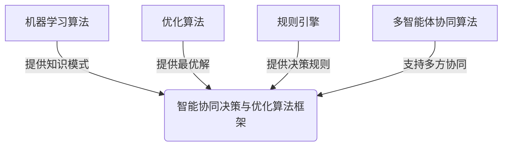

# 对抗组织熵增：AI与企业的协同

## 1. 背景介绍

### 1.1 问题的由来

在当今快节奏的商业环境中，组织面临着来自内外部的巨大压力和不确定性。全球化、技术革新和不断变化的客户需求等因素加剧了组织的复杂性,导致组织内部的混乱和无序状态不断增加,即组织熵值不断上升。这种熵增现象会降低组织的效率、响应能力和创新能力,最终影响组织的竞争力和生存能力。

组织熵增的主要表现包括:

1. 信息孤岛和数据碎片化
2. 流程低效和决策滞后  
3. 员工士气低落和创新乏力
4. 资源利用率低下和浪费严重
5. 适应环境变化的能力下降

因此,如何有效对抗组织熵增,提高组织的有序性和高效协同,已经成为当前企业家和管理者亟需解决的重大挑战。

### 1.2 研究现状

传统的组织管理方法如流程再造、绩效管理等在一定程度上能够提高组织效率,但难以根本解决熵增问题。随着人工智能(AI)技术的不断发展和应用,越来越多的研究表明,AI可以为组织熵增问题带来全新的解决方案。

目前,AI在组织管理中的应用主要集中在以下几个方面:

1. 智能决策支持系统
2. 流程自动化和优化  
3. 预测性维护和异常检测
4. 个性化推荐和客户关系管理
5. 员工协作和知识管理

这些应用虽然取得了一定成效,但大多数还停留在单点应用的阶段,缺乏整体的AI战略布局,难以充分发挥AI的协同增效作用。

### 1.3 研究意义

本文将系统阐述如何通过AI与企业的深度融合和协同,来全面对抗组织熵增,实现组织的高效协同和可持续发展。具体来说,本文的主要意义包括:

1. 构建AI赋能的智能协同框架
2. 探索AI在不同场景下的应用路径
3. 提出组织数字化转型的总体策略
4. 分析AI协同的典型案例和最佳实践
5. 展望AI协同在未来组织中的发展趋势

通过本文的研究,希望能够为企业的AI转型之路提供理论指导和实践借鉴,助力企业提升组织效能,获得可持续竞争优势。

### 1.4 本文结构

本文共分为8个部分:

1. 背景介绍:阐述研究背景、现状和意义
2. 核心概念与联系:解析AI协同的核心概念
3. 核心算法原理与步骤:介绍AI协同的关键算法
4. 数学模型和公式:建立AI协同的数学模型
5. 项目实践:提供AI协同的代码实例和解释
6. 实际应用场景:分析AI协同的典型应用案例
7. 工具和资源推荐:推荐AI协同的学习资源和工具
8. 总结与展望:总结研究成果并展望未来发展趋势

接下来,我们将逐一深入探讨每个部分的内容。

## 2. 核心概念与联系

在探讨AI如何协同企业对抗组织熵增之前,我们需要明确几个核心概念及其内在联系。

### 2.1 组织熵

熵(Entropy)概念源于热力学领域,用于描述系统的无序程度。将其引入到组织管理领域,组织熵就是指组织内部的无序、混乱和不确定性的总和。

组织熵主要来源于以下几个方面:

1. **信息熵**:信息的缺失、冗余和噪声
2. **过程熵**:流程的低效、冗余和错误  
3. **决策熵**:决策的滞后、偏差和矛盾
4. **人员熵**:人员的流失、低效和缺乏协同

组织熵值越高,意味着组织的无序程度越大,效率和创新能力就越低。因此,需要通过有效的管理手段来降低组织熵,提高有序性。

### 2.2 AI协同

AI协同(AI Collaboration)是指利用人工智能技术与人类协同工作,充分发挥人机结合的能力,以提高组织的总体效能。

AI协同的核心在于:

1. **人机合作**:人类与AI系统相互补充,发挥各自的优势
2. **跨系统协同**:多个AI系统之间、以及AI系统与其他系统之间的协同
3. **全场景覆盖**:AI协同贯穿组织的各个场景,如决策、流程、生产等
4. **持续进化**:通过不断学习,使AI协同能力持续提升

实现真正的AI协同,需要将AI深度融入到组织的各个层面和环节,并与人类形成高效的协作模式。

### 2.3 AI赋能的智能协同框架

为了充分发挥AI协同的作用,我们需要构建一个AI赋能的智能协同框架。该框架包括以下几个关键要素:

1. **数字化基础设施**:构建统一的数据平台、算力平台等基础设施
2. **AI赋能层**:集成多种AI能力,如机器学习、自然语言处理等
3. **智能应用层**:面向不同场景开发智能应用系统
4. **人机协作层**:实现人与AI系统的高效协作
5. **智能运营层**:持续优化和演进整个AI协同体系

这个多层次的AI赋能框架,为组织的智能化转型提供了系统的技术路线图和实施路径。

### 2.4 组织熵与AI协同的关系

组织熵与AI协同之间存在着内在的联系:

1. **AI协同可以降低组织熵**:通过优化信息流、流程和决策,消除冗余和低效,从而降低组织熵
2. **组织熵影响AI协同效果**:组织熵过高会影响AI系统的数据质量和应用效果,从而制约AI协同
3. **二者相互促进、形成良性循环**:AI协同降低熵值,熵值降低又优化AI协同,两者相互作用、持续改进

因此,AI协同与组织熵增是一个相互影响、相互促进的动态过程。通过有效管控这一过程,就能够最大限度地释放AI协同的能量,实现组织的高效运转。

## 3. 核心算法原理与具体操作步骤  

### 3.1 算法原理概述

要实现AI与企业的高效协同,关键在于构建一个智能化的协同决策与优化系统。该系统的核心算法主要包括:

1. **机器学习算法**:通过对历史数据的学习,发现潜在的知识模式,用于预测、决策等。
2. **优化算法**:基于优化目标和约束条件,寻找最优解或近似最优解。
3. **规则引擎**:将人类专家经验转化为可执行的规则,用于自动化决策。
4. **多智能体协同算法**:支持多个智能体(如人机代理)之间的协同决策。

这些算法相互配合,构成了一个完整的智能化协同决策与优化算法框架。

### 3.2 算法步骤详解

该算法框架的具体执行步骤如下:

1. **数据采集**:从组织的各个系统和来源采集相关数据,如业务数据、运营数据、环境数据等。

2. **数据预处理**:对采集的数据进行清洗、集成、转换等预处理,以满足后续算法的输入要求。

3. **知识发现**:基于机器学习算法,从历史数据中发现潜在的知识模式,例如客户行为模式、流程模式等。

4. **目标建模**:根据具体的应用场景,明确优化目标,如降低成本、提高效率、增加收益等。

5. **约束规则提取**:从领域专家处获取决策规则,并使用规则引擎进行形式化表示。

6. **多智能体建模**:对参与决策的各方主体(人机代理)进行智能体建模。

7. **优化求解**:将知识模式、优化目标、约束规则和智能体模型输入优化算法,求解最优或近似最优解。

8. **协同决策**:各智能体根据优化结果,通过协同机制进行决策并执行相应的行动方案。

9. **在线学习**:实时监控决策执行效果,并将反馈数据输入机器学习算法,持续优化知识模式。

10. **人机交互**:通过人机交互界面,让人类专家参与到协同决策的全过程,实现人机协作。

该算法框架贯穿了数据驱动、知识发现、优化求解和人机协同等多个环节,可以有效支撑AI与企业的智能化协同。

### 3.3 算法优缺点

上述智能协同算法框架具有以下优点:

1. **高效性**:通过机器学习和优化算法,能够快速发现最优解,提高决策效率。
2. **适应性**:算法可以持续学习,适应内外部环境的动态变化。
3. **人机融合**:有机融合人类经验和AI能力,充分发挥人机协同优势。
4. **可扩展性**:算法框架具有模块化设计,便于功能扩展和技术升级。

同时,该算法框架也存在一些不足之处:

1. **数据质量依赖**:算法的有效性高度依赖于输入数据的质量和完整性。
2. **复杂度较高**:涉及多种算法和模型,系统的构建和调优过程较为复杂。
3. **人机协同挑战**:实现高效的人机协作需要良好的人机交互设计和培训。
4. **隐私和伦理风险**:需要注意数据隐私保护和算法公平性等伦理问题。

### 3.4 算法应用领域

智能协同算法框架可以广泛应用于企业的各个领域,包括但不限于:

1. **智能决策支持**:辅助管理层进行战略决策、投资决策、风险决策等。
2. **智能流程优化**:优化业务流程,提高运营效率,降低运营成本。
3. **智能生产制造**:实现精益生产,提高产品质量,降低浪费。
4. **智能供应链管理**:优化供应链网络,提高物流效率,降低库存成本。
5. **智能营销和服务**:个性化营销,提升客户体验,增强客户粘性。
6. **智能人力资源管理**:优化人员配置,提高员工满意度和工作效率。

总的来说,智能协同算法可以广泛应用于组织的各个层面,充分发挥AI与人类的协同能力,从而全面降低组织熵,提升组织的总体效能。

## 4. 数学模型和公式及详细讲解与举例说明

### 4.1 数学模型构建

为了更好地刻画和量化AI协同对抗组织熵增的过程,我们需要构建相应的数学模型。该模型的核心要素包括:

1. **组织熵模型**:定量描述组织熵的来源和影响因素
2. **AI协同效用模型**:描述AI协同为组织带来的效用
3. **人机协作模型**:刻画人与AI系统之间的协作过程
4. **优化目标函数**:确定需要优化的目标,如最大化效用、最小化熵等

我们将组织熵定义为一个多维向量:

$$\vec{H} = (H_i, H_p, H_d, H_h)$$

其中:
- $H_i$表示信息熵,描述信息的无序程度
- $H_p$表示过程熵,描述流程的低效和冗余
- $H_d$表示决策熵,描述决策的滞后和偏差
- $H_h$表示人员熵,描述人员流失和低效

AI协同的效用函数可以定义为:

$$U = f(A, H, C)$$

其中:
- $A$表示AI系统的能力向量,包括机器学习、优化、规则推理等能力