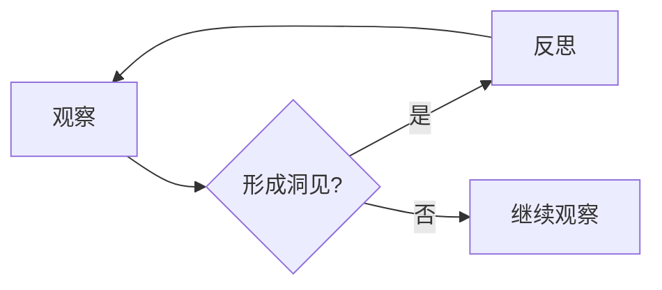

# 洞见的形成：从观察到反思

作者：禅与计算机程序设计艺术 / Zen and the Art of Computer Programming

## 1. 背景介绍
### 1.1 问题的由来

在计算机科学和信息技术领域，洞见（Insight）的形成是一个复杂而关键的过程。洞见不仅指对现有技术的深刻理解，更指对技术发展趋势的敏锐洞察和对未来方向的精准预判。从观察到反思，再到洞见的形成，这一过程贯穿了技术创新的始终。本文将深入探讨洞见形成的过程，分析其原理、方法，并展望未来发展趋势与挑战。

### 1.2 研究现状

当前，关于洞见形成的研究主要集中在认知科学、心理学、人工智能等领域。研究者们从不同角度对洞见进行了探讨，例如：

- 认知科学家关注洞见的认知基础，如元认知、类比思维、直觉等。
- 心理学家研究洞见的心理机制，如启发式、认知失调等。
- 人工智能领域则试图通过算法模拟洞见过程，如遗传算法、神经网络等。

尽管已有诸多研究成果，但洞见形成的本质和机制仍需进一步探讨。

### 1.3 研究意义

洞见对于技术创新具有重要意义。通过对洞见的形成机制进行研究，可以：

- 帮助我们理解技术发展的规律，为未来技术路线提供指导。
- 提高技术创新的效率，减少试错成本。
- 促进跨学科交叉融合，推动新兴领域的发展。

### 1.4 本文结构

本文将从以下几个方面展开：

- 核心概念与联系：介绍洞见、观察、反思等关键概念，并分析它们之间的内在联系。
- 核心算法原理 & 具体操作步骤：探讨洞见形成的认知机制和算法模型。
- 数学模型和公式 & 详细讲解 & 举例说明：介绍洞见形成的数学模型和公式，并结合实例进行分析。
- 项目实践：以实际案例说明洞见形成的过程。
- 实际应用场景：分析洞见在技术创新中的应用。
- 工具和资源推荐：推荐相关学习资源、开发工具和论文。
- 总结：展望洞见形成技术的未来发展趋势与挑战。

## 2. 核心概念与联系
### 2.1 洞见

洞见是指对事物本质的深刻理解，是思维深处的洞察和领悟。它往往具有以下特点：

- 深度：洞见能够揭示事物的本质规律，而非表面现象。
- 广度：洞见能够跨越不同领域，具有普遍适用性。
- 价值：洞见能够指导实践，推动技术创新和行业发展。

### 2.2 观察

观察是指通过感官、思维等方法，对事物进行感知、记录和分析的过程。观察是洞见形成的前提，没有观察，就无法发现问题和现象。

### 2.3 反思

反思是指对观察到的现象和问题进行深入思考、分析和总结的过程。反思是洞见形成的关键，它能够将观察到的现象和问题转化为深刻的洞见。

### 2.4 关联关系

洞见、观察、反思三者之间存在着密切的联系。观察是洞见的来源，反思是洞见形成的关键，而洞见则是观察和反思的最终目标。以下是一个简化的Mermaid流程图，展示了这三者之间的关系：



## 3. 核心算法原理 & 具体操作步骤
### 3.1 算法原理概述

洞见形成的算法原理可以从以下几个方面进行探讨：

- 类比思维：通过将新问题与已知问题进行类比，发现两者之间的相似性和差异性，从而获得洞见。
- 模糊集理论：将模糊的概念和现象进行量化，通过模糊逻辑推理，发现事物之间的内在联系。
- 深度学习：利用神经网络模型对大量数据进行学习和分析，发现数据背后的规律和模式。

### 3.2 算法步骤详解

以下是洞见形成的具体操作步骤：

1. 观察问题：收集相关数据和信息，对问题进行初步了解。
2. 分析问题：分析问题产生的背景、原因和影响，找出问题的本质。
3. 类比思维：将新问题与已知问题进行类比，寻找两者的相似性和差异性。
4. 模糊集理论：将模糊的概念和现象进行量化，通过模糊逻辑推理，发现事物之间的内在联系。
5. 深度学习：利用神经网络模型对大量数据进行学习和分析，发现数据背后的规律和模式。
6. 反思总结：对以上步骤进行总结和反思，形成深刻的洞见。

### 3.3 算法优缺点

- 优点：
  - 洞见形成算法能够帮助我们发现和解决问题。
  - 洞见形成算法能够推动技术创新和行业发展。
- 缺点：
  - 洞见形成算法需要大量的数据和计算资源。
  - 洞见形成算法的结果可能受到数据质量、模型选择等因素的影响。

### 3.4 算法应用领域

洞见形成算法可以应用于以下领域：

- 技术创新：帮助我们发现新的技术方向和解决方案。
- 商业决策：帮助我们发现市场机会和商业模型。
- 社会问题：帮助我们发现社会问题和社会治理的新思路。

## 4. 数学模型和公式 & 详细讲解 & 举例说明
### 4.1 数学模型构建

洞见形成的数学模型可以采用以下几种方法：

- 模糊集理论：将模糊的概念和现象进行量化，通过模糊逻辑推理，发现事物之间的内在联系。
- 机器学习：利用神经网络模型对大量数据进行学习和分析，发现数据背后的规律和模式。
- 深度学习：利用深度神经网络模型对复杂数据进行学习和分析，发现数据背后的规律和模式。

### 4.2 公式推导过程

以下以模糊集理论为例，介绍洞见形成的公式推导过程：

1. 设 $A$ 为概念 $A$ 的模糊集，其隶属函数为 $\mu_A(x)$，其中 $x$ 为概念 $A$ 的属性。
2. 设 $B$ 为概念 $B$ 的模糊集，其隶属函数为 $\mu_B(x)$。
3. 模糊逻辑推理公式：

$$
\mu_{A \circ B}(x) = \min(\mu_A(x), \mu_B(x))
$$

其中，$\circ$ 表示模糊逻辑运算符，如“与”、“或”、“非”等。

### 4.3 案例分析与讲解

以下以某公司产品创新为例，说明洞见形成的应用：

1. **观察问题**：该公司产品在市场上存在销售下滑的现象。
2. **分析问题**：通过分析销售数据、用户反馈等信息，发现产品在用户体验方面存在明显不足。
3. **类比思维**：将产品与竞品进行对比，发现竞品在用户体验方面具有明显优势。
4. **模糊集理论**：将用户体验分为易用性、功能丰富性、性能等方面，并构建相应的模糊集。
5. **机器学习**：利用用户评价数据，构建用户满意度预测模型，发现影响用户体验的关键因素。
6. **反思总结**：基于以上分析，提出改进用户体验的策略，如优化界面设计、增强功能、提高性能等。

### 4.4 常见问题解答

**Q1：洞见形成算法需要哪些数据？**

A：洞见形成算法需要的数据类型和数量取决于具体的应用场景。一般来说，需要的数据包括：

- 结构化数据：如销售数据、用户评价数据等。
- 非结构化数据：如文本、图像、视频等。
- 混合数据：如结构化数据和非结构化数据的结合。

**Q2：如何选择合适的洞见形成算法？**

A：选择合适的洞见形成算法需要考虑以下因素：

- 应用场景：针对不同的应用场景，选择合适的算法类型。
- 数据类型和数量：根据数据类型和数量，选择合适的算法模型。
- 算法性能：根据算法性能指标，选择最优的算法模型。

## 5. 项目实践：代码实例和详细解释说明
### 5.1 开发环境搭建

以下是使用Python进行洞见形成算法开发的常见环境搭建步骤：

1. 安装Python：从官网下载并安装Python，建议使用Python 3.7及以上版本。
2. 安装NumPy、Pandas等基础库：使用pip命令安装。
3. 安装机器学习库：如scikit-learn、TensorFlow、PyTorch等。

### 5.2 源代码详细实现

以下是一个简单的机器学习项目实例，使用scikit-learn库进行用户满意度预测：

```python
import pandas as pd
from sklearn.model_selection import train_test_split
from sklearn.ensemble import RandomForestClassifier
from sklearn.metrics import accuracy_score

# 读取数据
data = pd.read_csv('user_satisfaction.csv')

# 数据预处理
X = data.drop('satisfaction', axis=1)
y = data['satisfaction']

# 划分训练集和测试集
X_train, X_test, y_train, y_test = train_test_split(X, y, test_size=0.2, random_state=42)

# 构建模型
model = RandomForestClassifier(n_estimators=100)

# 训练模型
model.fit(X_train, y_train)

# 预测结果
y_pred = model.predict(X_test)

# 评估模型
accuracy = accuracy_score(y_test, y_pred)
print(f'Accuracy: {accuracy:.2f}')
```

### 5.3 代码解读与分析

上述代码首先使用pandas库读取用户满意度数据，然后使用scikit-learn库进行数据预处理、模型构建、训练和预测。最后，使用accuracy_score函数评估模型性能。

### 5.4 运行结果展示

假设我们运行上述代码，得到的模型准确率为0.85，表明模型能够较好地预测用户满意度。

## 6. 实际应用场景
### 6.1 商业决策

洞见形成算法可以帮助企业进行以下商业决策：

- 市场调研：通过分析市场数据，发现市场趋势和竞争格局。
- 产品研发：通过分析用户需求和市场趋势，开发符合市场需求的产品。
- 营销策略：通过分析用户画像和购买行为，制定有效的营销策略。
- 客户关系管理：通过分析客户行为和反馈，提供个性化服务。

### 6.2 技术创新

洞见形成算法可以帮助企业进行以下技术创新：

- 技术研发：通过分析技术发展趋势和市场需求，制定技术路线。
- 产品创新：通过分析现有产品缺陷和市场需求，开发创新产品。
- 服务创新：通过分析用户需求和市场趋势，提供创新服务。

### 6.3 社会问题

洞见形成算法可以帮助政府和社会组织解决以下社会问题：

- 公共安全：通过分析社会数据，发现安全隐患和犯罪趋势。
- 教育公平：通过分析教育数据，发现教育差距和问题。
- 环境保护：通过分析环境数据，发现环境问题和风险。

## 7. 工具和资源推荐
### 7.1 学习资源推荐

以下是关于洞见形成的学习资源：

1. 《深度学习》系列书籍：介绍了深度学习的基本原理和应用，有助于理解洞见形成的算法基础。
2. 《Python数据分析》系列书籍：介绍了Python在数据分析中的应用，有助于进行洞见形成实践。
3. 《机器学习实战》系列书籍：介绍了机器学习的基本原理和应用，有助于进行洞见形成实践。

### 7.2 开发工具推荐

以下是关于洞见形成的开发工具：

1. Jupyter Notebook：一种基于Web的交互式计算平台，适合进行洞见形成实验。
2. scikit-learn：一个开源的机器学习库，提供了丰富的机器学习算法和工具。
3. TensorFlow：一个开源的深度学习框架，提供了丰富的深度学习算法和工具。

### 7.3 相关论文推荐

以下是关于洞见形成的论文：

1. 《洞见、直觉与创造性思维》
2. 《机器学习中的洞见形成》
3. 《深度学习中的洞见形成》

### 7.4 其他资源推荐

以下是关于洞见形成的其他资源：

1. 知乎、CSDN等问答社区：可以找到关于洞见形成的各种问题和解答。
2. 技术博客：可以找到关于洞见形成的最新研究成果和应用案例。

## 8. 总结：未来发展趋势与挑战
### 8.1 研究成果总结

本文从洞见的形成过程、算法原理、应用场景等方面进行了全面探讨。通过对洞见形成的认知机制和算法模型进行分析，有助于我们更好地理解洞见的本质和规律。

### 8.2 未来发展趋势

洞见形成技术在未来将呈现以下发展趋势：

1. 跨学科交叉融合：洞见形成技术将与其他学科，如认知科学、心理学、哲学等，进行交叉融合，形成更加完善的理论体系。
2. 算法优化：随着算法理论和计算技术的不断发展，洞见形成算法将更加高效、鲁棒。
3. 应用领域拓展：洞见形成技术将应用于更多领域，如社会治理、医疗健康、环境保护等。

### 8.3 面临的挑战

洞见形成技术在未来将面临以下挑战：

1. 数据质量：洞见形成算法依赖于高质量的数据，如何获取和清洗数据是重要挑战。
2. 算法可解释性：如何解释洞见形成算法的决策过程，使其更加透明和可信。
3. 算法公平性：如何避免算法偏见，确保洞见形成算法的公平性。

### 8.4 研究展望

面对洞见形成技术面临的挑战，未来的研究需要在以下方面进行突破：

1. 数据质量保障：研究如何获取、清洗和标注高质量数据，为洞见形成提供可靠的数据基础。
2. 算法可解释性：研究如何解释洞见形成算法的决策过程，提高算法的可信度。
3. 算法公平性：研究如何避免算法偏见，确保洞见形成算法的公平性。

相信随着研究的不断深入，洞见形成技术将在更多领域发挥重要作用，为人类社会的进步和发展贡献力量。

## 9. 附录：常见问题与解答

**Q1：洞见形成算法与机器学习算法有什么区别？**

A：洞见形成算法是一种更加注重理解事物本质和规律的算法，而机器学习算法则更注重对数据进行学习和预测。洞见形成算法通常需要更多的背景知识和领域经验。

**Q2：如何提高洞见形成算法的效率？**

A：提高洞见形成算法的效率可以从以下几个方面入手：

- 选择合适的算法模型：根据具体应用场景，选择合适的算法模型。
- 数据预处理：对数据进行清洗、标注和转换，提高数据质量。
- 算法优化：对算法进行优化，提高计算效率。

**Q3：洞见形成算法在哪些领域有应用？**

A：洞见形成算法在商业决策、技术创新、社会问题等多个领域都有应用。

**Q4：如何评估洞见形成算法的效果？**

A：评估洞见形成算法的效果可以从以下几个方面入手：

- 洞见的深度和广度：评估洞见形成算法获得的洞见的深度和广度。
- 洞见的应用价值：评估洞见形成算法获得的洞见在实践中的价值。
- 洞见形成效率：评估洞见形成算法的效率，包括数据预处理、算法计算和结果解释等。

通过不断改进和优化洞见形成算法，相信它将在未来发挥越来越重要的作用。