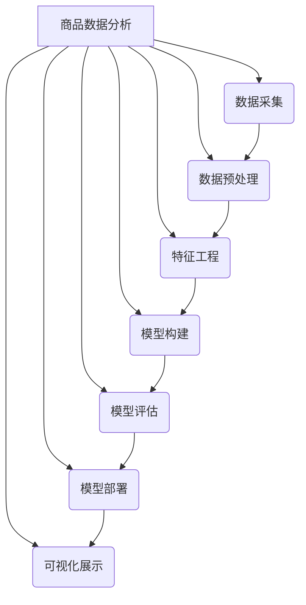
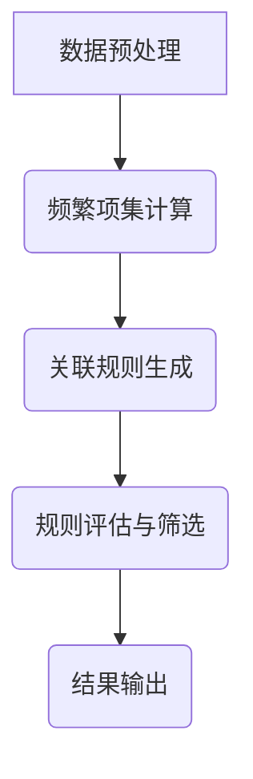

# 电商平台中商品数据分析功能的设计与实现

## 1. 背景介绍

### 1.1 问题的由来

在当今电子商务蓬勃发展的时代，电商平台上的商品数据日益庞大和复杂。有效地分析和利用这些数据对于电商平台的运营和决策至关重要。商品数据分析可以帮助电商平台了解用户的购买偏好、发现销售趋势、优化商品定价和库存管理等。然而,由于数据量巨大且多样化,传统的数据分析方法往往效率低下且难以发现深层次的见解。因此,设计和实现一个高效、智能的商品数据分析功能成为电商平台发展的迫切需求。

### 1.2 研究现状

目前,已有一些研究针对电商平台的商品数据分析问题提出了不同的解决方案。例如,基于关联规则挖掘的购物篮分析、基于协同过滤的个性化推荐系统、基于时间序列分析的销售预测模型等。然而,这些方法往往只关注于单一任务,难以全面地解决商品数据分析的复杂性。另一方面,随着大数据和人工智能技术的发展,一些新兴的数据分析方法也被应用于电商领域,如深度学习、自然语言处理和知识图谱等,展现出巨大的潜力。

### 1.3 研究意义

设计和实现一个高效、智能的商品数据分析功能,对于电商平台的发展具有重要意义:

1. 提高决策效率:通过对海量商品数据进行深入分析,电商平台可以更好地了解用户需求、发现销售趋势,从而做出更加准确的营销决策和商品策略。

2. 优化用户体验:基于用户购买行为和偏好的分析,电商平台可以为用户提供个性化的商品推荐和搜索服务,提升用户体验。

3. 提高运营效率:通过对库存、定价等数据的分析,电商平台可以优化库存管理、定价策略,降低运营成本。

4. 促进创新发展:智能化的商品数据分析功能可以帮助电商平台发现新的商机,促进业务创新和可持续发展。

### 1.4 本文结构

本文将从以下几个方面详细阐述电商平台中商品数据分析功能的设计与实现:

1. 核心概念与联系
2. 核心算法原理与具体操作步骤
3. 数学模型和公式详细讲解与举例说明
4. 项目实践:代码实例和详细解释说明
5. 实际应用场景
6. 工具和资源推荐
7. 总结:未来发展趋势与挑战
8. 附录:常见问题与解答

## 2. 核心概念与联系

在设计和实现电商平台的商品数据分析功能时,需要涉及多个核心概念,这些概念相互关联,共同构建了完整的分析框架。以下是一些核心概念及其联系:

1. **数据采集**: 从电商平台的各个数据源(如交易记录、用户浏览记录、商品描述等)收集相关数据,为后续分析奠定基础。

2. **数据预处理**: 对采集到的原始数据进行清洗、转换、集成等处理,以提高数据质量和一致性。

3. **特征工程**: 从预处理后的数据中提取有意义的特征,这些特征将作为模型输入,对模型的性能至关重要。

4. **模型构建**: 根据具体的分析任务(如销售预测、用户画像等),选择合适的机器学习或深度学习模型,并使用特征数据对模型进行训练。

5. **模型评估**: 使用测试数据对训练好的模型进行评估,确保模型的性能满足要求。

6. **模型部署**: 将评估通过的模型部署到生产环境中,为实际的商品数据分析任务服务。

7. **可视化展示**: 将分析结果以直观的形式(如图表、报告等)呈现给决策者和用户,方便理解和使用。

这些核心概念相互关联、环环相扣,共同构建了一个完整的商品数据分析流程。在实际应用中,可能需要根据具体需求对这些概念进行调整和优化。

## 3. 核心算法原理与具体操作步骤

### 3.1 算法原理概述

在电商平台的商品数据分析中,常见的算法包括:

1. **关联规则挖掘**: 用于发现商品之间的关联关系,例如发现哪些商品经常被一起购买。常用的算法有Apriori算法和FP-Growth算法。

2. **协同过滤**: 用于基于用户的历史行为数据(如购买记录、浏览记录等)进行个性化推荐。常见的算法有基于用户的协同过滤和基于物品的协同过滤。

3. **时间序列分析**: 用于预测商品的未来销售趋势,例如基于历史销售数据预测未来一段时间的销售量。常用的算法有ARIMA模型、指数平滑模型等。

4. **聚类分析**: 用于根据商品的特征对商品进行分组,发现具有相似特征的商品集合。常见的算法有K-Means聚类、层次聚类等。

5. **文本挖掘**: 用于从商品描述、评论等非结构化文本数据中提取有用信息,例如提取商品特征、情感分析等。常用的算法有TF-IDF、主题模型等。

6. **深度学习**: 近年来,深度学习在商品数据分析中的应用越来越广泛,如用于图像识别、自然语言处理、推荐系统等。常见的模型有卷积神经网络(CNN)、循环神经网络(RNN)、注意力机制等。

这些算法各有特点,需要根据具体的分析任务选择合适的算法。在实际应用中,往往需要将多种算法相结合,以获得更好的分析效果。

### 3.2 算法步骤详解

以关联规则挖掘算法Apriori为例,其具体步骤如下:

1. **数据预处理**:
   - 对原始交易数据进行清洗和转换,将其转化为适合算法处理的形式。
   - 通常将每个交易记录表示为一个集合,其中包含该交易中出现的所有商品项目。

2. **频繁项集计算**:
   - 设定最小支持度阈值,扫描数据集,统计每个商品项目集在整个数据集中出现的频率。
   - 保留支持度大于阈值的项目集,称为频繁项集。
   - 使用剪枝策略,避免对非频繁项集进行进一步计算,提高效率。

3. **关联规则生成**:
   - 设定最小置信度阈值。
   - 对于每个频繁项集,根据其子集生成候选关联规则。
   - 计算每条规则的置信度,保留置信度大于阈值的规则。

4. **规则评估与筛选**:
   - 使用其他指标(如lift、conviction等)对生成的规则进行进一步评估和筛选。
   - 根据实际需求,选择合适的规则集。

5. **结果输出**:
   - 将筛选后的规则集以易于理解的形式输出,供决策者和分析人员使用。

在实际应用中,可能需要对算法进行优化和改进,以提高效率和准确性。例如,使用哈希技术或并行计算来加速频繁项集的计算;使用多重最小支持度阈值来发现更多有价值的规则等。

### 3.3 算法优缺点

**Apriori算法的优点**:

1. 简单直观,原理易于理解。
2. 可以发现数据集中有价值的关联规则。
3. 通过设置最小支持度和置信度阈值,可以控制规则的质量。

**Apriori算法的缺点**:

1. 对于大型数据集,算法效率较低,尤其是在频繁项集计算阶段。
2. 需要多次扫描数据集,I/O开销较大。
3. 对于一些特殊的数据分布,算法可能会产生大量候选项集,导致内存占用过高。
4. 算法无法发现低支持度但有价值的规则。

### 3.4 算法应用领域

关联规则挖掘算法在电商平台的商品数据分析中有广泛应用,主要包括:

1. **购物篮分析**: 发现经常一起购买的商品集合,为交叉销售和打包销售提供依据。

2. **个性化推荐**: 结合用户的购买历史,推荐相关的商品。

3. **目录设计**: 根据商品之间的关联关系,优化商品的分类和展示方式。

4. **促销策略制定**: 分析哪些商品组合可以产生最大的销售额,为促销活动提供建议。

5. **网页个性化**: 根据用户的浏览记录,在网页上推荐相关商品。

除了电商领域,关联规则挖掘算法还可应用于其他场景,如基因分析、网络入侵检测、社交网络分析等。

## 4. 数学模型和公式详细讲解与举例说明

在商品数据分析中,常常需要使用数学模型和公式来量化和描述相关概念。以下是一些常见的数学模型和公式,以及详细的讲解和举例说明。

### 4.1 数学模型构建

**关联规则模型**:

关联规则模型用于描述商品项目集合之间的关联关系。一条关联规则可以表示为:

$$
X \Rightarrow Y
$$

其中,X和Y是不相交的商品项目集合,称为前件(antecedent)和后件(consequent)。

该规则的支持度(support)和置信度(confidence)定义如下:

$$
\text{support}(X \Rightarrow Y) = P(X \cup Y)
$$

$$
\text{confidence}(X \Rightarrow Y) = P(Y|X) = \frac{P(X \cup Y)}{P(X)}
$$

- 支持度表示事务数据集中同时包含X和Y的比例,反映了规则的普遍性。
- 置信度表示在包含X的事务中,同时包含Y的比例,反映了规则的可信程度。

通常,我们会设置最小支持度和置信度阈值,只保留支持度和置信度超过阈值的规则。

**举例**:

假设我们从一个电商平台的交易数据中发现以下规则:

$$
\{\text{牛奶}\} \Rightarrow \{\text{面包}\}
$$

$$
\text{support}(\{\text{牛奶}\} \Rightarrow \{\text{面包}\}) = 0.03
$$

$$
\text{confidence}(\{\text{牛奶}\} \Rightarrow \{\text{面包}\}) = 0.75
$$

这意味着,在所有交易中,3%同时购买了牛奶和面包;而在购买了牛奶的交易中,75%也购买了面包。如果我们设置最小支持度为0.02,最小置信度为0.7,那么这条规则将被保留下来。

### 4.2 公式推导过程

**Apriori算法中的频繁项集计算**:

在Apriori算法中,频繁项集的计算是一个关键步骤。我们需要从大量的候选项集中找出支持度超过阈值的频繁项集。

假设数据集D包含n个事务,最小支持度阈值为min_sup。对于一个项集X,我们定义:

- 支持计数(support count): $\text{sup_count}(X) = |\{t \in D | X \subseteq t\}|$,表示包含X的事务数量。
- 支持度(support): $\text{sup}(X) = \frac{\text{sup_count}(X)}{n}$,表示包含X的事务占总事务的比例。

我们的目标是找出所有支持度不小于min_sup的项集,即频繁项集。

Apriori算法基于一个重要