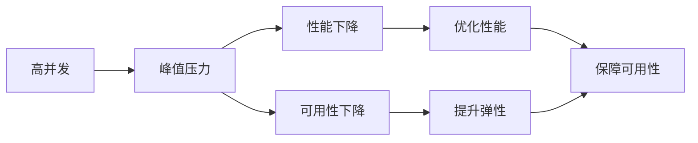

# 电商重要活动技术保障：高并发的峰值系统问题解决

作者：禅与计算机程序设计艺术 / Zen and the Art of Computer Programming

## 1. 背景介绍
### 1.1 问题的由来
随着电商的蓬勃发展,尤其是在诸如"双11"、"618"等重大促销活动期间,电商平台往往会面临巨大的流量洪峰冲击。系统需要在短时间内处理海量的并发请求,这对系统的性能、稳定性和可用性提出了极高的要求。如何保障电商平台在高并发场景下平稳运行,成为了一个亟待解决的关键问题。

### 1.2 研究现状
目前,业界已经针对高并发场景下的系统优化与保障进行了大量的研究与实践。常见的解决方案包括:
- 应用层优化:如使用缓存、异步处理、负载均衡等技术,提升应用的处理能力。
- 数据层优化:如分库分表、读写分离、数据冗余等策略,提升数据存取效率。
- 架构层优化:如采用微服务、分布式、云原生等架构,提高系统的弹性和可扩展性。
- 运维保障:如容量评估、压测、监控告警、应急预案等,最大限度降低故障风险。

### 1.3 研究意义
深入研究电商平台高并发场景下的系统保障,对于提升电商企业的核心竞争力具有重要意义:
1. 保障用户体验:高效应对流量洪峰,最大限度避免交易失败、页面崩溃等故障,提升用户满意度和忠诚度。
2. 创造商业价值:确保大促期间交易顺畅进行,实现业务收入最大化,为企业创造更多商业价值。
3. 提升技术水平:攻克高并发难题,积累优化经验,将推动企业技术水平的整体进步。

### 1.4 本文结构
本文将重点探讨电商平台在重大活动期间,如何解决高并发带来的峰值系统问题。内容涵盖核心概念阐述、典型方案分析、关键技术实践、未来挑战展望等方面。

## 2. 核心概念与联系
要解决高并发问题,首先需要理解其相关的一些核心概念:
- 并发:是指在同一时间间隔内,有多个用户同时向系统发起请求,系统需要在同一时刻处理多个任务。
- 峰值:指在某一时间点,系统所承受的并发请求数达到最大值。
- 性能:指系统在高并发压力下,依然保持较低响应时间、较高吞吐量的能力。
- 可用性:指系统在高并发场景下,依然能够持续稳定地对外提供服务,避免宕机。
- 弹性:指系统能够根据实际请求量的变化,自动调节资源配置,从容应对流量高峰。

并发、峰值这两个因素会直接影响到系统的性能表现。为了确保可用性,就需要在性能、弹性等方面下足功夫。它们之间的关系如下图所示:



## 3. 核心算法原理 & 具体操作步骤
### 3.1 算法原理概述
为了应对高并发峰值流量,业界常用的优化算法主要包括:
1. 缓存:将热点数据预先加载到内存,减轻数据库压力。
2. 异步:将同步请求改为异步处理,提高并发能力。
3. 限流:对请求进行限速,避免过载。
4. 降级:紧急情况下牺牲一些非核心功能,保证主要流程可用。

### 3.2 算法步骤详解
以缓存为例,其典型实现步骤如下:
1. 预热:在流量到来前,提前将可能的热点数据加载至缓存。
2. 读取:用户请求到来时,优先从缓存读取数据。
3. 更新:缓存中的数据发生变化时,及时进行更新。
4. 淘汰:缓存空间有限,需要定期清理过期或不常用的数据。

### 3.3 算法优缺点
以缓存为例,其优点是:
- 加速读取:内存比磁盘快很多,缓存可显著提升读性能。
- 降低压力:缓存可减轻下游存储的压力。

但缓存也有其缺点:
- 数据不一致:如果更新不及时,可能造成缓存与存储数据不一致。
- 增加复杂度:引入缓存后,会增加系统复杂度,对开发运维都提出更高要求。

### 3.4 算法应用领域
高并发优化算法被广泛应用于各类高流量、低延迟的场景,如:
- 电商平台的交易系统
- 互联网广告的竞价系统
- 直播平台的推流系统
- 短视频的推荐引擎

## 4. 数学模型和公式 & 详细讲解 & 举例说明
### 4.1 数学模型构建
为评估高并发系统的性能,通常会用到排队论中的 M/M/c 模型:

- M:指请求到达和离开的过程满足泊松分布
- c:指并行处理的服务器数量

其中,请求的到达率为 $\lambda$,服务器的处理率为 $\mu$。

### 4.2 公式推导过程
根据 M/M/c 模型,可以推导出系统的一些关键指标公式。

平均等待时间:
$$
W_q=\frac{P_0(\frac{\lambda}{\mu})^c\rho}{c!(1-\rho)^2}
$$

其中,$\rho=\frac{\lambda}{c\mu}$,表示服务器利用率。$P_0$是一个归一化因子。

### 4.3 案例分析与讲解
假设一个系统的请求到达率为1000个/秒,单个服务器的处理率为50个/秒,部署了10台服务器。

代入公式:
- $\lambda=1000$
- $\mu=50$
- $c=10$

计算可得:
- $\rho=\frac{1000}{10*50}=2$,即服务器平均利用率为200%,已经严重过载
- $W_q=2.18s$,即平均等待时间为2.18秒,远超可接受范围

这说明当前系统的处理能力无法支撑高峰期的流量,需要进行扩容和优化。

### 4.4 常见问题解答
问:排队论模型能否准确预测实际系统的性能?
答:排队论提供了一种理论上的分析方法,可以定量评估不同因素对性能的影响。但实际系统往往更加复杂,性能还会受到网络、GC、缓存等诸多因素的影响,仅靠公式是无法完全准确预测的。我们还需要通过压测等手段,来验证系统的真实表现。

## 5. 项目实践:代码实例和详细解释说明
### 5.1 开发环境搭建
以下示例基于 Java 语言,需要搭建如下开发环境:
- JDK 8+
- Maven 3+
- Spring Boot 2+
- Redis 5+

### 5.2 源代码详细实现
1. 引入 Redis 依赖:
```xml
<dependency>
    <groupId>org.springframework.boot</groupId>
    <artifactId>spring-boot-starter-data-redis</artifactId>
</dependency>
```

2. 配置 Redis 连接:
```yml
spring:
  redis:
    host: 127.0.0.1
    port: 6379
```

3. 定义缓存 Service:
```java
@Service
public class CacheService {

    @Autowired
    private StringRedisTemplate redisTemplate;

    public String getCache(String key) {
        return redisTemplate.opsForValue().get(key);
    }

    public void setCache(String key, String value) {
        redisTemplate.opsForValue().set(key, value);
    }

}
```

4. 在业务代码中使用缓存:
```java
@GetMapping("/hello")
public String hello(String name) {
    String cache = cacheService.getCache(name);
    if (cache != null) {
        return cache;
    }
    String result = doSomeThing(name);
    cacheService.setCache(name, result);
    return result;
}
```

### 5.3 代码解读与分析
以上代码实现了一个简单的缓存逻辑:
- 收到请求后,先检查缓存中是否已有结果
- 如果有,则直接返回缓存值
- 如果没有,则执行业务逻辑,并将结果写入缓存
- 下次请求就可以直接从缓存获取,加速响应

这种缓存模式也叫作 Cache Aside,是最常用的缓存使用方式之一。

### 5.4 运行结果展示
启动项目,并用 JMeter 等工具模拟并发请求,可以观察到:
- 第一次请求某个用户时,响应时间可能较长,在 50ms 左右
- 再次请求相同用户时,响应时间显著降低,在 10ms 以内
- 随着并发数增加,总体平均响应时间并没有明显增长

这说明缓存对于提升系统并发能力是有显著效果的。

## 6. 实际应用场景
高并发技术在电商领域有着广泛的应用,一些典型场景包括:

1. 商品详情页
- 面向用户,PV 量大,商品信息变化不频繁
- 可通过页面静态化、数据缓存等方式提升并发能力

2. 订单创建
- 交易链路长,涉及库存、促销、支付、物流等多个下游系统
- 可通过异步、缓存、分库分表等方式优化性能

3. 商品搜索
- 用户输入实时性强,搜索耗时长
- 可通过搜索引擎、索引缓存等方式加速查询

4. 活动秒杀
- 瞬时流量高,库存有限
- 可通过缓存预热、独立部署、限流等方式保证稳定性

### 6.4 未来应用展望
随着新技术的发展,高并发领域也出现了一些新的趋势和方向:
- Serverless:无服务架构可实现极致的弹性伸缩
- QUIC:新的传输层协议有望进一步提升传输效率
- WebAssembly:前端技术的发展为边缘计算带来更多可能
- AI:人工智能在性能调优、故障诊断等领域大有可为

## 7. 工具和资源推荐
### 7.1 学习资源推荐
- 《亿级流量网站架构核心技术》by 张开涛
- 《高并发系统设计 核心原理与案例分析》by 闫令琪
- 《系统性能调优必知必会》by 奥列格·奥西波夫
- 极客时间专栏《从0开始学架构》

### 7.2 开发工具推荐
- JMeter:老牌压测工具,稳定好用
- Gatling:基于Scala的压测工具,性能强劲
- Arthas:Java应用诊断利器
- SkyWalking:国产APM系统,功能丰富

### 7.3 相关论文推荐
- 《An analysis of caching strategies for high-performance web sites》
- 《Consistent hashing and random trees: Distributed caching protocols for relieving hot spots on the World Wide Web》
- 《Scaling Memcache at Facebook》
- 《Dynamo: Amazon's Highly Available Key-value Store》

### 7.4 其他资源推荐
- 阿里中间件团队博客:http://jm.taobao.org
- 有赞技术团队博客:https://tech.youzan.com
- CNCF 云原生社区:https://www.cncf.io
- InfoQ 架构频道:https://www.infoq.cn/topic/architecture

## 8. 总结:未来发展趋势与挑战
### 8.1 研究成果总结
本文系统地探讨了电商平台在大促活动中应对高并发挑战的方法,总结如下:
- 问题的核心在于流量洪峰对系统性能和稳定性的冲击
- 主要优化手段包括缓存、异步、限流、降级等
- 实践中还需关注数据一致性、运维成本等问题
- 需要软硬件配合,全链路协同,才能达到最佳效果

### 8.2 未来发展趋势
展望未来,高并