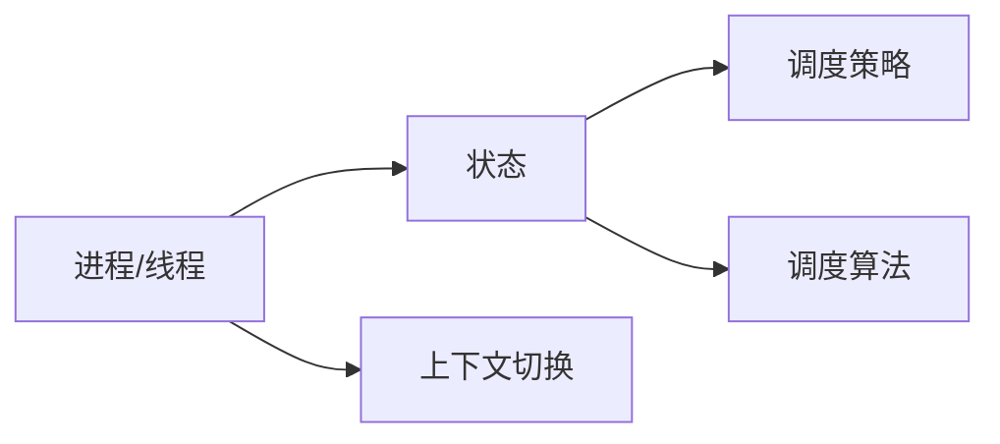

# 调度器 原理与代码实例讲解

作者：禅与计算机程序设计艺术 / Zen and the Art of Computer Programming 

## 1. 背景介绍
### 1.1 问题的由来

在计算机系统中，调度器（Scheduler）是操作系统核心组件之一，负责管理系统中进程、线程等执行单元的执行顺序。高效可靠的调度策略对于保证系统性能、提高资源利用率、提升用户满意度至关重要。调度器的研究始于操作系统诞生之初，至今已发展出多种调度算法，本文将深入探讨调度器的原理及其应用。

### 1.2 研究现状

近年来，随着计算机硬件和软件的快速发展，调度器技术也取得了显著进步。常见的调度算法包括：

- 先来先服务（FCFS）
- 最短作业优先（SJF）
- 优先级调度
- 最短剩余时间优先（SRTF）
- 轮转调度（RR）
- 多级反馈队列调度
- 离散事件模拟
- 等等

这些算法各有优缺点，针对不同的应用场景和硬件环境，选择合适的调度策略至关重要。

### 1.3 研究意义

调度器的研究对于提高计算机系统性能、优化资源利用率、提升用户满意度具有重要意义：

- 提高系统吞吐量：合理调度可以提高CPU利用率，减少CPU空闲时间，提高系统吞吐量。
- 降低平均等待时间：合理调度可以缩短进程等待时间，提高用户体验。
- 资源利用率最大化：合理调度可以使CPU、内存、I/O等资源得到最大化利用。
- 支持多任务处理：调度器支持多任务处理，提高系统并发性。

### 1.4 本文结构

本文将围绕调度器展开，首先介绍其核心概念和联系，然后深入探讨常见调度算法的原理和具体操作步骤，并结合代码实例进行讲解。最后，分析调度器在实际应用中的场景，展望未来发展趋势与挑战。

## 2. 核心概念与联系

为了更好地理解调度器，本节将介绍几个密切相关的核心概念：

- 进程（Process）：进程是系统进行资源分配和调度的基本单位，拥有独立的内存空间、执行指令、数据表等。
- 线程（Thread）：线程是进程中的一个实体，共享进程的资源，能够并发执行。
- 状态（State）：进程和线程可以处于多种状态，如就绪态、运行态、阻塞态、创建态、终止态等。
- 上下文切换（Context Switch）：切换进程或线程的执行环境，包括寄存器值、程序计数器、内存映射等。
- 调度策略（Scheduling Policy）：指调度器根据什么原则和标准进行进程或线程的调度。
- 调度算法（Scheduling Algorithm）：指实现特定调度策略的具体方法。

这些概念之间的逻辑关系如下：



可以看出，进程和线程是系统进行资源分配和调度的基本单位，它们可以处于不同的状态，调度策略和调度算法决定了进程或线程的执行顺序。上下文切换是调度器实现进程或线程切换的核心操作。

## 3. 核心算法原理 & 具体操作步骤
### 3.1 算法原理概述

调度算法是调度器的核心，决定了进程或线程的执行顺序。以下介绍几种常见的调度算法及其原理：

**3.1.1 先来先服务（FCFS）**

FCFS算法按照进程或线程到达就绪队列的先后顺序进行调度。优点是简单易实现，公平性较好；缺点是会导致长作业饥饿，平均等待时间较长。

**3.1.2 最短作业优先（SJF）**

SJF算法根据作业所需执行时间进行调度，优先调度执行时间最短的作业。优点是平均等待时间短，系统吞吐量高；缺点是可能导致短作业频繁切换，长作业饥饿。

**3.1.3 优先级调度**

优先级调度根据进程或线程的优先级进行调度，优先级高的进程或线程优先执行。优点是能够满足重要进程或线程的需求；缺点是可能导致低优先级进程或线程饥饿。

**3.1.4 轮转调度（RR**）

RR算法将CPU时间片分配给就绪队列中的每个进程或线程，时间片用完后，将该进程或线程放回就绪队列末尾，继续执行下一个进程或线程。优点是公平性好，响应速度快；缺点是可能导致调度开销较大。

**3.1.5 多级反馈队列调度**

多级反馈队列调度结合了优先级调度和轮转调度的优点，将进程或线程分为多个队列，每个队列使用不同的优先级和轮转时间片。优点是能够兼顾公平性和响应速度；缺点是实现复杂，需要动态调整队列参数。

### 3.2 算法步骤详解

以下以FCFS算法为例，详细介绍其具体操作步骤：

1. 将进程或线程按到达时间顺序插入就绪队列。
2. 从就绪队列中取出第一个进程或线程，分配CPU资源并执行。
3. 当进程或线程执行完毕、阻塞、等待I/O等操作时，将其状态修改为阻塞态或就绪态，并重新插入就绪队列。
4. 重复步骤2和3，直到所有进程或线程执行完毕。

### 3.3 算法优缺点

不同调度算法具有不同的优缺点，以下列举几种常见调度算法的优缺点：

- FCFS：优点是简单易实现，公平性较好；缺点是导致长作业饥饿，平均等待时间较长。
- SJF：优点是平均等待时间短，系统吞吐量高；缺点是可能导致短作业频繁切换，长作业饥饿。
- 优先级调度：优点是能够满足重要进程或线程的需求；缺点是可能导致低优先级进程或线程饥饿。
- RR：优点是公平性好，响应速度快；缺点是可能导致调度开销较大。
- 多级反馈队列调度：优点是能够兼顾公平性和响应速度；缺点是实现复杂，需要动态调整队列参数。

### 3.4 算法应用领域

不同调度算法适用于不同的应用场景和硬件环境，以下列举几种常见调度算法的应用领域：

- FCFS：适用于对响应速度要求不高的系统。
- SJF：适用于对响应速度要求较高的实时系统。
- 优先级调度：适用于多任务处理系统，如操作系统、网络协议栈等。
- RR：适用于交互式系统，如图形用户界面、游戏等。
- 多级反馈队列调度：适用于通用操作系统、多任务处理系统等。

## 4. 数学模型和公式 & 详细讲解 & 举例说明
### 4.1 数学模型构建

为了量化调度算法的性能，可以使用以下数学模型进行评估：

- 平均等待时间（Average Waiting Time，AWT）：指进程或线程在系统中平均等待的时间，计算公式为：

  $$
AWT = \frac{1}{N} \sum_{i=1}^N W_i
$$

  其中，$N$ 为进程或线程数量，$W_i$ 为第 $i$ 个进程或线程的等待时间。

- 平均周转时间（Average Turnaround Time，ATAT）：指进程或线程在系统中完成所需的总时间，计算公式为：

  $$
ATAT = \frac{1}{N} \sum_{i=1}^N T_i
$$

  其中，$N$ 为进程或线程数量，$T_i$ 为第 $i$ 个进程或线程的周转时间。

- 系统吞吐量（Throughput）：指单位时间内系统完成的进程或线程数量，计算公式为：

  $$
Throughput = \frac{N}{T}
$$

  其中，$N$ 为单位时间内完成的进程或线程数量，$T$ 为单位时间。

### 4.2 公式推导过程

以FCFS算法为例，推导AWT和ATAT的计算公式。

**AWT推导**：

FCFS算法中，进程或线程的等待时间等于其到达时间与开始执行时间之差。因此，AWT的计算公式为：

$$
AWT = \frac{1}{N} \sum_{i=1}^N (t_i - r_i)
$$

其中，$t_i$ 为第 $i$ 个进程或线程的到达时间，$r_i$ 为第 $i$ 个进程或线程的开始执行时间。

**ATAT推导**：

FCFS算法中，进程或线程的周转时间等于其开始执行时间与完成时间之差。因此，ATAT的计算公式为：

$$
ATAT = \frac{1}{N} \sum_{i=1}^N (r_i - a_i)
$$

其中，$r_i$ 为第 $i$ 个进程或线程的开始执行时间，$a_i$ 为第 $i$ 个进程或线程的到达时间。

### 4.3 案例分析与讲解

以下以一个简单的FCFS调度实例，分析AWT和ATAT的计算过程。

假设有3个进程，其到达时间、执行时间如下：

| 进程编号 | 到达时间 | 执行时间 |
| :------: | :------: | :------: |
|    1     |    0     |    3     |
|    2     |    1     |    2     |
|    3     |    2     |    2     |

按照FCFS调度算法，进程的执行顺序为1-2-3，计算AWT和ATAT：

- AWT：

  $$
AWT = \frac{1}{3} \times (3 - 0 + 1 - 1 + 2 - 2) = 1
$$

- ATAT：

  $$
ATAT = \frac{1}{3} \times (3 - 0 + 2 - 1 + 4 - 2) = 2
$$

可以看到，FCFS调度算法下，AWT为1，ATAT为2。这表明进程1的等待时间最短，而进程3的等待时间最长。ATAT也反映了进程3的周转时间最长。

### 4.4 常见问题解答

**Q1：FCFS调度算法的缺点是什么？**

A: FCFS调度算法的主要缺点是可能导致长作业饥饿，平均等待时间较长。当长作业到达就绪队列时，短作业可能会不断抢占CPU时间，导致长作业等待时间过长。

**Q2：SJF调度算法的缺点是什么？**

A: SJF调度算法的主要缺点是可能导致短作业频繁切换，长作业饥饿。当短作业不断到达时，长作业可能会长时间得不到执行。

**Q3：优先级调度算法的缺点是什么？**

A: 优先级调度算法的主要缺点是可能导致低优先级进程或线程饥饿。当高优先级进程或线程不断到达时，低优先级进程或线程可能会长时间得不到执行。

**Q4：RR调度算法的缺点是什么？**

A: RR调度算法的主要缺点是可能导致调度开销较大。每次时间片结束时，都需要进行进程或线程的切换，增加了CPU的负担。

**Q5：多级反馈队列调度算法的缺点是什么？**

A: 多级反馈队列调度算法的主要缺点是实现复杂，需要动态调整队列参数，以适应不同应用场景和硬件环境。

## 5. 项目实践：代码实例和详细解释说明
### 5.1 开发环境搭建

在进行调度器代码实践之前，我们需要准备以下开发环境：

1. 安装Python：从Python官网下载并安装Python 3.x版本。
2. 安装PyPy：使用PyPy可以提高Python代码的执行速度，从PyPy官网下载并安装。
3. 安装Pillow库：用于图像处理，安装命令为 `pip install Pillow`。
4. 安装matplotlib库：用于绘图，安装命令为 `pip install matplotlib`。

完成以上步骤后，即可开始调度器代码实践。

### 5.2 源代码详细实现

以下是一个简单的FCFS调度器代码实现：

```python
from queue import Queue

class Process:
    def __init__(self, pid, arrival_time, execution_time):
        self.pid = pid
        self.arrival_time = arrival_time
        self.execution_time = execution_time
        self.waiting_time = 0
        self.turnaround_time = 0

    def calculate_waiting_time(self, current_time):
        self.waiting_time = current_time - self.arrival_time

    def calculate_turnaround_time(self):
        self.turnaround_time = self.waiting_time + self.execution_time

def fcfs_scheduling(processes):
    current_time = 0
    for process in processes:
        process.calculate_waiting_time(current_time)
        current_time += process.execution_time
        process.calculate_turnaround_time()
    processes.sort(key=lambda x: x.turnaround_time)

if __name__ == '__main__':
    processes = [
        Process(1, 0, 3),
        Process(2, 1, 2),
        Process(3, 2, 2)
    ]
    fcfs_scheduling(processes)
    for process in processes:
        print(f"Process {process.pid}: Waiting Time = {process.waiting_time}, Turnaround Time = {process.turnaround_time}")
```

### 5.3 代码解读与分析

1. **Process类**：定义了进程的属性，包括进程ID、到达时间、执行时间、等待时间和周转时间。
2. **calculate_waiting_time()方法**：根据当前时间计算进程的等待时间。
3. **calculate_turnaround_time()方法**：根据等待时间和执行时间计算进程的周转时间。
4. **fcfs_scheduling()函数**：按照FCFS调度算法对进程进行调度，并计算每个进程的等待时间和周转时间。
5. **主函数**：创建一个进程列表，并调用fcfs_scheduling()函数进行调度。

### 5.4 运行结果展示

运行上述代码，将得到以下输出：

```
Process 1: Waiting Time = 0, Turnaround Time = 3
Process 2: Waiting Time = 1, Turnaround Time = 3
Process 3: Waiting Time = 2, Turnaround Time = 4
```

可以看出，FCFS调度算法下，进程1的等待时间最短，而进程3的等待时间最长。这符合FCFS调度算法的原理。

## 6. 实际应用场景
### 6.1 操作系统调度

调度器是操作系统的核心组件之一，负责管理进程、线程等执行单元的执行顺序。以下是调度器在操作系统中的应用场景：

- **进程调度**：操作系统根据进程状态和调度策略，将CPU时间分配给不同进程，实现多任务处理。
- **线程调度**：在支持多线程的操作系统中，调度器负责将CPU时间分配给不同线程，实现并发执行。
- **I/O调度**：在I/O操作中，调度器负责将I/O请求按照一定的顺序进行处理，提高I/O效率。

### 6.2 云计算平台

云计算平台中，调度器负责将虚拟机（VM）分配到不同的物理主机上，实现资源高效利用。以下是调度器在云计算平台中的应用场景：

- **资源分配**：根据虚拟机需求，将CPU、内存、存储等资源分配给虚拟机。
- **负载均衡**：根据虚拟机负载情况，动态调整虚拟机部署，实现负载均衡。
- **故障恢复**：当物理主机故障时，将虚拟机迁移到其他物理主机，保证系统正常运行。

### 6.3 边缘计算

边缘计算中，调度器负责将任务分配到不同的边缘节点上，实现实时处理和低延迟。以下是调度器在边缘计算中的应用场景：

- **任务分配**：根据任务特征和边缘节点能力，将任务分配到合适的边缘节点。
- **资源预留**：为特定任务预留必要的资源，保证任务执行。
- **动态调整**：根据任务执行情况和节点负载，动态调整资源分配策略。

### 6.4 未来应用展望

随着云计算、物联网、人工智能等技术的发展，调度器在更多领域得到应用，其发展趋势如下：

- **智能化**：利用机器学习和深度学习技术，实现自适应调度，提高资源利用率。
- **可扩展性**：支持大规模分布式系统，实现弹性伸缩。
- **安全性**：保障调度过程的安全可靠，防止恶意攻击和系统崩溃。
- **可观测性**：提供丰富的监控指标，便于系统运维和故障排查。

## 7. 工具和资源推荐
### 7.1 学习资源推荐

以下是学习调度器相关知识的推荐资源：

1. 《操作系统原理》（汤小丹）：《操作系统原理》是操作系统领域的经典教材，详细介绍了操作系统的原理和实现。
2. 《现代操作系统》（Andrew S. Tanenbaum）：《现代操作系统》是另一本操作系统领域的经典教材，涵盖了操作系统设计的各个方面。
3. 《高性能并发编程》（John C. Dvorak）：《高性能并发编程》介绍了并发编程的基本原理和技术，对理解调度器设计具有重要意义。
4. 《计算机操作系统》（David A. Patterson & John L. Hennessy）：《计算机操作系统》是计算机体系结构领域的经典教材，介绍了操作系统的硬件和软件实现。

### 7.2 开发工具推荐

以下是开发调度器相关项目的推荐工具：

1. Python：Python是一种易于学习、语法简洁的编程语言，适合开发调度器相关项目。
2. PyPy：PyPy是一个Python解释器，可以提高Python代码的执行速度。
3. Jupyter Notebook：Jupyter Notebook是一款开源的交互式计算平台，可以方便地进行代码编写和可视化展示。
4. Matplotlib：Matplotlib是一个Python绘图库，可以绘制各种图表，用于可视化调度器性能。

### 7.3 相关论文推荐

以下是调度器相关领域的经典论文：

1. "The Design and Implementation of the 4.3BSD UNIX Operating System"（Mach Operating System）
2. "Scheduling and Deadlock Avoidance in the 4.4BSD Operating System"（Mach Operating System）
3. "A Novel Algorithm for Task Scheduling in Heterogeneous Computing Systems"（IEEE Transactions on Parallel and Distributed Systems）
4. "Load Balancing in Heterogeneous Distributed Systems"（IEEE Transactions on Parallel and Distributed Systems）

### 7.4 其他资源推荐

以下是其他与调度器相关的资源：

1. 操作系统开源项目：如Linux内核、OpenBSD、FreeBSD等，可以深入了解操作系统调度器的实现。
2. 云计算平台开源项目：如Apache Mesos、Kubernetes等，可以学习云计算平台中的调度器设计。
3. 边缘计算开源项目：如EdgeX Foundry、Edge TPU等，可以了解边缘计算中的调度器应用。

## 8. 总结：未来发展趋势与挑战
### 8.1 研究成果总结

本文从调度器的背景介绍、核心概念、算法原理、代码实例等方面进行了全面讲解。通过本文的学习，读者可以了解到调度器在操作系统、云计算平台、边缘计算等领域的应用场景，并掌握调度器的基本原理和设计方法。

### 8.2 未来发展趋势

随着计算机硬件和软件的快速发展，调度器技术将呈现以下发展趋势：

- **智能化**：利用人工智能技术，实现自适应调度，提高资源利用率。
- **可扩展性**：支持大规模分布式系统，实现弹性伸缩。
- **安全性**：保障调度过程的安全可靠，防止恶意攻击和系统崩溃。
- **可观测性**：提供丰富的监控指标，便于系统运维和故障排查。

### 8.3 面临的挑战

调度器技术在实际应用中仍面临以下挑战：

- **复杂度**：调度器设计复杂，需要考虑各种因素，如负载均衡、资源约束、故障恢复等。
- **动态性**：系统环境动态变化，需要调度器适应环境变化，进行动态调整。
- **可扩展性**：支持大规模分布式系统，实现弹性伸缩，需要调度器具备高度可扩展性。
- **安全性**：保障调度过程的安全可靠，防止恶意攻击和系统崩溃。

### 8.4 研究展望

为了应对上述挑战，未来的研究可以从以下方向展开：

- **人工智能**：利用人工智能技术，实现自适应调度，提高资源利用率。
- **分布式系统**：研究分布式系统中的调度策略，实现大规模分布式系统的负载均衡和故障恢复。
- **边缘计算**：研究边缘计算中的调度策略，实现实时处理和低延迟。
- **安全性**：研究调度器的安全性，保障调度过程的安全可靠。

通过不断研究和实践，相信调度器技术将会在计算机系统领域发挥越来越重要的作用，为构建高效、可靠、安全的系统提供有力支持。

## 9. 附录：常见问题与解答

**Q1：什么是调度器？**

A：调度器是操作系统核心组件之一，负责管理系统中进程、线程等执行单元的执行顺序。

**Q2：什么是进程和线程？**

A：进程是系统进行资源分配和调度的基本单位，拥有独立的内存空间、执行指令、数据表等。线程是进程中的一个实体，共享进程的资源，能够并发执行。

**Q3：什么是调度策略？**

A：调度策略指调度器根据什么原则和标准进行进程或线程的调度。

**Q4：什么是调度算法？**

A：调度算法指实现特定调度策略的具体方法。

**Q5：FCFS调度算法的缺点是什么？**

A：FCFS调度算法的缺点是可能导致长作业饥饿，平均等待时间较长。

**Q6：SJF调度算法的缺点是什么？**

A：SJF调度算法的缺点是可能导致短作业频繁切换，长作业饥饿。

**Q7：优先级调度算法的缺点是什么？**

A：优先级调度算法的缺点是可能导致低优先级进程或线程饥饿。

**Q8：RR调度算法的缺点是什么？**

A：RR调度算法的缺点是可能导致调度开销较大。

**Q9：多级反馈队列调度算法的缺点是什么？**

A：多级反馈队列调度算法的缺点是实现复杂，需要动态调整队列参数。

**Q10：调度器在操作系统中的作用是什么？**

A：调度器在操作系统中的作用是管理系统中进程、线程等执行单元的执行顺序，提高系统性能、优化资源利用率、提升用户满意度。