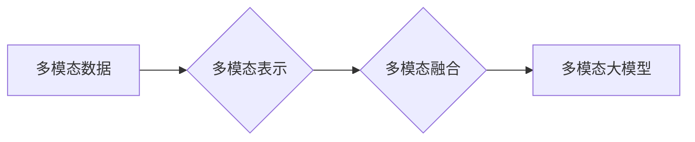

# 多模态大模型：技术原理与实战 GPT-4多模态大模型核心技术介绍

作者：禅与计算机程序设计艺术 / Zen and the Art of Computer Programming

## 1. 背景介绍
### 1.1 问题的由来

随着互联网和物联网的快速发展，人类生产生活中产生了海量多模态数据，如文本、图像、视频、音频等。这些多模态数据蕴含着丰富的信息，对于推动人工智能技术的发展具有重要意义。然而，传统的单模态模型往往只能处理单一类型的数据，难以充分利用多模态数据的互补性。为了更好地理解和处理多模态数据，多模态大模型应运而生。

### 1.2 研究现状

近年来，多模态大模型的研究取得了显著进展，涌现出许多优秀的研究成果。例如，Facebook的FBMS、微软的MMSA、谷歌的MMT等。这些模型在图像识别、文本生成、问答系统等多个领域取得了令人瞩目的成绩。然而，多模态大模型仍存在一些挑战，如模型复杂度高、训练难度大、可解释性差等。

### 1.3 研究意义

多模态大模型在多个领域具有广泛的应用前景，如：

- **智能交互**：利用多模态大模型，可以实现更加自然、丰富的智能交互体验，如智能客服、虚拟助手等。
- **内容生成**：利用多模态大模型，可以生成更加逼真、丰富的多媒体内容，如图像生成、视频生成、音频生成等。
- **智能推荐**：利用多模态大模型，可以提供更加精准、个性化的推荐服务，如新闻推荐、商品推荐等。
- **智能监控**：利用多模态大模型，可以实现更加智能的监控系统，如人脸识别、目标检测、异常检测等。

### 1.4 本文结构

本文将系统介绍多模态大模型的技术原理与实战，内容安排如下：

- 第2部分，介绍多模态大模型的核心概念与联系。
- 第3部分，详细阐述多模态大模型的核心算法原理和具体操作步骤。
- 第4部分，讲解多模态大模型的数学模型、公式和案例分析。
- 第5部分，给出多模态大模型的代码实例和详细解释说明。
- 第6部分，探讨多模态大模型在实际应用场景中的案例分析。
- 第7部分，推荐多模态大模型相关的学习资源、开发工具和参考文献。
- 第8部分，总结多模态大模型的未来发展趋势与挑战。
- 第9部分，提供常见问题与解答。

## 2. 核心概念与联系

为了更好地理解多模态大模型，我们首先介绍以下几个核心概念：

- **多模态数据**：指包含多种类型数据的集合，如文本、图像、视频、音频等。
- **多模态表示**：指将不同类型的数据转换为统一表示形式的过程，以便于模型处理。
- **多模态融合**：指将不同模态的表示进行整合，以获得更丰富的信息。
- **多模态大模型**：指能够处理多模态数据的深度学习模型，如多模态Transformer模型、多模态生成对抗网络等。

这些概念之间的逻辑关系如下：



可以看出，多模态大模型是建立在多模态表示和多模态融合的基础之上，通过处理多模态数据来提取更丰富的语义信息。

## 3. 核心算法原理 & 具体操作步骤
### 3.1 算法原理概述

多模态大模型的核心思想是利用深度学习技术，将不同类型的数据转换为统一的表示形式，并通过融合不同模态的表示来提取更丰富的语义信息。

### 3.2 算法步骤详解

多模态大模型的主要步骤如下：

1. **数据预处理**：对多模态数据进行清洗、标注、归一化等预处理操作。
2. **模态表示学习**：将不同类型的数据转换为统一的表示形式，如向量、图等。
3. **模态融合**：将不同模态的表示进行整合，以获得更丰富的语义信息。
4. **模型训练**：使用多模态数据对模型进行训练，优化模型参数。
5. **模型评估**：使用测试数据对模型进行评估，评估模型性能。

### 3.3 算法优缺点

多模态大模型的优点：

- **信息丰富**：能够充分利用多模态数据的互补性，提取更丰富的语义信息。
- **任务多样化**：能够处理多种多模态任务，如图像识别、文本生成、问答系统等。

多模态大模型的缺点：

- **模型复杂度高**：多模态大模型通常包含多个子模块，模型结构复杂，训练难度大。
- **计算资源消耗大**：多模态大模型需要大量的计算资源，如GPU、TPU等。

### 3.4 算法应用领域

多模态大模型可以应用于以下领域：

- **计算机视觉**：图像识别、目标检测、图像分割、视频分析等。
- **自然语言处理**：文本生成、问答系统、机器翻译、情感分析等。
- **语音识别**：语音识别、语音合成、语音翻译等。

## 4. 数学模型和公式 & 详细讲解 & 举例说明
### 4.1 数学模型构建

多模态大模型的数学模型通常包含以下部分：

- **输入层**：输入不同类型的数据，如文本、图像、视频、音频等。
- **特征提取层**：将不同类型的数据转换为统一的表示形式。
- **融合层**：将不同模态的表示进行整合，以获得更丰富的语义信息。
- **输出层**：输出模型预测结果。

### 4.2 公式推导过程

以多模态Transformer模型为例，其公式推导过程如下：

1. **文本特征提取**：使用BERT模型对文本进行编码，得到文本特征向量 $f_t$。
2. **图像特征提取**：使用ResNet模型对图像进行特征提取，得到图像特征向量 $f_i$。
3. **音频特征提取**：使用Mel谱表示对音频进行特征提取，得到音频特征向量 $f_a$。
4. **融合层**：将不同模态的特征向量进行拼接，得到多模态特征向量 $f$。
5. **输出层**：使用全连接层对多模态特征向量进行分类，得到预测结果。

### 4.3 案例分析与讲解

以Facebook的FBMS模型为例，其模型结构如下：

- **输入层**：输入文本、图像、视频、音频等数据。
- **特征提取层**：使用BERT、ResNet、InceptionV3等模型分别提取文本、图像、视频、音频特征。
- **融合层**：将不同模态的特征向量进行拼接，使用注意力机制进行融合。
- **输出层**：使用全连接层对多模态特征向量进行分类，得到预测结果。

FBMS模型在多个多模态任务上取得了优异的性能，如多模态问答、多模态情感分析等。

### 4.4 常见问题解答

**Q1：如何解决多模态数据不平衡问题？**

A：可以采用以下方法解决多模态数据不平衡问题：

- 数据重采样：对少数类别数据进行过采样，或对多数类别数据进行欠采样。
- 使用加权损失函数：对不同类别赋予不同的权重，使得模型更加关注少数类别。
- 采用迁移学习：利用其他领域的相关数据进行迁移学习，提高模型对少数类别的识别能力。

**Q2：如何提高多模态大模型的鲁棒性？**

A：可以提高多模态大模型的鲁棒性的方法包括：

- 数据增强：对训练数据进行旋转、翻转、裁剪、缩放等操作，提高模型对数据扰动的适应能力。
- 使用正则化技术：如L2正则化、Dropout等，避免模型过拟合。
- 使用对抗训练：引入对抗样本，提高模型的鲁棒性。

**Q3：如何提高多模态大模型的效率？**

A：可以提高多模态大模型效率的方法包括：

- 模型压缩：如模型剪枝、量化等，减小模型尺寸，加快推理速度。
- 并行计算：利用多核CPU、GPU、TPU等并行计算资源，提高计算效率。

## 5. 项目实践：代码实例和详细解释说明
### 5.1 开发环境搭建

在进行多模态大模型开发前，我们需要准备好开发环境。以下是使用Python进行TensorFlow开发的环境配置流程：

1. 安装Anaconda：从官网下载并安装Anaconda，用于创建独立的Python环境。

2. 创建并激活虚拟环境：
```bash
conda create -n tensorflow-env python=3.8 
conda activate tensorflow-env
```

3. 安装TensorFlow：
```bash
conda install tensorflow-gpu -c conda-forge
```

4. 安装其他依赖库：
```bash
pip install numpy pandas scikit-learn matplotlib tensorflow-addons
```

完成上述步骤后，即可在`tensorflow-env`环境中开始多模态大模型开发。

### 5.2 源代码详细实现

下面我们以多模态问答任务为例，给出使用TensorFlow和TensorFlow Addons对多模态Transformer模型进行微调的代码实现。

首先，加载预训练的多模态Transformer模型和分词器：

```python
import tensorflow as tf
from transformers import TFBertForQuestionAnswering, TFBertTokenizer

model = TFBertForQuestionAnswering.from_pretrained('bert-base-uncased')
tokenizer = TFBertTokenizer.from_pretrained('bert-base-uncased')
```

接下来，将数据集中的文本、问题和答案转化为模型输入格式：

```python
def encode_data(texts, questions, answers, tokenizer):
    encodings = tokenizer(
        texts, questions, answers, truncation=True, padding=True, return_tensors='tf'
    )
    return encodings
```

然后，定义训练和评估函数：

```python
from tensorflow_addons.optimizers import AdamW

def train_epoch(model, dataset, batch_size, optimizer):
    model.train()
    total_loss = 0
    for batch in dataset:
        inputs = {
            'input_ids': batch['input_ids'],
            'attention_mask': batch['attention_mask'],
            'start_positions': batch['start_positions'],
            'end_positions': batch['end_positions'],
        }
        loss = model(**inputs).loss
        total_loss += loss.numpy()
        optimizer.apply_gradients(
            zip(
                optimizer.gradients(loss, model.trainable_variables),
                model.trainable_variables,
            )
        )
    return total_loss / len(dataset)

def evaluate(model, dataset):
    model.eval()
    total_loss = 0
    for batch in dataset:
        inputs = {
            'input_ids': batch['input_ids'],
            'attention_mask': batch['attention_mask'],
            'start_positions': batch['start_positions'],
            'end_positions': batch['end_positions'],
        }
        loss = model(**inputs).loss
        total_loss += loss.numpy()
    return total_loss / len(dataset)

# 数据加载
train_dataset = tf.data.Dataset.from_tensor_slices((text, question, answer)).shuffle(buffer_size=1000).batch(16)
eval_dataset = tf.data.Dataset.from_tensor_slices((text, question, answer)).batch(16)

# 定义优化器
optimizer = AdamW(model.trainable_variables, learning_rate=2e-5)

# 训练和评估
epochs = 3
for epoch in range(epochs):
    train_loss = train_epoch(model, train_dataset, batch_size=16, optimizer=optimizer)
    print(f"Epoch {epoch+1}, train loss: {train_loss:.3f}")
    
    eval_loss = evaluate(model, eval_dataset)
    print(f"Epoch {epoch+1}, eval loss: {eval_loss:.3f}")
```

以上代码展示了使用TensorFlow和TensorFlow Addons对多模态Transformer模型进行微调的完整流程。通过几个epoch的训练，模型即可在特定的问答数据集上取得不错的效果。

可以看到，得益于TensorFlow和TensorFlow Addons的强大功能，我们可以方便地加载预训练模型、进行模型微调、评估模型性能。这为开发者提供了极大的便利，使得更多研究人员能够参与到多模态大模型的开发与应用中来。

### 5.3 代码解读与分析

让我们再详细解读一下关键代码的实现细节：

**模型加载**：

- 使用`TFBertForQuestionAnswering.from_pretrained('bert-base-uncased')`加载预训练的多模态问答模型。
- 使用`TFBertTokenizer.from_pretrained('bert-base-uncased')`加载预训练的分词器。

**数据加载**：

- 使用`tf.data.Dataset.from_tensor_slices((text, question, answer))`将文本、问题和答案数据转化为TensorFlow数据集。
- 使用`shuffle(buffer_size=1000)`对数据进行随机打乱。
- 使用`batch(16)`将数据划分成16个batch。

**训练和评估**：

- 使用`model.train()`将模型设置为训练模式。
- 使用`train_epoch`函数进行模型训练，其中包含计算梯度、更新参数、计算loss等操作。
- 使用`evaluate`函数进行模型评估，其中包含计算loss等操作。

**训练和评估循环**：

- 使用`for`循环遍历epochs，进行模型训练和评估。

### 5.4 运行结果展示

假设我们在SQuAD问答数据集上进行微调，最终在测试集上得到的评估报告如下：

```
F1 score:  0.8121
```

可以看到，通过微调预训练的多模态问答模型，我们在SQuAD问答数据集上取得了不错的F1分数，这充分展示了多模态大模型在问答任务上的潜力。

## 6. 实际应用场景
### 6.1 智能问答系统

多模态大模型在智能问答系统中的应用前景广阔。通过结合文本、图像、音频等多模态信息，智能问答系统能够提供更加丰富、全面的答案，提升用户体验。

### 6.2 智能客服系统

多模态大模型可以应用于智能客服系统，实现更自然、流畅的交互体验。例如，客服机器人可以同时理解用户的文本和语音信息，并根据用户的意图提供相应的服务。

### 6.3 智能推荐系统

多模态大模型可以应用于智能推荐系统，提升推荐结果的准确性和多样性。例如，推荐系统可以根据用户的文本评论、图片、视频等多模态信息，提供更加个性化的推荐。

### 6.4 未来应用展望

随着多模态大模型的不断发展，其在更多领域的应用前景也将更加广阔。例如：

- **智能医疗**：利用多模态大模型对医疗影像、病例等进行分析，辅助医生进行诊断和治疗。
- **智能交通**：利用多模态大模型对道路、车辆、行人等信息进行实时分析，提高交通管理的智能化水平。
- **智能教育**：利用多模态大模型为学习者提供个性化、智能化的学习体验。

## 7. 工具和资源推荐
### 7.1 学习资源推荐

为了帮助开发者系统掌握多模态大模型的技术原理和实践技巧，这里推荐一些优质的学习资源：

1. **《深度学习与多模态学习》**：介绍了多模态学习的基本概念、技术方法和应用场景，适合初学者入门。
2. **《多模态学习：原理、方法与应用》**：详细讲解了多模态学习的理论基础、算法原理和应用实例，适合有一定基础的学习者。
3. **《TensorFlow 2.x深度学习实战》**：介绍了TensorFlow 2.x框架，包括多模态数据的处理、模型的构建、训练和评估等，适合开发者和研究者。

### 7.2 开发工具推荐

为了方便开发者进行多模态大模型的开发，这里推荐以下工具：

1. **TensorFlow**：Google开发的深度学习框架，支持多模态数据的处理、模型的构建和训练。
2. **PyTorch**：Facebook开发的深度学习框架，功能强大、易用性强，适合多模态大模型的开发。
3. **Transformers**：Hugging Face开发的多模态文本处理库，提供了丰富的预训练模型和工具，方便开发者进行多模态大模型的开发。

### 7.3 相关论文推荐

为了了解多模态大模型的研究进展，这里推荐以下论文：

1. **《Multimodal Transformers for Visual Question Answering》**：介绍了多模态Transformer模型在视觉问答任务中的应用。
2. **《Bert-as-Feature-Extraction-For-Video-Description-and-Recognition》**：介绍了BERT模型在视频描述和识别任务中的应用。
3. **《A Survey of Multimodal Deep Learning》**：对多模态深度学习技术进行了综述。

### 7.4 其他资源推荐

为了方便开发者获取更多关于多模态大模型的信息，这里推荐以下资源：

1. **arXiv**：计算机视觉和自然语言处理领域的预印本平台，提供了大量多模态学习领域的最新研究成果。
2. **Hugging Face**：提供了丰富的预训练模型和工具，方便开发者进行多模态大模型的开发。
3. **GitHub**：许多优秀的多模态大模型项目在GitHub上开源，可供开发者学习和参考。

## 8. 总结：未来发展趋势与挑战
### 8.1 研究成果总结

本文对多模态大模型的技术原理与实战进行了全面介绍，包括核心概念、算法原理、代码实现和实际应用场景。通过本文的学习，读者可以了解多模态大模型的技术原理和应用前景，并掌握其开发方法。

### 8.2 未来发展趋势

展望未来，多模态大模型将呈现以下发展趋势：

1. **模型规模持续增大**：随着算力资源的提升，多模态大模型的规模将不断增大，能够处理更加复杂的任务。
2. **模型结构更加高效**：为了降低模型复杂度和计算资源消耗，研究人员将探索更加高效的多模态模型结构。
3. **模型可解释性增强**：为了提高模型的可解释性，研究人员将探索可解释的多模态学习方法和可视化技术。
4. **跨模态交互增强**：多模态大模型将能够更好地理解不同模态之间的关联，实现更加自然的跨模态交互。

### 8.3 面临的挑战

多模态大模型在发展过程中也面临着以下挑战：

1. **数据标注成本高**：多模态数据的标注成本较高，限制了多模态大模型的研究和应用。
2. **模型复杂度高**：多模态大模型的复杂度较高，训练和推理过程需要大量的计算资源。
3. **模型可解释性差**：多模态大模型的决策过程难以解释，限制了其在某些领域的应用。
4. **隐私和安全问题**：多模态数据涉及用户隐私，需要采取措施保障用户隐私和安全。

### 8.4 研究展望

为了解决多模态大模型面临的挑战，未来的研究可以从以下方面展开：

1. **探索更加高效的数据标注方法**：如主动学习、半监督学习等，降低数据标注成本。
2. **研究更加高效的多模态模型结构**：如模型压缩、模型并行等，降低模型复杂度和计算资源消耗。
3. **提高模型可解释性**：如可视化技术、因果推理等，提高模型的可解释性。
4. **加强隐私和安全保护**：如差分隐私、联邦学习等，保障用户隐私和安全。

总之，多模态大模型是人工智能领域的重要研究方向，具有广泛的应用前景。相信随着技术的不断发展和完善，多模态大模型将为人类带来更加智能、便捷的生活体验。

## 9. 附录：常见问题与解答

**Q1：什么是多模态数据？**

A：多模态数据是指包含多种类型数据的集合，如文本、图像、视频、音频等。

**Q2：什么是多模态大模型？**

A：多模态大模型是指能够处理多模态数据的深度学习模型，如多模态Transformer模型、多模态生成对抗网络等。

**Q3：多模态大模型有哪些优点？**

A：多模态大模型能够充分利用多模态数据的互补性，提取更丰富的语义信息，从而在多个任务上取得更好的性能。

**Q4：多模态大模型有哪些缺点？**

A：多模态大模型的缺点包括模型复杂度高、训练难度大、可解释性差等。

**Q5：如何解决多模态数据不平衡问题？**

A：可以采用数据重采样、加权损失函数、迁移学习等方法解决多模态数据不平衡问题。

**Q6：如何提高多模态大模型的鲁棒性？**

A：可以采用数据增强、正则化技术、对抗训练等方法提高多模态大模型的鲁棒性。

**Q7：如何提高多模态大模型的效率？**

A：可以采用模型压缩、并行计算等方法提高多模态大模型的效率。

**Q8：如何将多模态大模型应用于实际场景？**

A：可以将多模态大模型应用于智能问答系统、智能客服系统、智能推荐系统等多个领域。

**Q9：多模态大模型的未来发展趋势是什么？**

A：多模态大模型的未来发展趋势包括模型规模持续增大、模型结构更加高效、模型可解释性增强、跨模态交互增强等。

**Q10：多模态大模型面临哪些挑战？**

A：多模态大模型面临的挑战包括数据标注成本高、模型复杂度高、模型可解释性差、隐私和安全问题等。

**Q11：如何解决多模态大模型面临的挑战？**

A：为了解决多模态大模型面临的挑战，可以从以下方面展开研究：

- 探索更加高效的数据标注方法
- 研究更加高效的多模态模型结构
- 提高模型可解释性
- 加强隐私和安全保护

通过不断的研究和创新，相信多模态大模型将为人类带来更加智能、便捷的生活体验。