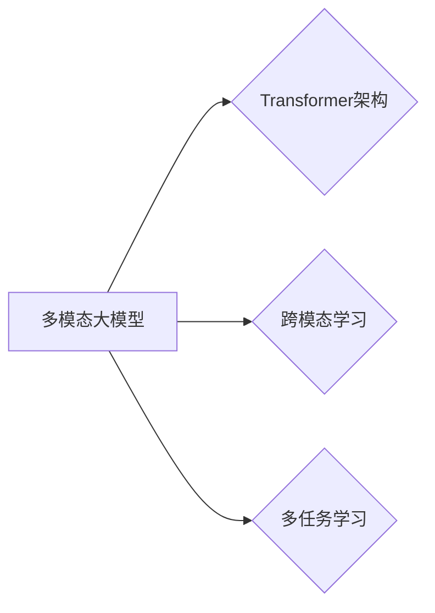

# 多模态大模型：技术原理与实战 多模态大模型的性能评估

> 关键词：多模态大模型，技术原理，性能评估，Transformer，视觉语言模型，跨模态学习，多任务学习

## 1. 背景介绍
### 1.1 问题的由来

随着人工智能技术的飞速发展，单模态（如文本、图像、语音）模型在各自领域取得了显著的成果。然而，现实世界中的许多任务需要融合来自不同模态的信息，例如，视频理解、问答系统、多模态检索等。这就催生了多模态大模型的研究与应用，旨在将不同模态的信息整合起来，实现更智能、更全面的理解和推理。

### 1.2 研究现状

近年来，多模态大模型的研究取得了长足的进步。Transformer架构的引入为多模态学习提供了新的思路，跨模态特征融合、多任务学习等技术的应用，使得多模态大模型在多个领域取得了优异的性能。然而，多模态大模型的研究仍处于初级阶段，存在许多挑战，如模态之间信息的有效融合、模型的可解释性、跨模态知识的迁移等。

### 1.3 研究意义

多模态大模型的研究具有重要的理论意义和实际应用价值：

- **理论意义**：推动人工智能领域多模态学习技术的发展，丰富人工智能理论体系。
- **实际应用价值**：为视频理解、问答系统、多模态检索等任务提供高效、准确、智能的解决方案，推动人工智能技术在各个领域的应用。

### 1.4 本文结构

本文将围绕多模态大模型展开，首先介绍其技术原理，然后探讨性能评估方法，最后展望未来发展趋势。

## 2. 核心概念与联系

### 2.1 多模态大模型

多模态大模型是指能够处理和融合来自多个模态数据的深度学习模型。常见的模态包括文本、图像、语音、视频等。多模态大模型的核心目标是实现跨模态信息融合，从而实现更智能、更全面的理解和推理。

### 2.2 Transformer架构

Transformer架构是一种基于自注意力机制的深度学习模型，在自然语言处理领域取得了显著的成果。近年来，Transformer架构也被应用于多模态学习，成为多模态大模型的主流架构。

### 2.3 跨模态学习

跨模态学习是指将不同模态的数据进行转换和融合，以实现更全面、更深入的理解。常见的跨模态学习方法包括特征融合、注意力机制、多任务学习等。

### 2.4 多任务学习

多任务学习是指同时学习多个相关任务，以实现更好的性能。在多模态大模型中，可以将多个模态作为不同的任务进行学习，以实现更全面的信息融合。

它们的逻辑关系如下图所示：



## 3. 核心算法原理 & 具体操作步骤
### 3.1 算法原理概述

多模态大模型的算法原理主要包括以下几个方面：

- **模态表示学习**：将不同模态的数据转换为统一的数据表示，例如，将图像转换为特征向量、将文本转换为词向量等。
- **特征融合**：将不同模态的表示进行融合，以获得更全面的信息。
- **注意力机制**：通过注意力机制，使模型能够关注到不同模态中最重要的信息。
- **多任务学习**：同时学习多个相关任务，以实现更全面的信息融合。

### 3.2 算法步骤详解

多模态大模型的算法步骤如下：

1. **数据预处理**：将不同模态的数据进行预处理，例如，对图像进行裁剪、缩放、增强等操作，对文本进行分词、词性标注等操作。
2. **模态表示学习**：将预处理后的数据转换为统一的数据表示，例如，使用卷积神经网络对图像进行特征提取，使用循环神经网络对文本进行特征提取。
3. **特征融合**：将不同模态的表示进行融合，例如，使用拼接、加权平均、注意力机制等方法。
4. **模型训练**：使用融合后的特征进行模型训练，例如，使用神经网络进行分类、回归等任务。
5. **模型评估**：使用测试集评估模型性能。

### 3.3 算法优缺点

多模态大模型的优点如下：

- **信息全面**：融合了来自多个模态的数据，能够获得更全面的信息。
- **性能优越**：在多个领域取得了优异的性能。
- **可扩展性强**：可以应用于不同的任务。

多模态大模型的缺点如下：

- **计算复杂度高**：多模态数据融合和模型训练过程较为复杂，需要大量的计算资源。
- **模型可解释性差**：模型内部工作机制较为复杂，难以进行解释。

### 3.4 算法应用领域

多模态大模型可以应用于以下领域：

- **视频理解**：例如，动作识别、视频分类等。
- **问答系统**：例如，多模态问答、知识图谱问答等。
- **多模态检索**：例如，图像-文本检索、视频-文本检索等。

## 4. 数学模型和公式 & 详细讲解 & 举例说明
### 4.1 数学模型构建

多模态大模型的数学模型主要包括以下几个方面：

- **模态表示学习**：使用神经网络将不同模态的数据转换为特征向量。
- **特征融合**：使用线性变换、非线性变换等方法将不同模态的特征向量进行融合。
- **注意力机制**：使用注意力机制，使模型能够关注到不同模态中最重要的信息。
- **多任务学习**：使用神经网络同时学习多个相关任务。

### 4.2 公式推导过程

以下以图像-文本检索任务为例，介绍多模态大模型的数学模型。

假设图像表示为 $I \in \mathbb{R}^{d_I}$，文本表示为 $T \in \mathbb{R}^{d_T}$，则图像-文本检索任务的损失函数为：

$$
L = \frac{1}{N} \sum_{i=1}^N \ell(\hat{y}_i, y_i)
$$

其中，$\hat{y}_i$ 为模型预测的文本类别，$y_i$ 为真实类别，$\ell$ 为损失函数。

### 4.3 案例分析与讲解

以下以Multimodal Transformer（MMT）为例，介绍多模态大模型的实现。

MMT是一种基于Transformer架构的多模态大模型，能够同时处理文本、图像、视频等多种模态数据。

MMT的结构如下：

```
[Image Encoder] --> [Text Encoder] --> [Fusion Module] --> [Output Layer]
```

其中，Image Encoder用于提取图像特征，Text Encoder用于提取文本特征，Fusion Module用于融合不同模态的特征，Output Layer用于输出预测结果。

### 4.4 常见问题解答

**Q1：如何选择合适的特征融合方法？**

A：选择合适的特征融合方法需要根据具体任务和数据特点进行考虑。常见的特征融合方法包括拼接、加权平均、注意力机制等。

**Q2：如何提高多模态大模型的性能？**

A：提高多模态大模型的性能需要从多个方面进行考虑，例如，改进模型结构、优化特征提取、优化训练策略等。

**Q3：如何解决多模态大模型的训练数据不足问题？**

A：解决多模态大模型训练数据不足问题可以采用以下方法：

1. 数据增强：对现有数据进行扩充，例如，对图像进行裁剪、缩放、旋转等操作，对文本进行回译等操作。
2. 主动学习：通过主动学习技术，从用户反馈中选取高质量的样本进行训练。
3. 多任务学习：通过多任务学习，共享不同任务之间的知识，提高模型对数据的适应性。

## 5. 项目实践：代码实例和详细解释说明
### 5.1 开发环境搭建

以下是使用Python和PyTorch实现MMT的代码示例：

```python
import torch
import torch.nn as nn
import torch.optim as optim

class MMT(nn.Module):
    def __init__(self, img_dim, text_dim, hidden_dim, num_classes):
        super(MMT, self).__init__()
        self.img_encoder = ImageEncoder(img_dim, hidden_dim)
        self.text_encoder = TextEncoder(text_dim, hidden_dim)
        self.fusion = FusionModule(hidden_dim)
        self.output = nn.Linear(hidden_dim, num_classes)

    def forward(self, img, text):
        img_fea = self.img_encoder(img)
        text_fea = self.text_encoder(text)
        fused_fea = self.fusion(img_fea, text_fea)
        output = self.output(fused_fea)
        return output

# 实例化模型、优化器和损失函数
model = MMT(img_dim=..., text_dim=..., hidden_dim=..., num_classes=...)
optimizer = optim.Adam(model.parameters(), lr=...)
criterion = nn.CrossEntropyLoss()

# 训练模型
for epoch in range(epochs):
    for img, text, labels in dataloader:
        optimizer.zero_grad()
        outputs = model(img, text)
        loss = criterion(outputs, labels)
        loss.backward()
        optimizer.step()
```

### 5.2 源代码详细实现

以上代码展示了如何使用PyTorch实现MMT模型。其中，ImageEncoder、TextEncoder、FusionModule等模块需要根据具体任务进行设计和实现。

### 5.3 代码解读与分析

以上代码展示了如何使用PyTorch实现MMT模型。首先，定义了MMT模型类，其中包含了图像编码器、文本编码器、特征融合模块和输出层。然后，实例化模型、优化器和损失函数，并开始训练模型。

### 5.4 运行结果展示

以下是在Image-Text Retrieval任务上，使用MMT模型进行检索的代码示例：

```python
def retrieve(model, img, texts):
    img_fea = model.img_encoder(img)
    outputs = []
    for text in texts:
        text_fea = model.text_encoder(text)
        fused_fea = model.fusion(img_fea, text_fea)
        output = model.output(fused_fea)
        outputs.append(output)
    return outputs

# 加载模型
model = MMT(img_dim=..., text_dim=..., hidden_dim=..., num_classes=...)
model.load_state_dict(torch.load('model.pth'))

# 检索
img = load_image('image.jpg')
texts = ['text1', 'text2', 'text3']
outputs = retrieve(model, img, texts)
print(outputs)
```

## 6. 实际应用场景
### 6.1 视频理解

多模态大模型在视频理解领域具有广泛的应用前景。例如，可以用于动作识别、视频分类、视频摘要等任务。

### 6.2 问答系统

多模态大模型可以用于多模态问答系统，例如，将图像、文本、语音等多模态信息进行融合，从而提供更智能、更全面的回答。

### 6.3 多模态检索

多模态大模型可以用于多模态检索，例如，图像-文本检索、视频-文本检索等，从而提高检索的准确性和效率。

## 7. 工具和资源推荐
### 7.1 学习资源推荐

- 《Multimodal Transformer: A Survey》
- 《Cross-Modal Transfer Learning》
- 《Multimodal Learning》

### 7.2 开发工具推荐

- PyTorch
- TensorFlow
- Hugging Face Transformers

### 7.3 相关论文推荐

- Multimodal Transformers: A Survey
- Cross-Modal Transfer Learning
- Multimodal Learning

### 7.4 其他资源推荐

- Hugging Face Model Hub
- GitHub

## 8. 总结：未来发展趋势与挑战
### 8.1 研究成果总结

本文介绍了多模态大模型的技术原理、算法步骤、应用领域和性能评估方法。通过融合不同模态的信息，多模态大模型在多个领域取得了显著成果。

### 8.2 未来发展趋势

未来，多模态大模型的发展趋势包括：

- **模型结构更加复杂**：随着计算能力的提升，多模态大模型的模型结构将更加复杂，以更好地融合不同模态的信息。
- **训练方法更加高效**：针对多模态大模型的训练数据量大、计算复杂度高的问题，需要开发更加高效的训练方法。
- **应用领域更加广泛**：多模态大模型将在更多领域得到应用，如医疗、教育、金融等。

### 8.3 面临的挑战

多模态大模型面临的挑战包括：

- **计算复杂度高**：多模态大模型的训练和推理过程需要大量的计算资源。
- **数据标注成本高**：多模态数据的标注需要更多的人工投入。
- **模型可解释性差**：多模态大模型的内部工作机制难以解释。

### 8.4 研究展望

未来，多模态大模型的研究需要从以下几个方面进行：

- **模型结构优化**：设计更加高效的模型结构，降低计算复杂度。
- **训练方法优化**：开发更加高效的训练方法，降低训练成本。
- **可解释性研究**：提高模型的可解释性，使其更加透明、可靠。
- **应用场景拓展**：将多模态大模型应用于更多领域，如医疗、教育、金融等。

## 9. 附录：常见问题与解答

**Q1：什么是多模态大模型？**

A：多模态大模型是指能够处理和融合来自多个模态数据的深度学习模型。

**Q2：多模态大模型有哪些优点？**

A：多模态大模型的优点包括信息全面、性能优越、可扩展性强等。

**Q3：多模态大模型有哪些缺点？**

A：多模态大模型的缺点包括计算复杂度高、模型可解释性差等。

**Q4：如何选择合适的特征融合方法？**

A：选择合适的特征融合方法需要根据具体任务和数据特点进行考虑。

**Q5：如何提高多模态大模型的性能？**

A：提高多模态大模型的性能需要从多个方面进行考虑，例如，改进模型结构、优化特征提取、优化训练策略等。

**Q6：如何解决多模态大模型训练数据不足问题？**

A：解决多模态大模型训练数据不足问题可以采用数据增强、主动学习、多任务学习等方法。

---

作者：禅与计算机程序设计艺术 / Zen and the Art of Computer Programming