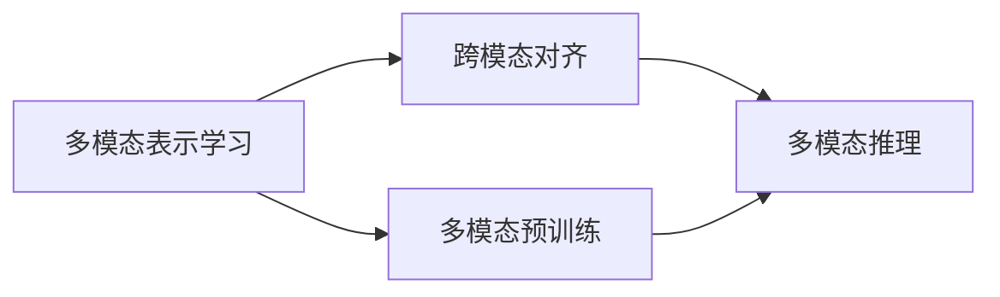

# 多模态大模型：技术原理与实战 看清GPT的进化史和创新点

## 1. 背景介绍
### 1.1  问题的由来
近年来,随着人工智能技术的飞速发展,大规模预训练语言模型(Pre-trained Language Models, PLMs)在自然语言处理(Natural Language Processing, NLP)领域取得了巨大的成功。以GPT(Generative Pre-trained Transformer)系列模型为代表的生成式预训练语言模型,在机器翻译、对话系统、文本摘要等任务上都取得了突破性的进展,引领了NLP技术的发展潮流。

然而,单一模态的语言模型在处理现实世界的复杂任务时仍然存在局限性。人类感知世界的方式是多模态的,我们不仅依赖语言,还借助视觉、听觉等其他感官获取信息。因此,如何将视觉、语音等不同模态的信息与语言模型结合,构建多模态大模型,成为了当前人工智能领域的研究热点和发展趋势。

### 1.2  研究现状
目前,学术界和工业界都在积极探索多模态大模型的构建方法。微软、谷歌、OpenAI等科技巨头纷纷推出了自己的多模态大模型,如微软的Kosmos-1、谷歌的PaLM-E、OpenAI的DALL·E等。这些模型在图像描述、视觉问答、文本-图像生成等任务上取得了瞩目的成绩。

同时,学术界也提出了一系列多模态预训练方法,如ViLBERT、LXMERT、UNITER等,通过设计巧妙的预训练任务和融合机制,实现了视觉和语言特征的高效融合,在多模态理解和生成任务上取得了不错的效果。

### 1.3  研究意义
多模态大模型的研究具有重要的理论和实践意义:

(1)从理论角度看,多模态大模型的研究有助于揭示人类认知的奥秘,探索人工智能模拟人类智能的途径。不同模态信息的融合与交互是人类智能的重要特征,多模态大模型的构建有望让机器具备类似人类的感知和理解能力。

(2)从应用角度看,多模态大模型可以大大拓展人工智能的应用场景。在智能客服、智能教育、医疗诊断等领域,多模态大模型可以更好地理解用户需求,提供个性化、智能化的服务。此外,多模态大模型在创意生成、艺术设计等领域也有广阔的应用前景。

### 1.4  本文结构
本文将围绕多模态大模型的技术原理与实战展开论述,主要内容包括:

- 第2部分介绍多模态大模型的核心概念与模态间的关联
- 第3部分重点阐述多模态大模型的核心算法原理与具体操作步骤
- 第4部分从数学角度对多模态大模型的关键模型和公式进行详细讲解和举例说明
- 第5部分通过代码实例和详细的注释,演示多模态大模型的项目实践
- 第6部分分析多模态大模型的实际应用场景及未来应用展望
- 第7部分推荐多模态大模型相关的学习资源、开发工具和论文
- 第8部分总结全文,展望多模态大模型的未来发展趋势与挑战
- 第9部分列举多模态大模型领域的常见问题与解答

## 2. 核心概念与联系
多模态大模型是融合了不同模态信息(如文本、图像、语音等)的大规模预训练模型。与单模态模型相比,多模态大模型能够建立模态间的语义联系,实现跨模态的信息交互和理解。下面介绍几个多模态大模型的核心概念:

- **多模态表示学习(Multi-modal Representation Learning)**: 旨在学习不同模态数据的统一表示,捕捉模态间的语义对齐和互补信息。主要方法包括多模态融合、对齐、映射等。

- **跨模态对齐(Cross-modal Alignment)**: 建立不同模态表示之间的语义对应关系,实现模态间的信息传递和交互。常见的对齐方式有注意力机制、对比学习等。

- **多模态预训练(Multi-modal Pre-training)**: 在大规模多模态数据上进行预训练,学习通用的多模态表示。预训练任务设计是关键,需要充分利用模态间的互补和关联信息。

- **多模态推理(Multi-modal Reasoning)**: 基于多模态信息进行联合推理,回答跨模态问题。多模态推理需要建模不同模态信息之间的复杂交互,如视觉-语言推理等。

这些概念之间密切相关,共同构成了多模态大模型的理论基础。下图展示了它们之间的联系:

多模态表示学习是基础,通过跨模态对齐和多模态预训练学习模态间的关联,进而实现多模态推理。这些技术的发展和创新,推动了多模态大模型的不断进步。

## 3. 核心算法原理 & 具体操作步骤
### 3.1  算法原理概述
多模态大模型的核心是如何有效融合不同模态的信息,并在此基础上完成下游任务。主流的多模态大模型通常采用Transformer编码器作为主干网络,通过注意力机制实现模态间的信息交互。以下是几种典型的多模态融合方法:

- **多模态注意力(Multi-modal Attention)**: 在Transformer的自注意力机制基础上,引入跨模态注意力,让不同模态的特征相互关注,实现信息融合。如ViLBERT中的Co-attentional Transformer就采用了这种方式。

- **多模态对齐(Multi-modal Alignment)**: 通过对齐损失函数,显式地强制不同模态特征在共同语义空间中对齐。如CLIP模型使用对比学习,最大化图像和文本特征的互信息。

- **模态特定的编码器(Modality-specific Encoders)**: 为每种模态设计独立的编码器,提取模态特定的特征,再通过融合模块进行整合。如LXMERT中的Object-Relationship Encoder和Language Encoder分别处理图像和文本特征。

### 3.2  算法步骤详解
以ViLBERT为例,详细说明多模态大模型的训练步骤:

**Step 1: 视觉特征提取**
- 使用预训练的CNN网络(如ResNet)对图像进行特征提取,得到图像区域的特征表示。
- 将图像特征序列化,作为Transformer编码器的输入。

**Step 2: 文本特征提取**
- 对输入的文本进行分词、映射,得到词嵌入表示。
- 使用位置编码将词嵌入转化为序列化的特征表示。

**Step 3: 多模态融合**
- 将视觉特征和文本特征输入到Co-attentional Transformer中。
- Co-attentional Transformer通过自注意力和跨模态注意力,实现视觉-语言特征的深度融合。

**Step 4: 预训练任务**
- 基于融合后的多模态特征,设计预训练任务进行训练。常见任务有:
  - 掩码语言建模(Masked Language Modeling, MLM):随机掩码文本词汇,预测被掩码的词。
  - 掩码区域特征回归(Masked Region Feature Regression, MRFR):随机掩码图像区域,预测被掩码区域的视觉特征。
  - 图像-文本匹配(Image-Text Matching, ITM):判断图像和文本是否匹配。
- 联合多个预训练任务,最小化总体损失函数,优化模型参数。

**Step 5: 微调与推理**
- 在下游任务的数据集上,使用预训练好的多模态大模型进行微调。
- 将任务的输入(如图像、问题)传入微调后的模型,获得预测结果。

### 3.3  算法优缺点
多模态大模型的优点包括:
- 通过预训练学习通用的多模态表示,可以更好地理解和关联不同模态信息。
- 采用注意力机制等技术,能够动态地建模模态间的复杂交互。
- 在视觉问答、图像描述等任务上取得了显著的性能提升。

但多模态大模型也存在一些局限:
- 对大规模、高质量的多模态数据有较高要求,数据的获取和标注成本高。
- 模型参数量大,训练和推理的计算开销大,对硬件资源要求高。
- 对于一些涉及常识推理、因果关系的复杂问题,仍然难以给出令人满意的回答。

### 3.4  算法应用领域
多模态大模型可以应用于以下领域:

- 智能问答:回答用户提出的关于图像内容的问题,如"图中有几个人?"等。
- 图像描述:根据图像内容,自动生成自然语言描述。
- 视觉对话:根据图像和对话历史,生成下一轮对话回复。
- 文本-图像检索:给定文本查询,从图像库中检索最相关的图像,或反之。
- 多模态内容创作:根据文本提示自动生成相关的图像、视频等。

随着技术的不断发展,多模态大模型有望在更广泛的场景中发挥作用。

## 4. 数学模型和公式 & 详细讲解 & 举例说明
### 4.1  数学模型构建
多模态大模型的核心是Transformer结构和注意力机制。以下是Transformer的关键数学模型:

**自注意力(Self-Attention)**
自注意力用于捕捉序列内部的长距离依赖关系。对于输入序列 $\mathbf{X} \in \mathbb{R}^{n \times d}$,自注意力的计算过程如下:

$$
\begin{aligned}
\mathbf{Q} &= \mathbf{X} \mathbf{W}^Q \
\mathbf{K} &= \mathbf{X} \mathbf{W}^K \
\mathbf{V} &= \mathbf{X} \mathbf{W}^V \
\text{Attention}(\mathbf{Q}, \mathbf{K}, \mathbf{V}) &= \text{softmax}(\frac{\mathbf{Q}\mathbf{K}^T}{\sqrt{d_k}})\mathbf{V}
\end{aligned}
$$

其中,$\mathbf{W}^Q, \mathbf{W}^K, \mathbf{W}^V$是可学习的参数矩阵,$d_k$是缩放因子。

**多头注意力(Multi-Head Attention)**
多头注意力通过并行计算多个自注意力,捕捉不同子空间的信息。假设有$h$个头,多头注意力的计算过程如下:

$$
\begin{aligned}
\text{MultiHead}(\mathbf{Q}, \mathbf{K}, \mathbf{V}) &= \text{Concat}(\text{head}_1, ..., \text{head}_h)\mathbf{W}^O \
\text{head}_i &= \text{Attention}(\mathbf{Q}\mathbf{W}_i^Q, \mathbf{K}\mathbf{W}_i^K, \mathbf{V}\mathbf{W}_i^V)
\end{aligned}
$$

其中,$\mathbf{W}_i^Q, \mathbf{W}_i^K, \mathbf{W}_i^V, \mathbf{W}^O$是可学习的参数矩阵。

**前馈网络(Feed-Forward Network)**
前馈网络用于对注意力输出进行非线性变换,增强模型的表达能力。前馈网络通常由两个全连接层组成:

$$
\text{FFN}(\mathbf{x}) = \max(0, \mathbf{x}\mathbf{W}_1 + \mathbf{b}_1)\mathbf{W}_2 + \mathbf{b}_2
$$

其中,$\mathbf{W}_1, \mathbf{W}_2, \mathbf{b}_1, \mathbf{b}_2$是可学习的参数。

### 4.2  公式推导过程
以下推导Transformer中的自注意力公式:

**Step 1: 计算查询矩阵$\mathbf{Q}$、键矩阵$\mathbf{K}$和值矩阵$\mathbf{V}$**

$$
\begin{aligned}
\mathbf{Q} &= \mathbf{X} \mathbf{W}^Q \
\mathbf{K} &= \mathbf{X} \