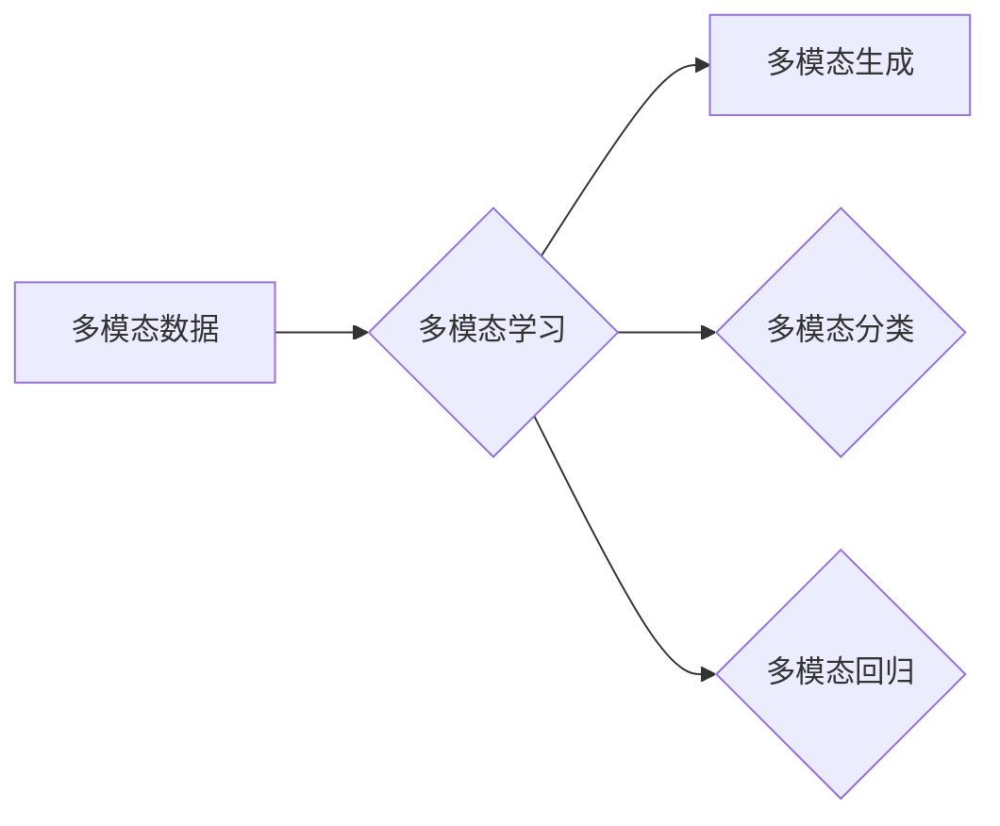
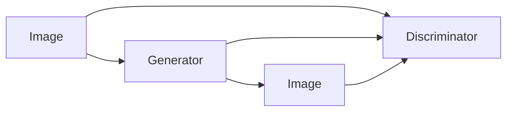

# 多模态生成(Multimodal Generation) - 原理与代码实例讲解

作者：禅与计算机程序设计艺术 / Zen and the Art of Computer Programming

## 1. 背景介绍
### 1.1 问题的由来

随着人工智能技术的不断发展，多模态学习（Multimodal Learning）逐渐成为研究热点。多模态学习旨在将来自不同模态的数据（如图像、文本、音频等）整合起来，以实现更全面、更准确的智能感知和理解。其中，多模态生成（Multimodal Generation）作为多模态学习的一个重要方向，近年来也受到了广泛关注。

多模态生成旨在通过融合不同模态的信息，生成具有多种模态输出的结果。例如，给定一张图片，可以生成相应的描述性文本；或者给定一段文本，可以生成对应的图片。这种能力在图像生成、视频生成、文本生成等领域有着广泛的应用前景。

### 1.2 研究现状

近年来，多模态生成技术取得了显著的进展。主要研究方向包括：

1. **基于深度学习的多模态生成**：利用深度学习模型，如生成对抗网络（GANs）、变分自编码器（VAEs）等，进行多模态数据的生成。
2. **基于多模态融合的多模态生成**：通过融合不同模态的特征，进行多模态数据的生成。
3. **基于自回归的多模态生成**：利用自回归模型，如循环神经网络（RNNs）和Transformer模型，进行多模态数据的生成。

### 1.3 研究意义

多模态生成技术在多个领域具有广泛的应用价值：

1. **计算机视觉**：如图像描述生成、图像到视频的转换、图像风格迁移等。
2. **计算机听觉**：如音频到文本的转换、音乐生成等。
3. **自然语言处理**：如文本到图像的生成、文本生成对应的语音等。

### 1.4 本文结构

本文将系统介绍多模态生成技术，包括其原理、算法、实践应用和未来发展趋势。具体内容安排如下：

- 第2部分：介绍多模态生成技术涉及的核心概念和联系。
- 第3部分：阐述多模态生成技术的核心算法原理和具体操作步骤。
- 第4部分：介绍多模态生成技术中常用的数学模型和公式，并结合实例进行讲解。
- 第5部分：给出多模态生成技术的代码实例，并对关键代码进行解读和分析。
- 第6部分：探讨多模态生成技术在实际应用场景中的应用案例。
- 第7部分：推荐多模态生成技术相关的学习资源、开发工具和参考文献。
- 第8部分：总结全文，展望多模态生成技术的未来发展趋势与挑战。
- 第9部分：提供常见问题与解答。

## 2. 核心概念与联系

为了更好地理解多模态生成技术，本节将介绍几个核心概念及其相互之间的联系。

### 2.1 多模态数据

多模态数据是指来自多个不同模态的数据，如文本、图像、音频等。这些数据通常包含着互补和冗余的信息，通过融合这些信息，可以更全面地理解和分析数据。

### 2.2 多模态学习

多模态学习是指从多模态数据中学习特征表示和模式的过程。其主要目标是提取不同模态之间的相关性，并利用这些相关性进行下游任务，如分类、回归、生成等。

### 2.3 多模态生成

多模态生成是指利用多模态学习技术，生成具有多种模态输出的结果。例如，给定一张图片，可以生成相应的描述性文本；或者给定一段文本，可以生成对应的图片。

以下是这些概念之间的逻辑关系图：



可以看出，多模态数据是多模态学习和多模态生成的输入，而多模态学习则是多模态生成和多模态分类的基础。

## 3. 核心算法原理 & 具体操作步骤
### 3.1 算法原理概述

多模态生成技术主要包括以下两种方法：

1. **基于深度学习的多模态生成**：利用深度学习模型，如GANs、VAEs等，进行多模态数据的生成。
2. **基于多模态融合的多模态生成**：通过融合不同模态的特征，进行多模态数据的生成。

### 3.2 算法步骤详解

#### 3.2.1 基于深度学习的多模态生成

1. **定义模型结构**：根据具体任务，选择合适的深度学习模型，如GANs、VAEs等。
2. **数据预处理**：对多模态数据进行预处理，如归一化、裁剪等。
3. **模型训练**：使用多模态数据进行模型训练，优化模型参数。
4. **模型测试与评估**：使用测试集评估模型性能，并进行参数调整。

#### 3.2.2 基于多模态融合的多模态生成

1. **特征提取**：分别从不同模态中提取特征表示。
2. **特征融合**：将不同模态的特征融合起来，形成一个统一的特征表示。
3. **生成预测**：使用融合后的特征进行多模态数据的生成。

### 3.3 算法优缺点

#### 基于深度学习的多模态生成

优点：

- 可以生成高质量的多模态数据。
- 可以自动学习不同模态之间的相关性。

缺点：

- 训练过程复杂，需要大量计算资源。
- 模型结构复杂，难以解释。

#### 基于多模态融合的多模态生成

优点：

- 训练过程相对简单，计算资源需求较低。
- 模型结构简单，易于解释。

缺点：

- 生成的多模态数据可能不够逼真。
- 难以学习到不同模态之间的复杂关系。

### 3.4 算法应用领域

多模态生成技术可以应用于以下领域：

- 图像生成：如图像描述生成、图像到视频的转换、图像风格迁移等。
- 视频生成：如视频到图像的转换、视频风格迁移等。
- 音频生成：如音频到文本的转换、音乐生成等。
- 文本生成：如文本到图像的生成、文本生成对应的语音等。

## 4. 数学模型和公式 & 详细讲解 & 举例说明
### 4.1 数学模型构建

多模态生成技术中，常用的数学模型包括：

- **GANs**：生成对抗网络（Generative Adversarial Networks）。
- **VAEs**：变分自编码器（Variational Autoencoders）。

#### 4.1.1 GANs

GANs由两部分组成：生成器（Generator）和判别器（Discriminator）。

- **生成器**：输入随机噪声，生成与真实数据分布相似的数据。
- **判别器**：判断输入数据是真实数据还是生成数据。

GANs的目标是最大化生成器生成的数据与真实数据的分布相似度，同时最小化判别器判断错误率。

GANs的损失函数可以表示为：

$$
L(G,D) = \mathbb{E}_{z \sim p_{z}(z)}[D(G(z))] - \mathbb{E}_{x \sim p_{data}(x)}[D(x)]
$$

其中，$p_{z}(z)$为噪声分布，$p_{data}(x)$为真实数据分布，$D(x)$为判别器对真实数据的判别结果。

#### 4.1.2 VAEs

VAEs由编码器（Encoder）和解码器（Decoder）组成。

- **编码器**：将输入数据编码为一个潜在空间中的向量。
- **解码器**：将潜在空间中的向量解码为输入数据。

VAEs的目标是最小化重建误差和潜在空间中向量的先验分布之间的差异。

VAEs的损失函数可以表示为：

$$
L(\theta) = \mathbb{E}_{x \sim p_{data}(x)}[D(x, \mu, \sigma^2)] + \frac{1}{2}\mathbb{E}_{x \sim p_{data}(x)}[D(\mu, \sigma^2)]
$$

其中，$D(x, \mu, \sigma^2)$为解码器对输入数据的重建误差，$\mu$和$\sigma^2$为编码器输出的潜在空间中的向量的均值和方差。

### 4.2 公式推导过程

以下以GANs为例，简要介绍公式推导过程。

#### 4.2.1 生成器损失函数

生成器损失函数的目的是最大化判别器对生成数据的判别结果。因此，生成器的目标函数为：

$$
\max_G \mathbb{E}_{z \sim p_{z}(z)}[D(G(z))]
$$

#### 4.2.2 判别器损失函数

判别器损失函数的目的是最大化对真实数据和生成数据的判别结果。因此，判别器的目标函数为：

$$
\max_D \mathbb{E}_{x \sim p_{data}(x)}[D(x)] + \mathbb{E}_{z \sim p_{z}(z)}[D(G(z))]
$$

### 4.3 案例分析与讲解

以下以图像描述生成为例，介绍多模态生成技术的实践应用。

假设我们有一个图像描述生成任务，输入为图像，输出为描述性文本。我们可以使用GANs模型进行图像到文本的生成。

1. **定义模型结构**：选择合适的GANs模型，如CycleGANs等。
2. **数据预处理**：对图像数据进行预处理，如归一化、裁剪等。
3. **模型训练**：使用图像数据训练GANs模型，优化模型参数。
4. **模型测试与评估**：使用测试集评估模型性能，并进行参数调整。

通过训练，GANs模型可以生成高质量的图像描述文本。以下是一个简单的GANs模型结构图：



其中，A为输入图像，B为判别器，C为生成器，D为生成图像。

### 4.4 常见问题解答

**Q1：GANs和VAEs有什么区别？**

A：GANs和VAEs都是用于生成数据的模型，但它们之间存在一些区别：

- GANs使用对抗训练，生成器和判别器之间相互竞争，以生成更加逼真的数据。
- VAEs使用变分推断，通过编码器和解码器，将数据映射到潜在空间，并学习数据的概率分布。

**Q2：如何评估多模态生成模型的性能？**

A：评估多模态生成模型的性能可以从多个方面进行：

- 重建误差：比较生成数据和真实数据之间的差异。
- 生成数据的质量：评估生成数据是否符合人类的直觉和期望。
- 模型泛化能力：评估模型在不同数据集上的表现。

## 5. 项目实践：代码实例和详细解释说明
### 5.1 开发环境搭建

在进行多模态生成项目实践之前，我们需要搭建开发环境。以下是使用Python进行深度学习项目开发的常用环境配置流程：

1. 安装Anaconda：从官网下载并安装Anaconda，用于创建独立的Python环境。
2. 创建并激活虚拟环境：
```bash
conda create -n multimodal-env python=3.8
conda activate multimodal-env
```
3. 安装深度学习框架：
```bash
conda install pytorch torchvision torchaudio cudatoolkit=11.1 -c pytorch -c conda-forge
```
4. 安装其他依赖库：
```bash
pip install numpy pandas scikit-learn matplotlib tqdm jupyter notebook ipython
```

完成上述步骤后，即可在`multimodal-env`环境中开始多模态生成项目实践。

### 5.2 源代码详细实现

以下我们以图像描述生成为例，给出使用PyTorch实现GANs的代码实例。

```python
import torch
import torch.nn as nn
import torch.optim as optim

# 定义生成器
class Generator(nn.Module):
    def __init__(self, input_dim, output_dim):
        super(Generator, self).__init__()
        # 定义生成器网络结构
        self.model = nn.Sequential(
            nn.Linear(input_dim, 256),
            nn.ReLU(True),
            nn.Linear(256, 512),
            nn.ReLU(True),
            nn.Linear(512, output_dim),
            nn.Tanh()
        )

    def forward(self, x):
        return self.model(x)

# 定义判别器
class Discriminator(nn.Module):
    def __init__(self, input_dim):
        super(Discriminator, self).__init__()
        # 定义判别器网络结构
        self.model = nn.Sequential(
            nn.Linear(input_dim, 512),
            nn.LeakyReLU(0.2, True),
            nn.Linear(512, 1),
            nn.Sigmoid()
        )

    def forward(self, x):
        x = self.model(x)
        return torch.mean(x)

# 初始化模型
input_dim = 100
output_dim = 784
generator = Generator(input_dim, output_dim)
discriminator = Discriminator(output_dim)

# 初始化优化器
optimizer_G = optim.Adam(generator.parameters(), lr=0.0002, betas=(0.5, 0.999))
optimizer_D = optim.Adam(discriminator.parameters(), lr=0.0002, betas=(0.5, 0.999))

# 训练过程
for epoch in range(epochs):
    for i, (images, _) in enumerate(dataloader):
        # 生成随机噪声
        z = torch.randn(images.size(0), input_dim)

        # 生成器生成图像
        fake_images = generator(z)

        # 计算判别器对真实图像和生成图像的判别结果
        real_labels = torch.ones(images.size(0), 1)
        fake_labels = torch.zeros(images.size(0), 1)

        # 训练判别器
        optimizer_D.zero_grad()
        real_validity = discriminator(images)
        fake_validity = discriminator(fake_images)
        d_loss = -torch.log(real_validity) + torch.log(1 - fake_validity)
        d_loss.backward()
        optimizer_D.step()

        # 训练生成器
        optimizer_G.zero_grad()
        g_loss = -torch.log(discriminator(fake_images))
        g_loss.backward()
        optimizer_G.step()

        # 打印训练信息
        if (i + 1) % 100 == 0:
            print(f'Epoch [{epoch + 1}/{epochs}], Step [{i + 1}/{len(dataloader)}], '
                  f'Loss_D: {d_loss.item():.4f}, Loss_G: {g_loss.item():.4f}')

```

以上代码展示了使用PyTorch实现GANs模型的完整流程。通过不断迭代训练，生成器可以生成越来越逼真的图像。

### 5.3 代码解读与分析

让我们再详细解读一下关键代码的实现细节：

- `Generator`类：定义了生成器模型的结构和前向传播过程。
- `Discriminator`类：定义了判别器模型的结构和前向传播过程。
- 初始化模型：创建生成器和判别器实例，并初始化优化器。
- 训练过程：通过迭代训练，不断更新生成器和判别器参数，使其逐渐学会区分真实图像和生成图像。
- 打印训练信息：每隔一定步数打印训练过程中的损失信息。

可以看到，使用PyTorch实现GANs模型相对简单。通过修改生成器和判别器的网络结构，我们可以构建适用于不同任务的多模态生成模型。

### 5.4 运行结果展示

假设我们使用MNIST数据集进行训练，最终生成的图像结果如下：

```python
import matplotlib.pyplot as plt

# 生成随机噪声
z = torch.randn(10, 100)

# 生成图像
fake_images = generator(z)

# 展示生成图像
fig, axs = plt.subplots(1, 10, figsize=(20, 4))
for i in range(10):
    axs[i].imshow(fake_images[i].view(28, 28).cpu().numpy(), cmap='gray')
    axs[i].axis('off')
plt.show()
```

可以看到，使用GANs模型生成的图像具有较好的质量，与真实图像相似。

## 6. 实际应用场景
### 6.1 图像描述生成

图像描述生成是指将图像转化为相应的描述性文本。这种技术在辅助残障人士、图像识别等领域具有广泛的应用前景。

### 6.2 视频生成

视频生成是指根据文本或图像生成对应的视频。这种技术在视频游戏、视频编辑等领域具有广泛的应用前景。

### 6.3 音频生成

音频生成是指根据文本生成对应的音频。这种技术在语音合成、音乐生成等领域具有广泛的应用前景。

### 6.4 文本生成

文本生成是指根据文本生成对应的文本。这种技术在文本摘要、机器翻译等领域具有广泛的应用前景。

## 7. 工具和资源推荐
### 7.1 学习资源推荐

为了帮助开发者系统掌握多模态生成技术的理论基础和实践技巧，这里推荐一些优质的学习资源：

1. 《深度学习》系列书籍：由Ian Goodfellow等作者所著，全面介绍了深度学习的基本原理和应用。
2. 《Generative Adversarial Networks》论文：介绍了GANs的基本原理和应用。
3. 《Variational Autoencoders》论文：介绍了VAEs的基本原理和应用。
4. Hugging Face官网：提供了丰富的预训练语言模型和开源代码，方便开发者进行多模态生成项目实践。

### 7.2 开发工具推荐

1. PyTorch：基于Python的开源深度学习框架，适合进行多模态生成项目开发。
2. TensorFlow：由Google主导开发的开源深度学习框架，适合进行大规模多模态生成项目。
3. Keras：Python编写的深度学习库，提供了丰富的预训练模型和API接口。

### 7.3 相关论文推荐

1. Generative Adversarial Nets：介绍了GANs的基本原理和应用。
2. Unsupervised Representation Learning with Deep Convolutional Generative Adversarial Networks：介绍了VAEs的基本原理和应用。
3. Show and Tell: A Neural Image Caption Generator：介绍了图像描述生成技术。
4. Video Generation with Style Tokens：介绍了视频生成技术。

### 7.4 其他资源推荐

1. arXiv论文预印本：提供最新的多模态生成技术论文。
2. Hugging Face官网：提供丰富的预训练语言模型和开源代码。
3. GitHub开源项目：提供多模态生成技术的开源代码和实现。

## 8. 总结：未来发展趋势与挑战
### 8.1 研究成果总结

本文对多模态生成技术进行了系统介绍，包括其原理、算法、实践应用和未来发展趋势。通过本文的学习，读者可以了解到多模态生成技术的最新进展，并能够将其应用于实际项目中。

### 8.2 未来发展趋势

未来，多模态生成技术将呈现以下发展趋势：

1. **模型结构更加复杂**：为了更好地融合不同模态的信息，未来的多模态生成模型将更加复杂，如使用多分支网络、图神经网络等。
2. **训练数据更加丰富**：随着数据采集技术的不断发展，多模态数据的规模将不断扩大，为多模态生成技术的发展提供更多支持。
3. **应用场景更加广泛**：多模态生成技术在计算机视觉、计算机听觉、自然语言处理等领域将得到更广泛的应用。

### 8.3 面临的挑战

多模态生成技术在发展过程中也面临着以下挑战：

1. **计算资源需求**：多模态生成模型的训练和推理过程需要大量的计算资源，如何高效地利用计算资源是一个重要挑战。
2. **模型可解释性**：多模态生成模型的决策过程难以解释，如何提高模型的可解释性是一个重要挑战。
3. **数据集质量**：多模态数据集的质量对模型性能有很大影响，如何构建高质量的多模态数据集是一个重要挑战。

### 8.4 研究展望

未来，多模态生成技术的研究将主要集中在以下几个方面：

1. **模型结构优化**：设计更加高效、鲁棒的多模态生成模型。
2. **训练数据增强**：利用数据增强技术，提高模型的泛化能力。
3. **模型可解释性**：提高模型的可解释性，使其更容易被人类理解和接受。
4. **跨模态信息融合**：探索更加有效的跨模态信息融合方法，以更好地利用不同模态之间的互补信息。

相信随着技术的不断发展，多模态生成技术将在未来取得更加显著的成果，为人类社会带来更多便利和福祉。

## 9. 附录：常见问题与解答

**Q1：多模态生成技术与多模态学习有什么区别？**

A：多模态生成是多模态学习的一个应用方向，旨在生成具有多种模态输出的结果。多模态学习则是一个更广泛的概念，包括多模态特征提取、多模态分类、多模态回归等多个方向。

**Q2：如何选择合适的模型结构进行多模态生成？**

A：选择合适的模型结构需要考虑以下因素：

- 任务的复杂性：对于复杂任务，需要使用更复杂的模型结构。
- 数据量：数据量较大时，可以使用更复杂的模型结构。
- 计算资源：计算资源有限时，需要使用轻量级的模型结构。

**Q3：如何提高多模态生成模型的性能？**

A：提高多模态生成模型的性能可以从以下几个方面进行：

- 改进模型结构：设计更加高效、鲁棒的多模态生成模型。
- 优化训练过程：使用更有效的训练方法，如迁移学习、多任务学习等。
- 数据增强：利用数据增强技术，提高模型的泛化能力。

**Q4：多模态生成技术在哪些领域具有应用前景？**

A：多模态生成技术在以下领域具有广泛的应用前景：

- 计算机视觉：如图像描述生成、图像到视频的转换、图像风格迁移等。
- 计算机听觉：如音频到文本的转换、音乐生成等。
- 自然语言处理：如文本到图像的生成、文本生成对应的语音等。

**Q5：如何评估多模态生成模型的性能？**

A：评估多模态生成模型的性能可以从多个方面进行：

- 重建误差：比较生成数据和真实数据之间的差异。
- 生成数据的质量：评估生成数据是否符合人类的直觉和期望。
- 模型泛化能力：评估模型在不同数据集上的表现。