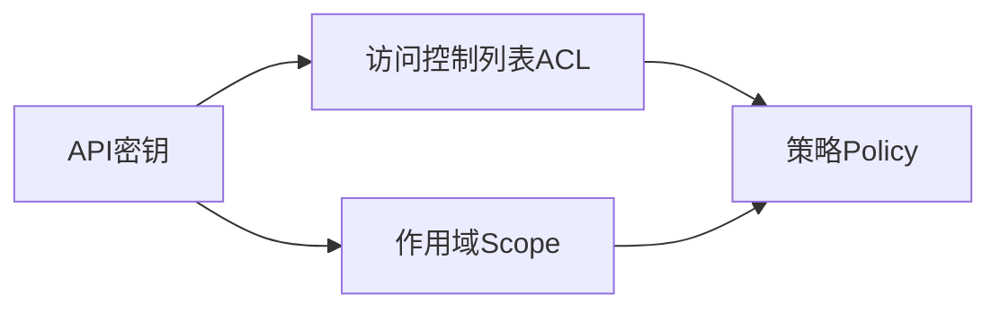
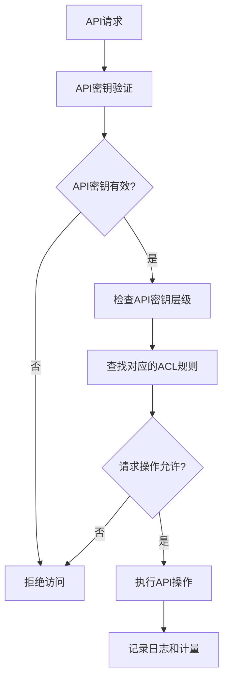

# 分级 API Key 的详细管理

## 1. 背景介绍

### 1.1 问题的由来

在现代软件开发中,应用程序接口(API)扮演着至关重要的角色。API允许不同的软件系统、服务和应用程序相互通信和交换数据。随着云计算、微服务架构和移动应用的兴起,API的使用变得越来越普遍。然而,随着API的广泛采用,确保API的安全性和访问控制也变得越来越重要。

传统的API访问控制方式通常是使用单一的API密钥(API Key)。虽然这种方式简单直接,但它存在一些固有的缺陷和安全隐患。例如,如果API密钥被泄露或滥用,整个系统都可能面临风险。此外,单一API密钥无法区分不同的用户或客户端,从而难以实现细粒度的访问控制和审计。

### 1.2 研究现状

为了解决上述问题,分级API密钥(Tiered API Keys)的概念应运而生。分级API密钥旨在通过引入多级别的API密钥来提高API访问控制的灵活性和安全性。每个级别的API密钥都可以赋予不同的权限和访问范围,从而实现更精细化的访问控制策略。

目前,一些主流的API管理平台和云服务提供商已经支持分级API密钥的功能,如AWS API Gateway、Google Cloud Endpoints、Azure API Management等。然而,如何有效地设计和管理分级API密钥体系,并将其集成到现有的API架构中,仍然是一个值得探讨的课题。

### 1.3 研究意义

实施分级API密钥管理可以带来以下主要好处:

1. **提高安全性**: 通过为不同的用户或客户端分配不同级别的API密钥,可以最小化潜在的安全风险。即使某个API密钥被泄露,其影响也将被限制在特定的访问范围内。

2. **细粒度访问控制**: 分级API密钥允许根据用户角色、客户端类型或其他标准来定制不同级别的访问权限,实现更精细化的访问控制策略。

3. **改善审计和监控**: 由于每个API密钥都与特定的用户或客户端相关联,因此可以更容易地跟踪和审计API的使用情况,从而提高可追溯性和透明度。

4. **支持计费和计量**: 不同级别的API密钥可以与不同的计费策略或使用限制相关联,为API提供商提供更灵活的商业模式和资源管理方式。

### 1.4 本文结构

本文将全面探讨分级API密钥的设计、实现和管理。我们将从核心概念和原理出发,详细介绍分级API密钥的工作机制、关键算法和数学模型。接下来,我们将通过实际的代码示例和项目实践,展示如何在实际应用中集成和管理分级API密钥。最后,我们将讨论分级API密钥的实际应用场景、相关工具和资源,并总结未来的发展趋势和挑战。

## 2. 核心概念与联系

分级API密钥管理涉及多个核心概念,包括API密钥、访问控制列表(ACL)、作用域(Scope)和策略(Policy)等。这些概念相互关联,共同构建了一个完整的分级API密钥体系。

1. **API密钥(API Key)**: API密钥是一个唯一的标识符,用于认证和授权API的访问。在分级API密钥体系中,每个级别的API密钥都具有不同的权限和访问范围。

2. **访问控制列表(ACL)**: ACL定义了每个API密钥所允许访问的API资源和操作。它通常由一系列规则组成,指定了允许或拒绝访问的条件。

3. **作用域(Scope)**: 作用域用于限定API密钥的访问范围。它可以是特定的API资源、操作或其他自定义的限制条件。作用域通常与ACL密切相关,并被用于构建ACL规则。

4. **策略(Policy)**: 策略是一组预定义的规则和配置,用于管理API密钥的生命周期、权限分配和其他行为。策略可以应用于单个API密钥或整个API密钥层级。

这些核心概念相互关联,共同构建了一个灵活且可扩展的分级API密钥体系。API密钥定义了访问凭证,ACL和作用域限定了访问范围,而策略则提供了管理和配置这些元素的方式。

## 3. 核心算法原理 & 具体操作步骤

### 3.1 算法原理概述

分级API密钥管理的核心算法原理基于**层级访问控制模型**。该模型将API密钥组织成多个层级,每个层级具有不同的访问权限和范围。较高层级的API密钥拥有更广泛的访问权限,而较低层级的API密钥则受到更多限制。

该算法的工作流程如下:

1. 当API请求到达时,系统首先验证提供的API密钥是否有效。
2. 如果API密钥无效,则直接拒绝访问。
3. 如果API密钥有效,系统将检查该API密钥所属的层级,并查找与该层级相关联的ACL规则。
4. 系统根据ACL规则评估请求的操作是否被允许。如果不允许,则拒绝访问。
5. 如果请求的操作被允许,系统将执行相应的API操作。
6. 最后,系统记录相关日志并进行计量(如果需要)。

### 3.2 算法步骤详解

1. **API密钥验证**

   - 检查API密钥是否存在于有效的API密钥列表中。
   - 验证API密钥的有效期是否已过期。
   - 可选地进行其他安全检查,如IP地址限制、速率限制等。

2. **API密钥层级确定**

   - 根据API密钥,查找其所属的层级。
   - 层级可以基于多种因素确定,如用户角色、客户端类型、付费计划等。

3. **ACL规则匹配**

   - 根据API密钥所属的层级,查找对应的ACL规则集合。
   - ACL规则通常包括允许访问的API资源、HTTP方法、IP地址范围等条件。

4. **请求评估**

   - 将当前API请求与ACL规则进行匹配。
   - 如果请求匹配任何一条允许规则,则允许访问。
   - 如果请求与所有规则都不匹配,则拒绝访问。

5. **API操作执行**

   - 如果请求被允许,则执行相应的API操作。
   - 可能需要进行额外的安全检查或预处理。

6. **日志记录和计量**

   - 记录API请求的详细信息,如时间戳、API密钥、请求路径、响应状态码等。
   - 根据需要进行计量,如请求计数、带宽使用等,用于计费或资源管理。

### 3.3 算法优缺点

**优点**:

- **灵活性**: 分级API密钥体系提供了灵活的访问控制机制,可以根据不同的需求定制不同层级的API密钥。
- **安全性**: 通过将API密钥划分为多个层级,可以最小化单个API密钥泄露的风险。
- **可扩展性**: 算法可以轻松地扩展到更多层级和更复杂的ACL规则,以满足不同的需求。
- **审计和监控**: 由于每个API密钥都与特定的用户或客户端相关联,因此可以更容易地跟踪和审计API的使用情况。

**缺点**:

- **复杂性**: 相比于单一API密钥,分级API密钥体系增加了管理和配置的复杂性。
- **性能开销**: 需要进行额外的API密钥验证和ACL规则匹配,可能会增加一些性能开销。
- **迁移成本**: 将现有系统迁移到分级API密钥体系可能需要一定的工作量和成本。

### 3.4 算法应用领域

分级API密钥管理算法可以应用于各种需要精细化访问控制的场景,包括但不限于:

- **云服务平台**: 云服务提供商可以使用分级API密钥来管理不同客户或服务的API访问权限。
- **企业内部API**: 企业可以基于员工角色、部门或其他标准,为内部API实施分级访问控制。
- **第三方API**: API提供商可以通过分级API密钥为不同的合作伙伴或客户提供不同的API访问级别。
- **物联网(IoT)系统**: 在IoT环境中,可以为不同类型的设备分配不同级别的API密钥,以实现精细化的设备管理和数据访问控制。
- **移动应用**: 移动应用可以使用分级API密钥来控制不同用户角色或付费计划的API访问权限。

总的来说,任何需要对API访问进行细粒度控制的场景都可以考虑采用分级API密钥管理算法。

## 4. 数学模型和公式 & 详细讲解 & 举例说明

分级API密钥管理算法涉及一些数学模型和公式,用于描述和优化访问控制策略。在这一部分,我们将详细介绍这些数学模型和公式,并通过实际案例进行讲解和说明。

### 4.1 数学模型构建

我们将使用**布尔矩阵模型**来表示API资源、操作和API密钥层级之间的访问控制关系。

设有 $n$ 个API资源 $R = \{r_1, r_2, \ldots, r_n\}$,和 $m$ 种操作 $O = \{o_1, o_2, \ldots, o_m\}$。我们定义一个 $n \times m$ 的布尔矩阵 $A$,其中 $A_{ij}$ 表示对于资源 $r_i$ 是否允许执行操作 $o_j$。

$$
A = \begin{bmatrix}
    a_{11} & a_{12} & \cdots & a_{1m} \
    a_{21} & a_{22} & \cdots & a_{2m} \
    \vdots & \vdots & \ddots & \vdots \
    a_{n1} & a_{n2} & \cdots & a_{nm}
\end{bmatrix}
$$

其中 $a_{ij} = \begin{cases}
1, & \text{允许对资源 $r_i$ 执行操作 $o_j$} \
0, & \text{不允许对资源 $r_i$ 执行操作 $o_j$}
\end{cases}$

接下来,我们定义 $k$ 个API密钥层级 $L = \{l_1, l_2, \ldots, l_k\}$,每个层级 $l_i$ 对应一个 $n \times m$ 的布尔矩阵 $B_i$,表示该层级允许访问的资源和操作。

$$
B_i = \begin{bmatrix}
    b_{i11} & b_{i12} & \cdots & b_{i1m} \
    b_{i21} & b_{i22} & \cdots & b_{i2m} \
    \vdots & \vdots & \ddots & \vdots \
    b_{in1} & b_{in2} & \cdots & b_{inm}
\end{bmatrix}
$$

其中 $b_{ijk} = \begin{cases}
1, & \text{层级 $l_i$ 允许对资源 $r_j$ 执行操作 $o_k$} \
0, & \text{层级 $l_i$ 不允许对资源 $r_j$ 执行操作 $o_k$}
\end{cases}$

对于任意API请求,我们可以根据请求的API密钥层级 $l_i$,查找对应的矩阵 $B_i$,并与矩阵 $A$ 进行逐元素相乘,得到一个新的矩阵 $C$,表示该请求的允许访问范围。

$$
C = A \odot B_i
$$