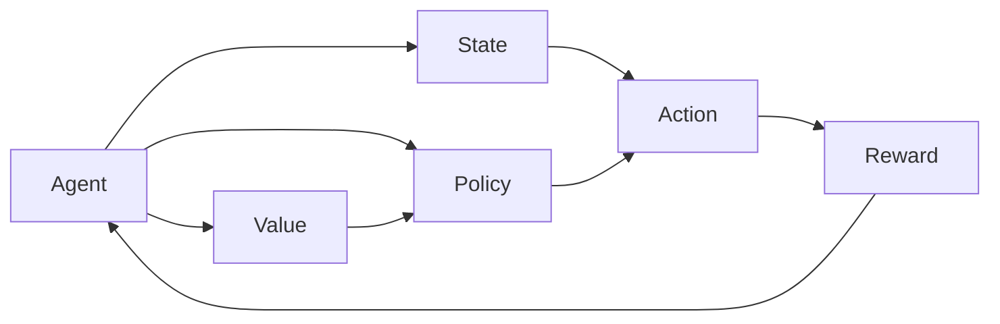

# 多智能体强化学习 (Multi-Agent Reinforcement Learning)

关键词：强化学习、多智能体系统、博弈论、深度学习、分布式优化

## 1. 背景介绍

### 1.1 问题的由来

随着人工智能技术的飞速发展,越来越多的实际应用场景需要多个智能体协同工作,完成复杂任务。传统的单智能体强化学习方法已经无法满足这些场景的需求。因此,多智能体强化学习(Multi-Agent Reinforcement Learning,MARL)应运而生,成为了人工智能领域的研究热点。

### 1.2 研究现状

近年来,MARL取得了长足的进展。一方面,深度强化学习的兴起为MARL提供了更强大的学习范式。另一方面,博弈论与优化理论的发展为解决多智能体协同问题提供了理论基础。目前MARL已经在无人驾驶、智能电网、网络安全等诸多领域得到应用。但同时MARL还面临着诸如信息不完全、通信受限、探索-利用困境等诸多挑战。

### 1.3 研究意义

MARL的研究对于推动人工智能在实际场景中的应用具有重要意义。一方面,MARL为解决现实世界中的多智能体决策问题提供了有效途径。另一方面,MARL有望揭示生物群体智能的机理,为认知科学和神经科学研究提供新的视角。此外,MARL作为机器学习的前沿方向之一,其研究进展也将推动人工智能基础理论的发展。

### 1.4 本文结构

本文将全面介绍MARL的研究现状、核心概念、关键技术与应用实践。第2节介绍MARL的核心概念。第3节阐述MARL的核心算法。第4节给出MARL的数学模型。第5节展示MARL的代码实现。第6节讨论MARL的应用场景。第7节推荐MARL相关工具和资源。第8节总结全文并展望未来。第9节列出常见问题解答。

## 2. 核心概念与联系

MARL中的核心概念包括:
- 智能体(Agent):自主执行动作、感知环境的个体。
- 状态(State):环境的完整描述。
- 动作(Action):智能体对环境施加的影响。
- 奖励(Reward):量化智能体行为优劣的即时反馈。
- 策略(Policy):将状态映射为动作的函数。
- 价值(Value):衡量状态或动作长期收益的函数。

这些概念的关系如下图所示:



在MARL中,多个智能体在同一环境中交互,各自的动作会影响环境状态和其他智能体的奖励。因此,每个智能体在优化自身策略的同时,还需要考虑其他智能体的行为,形成了博弈问题。智能体间可以采取合作、竞争、混合等不同方式互动。

## 3. 核心算法原理 & 具体操作步骤

### 3.1 算法原理概述

MARL的核心是让多个智能体通过与环境和彼此互动,学习到最优联合策略,即纳什均衡。常见的MARL算法包括:
- 独立学习:每个智能体独立学习,将其他智能体视为环境的一部分。代表算法有独立Q学习等。
- 联合行动学习:智能体学习联合行动价值函数,将联合行动空间视为单个行动空间。代表算法有联合行动学习等。
- 策略梯度:直接优化智能体的策略函数,使用策略梯度定理更新策略参数。代表算法有Actor-Critic等。
- 对抗学习:不同智能体相互博弈,在对抗中不断提升策略。代表算法有Minimax-Q等。
- 通信学习:允许智能体间传递信息,基于通信内容优化策略。代表算法有DIAL等。

### 3.2 算法步骤详解

以经典的Minimax-Q算法为例,其具体步骤如下:

1. 随机初始化Q值函数参数 $\theta_i, i=1,2$
2. 重复:
   1. 重置环境状态 $s$
   2. 当前状态为 $s$,重复:
      1. 对于智能体 $i=1,2$:
         1. 根据 $\epsilon$-贪婪策略选择动作 $a_i$
      2. 执行联合动作 $\mathbf{a}=(a_1,a_2)$,观测下一状态 $s'$,奖励 $r_1,r_2$
      3. 对于智能体 $i=1,2$,更新Q值:

         $Q_i(s,a_1,a_2) \leftarrow (1-\alpha)Q_i(s,a_1,a_2)+\alpha[r_i+\gamma \min\limits_{a'_j} \max\limits_{a'_i} Q_i(s',a'_1,a'_2)]$

      4. $s \leftarrow s'$
   3. 更新目标Q网络参数 $\theta'_i \leftarrow \theta_i$

其中,$\alpha$是学习率,$\gamma$是折扣因子,$\epsilon$控制探索。算法交替优化双方策略,最终收敛到纳什均衡。

### 3.3 算法优缺点

Minimax-Q的优点是能够在零和博弈中稳定收敛,对抗双方的策略质量接近。但其缺点是计算复杂度高,很难扩展到多于2个智能体的场景。此外,该算法要求智能体间的奖励必须是完全对称的。

### 3.4 算法应用领域

Minimax-Q等对抗学习算法在对称博弈问题上表现出色,如双人零和游戏(国际象棋、围棋)、网络安全博弈(攻防对抗)、自动驾驶(车辆交互)等。而在合作型任务如多机器人协同等场景下,则需要使用其他类型的MARL算法。

## 4. 数学模型和公式 & 详细讲解 & 举例说明

### 4.1 数学模型构建

MARL可以用马尔可夫博弈(Markov Game)模型来刻画。考虑一个有 $N$ 个智能体的马尔可夫博弈,定义为一个元组:
$$
\mathcal{G}=\langle\mathcal{S},\mathcal{A}^1,\ldots,\mathcal{A}^N,\mathcal{T},\mathcal{R}^1,\ldots,\mathcal{R}^N\rangle
$$

其中:
- $\mathcal{S}$ 是状态空间
- $\mathcal{A}^i$ 是智能体 $i$ 的行动空间
- $\mathcal{T}:\mathcal{S}\times\mathcal{A}^1\times\ldots\times\mathcal{A}^N\rightarrow\Delta(\mathcal{S})$ 是状态转移函数
- $\mathcal{R}^i:\mathcal{S}\times\mathcal{A}^1\times\ldots\times\mathcal{A}^N\rightarrow\mathbb{R}$ 是智能体 $i$ 的奖励函数

每个智能体 $i$ 的目标是最大化自身的累积奖励:

$$
\max\limits_{\pi^i} \mathbb{E}\left[\sum_{t=0}^\infty \gamma^t r^i_t \mid s_0,\pi^1,\ldots,\pi^N\right]
$$

其中 $\pi^i:\mathcal{S}\rightarrow\Delta(\mathcal{A}^i)$ 是智能体 $i$ 的策略函数。

### 4.2 公式推导过程

在马尔可夫博弈中,定义智能体 $i$ 在状态 $s$ 下执行联合行动 $\mathbf{a}=(a^1,\ldots,a^N)$ 的Q值为:

$$
Q^i(s,\mathbf{a})=\mathcal{R}^i(s,\mathbf{a})+\gamma \sum_{s'\in\mathcal{S}} \mathcal{T}(s'|s,\mathbf{a})V^i(s')
$$

其中 $V^i(s)$ 是状态价值函数,表示状态 $s$ 对于智能体 $i$ 的长期价值:

$$
V^i(s)=\max\limits_{\pi^i}\mathbb{E}\left[\sum_{t=0}^\infty \gamma^t r^i_t \mid s_0=s,\pi^1,\ldots,\pi^N\right]
$$

在博弈均衡时,每个智能体的策略 $\pi^i$ 满足:

$$
\pi^{i*}(s) \in \arg\max\limits_{a^i} Q^i(s,a^i,\pi^{-i*}(s)), \forall s\in\mathcal{S}
$$

其中 $\pi^{-i*}$ 表示其他智能体的均衡策略。上式即为纳什均衡的定义。

### 4.3 案例分析与讲解

考虑一个简单的二人零和博弈,称为"匹配硬币"。两名玩家同时出示正面或反面,若两人出示面相同则玩家1胜,反之玩家2胜。

我们可以将其建模为一个马尔可夫博弈:
- 状态空间 $\mathcal{S}=\{\text{Start},\text{End}\}$
- 行动空间 $\mathcal{A}^1=\mathcal{A}^2=\{\text{正面},\text{反面}\}$
- 转移函数 $\mathcal{T}(\text{End}|\text{Start},\cdot)=1$
- 奖励函数 $\mathcal{R}^1(\text{Start},a^1,a^2)=\mathbf{1}_{a^1=a^2}, \mathcal{R}^2=-\mathcal{R}^1$

可以证明,这个博弈的纳什均衡为两人都以 $0.5$ 的概率出示正反面。在均衡时,双方的期望奖励都是 $0$。

### 4.4 常见问题解答

Q: MARL能否处理部分可观测问题?
A: 可以,将状态替换为观测历史,即可将部分可观测博弈转化为完全可观测博弈。但这会导致状态空间指数爆炸。也可以用基于RNN的方法直接处理观测序列。

Q: 如何降低MARL算法的通信开销?
A: 可以使用基于均值场的方法,每个智能体只与邻居通信,估计全局信息。也可以使用通信频率控制、信息压缩等技术降低通信量。

## 5. 项目实践：代码实例和详细解释说明

### 5.1 开发环境搭建

本节我们使用Python和PyTorch搭建MARL算法开发环境。需要安装以下依赖包:
- Python 3.6+
- PyTorch 1.8+
- Gym 0.18+
- NumPy 1.19+

可以使用pip命令安装:

```bash
pip install torch gym numpy
```

### 5.2 源代码详细实现

以下是Minimax-Q算法在"匹配硬币"游戏中的PyTorch实现:

```python
import torch
import numpy as np

class MinimaxQ:
    def __init__(self, gamma=0.99, lr=0.01):
        self.gamma = gamma
        self.lr = lr
        self.Q = torch.zeros(2,2)

    def choose_action(self, epsilon=0.1):
        if np.random.rand() < epsilon:
            return np.random.randint(2)
        else:
            return self.Q[0].argmax().item()

    def train(self, s, a1, a2, r, done=True):
        if done:
            target = r
        else:
            target = r + self.gamma * self.Q[s].min().max().item()
        self.Q[s,a1,a2] += self.lr * (target - self.Q[s,a1,a2])

def play(agent1, agent2, episodes=1000):
    rewards = [0, 0]
    for _ in range(episodes):
        a1 = agent1.choose_action()
        a2 = agent2.choose_action()
        if a1 == a2:
            r1, r2 = 1, -1
        else:
            r1, r2 = -1, 1
        agent1.train(0, a1, a2, r1)
        agent2.train(0, a2, a1, r2)
        rewards[0] += r1
        rewards[1] += r2

    return rewards[0]/episodes, rewards[1]/episodes

agent1 = MinimaxQ()
agent2 = MinimaxQ()
r1, r2 = play(agent1, agent2)
print(f"Agent1 average reward: {r1:.2f}")
print(f"Agent2 average reward: {