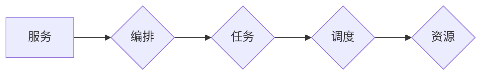

# 服务编排与任务调度原理与代码实战案例讲解

## 1. 背景介绍
### 1.1 问题的由来

随着现代软件系统的复杂性日益增加，单个应用程序往往由多个服务组成，这些服务之间需要协同工作才能完成复杂的业务逻辑。在这种情况下，如何有效地管理和协调这些服务的执行顺序和资源分配，成为了一个关键问题。服务编排和任务调度技术应运而生，旨在提高系统的可靠性和性能。

### 1.2 研究现状

服务编排和任务调度技术在过去的几十年里得到了广泛关注，并涌现出许多成熟的框架和解决方案。例如，Apache Camel、Apache Airflow、Kubernetes、Docker Swarm等。这些技术提供了丰富的功能，如工作流定义、任务调度、故障恢复、资源管理等。

### 1.3 研究意义

研究服务编排与任务调度技术对于构建高效、可靠的软件系统具有重要意义：

1. **提高系统可靠性**：通过合理编排服务执行顺序和资源分配，可以减少服务故障对系统整体的影响，提高系统的可靠性。
2. **优化系统性能**：合理的任务调度可以充分利用系统资源，提高系统吞吐量和响应速度。
3. **简化开发过程**：成熟的编排和调度框架可以降低开发难度，缩短开发周期。
4. **提高运维效率**：自动化编排和调度可以减少人工干预，提高运维效率。

### 1.4 本文结构

本文将系统介绍服务编排与任务调度的原理、技术架构、实现方法以及代码实战案例。文章结构如下：

- 第2部分，介绍服务编排与任务调度的核心概念和联系。
- 第3部分，详细阐述服务编排与任务调度的核心算法原理和具体操作步骤。
- 第4部分，介绍常用的数学模型和公式，并结合实例进行讲解。
- 第5部分，给出服务编排与任务调度的代码实例，并对关键代码进行解读。
- 第6部分，探讨服务编排与任务调度的实际应用场景和未来发展趋势。
- 第7部分，推荐相关学习资源、开发工具和参考文献。
- 第8部分，总结全文，展望服务编排与任务调度的未来发展趋势与挑战。
- 第9部分，提供常见问题与解答。

## 2. 核心概念与联系

以下是服务编排与任务调度中涉及的一些核心概念：

- **服务**：指完成特定功能的软件组件，可以是一个程序、一个API或者一组服务的组合。
- **编排**：指将多个服务按照一定的顺序和规则组合起来，协同完成一个复杂的业务流程。
- **任务**：指需要执行的具体工作单元，可以是调用一个服务、执行一个命令或者执行一段脚本。
- **调度**：指根据一定的策略和规则，将任务分配到合适的资源上执行。
- **工作流**：指多个任务按照一定的顺序和规则执行的流程。
- **资源**：指执行任务所需的硬件和软件资源，如CPU、内存、磁盘空间、网络带宽等。

这些概念之间的关系可以用以下Mermaid流程图表示：



可以看出，服务是编排和调度的基础，编排定义了任务的执行顺序和规则，调度将任务分配到资源上执行，从而完成复杂的业务流程。

## 3. 核心算法原理 & 具体操作步骤
### 3.1 算法原理概述

服务编排与任务调度的核心算法主要包括以下几种：

1. **工作流引擎**：负责定义和执行工作流，包括任务执行顺序、条件判断、循环等。
2. **调度算法**：根据一定的策略和规则，将任务分配到合适的资源上执行。
3. **资源管理器**：负责管理资源的使用情况，包括资源的分配、释放、监控等。
4. **监控和告警**：监控系统状态，及时发现和响应异常情况。

### 3.2 算法步骤详解

以下是服务编排与任务调度的基本步骤：

1. **定义工作流**：使用工作流定义语言或工具定义任务的执行顺序、条件判断、循环等。
2. **创建任务实例**：根据工作流定义创建任务实例，并将任务实例分配到调度队列。
3. **任务调度**：调度器根据策略和规则，将任务实例分配到合适的资源上执行。
4. **任务执行**：任务在分配的资源上执行，完成任务后返回执行结果。
5. **监控和告警**：监控系统状态，发现异常情况后触发告警，并采取措施进行处理。

### 3.3 算法优缺点

以下是服务编排与任务调度的常见算法及其优缺点：

| 算法名称 | 优点 | 缺点 |
| --- | --- | --- |
| 轮询调度 | 简单易实现，公平分配资源 | 无法根据实际负载动态调整资源分配 |
| 最小化完成时间调度 | 尽快完成所有任务，减少总完成时间 | 可能导致某些资源长时间空闲 |
| 最小化最大完成时间调度 | 最快完成所有任务，减少任务完成时间最长的资源空闲时间 | 调度复杂度较高 |
| 加权公平调度 | 根据资源权重分配任务，平衡负载 | 难以准确评估资源权重 |
| 按需分配调度 | 根据实际负载动态调整资源分配 | 实现复杂，需要实时监控资源状态 |

### 3.4 算法应用领域

服务编排与任务调度算法广泛应用于以下领域：

- **云计算平台**：如Kubernetes、Docker Swarm等，负责虚拟机的创建、管理、调度和销毁。
- **大数据平台**：如Apache Hadoop、Apache Spark等，负责大数据处理任务的分配和执行。
- **微服务架构**：如Spring Cloud、Dubbo等，负责微服务的注册、发现、负载均衡和服务治理。
- **自动化运维**：如Ansible、Puppet等，负责自动化执行IT任务，如配置管理、软件部署等。

## 4. 数学模型和公式 & 详细讲解 & 举例说明
### 4.1 数学模型构建

服务编排与任务调度的数学模型主要包括以下几种：

1. **任务执行时间模型**：用于估计任务在资源上执行所需的时间。
2. **资源利用率模型**：用于评估资源的利用率。
3. **任务调度优化模型**：用于在满足约束条件下，最小化任务完成时间或最大化资源利用率。

以下是一个简单的任务执行时间模型：

$$
T_i = a_i + b_i \times C_i
$$

其中，$T_i$ 为任务 $i$ 在资源 $R_j$ 上执行所需的时间，$a_i$ 为任务 $i$ 的固定执行时间，$b_i$ 为资源 $R_j$ 的动态系数，$C_i$ 为任务 $i$ 的计算量。

### 4.2 公式推导过程

以下是一个简单的资源利用率模型：

$$
U_j = \frac{\sum_{i=1}^N \frac{C_i}{T_i}}{R_j}
$$

其中，$U_j$ 为资源 $R_j$ 的利用率，$C_i$ 为任务 $i$ 的计算量，$T_i$ 为任务 $i$ 在资源 $R_j$ 上执行所需的时间，$N$ 为任务总数。

### 4.3 案例分析与讲解

以下是一个简单的任务调度优化模型：

目标函数：最小化任务完成时间

$$
\min_{x_1, x_2, ..., x_N} \sum_{i=1}^N T_i
$$

约束条件：

- $x_i \in \{0,1\}$，表示任务 $i$ 是否执行
- $T_i = \sum_{j=1}^M t_{ij} \times x_i$，其中 $t_{ij}$ 为任务 $i$ 在资源 $j$ 上执行所需的时间
- $\sum_{j=1}^M t_{ij} \times x_i \leq C_j$，表示资源 $j$ 的计算能力限制

这是一个典型的线性规划问题，可以使用线性规划求解器进行求解。

### 4.4 常见问题解答

**Q1：如何选择合适的调度算法？**

A：选择合适的调度算法需要考虑以下因素：

- 任务类型：不同类型的任务对调度算法的需求不同，如CPU密集型任务适合最小化最大完成时间调度，I/O密集型任务适合轮询调度。
- 资源类型：不同类型的资源对调度算法的需求不同，如虚拟机的内存和CPU资源适合最小化最大完成时间调度，网络带宽适合最小化最大延迟调度。
- 系统性能目标：根据系统性能目标选择合适的调度算法，如最大化资源利用率、最小化任务完成时间等。

**Q2：如何评估调度算法的性能？**

A：评估调度算法的性能可以从以下几个方面进行：

- 完成时间：评估任务完成时间是否符合要求。
- 资源利用率：评估资源的利用率是否达到预期。
- 延迟：评估任务的执行延迟是否符合要求。
- 稳定性：评估系统在面对突发负载时的稳定性。

## 5. 项目实践：代码实例和详细解释说明
### 5.1 开发环境搭建

以下是使用Python和Apache Airflow进行服务编排与任务调度的开发环境搭建步骤：

1. 安装Apache Airflow：
```bash
pip install apache-airflow
```

2. 安装Airflow命令行工具：
```bash
pip install apache-airflow[cli]
```

3. 创建Airflow项目：
```bash
airflow create airflow-project-name
```

4. 启动Airflow Web UI：
```bash
airflow webserver
```

5. 打开浏览器，访问 http://localhost:8080/，查看Airflow Web UI。

### 5.2 源代码详细实现

以下是一个简单的Apache Airflow DAG（Directed Acyclic Graph）示例，用于执行两个Python脚本：

```python
from airflow import DAG
from airflow.operators.python_operator import PythonOperator

dag = DAG('my_dag', start_date=datetime(2023, 1, 1))

def task1(**kwargs):
    print("Task 1 executed!")

def task2(**kwargs):
    print("Task 2 executed!")

task1_op = PythonOperator(
    task_id='task1',
    python_callable=task1,
    dag=dag)

task2_op = PythonOperator(
    task_id='task2',
    python_callable=task2,
    dag=dag)

task1_op >> task2_op
```

### 5.3 代码解读与分析

以上代码定义了一个名为 `my_dag` 的DAG，其中包含两个任务 `task1` 和 `task2`。任务 `task1` 执行打印 "Task 1 executed!"，任务 `task2` 执行打印 "Task 2 executed!"。任务 `task1` 在任务 `task2` 之前执行，即 `task1_op >> task2_op`。

在这个示例中，我们使用 `PythonOperator` 创建任务，并指定任务的执行函数和DAG。通过定义任务之间的依赖关系，可以构建复杂的工作流。

### 5.4 运行结果展示

在Airflow Web UI中，可以看到 `my_dag` DAG的状态和任务执行情况。当手动触发DAG执行时，会依次执行 `task1` 和 `task2`，并打印相应的输出信息。

## 6. 实际应用场景
### 6.1 云计算平台

在云计算平台中，服务编排与任务调度技术用于管理虚拟机的创建、管理、调度和销毁。例如，Kubernetes和Docker Swarm等容器编排平台，利用服务编排与任务调度技术，实现了容器集群的自动扩展、负载均衡、故障恢复等功能。

### 6.2 大数据平台

在大数据平台中，服务编排与任务调度技术用于管理大数据处理任务的分配和执行。例如，Apache Hadoop和Apache Spark等大数据平台，利用服务编排与任务调度技术，实现了分布式计算任务的自动化调度、资源管理、故障恢复等功能。

### 6.3 微服务架构

在微服务架构中，服务编排与任务调度技术用于管理微服务的注册、发现、负载均衡和服务治理。例如，Spring Cloud和Dubbo等微服务框架，利用服务编排与任务调度技术，实现了微服务的自动注册、发现、负载均衡和服务治理等功能。

### 6.4 未来应用展望

随着人工智能、物联网等技术的发展，服务编排与任务调度技术将在更多领域得到应用：

- **人工智能**：用于管理训练、推理等任务的分配和执行，提高人工智能应用的效率。
- **物联网**：用于管理设备之间的通信和数据流转，提高物联网系统的可靠性。
- **边缘计算**：用于管理边缘节点的计算任务分配和资源调度，提高边缘计算系统的性能。

## 7. 工具和资源推荐
### 7.1 学习资源推荐

以下是一些关于服务编排与任务调度的学习资源：

- **书籍**：
  - 《Docker容器与容器编排》
  - 《Kubernetes权威指南》
  - 《Apache Airflow实战》
- **在线课程**：
  - Coursera上的《容器技术》课程
  - Udemy上的《Kubernetes入门与实践》课程
  - 官方文档：Apache Airflow、Kubernetes、Docker等
- **开源社区**：
  - Apache Airflow社区
  - Kubernetes社区
  - Docker社区

### 7.2 开发工具推荐

以下是一些常用的服务编排与任务调度开发工具：

- **Apache Airflow**：开源的工作流管理系统，用于定义、调度和监控数据管道。
- **Apache NiFi**：开源的数据流平台，用于自动化、可靠地传输、转换和存储数据。
- **Kubernetes**：开源的容器编排平台，用于自动化容器的部署、扩展和管理。
- **Docker**：开源的容器引擎，用于打包、发布和运行应用程序。

### 7.3 相关论文推荐

以下是一些关于服务编排与任务调度的相关论文：

- **"The Design of an Efficient Parallel Scheduling Algorithm for Heterogeneous Systems"**
- **"A Study of Task Scheduling Algorithms in Distributed Computing Systems"**
- **"Energy-Efficient Scheduling in Distributed Computing Systems"**

### 7.4 其他资源推荐

以下是一些其他资源：

- **Apache Airflow官方文档**
- **Kubernetes官方文档**
- **Docker官方文档**
- **Service Mesh技术社区**

## 8. 总结：未来发展趋势与挑战
### 8.1 研究成果总结

本文介绍了服务编排与任务调度的原理、技术架构、实现方法以及代码实战案例。通过本文的学习，读者可以了解到服务编排与任务调度的核心概念、算法原理、应用场景以及相关工具和资源。

### 8.2 未来发展趋势

随着人工智能、物联网等技术的发展，服务编排与任务调度技术将呈现以下发展趋势：

- **自动化程度更高**：服务编排与任务调度将更加自动化，减少人工干预。
- **智能化程度更高**：利用人工智能技术，实现更智能的任务调度和资源分配。
- **跨平台支持**：支持更多平台和技术的编排与调度。
- **可扩展性更强**：能够适应大规模、高并发场景。

### 8.3 面临的挑战

服务编排与任务调度技术在发展过程中也面临着以下挑战：

- **复杂性**：随着系统规模的扩大，服务编排与任务调度的复杂性也随之增加。
- **可扩展性**：如何保证服务编排与任务调度的可扩展性，是一个重要挑战。
- **可维护性**：如何提高服务编排与任务调度的可维护性，也是一个需要关注的问题。

### 8.4 研究展望

为了应对未来的挑战，以下研究方向值得关注：

- **开发更有效的调度算法**：研究更智能、更高效的调度算法，提高资源利用率和系统性能。
- **构建可扩展的编排与调度平台**：开发可扩展的编排与调度平台，支持大规模、高并发场景。
- **提高可维护性**：提高服务编排与任务调度的可维护性，降低运维成本。

通过不断探索和创新，相信服务编排与任务调度技术将在未来发挥越来越重要的作用，推动软件系统的发展。

## 9. 附录：常见问题与解答

**Q1：什么是服务编排？**

A：服务编排是指将多个服务按照一定的顺序和规则组合起来，协同完成一个复杂的业务流程。

**Q2：什么是任务调度？**

A：任务调度是指根据一定的策略和规则，将任务分配到合适的资源上执行。

**Q3：什么是DAG？**

A：DAG是指有向无环图，用于表示任务之间的依赖关系。

**Q4：什么是Kubernetes？**

A：Kubernetes是一个开源的容器编排平台，用于自动化容器的部署、扩展和管理。

**Q5：什么是Docker？**

A：Docker是一个开源的容器引擎，用于打包、发布和运行应用程序。

**Q6：如何选择合适的编排与调度框架？**

A：选择合适的编排与调度框架需要考虑以下因素：

- 应用场景：不同的应用场景需要不同的编排与调度框架。
- 技术栈：不同的技术栈需要不同的编排与调度框架。
- 扩展性：考虑框架的扩展性，是否能够满足未来需求。

**Q7：如何提高服务编排与任务调度的性能？**

A：提高服务编排与任务调度的性能可以从以下几个方面入手：

- 选择合适的调度算法。
- 优化工作流定义。
- 优化资源分配策略。

**Q8：如何保证服务编排与任务调度的可靠性？**

A：为了保证服务编排与任务调度的可靠性，可以采取以下措施：

- 采用故障转移机制。
- 采用幂等性设计。
- 采用监控和告警机制。

作者：禅与计算机程序设计艺术 / Zen and the Art of Computer Programming