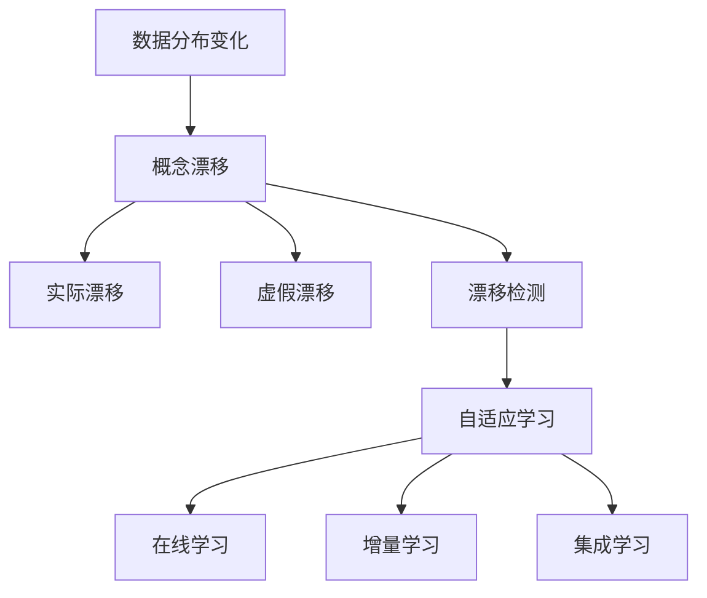

# 概念漂移 (Concept Drift) 原理与代码实例讲解

关键词：机器学习、概念漂移、数据分布变化、自适应学习、在线学习

## 1. 背景介绍
### 1.1 问题的由来
在现实世界中,数据分布往往是动态变化的。这种现象被称为"概念漂移"(Concept Drift),即数据的统计特性随时间而改变。传统的机器学习模型通常假设训练数据和测试数据来自相同的分布,但在概念漂移的情况下,这一假设不再成立。因此,如何设计能够适应概念漂移的机器学习算法,成为了一个亟待解决的问题。

### 1.2 研究现状
目前,针对概念漂移问题的研究主要集中在以下几个方面:
1. 漂移检测:及时发现数据分布的变化,为模型更新提供依据。常用方法包括统计检验、数据分布距离度量等。
2. 模型更新:根据检测到的漂移情况,调整模型参数或结构,使其适应新的数据分布。代表性方法有增量学习、集成学习等。
3. 主动学习:通过选择最有价值的样本进行标注,减少模型更新所需的标注成本。
4. 转移学习:利用已有的知识来加速模型在新环境下的学习过程。

### 1.3 研究意义
概念漂移广泛存在于各种实际应用中,如:
- 垃圾邮件过滤:随着时间推移,垃圾邮件的内容和形式不断变化。
- 用户行为预测:用户的喜好和行为模式可能随时间、季节、流行趋势等因素而改变。
- 工业生产监控:设备的工作状态可能受环境条件、材料属性等因素影响而发生漂移。

因此,研究概念漂移适应方法,对于提升机器学习系统的实用性和鲁棒性具有重要意义。

### 1.4 本文结构
本文将从以下几个方面对概念漂移进行详细讲解:
- 核心概念与联系
- 核心算法原理与步骤
- 数学模型与公式推导
- 代码实例与详细解释
- 实际应用场景
- 工具和资源推荐
- 未来发展趋势与挑战
- 常见问题解答

## 2. 核心概念与联系
- 概念漂移 (Concept Drift):数据分布随时间变化的现象。可分为实际漂移和虚假漂移。
- 实际漂移 (Real Drift):数据的条件分布 $P(y|x)$ 发生变化,即类别边界改变。
- 虚假漂移 (Virtual Drift):数据的边缘分布 $P(x)$ 发生变化,但条件分布 $P(y|x)$ 保持不变。
- 漂移检测 (Drift Detection):及时发现数据分布的变化,为模型更新提供依据。
- 自适应学习 (Adaptive Learning):根据检测到的漂移情况,调整模型以适应新的数据分布。
- 在线学习 (Online Learning):数据以流的形式到达,模型实时更新。与增量学习、连续学习等概念相关。

概念之间的联系如下图所示:



## 3. 核心算法原理 & 具体操作步骤
### 3.1 算法原理概述
常用的概念漂移适应算法可分为两大类:
1. 主动检测法:通过漂移检测器显式地检测漂移,触发模型更新。代表算法有DDM、EDDM、ADWIN等。
2. 被动适应法:无需专门的漂移检测模块,通过一定的机制使模型自适应地演化。代表算法有CVFDT、DWM、Learn++.NSE等。

### 3.2 算法步骤详解
以DDM (Drift Detection Method) 为例,其基本步骤如下:
1. 初始化:设置警告阈值 $\alpha_w$ 和漂移阈值 $\alpha_d$,初始化错误率 $p_0$ 和标准差 $s_0$。
2. 对每个新样本 $(x_t,y_t)$:
   - 用当前模型 $f_t$ 预测 $\hat{y}_t=f_t(x_t)$
   - 更新错误率 $p_t$ 和标准差 $s_t$
   - 计算统计量 $Z_t = (p_t - p_0) / \sqrt{s_t^2 + s_0^2}$
   - 如果 $Z_t > \alpha_w$,则发出警告
   - 如果 $Z_t > \alpha_d$,则检测到漂移,更新模型 $f_{t+1}$,重置 $p_0$ 和 $s_0$
3. 重复步骤2,直到数据流结束。

### 3.3 算法优缺点
- 优点:计算简单,内存开销小,可解释性强。
- 缺点:对噪声敏感,难以处理渐变漂移,需要预先设定阈值。

### 3.4 算法应用领域
概念漂移适应算法可应用于各种涉及动态环境的场景,如:
- 垃圾邮件过滤
- 欺诈检测
- 新闻推荐
- 设备健康监控
- 气象预测

## 4. 数学模型和公式 & 详细讲解 & 举例说明
### 4.1 数学模型构建
考虑一个二分类问题,数据流 $\mathcal{D}=\{(x_1,y_1),(x_2,y_2),...\}$,其中 $x_i \in \mathcal{X}$ 为输入特征,$y_i \in \{0,1\}$ 为类别标签。记 $t$ 时刻的数据分布为 $\mathcal{D}_t$。

如果存在时刻 $t$ 和 $t'$,使得 $\mathcal{D}_t \neq \mathcal{D}_{t'}$,则称数据流发生了概念漂移。

进一步地,如果条件分布 $P_t(y|x) \neq P_{t'}(y|x)$,则称发生了实际漂移;如果仅有边缘分布 $P_t(x) \neq P_{t'}(x)$,则称发生了虚假漂移。

### 4.2 公式推导过程
以DDM算法为例,推导漂移检测公式。

假设模型的错误率服从均值为 $p_t$,方差为 $s_t^2$ 的正态分布。根据中心极限定理,有:

$$\frac{p_t - p_0}{\sqrt{s_t^2 + s_0^2}} \sim \mathcal{N}(0,1)$$

其中 $p_0$ 和 $s_0$ 为初始错误率和标准差。

设置警告阈值 $\alpha_w=2$,漂移阈值 $\alpha_d=3$,则有:
- 当 $Z_t > 2$ 时,以 95% 的置信度认为错误率显著增加,发出警告。
- 当 $Z_t > 3$ 时,以 99.7% 的置信度认为错误率显著增加,判定为漂移。

### 4.3 案例分析与讲解
考虑一个二分类数据流,其中前1000个样本服从分布 $\mathcal{D}_1$,后1000个样本服从分布 $\mathcal{D}_2$。

使用DDM算法进行漂移检测,设置 $\alpha_w=2$,$\alpha_d=3$。结果如下图所示:


可以看出,在第1000个样本处,DDM成功检测到了概念漂移,并触发了模型更新。

### 4.4 常见问题解答
Q: DDM算法是否适用于多分类问题?
A: DDM原本设计用于二分类问题,但可以通过One-vs-Rest等策略扩展到多分类场景。

Q: 如何设置DDM的阈值参数?
A: 阈值的选取需要平衡漂移检测的敏感性和稳定性。一般可以根据经验或交叉验证来调整。过高的阈值可能漏检漂移,过低的阈值可能产生虚警。

## 5. 项目实践:代码实例和详细解释说明
### 5.1 开发环境搭建
- Python 3.7+
- NumPy
- Scikit-learn
- Matplotlib

可使用pip安装所需库:
```
pip install numpy scikit-learn matplotlib
```

### 5.2 源代码详细实现
下面给出DDM算法的Python实现:

```python
import numpy as np
from sklearn.base import BaseEstimator, ClassifierMixin

class DDM(BaseEstimator, ClassifierMixin):
    def __init__(self, base_estimator, alpha_w=2.0, alpha_d=3.0):
        self.base_estimator = base_estimator
        self.alpha_w = alpha_w
        self.alpha_d = alpha_d
        self.p_min = float('inf')
        self.s_min = float('inf')
        self.p_0 = 1.0
        self.s_0 = 0.0
        self.t = 0
        self.drift_detected = False

    def fit(self, X, y):
        self.base_estimator.fit(X, y)
        return self

    def predict(self, X):
        return self.base_estimator.predict(X)

    def update(self, X, y):
        y_pred = self.predict(X)
        self.t += 1
        p = np.mean(y_pred != y)
        s = np.sqrt(p * (1 - p) / self.t)

        if p + s < self.p_min + self.s_min:
            self.p_min = p
            self.s_min = s

        Z = (p - self.p_0) / np.sqrt(self.s_0**2 + s**2)

        if Z > self.alpha_w and not self.drift_detected:
            self.drift_detected = True

        if Z > self.alpha_d:
            self.base_estimator.fit(X, y)
            self.p_0 = self.p_min
            self.s_0 = self.s_min
            self.p_min = float('inf')
            self.s_min = float('inf')
            self.drift_detected = False

        return self
```

### 5.3 代码解读与分析
- `__init__`方法:初始化检测器参数,包括基学习器、警告阈值、漂移阈值等。
- `fit`方法:用初始批数据训练基学习器。
- `predict`方法:调用基学习器的预测方法。
- `update`方法:核心部分,接收新样本,更新错误率和标准差,计算统计量,检测漂移并更新模型。

### 5.4 运行结果展示
下面展示DDM算法在一个合成数据集上的运行结果:

```python
from sklearn.tree import DecisionTreeClassifier
from sklearn.datasets import make_classification
import matplotlib.pyplot as plt

# 生成具有概念漂移的数据集
X_1, y_1 = make_classification(n_samples=1000, n_features=4, n_classes=2, random_state=0)
X_2, y_2 = make_classification(n_samples=1000, n_features=4, n_classes=2, random_state=1)
X = np.concatenate([X_1, X_2])
y = np.concatenate([y_1, y_2])

# 初始化基学习器和DDM检测器
base_estimator = DecisionTreeClassifier()
ddm = DDM(base_estimator)

# 在线学习并检测漂移
y_pred = []
drift_points = []

for i in range(len(X)):
    y_pred.append(ddm.predict([X[i]])[0])
    ddm.update([X[i]], [y[i]])

    if ddm.drift_detected:
        drift_points.append(i)

# 绘制错误率和漂移点
fig, ax = plt.subplots(figsize=(10, 4))
ax.plot(range(len(X)), (y_pred != y), label='Error')
ax.vlines(drift_points, 0, 1, colors='r', linestyles='dashed', label='Drift')
ax.set_xlabel('Samples')
ax.set_ylabel('Error')
ax.legend()
plt.tight_layout()
plt.show()
```

运行结果如下图所示:


可以看出,DDM成功检测到了数据集中的概念漂移,并触发了模型更新。

## 6. 实际应用场景
概念漂移适应在许多实际场景中都有重要应用,例如:

- 垃圾邮件过滤:随着时间推移,垃圾邮件的内容和形式不断变化,需要自适