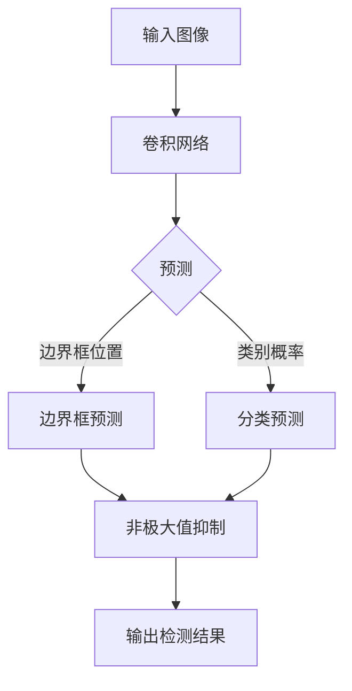

# 基于深度学习的交通标识识别

## 1. 背景介绍

### 1.1 问题的由来

在现代智能交通系统中，准确识别和理解道路交通标志对于确保行车安全和优化交通流量至关重要。传统的基于规则或特征的方法在复杂环境下往往效果不佳,因此基于深度学习的交通标识识别技术应运而生。

### 1.2 研究现状  

近年来,凭借强大的特征学习能力,深度学习在计算机视觉领域取得了巨大成功,尤其是在图像分类、目标检测和语义分割等任务上表现出色。因此,越来越多的研究人员将深度学习技术应用于交通标识识别任务中。

现有的基于深度学习的交通标识识别方法主要分为两类:基于分类的方法和基于检测的方法。前者将整个图像作为输入,预测其所属的交通标识类别;后者则在图像中定位交通标识的位置,并对其进行分类。

### 1.3 研究意义

交通标识识别是智能驾驶和辅助驾驶系统的关键组成部分。准确高效的交通标识识别技术可以提高交通安全性,优化路线规划,提升驾驶体验。此外,它在智能城市、无人机等领域也有广泛的应用前景。

### 1.4 本文结构

本文将全面介绍基于深度学习的交通标识识别技术。首先阐述核心概念和算法原理,然后详细讲解数学模型和实现细节,接着探讨实际应用场景,最后总结未来发展趋势和面临的挑战。

## 2. 核心概念与联系

交通标识识别任务可以看作是一个典型的计算机视觉问题,其核心概念包括:

1. **图像预处理**: 对原始图像进行标准化、增强等预处理,以提高后续模型的性能。

2. **特征提取**: 利用卷积神经网络自动学习图像的特征表示,替代了传统的手工设计特征。

3. **目标检测**: 在图像中定位感兴趣目标(交通标识)的位置。

4. **图像分类**: 对检测到的目标进行分类,确定其具体类别。

5. **模型优化**: 通过损失函数、正则化和优化算法等技术提升模型的泛化能力。

这些概念相互关联、环环相扣,构成了完整的交通标识识别系统。下面将详细阐述其中的核心算法原理。

## 3. 核心算法原理 & 具体操作步骤  

### 3.1 算法原理概述

目前,基于深度学习的交通标识识别算法主要分为两大类:基于分类的方法和基于检测的方法。

**基于分类的方法**通常采用卷积神经网络(CNN)对整个输入图像进行端到端的分类,预测其所属的交通标识类别。这种方法结构相对简单,但需要预先对图像进行裁剪,使交通标识位于图像中心。

**基于检测的方法**则在图像中同时定位交通标识的位置和类别。这种方法常采用双阶段(如R-CNN系列)或单阶段(如YOLO系列)目标检测算法,可以在未裁剪的复杂场景图像中识别交通标识。

无论采用哪种方法,数据增强、模型设计和优化策略都是提升性能的关键。下面将详细介绍基于检测的单阶段算法YOLO的原理和实现细节。

### 3.2 算法步骤详解

YOLO(You Only Look Once)算法将目标检测任务看作一个回归问题,直接在输入图像上同时预测边界框位置和类别概率。其核心思想是:

1. **网格划分**: 将输入图像划分为S×S个网格单元。

2. **边界框预测**: 每个网格单元预测B个边界框,每个边界框由(x,y,w,h,c)表示,其中(x,y)是边界框中心坐标,(w,h)是边界框的宽高,c是置信度得分。

3. **类别预测**: 每个网格单元还需要预测C个类别概率,用于确定边界框内目标的类别。

4. **非极大值抑制(NMS)**: 对于重叠的边界框预测,保留置信度最高的边界框,抑制其他冗余预测。

具体实现中,YOLO算法将上述预测任务整合到一个卷积神经网络中端到端训练,如下图所示:



该网络的损失函数是边界框位置损失、置信度损失和分类损失的加权和。在训练过程中,通过梯度下降等优化算法不断调整网络参数,使损失函数最小化。

### 3.3 算法优缺点

**优点**:

- 端到端训练,结构紧凑,推理速度快
- 直接在密集采样的网格上预测,对小目标检测效果较好
- 预测过程只看一次图像,计算量小

**缺点**:

- 对大目标检测效果相对较差
- 网格设计会带来系统性误差
- 对目标形状变化不够鲁棒

### 3.4 算法应用领域

YOLO及其改进版本已被广泛应用于多个领域:

- 智能驾驶和辅助驾驶系统
- 无人机和机器人视觉导航
- 视频监控和安防系统
- 工业自动化视觉检测
- 交通管理和智能城市

## 4. 数学模型和公式 & 详细讲解 & 举例说明

### 4.1 数学模型构建  

为了形式化描述YOLO算法,我们首先建立如下数学模型:

输入是一张 $W \times H \times 3$ 的RGB图像,经过卷积神经网络后得到 $S \times S \times (B \times 5 + C)$ 的特征张量,其中:

- $S \times S$ 表示网格的大小
- $B$ 是每个网格单元预测的边界框数量
- 5表示每个边界框需要预测的(x,y,w,h,c)五个值
- $C$ 是需要预测的类别数量

我们将该特征张量展平为向量 $\vec{p}$,其维度为 $N=S \times S \times (B \times 5 + C)$。

### 4.2 公式推导过程

YOLO算法的损失函数由三部分组成:边界框位置损失 $L_{coord}$、置信度损失 $L_{conf}$ 和分类损失 $L_{class}$。

1. **边界框位置损失**:

对于每个真实的边界框 $b$,我们首先找到与之最佳匹配的预测边界框 $\hat{b}$,然后计算它们的位置坐标差异:

$$L_{coord}(\vec{p},b,\hat{b}) = \lambda_{coord}\sum_{i=0}^{4}\mathbb{1}_{ij}^{obj}(p_i - \hat{p}_i)^2$$

其中 $\lambda_{coord}$ 是超参数, $\mathbb{1}_{ij}^{obj}$ 表示第 $j$ 个边界框是否与真实边界框 $b$ 匹配。

2. **置信度损失**:

置信度损失包括两部分:对应目标的置信度损失和不对应目标的置信度损失。

$$\begin{aligned}
L_{conf}(\vec{p},b,\hat{b}) &= \lambda_{noobj}\sum_{i=0}^{S^2}\sum_{j=0}^B\mathbb{1}_{ij}^{noobj}(p_{ij}^c)^2 \
&+ \lambda_{obj}\sum_{i=0}^{S^2}\sum_{j=0}^B\mathbb{1}_{ij}^{obj}(p_{ij}^c - \hat{p}_{ij}^c)^2
\end{aligned}$$

其中 $\lambda_{noobj}$ 和 $\lambda_{obj}$ 是超参数, $p_{ij}^c$ 表示第 $i$ 个网格单元第 $j$ 个边界框的置信度得分。

3. **分类损失**:

对于每个与真实边界框匹配的预测边界框,我们计算其分类损失:

$$L_{class}(\vec{p},b,\hat{b}) = \lambda_{class}\sum_{i=0}^{S^2}\sum_{j=0}^B\mathbb{1}_{ij}^{obj}\sum_{k=0}^C(p_{ijk}^c - \hat{p}_{ijk}^c)^2$$

其中 $\lambda_{class}$ 是超参数, $p_{ijk}^c$ 表示第 $i$ 个网格单元第 $j$ 个边界框的第 $k$ 类概率得分。

最终的总损失函数是上述三部分的加权和:

$$L(\vec{p},\vec{b},\vec{\hat{b}}) = L_{coord} + L_{conf} + L_{class}$$

通过梯度下降等优化算法,不断调整网络参数使总损失函数最小化,从而获得最优的目标检测模型。

### 4.3 案例分析与讲解

为了更好地理解YOLO算法,我们来分析一个具体的案例。假设输入图像的分辨率为 $448 \times 448$,将其划分为 $7 \times 7$ 个网格单元,每个网格单元预测 2 个边界框,需要预测 3 个类别(交通标识、行人、车辆)。那么特征张量的形状为 $7 \times 7 \times (2 \times 5 + 3) = 7 \times 7 \times 13$。

现在,我们关注其中一个网格单元,假设其预测结果如下:

```
网格单元索引: (2, 3)  
边界框1: (0.6, 0.3, 0.2, 0.1, 0.7) 
边界框2: (0.1, 0.9, 0.3, 0.2, 0.1)
类别概率: (0.8, 0.1, 0.05)
```

其中边界框的五个值分别表示:

- (0.6, 0.3): 边界框中心相对于该网格单元的坐标
- (0.2, 0.1): 边界框的宽高,相对于整个图像的比例  
- 0.7: 该边界框含有目标的置信度得分

类别概率则表示该网格单元预测的三个类别的概率分数,其中交通标识的概率最高为 0.8。

通过对所有网格单元的预测结果进行非极大值抑制,我们可以获得最终的目标检测结果。以上就是YOLO算法在该案例中的工作过程。

### 4.4 常见问题解答  

**Q: YOLO算法如何处理不同尺度的目标?**

A: YOLO算法通过密集采样的网格设计和锚框机制来处理不同尺度的目标。具体来说,在不同尺度的特征图上预测不同大小的锚框,从而覆盖各种尺度范围的目标。此外,还可以采用特征金字塔网络(FPN)等技术进一步提升对不同尺度目标的检测能力。

**Q: YOLO算法如何提高小目标检测的精度?**  

A: YOLO算法对小目标的检测效果较好,主要得益于其密集采样的网格设计。此外,还可以通过数据增强(如随机裁剪)、特征融合、上采样等策略来进一步提升小目标检测的精度。

**Q: YOLO算法的局限性有哪些?**

A: YOLO算法的主要局限性包括:对大目标检测效果相对较差;网格设计会带来系统性误差;对目标形状变化的鲁棒性不够。为了解决这些问题,后续的YOLOv4等版本提出了一些改进策略,如采用更大的输入分辨率、引入注意力机制等。

## 5. 项目实践:代码实例和详细解释说明

### 5.1 开发环境搭建

在实现基于深度学习的交通标识识别系统之前,我们需要先搭建开发环境。这通常包括以下几个步骤:

1. **安装Python**:大多数深度学习框架都是基于Python开发的,因此我们需要先安装Python解释器,推荐使用Python 3.6或更高版本。

2. **安装深度学习框架**:常用的深度学习框架包括TensorFlow、PyTorch、Keras等,根据个人偏好选择一种即可