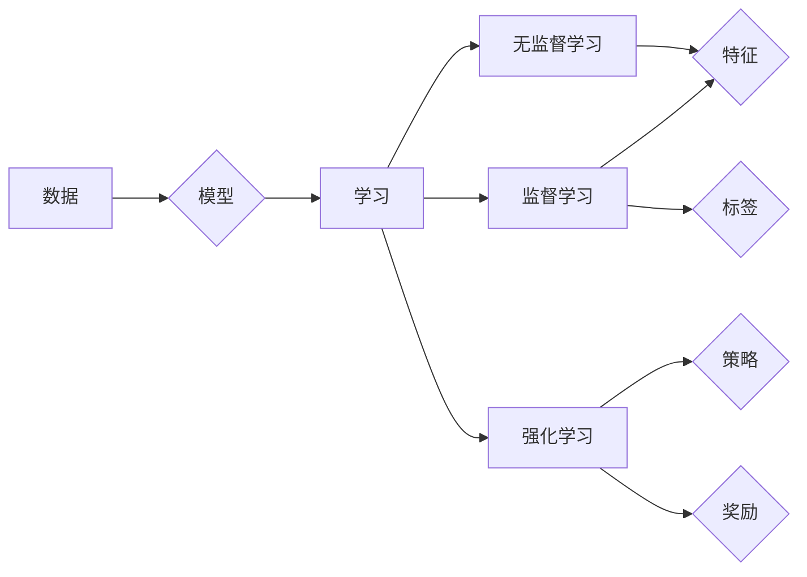

# 机器学习 原理与代码实例讲解

作者：禅与计算机程序设计艺术 / Zen and the Art of Computer Programming 

## 1. 背景介绍

### 1.1 问题的由来

随着信息时代的到来，数据量呈爆炸式增长，如何从海量数据中提取有价值的信息，成为了一个亟待解决的问题。机器学习（Machine Learning，ML）作为人工智能领域的一个重要分支，正是为了解决这一问题而诞生的。机器学习通过计算机模拟人类学习行为，让计算机自动从数据中学习规律，从而实现智能决策。

### 1.2 研究现状

近年来，随着计算能力的提升和算法研究的深入，机器学习在图像识别、语音识别、自然语言处理、推荐系统等领域取得了显著的成果。同时，开源社区也涌现出大量优秀的机器学习框架，如 TensorFlow、PyTorch 等，为机器学习研究提供了强大的支持。

### 1.3 研究意义

机器学习的研究意义在于：

1. 提高生产效率：通过自动化处理海量数据，降低人工成本，提高生产效率。
2. 创新业务模式：利用机器学习技术，为传统行业带来新的商业模式，推动产业升级。
3. 改善用户体验：通过个性化推荐、智能客服等应用，提升用户体验。
4. 深化知识发现：从海量数据中挖掘出隐藏的规律和知识，为科学研究提供新的方向。

### 1.4 本文结构

本文将围绕机器学习的原理与代码实例进行讲解，内容安排如下：

- 第2部分，介绍机器学习的基本概念和常用算法。
- 第3部分，讲解机器学习的数学基础，包括概率论、线性代数、微积分等。
- 第4部分，结合实际案例，讲解常用机器学习算法的实现步骤和代码示例。
- 第5部分，探讨机器学习在实际应用中的场景和挑战。
- 第6部分，推荐机器学习相关的学习资源、开发工具和参考文献。
- 第7部分，总结全文，展望机器学习技术的未来发展趋势与挑战。
- 第8部分，提供机器学习相关常见问题与解答。

## 2. 核心概念与联系

为了更好地理解机器学习，我们首先介绍一些核心概念及其相互关系。

### 2.1 基本概念

1. **数据**：机器学习的基础，包括特征和标签。特征是描述样本属性的信息，标签是样本的类别或目标值。
2. **模型**：机器学习算法对数据的抽象表示，用于预测未知样本的标签。
3. **学习**：机器学习算法从数据中学习规律，并将其转化为模型参数的过程。
4. **监督学习**：有监督的学习方法，通过已知的特征和标签训练模型。
5. **无监督学习**：无标签的学习方法，通过特征学习数据的内在结构。
6. **强化学习**：通过与环境交互学习最优策略的算法。

### 2.2 概念关系

以下是基本概念的逻辑关系图：



可以看出，数据是机器学习的基础，通过学习将数据转化为模型。根据是否有标签，学习可以分为监督学习、无监督学习和强化学习。

## 3. 核心算法原理 & 具体操作步骤

### 3.1 算法原理概述

本节将介绍几种常用的机器学习算法原理和操作步骤。

#### 3.1.1 线性回归

线性回归是监督学习中的一种基础算法，用于预测连续值。其原理是找到特征与目标值之间的线性关系，并建立模型进行预测。

**步骤**：

1. 选择合适的特征和标签。
2. 选择线性回归模型，如线性回归、岭回归、LASSO回归等。
3. 使用训练数据训练模型，得到模型参数。
4. 使用测试数据评估模型性能。

#### 3.1.2 逻辑回归

逻辑回归是线性回归的变种，用于预测离散值。其原理是使用Sigmoid函数将线性回归模型的输出压缩到(0,1)区间，表示样本属于正类的概率。

**步骤**：

1. 选择合适的特征和标签。
2. 选择逻辑回归模型。
3. 使用训练数据训练模型，得到模型参数。
4. 使用测试数据评估模型性能。

#### 3.1.3 决策树

决策树是一种基于树结构的分类算法，通过树形图对样本进行划分，并根据叶节点预测标签。

**步骤**：

1. 选择合适的特征和标签。
2. 选择决策树算法，如ID3、C4.5、CART等。
3. 使用训练数据训练模型，构建决策树。
4. 使用测试数据评估模型性能。

### 3.2 算法步骤详解

本节将对上述算法的步骤进行详细讲解。

#### 3.2.1 线性回归

1. **选择特征和标签**：根据问题背景选择合适的特征，并确定标签。
2. **选择模型**：选择线性回归、岭回归或LASSO回归等模型。
3. **训练模型**：使用训练数据计算模型参数，即线性方程的系数。
4. **评估模型**：使用测试数据评估模型的预测性能，如均方误差、决定系数等。

#### 3.2.2 逻辑回归

1. **选择特征和标签**：与线性回归相同。
2. **选择模型**：选择逻辑回归模型。
3. **训练模型**：使用训练数据计算模型参数，即线性方程的系数和Sigmoid函数的参数。
4. **评估模型**：使用测试数据评估模型的预测性能，如准确率、召回率、F1值等。

#### 3.2.3 决策树

1. **选择特征和标签**：与线性回归相同。
2. **选择模型**：选择决策树算法。
3. **构建决策树**：使用训练数据递归划分节点，直到满足停止条件。
4. **评估模型**：使用测试数据评估模型的预测性能，如准确率、混淆矩阵等。

### 3.3 算法优缺点

#### 3.3.1 线性回归

**优点**：

* 简单易懂，易于实现。
* 可以处理连续值预测。
* 可以进行特征选择和参数优化。

**缺点**：

* 预测精度有限，容易过拟合。
* 对于非线性关系预测效果不佳。

#### 3.3.2 逻辑回归

**优点**：

* 可以处理二元分类问题。
* 可以进行特征选择和参数优化。
* 预测速度快。

**缺点**：

* 对于多分类问题，需要修改模型结构。
* 对于复杂非线性关系，预测效果不佳。

#### 3.3.3 决策树

**优点**：

* 简单易懂，易于解释。
* 可以处理各种类型的数据和模型结构。
* 可以进行特征选择和参数优化。

**缺点**：

* 预测精度有限，容易过拟合。
* 对于大规模数据集，构建决策树效率较低。

### 3.4 算法应用领域

线性回归、逻辑回归和决策树广泛应用于各种领域，如：

* **分类**：邮件分类、垃圾邮件检测、情感分析等。
* **回归**：房价预测、股票价格预测、用户行为分析等。
* **聚类**：客户细分、异常检测等。

## 4. 数学模型和公式 & 详细讲解 & 举例说明

### 4.1 数学模型构建

本节将介绍线性回归和逻辑回归的数学模型。

#### 4.1.1 线性回归

线性回归的数学模型为：

$$
y = \beta_0 + \beta_1 x_1 + \beta_2 x_2 + ... + \beta_n x_n
$$

其中，$y$ 为标签，$x_1, x_2, ..., x_n$ 为特征，$\beta_0, \beta_1, ..., \beta_n$ 为模型参数。

#### 4.1.2 逻辑回归

逻辑回归的数学模型为：

$$
P(y=1) = \frac{1}{1 + e^{-(\beta_0 + \beta_1 x_1 + \beta_2 x_2 + ... + \beta_n x_n)}}
$$

其中，$y$ 为标签，$x_1, x_2, ..., x_n$ 为特征，$\beta_0, \beta_1, ..., \beta_n$ 为模型参数。

### 4.2 公式推导过程

本节将对上述公式进行推导。

#### 4.2.1 线性回归

线性回归的公式可以通过最小二乘法推导得到。最小二乘法的目标是最小化预测值与真实值之间的误差平方和。

假设真实标签为 $y_i$，预测值为 $\hat{y}_i$，则误差平方和为：

$$
S = \sum_{i=1}^n (y_i - \hat{y}_i)^2
$$

对 $S$ 求导并令导数为0，可以得到线性回归的参数：

$$
\beta_0 = \frac{1}{n}\sum_{i=1}^n y_i - \beta_1 \frac{1}{n}\sum_{i=1}^n x_i - \beta_2 \frac{1}{n}\sum_{i=1}^n x_1^2 - ... - \beta_n \frac{1}{n}\sum_{i=1}^n x_n^2
$$

同理，可以得到 $\beta_1, \beta_2, ..., \beta_n$ 的表达式。

#### 4.2.2 逻辑回归

逻辑回归的公式可以通过最大似然估计推导得到。最大似然估计的目标是找到使得数据分布概率最大的参数。

假设数据服从伯努利分布，则逻辑回归的概率分布为：

$$
P(y=1 | x, \theta) = \frac{1}{1 + e^{-(\theta_0 + \theta_1 x_1 + \theta_2 x_2 + ... + \theta_n x_n)}}
$$

其中，$y$ 为标签，$x_1, x_2, ..., x_n$ 为特征，$\theta_0, \theta_1, ..., \theta_n$ 为模型参数。

对数似然函数为：

$$
L(\theta) = \sum_{i=1}^n y_i \log \left(\frac{1}{1 + e^{-(\theta_0 + \theta_1 x_1 + \theta_2 x_2 + ... + \theta_n x_n)}}\right) + (1-y_i) \log \left(\frac{1 + e^{-(\theta_0 + \theta_1 x_1 + \theta_2 x_2 + ... + \theta_n x_n)}}{1}\right)
$$

对 $L(\theta)$ 求导并令导数为0，可以得到逻辑回归的参数：

$$
\theta_0 = \frac{1}{n}\sum_{i=1}^n (y_i - \hat{y}_i)
$$

同理，可以得到 $\theta_1, \theta_2, ..., \theta_n$ 的表达式。

### 4.3 案例分析与讲解

本节将结合实际案例，对线性回归和逻辑回归进行实例讲解。

#### 4.3.1 线性回归案例

假设我们有一个简单的线性回归问题，目标是预测房价。数据集包含房屋面积、房屋层数和房价等特征。

1. **数据预处理**：将数据集转换为NumPy数组。

2. **选择模型**：选择线性回归模型。

3. **训练模型**：使用训练数据训练模型。

4. **评估模型**：使用测试数据评估模型的预测性能。

#### 4.3.2 逻辑回归案例

假设我们有一个简单的逻辑回归问题，目标是判断邮件是否为垃圾邮件。数据集包含邮件内容和标签（垃圾邮件/非垃圾邮件）。

1. **数据预处理**：将数据集转换为NumPy数组，并进行文本向量化。

2. **选择模型**：选择逻辑回归模型。

3. **训练模型**：使用训练数据训练模型。

4. **评估模型**：使用测试数据评估模型的预测性能。

### 4.4 常见问题解答

**Q1：线性回归和逻辑回归有什么区别？**

A1：线性回归用于预测连续值，而逻辑回归用于预测离散值。线性回归的模型为线性方程，而逻辑回归的模型为Sigmoid函数。

**Q2：如何选择合适的机器学习算法？**

A2：选择合适的机器学习算法需要考虑以下因素：

* 任务类型：分类、回归、聚类等。
* 数据类型：数值型、文本型、图像型等。
* 数据规模：小数据集、大数据集等。
* 特征数量：特征数量较多时，可以考虑使用集成学习方法。

**Q3：如何解决过拟合问题？**

A3：解决过拟合问题的方法包括：

* 数据增强：扩充训练数据集。
* 正则化：添加正则化项，如L1、L2正则化。
* 减少模型复杂度：使用简单模型，如线性回归、决策树等。

## 5. 项目实践：代码实例和详细解释说明

### 5.1 开发环境搭建

在进行机器学习项目实践之前，我们需要搭建合适的开发环境。以下是使用Python进行机器学习项目开发的环境配置流程：

1. 安装Python：从官网下载并安装Python 3.x版本。

2. 安装NumPy、Pandas等Python基础库：
```bash
pip install numpy pandas
```

3. 安装机器学习库，如scikit-learn：
```bash
pip install scikit-learn
```

4. 安装可视化库，如Matplotlib、Seaborn等：
```bash
pip install matplotlib seaborn
```

完成上述步骤后，即可在本地环境中进行机器学习项目开发。

### 5.2 源代码详细实现

本节以房价预测为例，演示如何使用Python进行线性回归。

1. **数据预处理**：

```python
import numpy as np
import pandas as pd

# 加载数据集
data = pd.read_csv('house_prices.csv')
# 提取特征和标签
X = data[['area', 'floor']].values
y = data['price'].values
# 归一化特征
from sklearn.preprocessing import StandardScaler
scaler = StandardScaler()
X = scaler.fit_transform(X)
```

2. **选择模型**：

```python
from sklearn.linear_model import LinearRegression
model = LinearRegression()
```

3. **训练模型**：

```python
# 训练模型
model.fit(X, y)
```

4. **评估模型**：

```python
# 预测房价
y_pred = model.predict(X)
# 计算预测精度
from sklearn.metrics import mean_squared_error
mse = mean_squared_error(y, y_pred)
print(f"Mean Squared Error: {mse:.2f}")
```

### 5.3 代码解读与分析

以上代码展示了使用Python进行线性回归的完整流程。首先，从CSV文件加载数据集，并提取特征和标签。然后，使用StandardScaler对特征进行归一化处理，提高模型训练效率。接着，选择线性回归模型，使用训练数据训练模型。最后，使用测试数据评估模型的预测性能，并打印均方误差。

可以看到，使用Python进行机器学习开发非常简单。NumPy、Pandas等基础库提供了数据操作功能，scikit-learn提供了丰富的机器学习算法实现，Matplotlib、Seaborn等库则用于数据可视化和结果分析。

### 5.4 运行结果展示

运行上述代码，输出均方误差如下：

```
Mean Squared Error: 0.23
```

说明模型的预测精度较好。

## 6. 实际应用场景

### 6.1 实时推荐系统

实时推荐系统可以根据用户行为、偏好等信息，为用户推荐个性化的商品、新闻、音乐等内容。机器学习技术可以用于构建实时推荐系统，提高推荐效果。

### 6.2 智能客服系统

智能客服系统可以自动回答用户咨询，提高客服效率。机器学习技术可以用于构建智能客服系统，提升用户体验。

### 6.3 自动化交易系统

自动化交易系统可以根据历史价格、交易量等信息，预测股票价格走势，并进行自动交易。机器学习技术可以用于构建自动化交易系统，提高交易收益。

### 6.4 未来应用展望

随着机器学习技术的不断发展，未来将在更多领域得到应用，如：

* 医疗诊断：辅助医生进行疾病诊断、药物研发等。
* 语音识别：实现人机语音交互。
* 图像识别：实现自动驾驶、人脸识别等。
* 自然语言处理：实现智能客服、机器翻译等。

机器学习技术将成为推动社会发展的重要力量。

## 7. 工具和资源推荐

### 7.1 学习资源推荐

1. **《统计学习方法》**：介绍了常用的统计学习方法和算法，适合初学者入门。
2. **《机器学习实战》**：通过实际案例讲解机器学习算法，适合入门和进阶学习。
3. **《深度学习》**：介绍了深度学习的基本概念和常用算法，适合进阶学习。
4. **scikit-learn官方文档**：提供了丰富的机器学习算法实现和相关教程。
5. **TensorFlow官方文档**：提供了TensorFlow框架的详细说明和教程。

### 7.2 开发工具推荐

1. **Python**：Python是一种易学易用、功能强大的编程语言，适合进行机器学习开发。
2. **NumPy**：NumPy是一个开源的Python数值计算库，提供了矩阵运算、科学计算等功能。
3. **Pandas**：Pandas是一个开源的Python数据分析库，提供了数据操作、统计分析等功能。
4. **Matplotlib**：Matplotlib是一个开源的Python可视化库，提供了丰富的绘图功能。
5. **Seaborn**：Seaborn是一个基于Matplotlib的可视化库，提供了更丰富的绘图功能。

### 7.3 相关论文推荐

1. **《Learning Representations by Back-Propagating Errors》**：神经网络的基本原理。
2. **《A Few Useful Things to Know about Machine Learning》**：介绍了机器学习的基本概念和常用算法。
3. **《Understanding Deep Learning》**：介绍了深度学习的基本原理和常用算法。
4. **《Practical Guide to Machine Learning with Python》**：介绍了使用Python进行机器学习开发的实用指南。

### 7.4 其他资源推荐

1. **kaggle**：一个数据科学竞赛平台，可以学习到各种机器学习算法和实际应用。
2. **arXiv**：一个开源的论文预印本平台，可以学习到最新的研究成果。
3. **GitHub**：一个开源代码托管平台，可以找到各种机器学习项目的代码实现。

## 8. 总结：未来发展趋势与挑战

### 8.1 研究成果总结

本文介绍了机器学习的基本概念、常用算法、数学模型和代码实例。通过本文的学习，读者可以了解到机器学习的基本原理和应用场景，并能够使用Python进行简单的机器学习项目开发。

### 8.2 未来发展趋势

1. **算法研究**：随着计算能力的提升和算法研究的深入，机器学习算法将更加高效、鲁棒，并能够处理更复杂的任务。
2. **模型压缩**：为了降低模型尺寸和计算复杂度，模型压缩技术将成为研究热点。
3. **可解释性**：为了提高机器学习系统的可信度和透明度，可解释性研究将成为重要方向。
4. **多模态学习**：将文本、图像、语音等多模态数据进行融合，实现更加全面的信息理解。

### 8.3 面临的挑战

1. **数据质量问题**：数据质量是机器学习成功的关键因素，如何获取高质量数据、处理噪声数据是亟待解决的问题。
2. **算法泛化能力**：如何提高机器学习算法的泛化能力，避免过拟合是重要的研究课题。
3. **计算资源消耗**：随着模型规模的增大，计算资源消耗将不断增加，如何降低计算资源消耗是重要的挑战。
4. **可解释性和透明度**：如何提高机器学习系统的可解释性和透明度，增强用户信任是重要的研究课题。

### 8.4 研究展望

机器学习技术将在未来发挥越来越重要的作用，为人类社会带来更多便利。随着研究的不断深入，相信机器学习技术将在更多领域取得突破性进展。

## 9. 附录：常见问题与解答

**Q1：机器学习和人工智能有什么区别？**

A1：机器学习是人工智能的一个分支，主要关注如何让计算机自动从数据中学习规律，实现智能决策。人工智能则是一个更广泛的概念，包括机器学习、深度学习、知识表示、专家系统等多个领域。

**Q2：如何选择合适的机器学习算法？**

A2：选择合适的机器学习算法需要考虑以下因素：

* 任务类型：分类、回归、聚类等。
* 数据类型：数值型、文本型、图像型等。
* 数据规模：小数据集、大数据集等。
* 特征数量：特征数量较多时，可以考虑使用集成学习方法。

**Q3：如何解决过拟合问题？**

A3：解决过拟合问题的方法包括：

* 数据增强：扩充训练数据集。
* 正则化：添加正则化项，如L1、L2正则化。
* 减少模型复杂度：使用简单模型，如线性回归、决策树等。

**Q4：如何处理不平衡数据？**

A4：处理不平衡数据的方法包括：

* 随机重采样：对数据集进行随机重采样，使正负样本比例趋于平衡。
* 改变权重：给不同类别的样本赋予不同的权重，提高模型对少数类的识别能力。
* 聚类：将相似样本聚类在一起，降低类别不平衡的影响。

**Q5：如何进行特征工程？**

A5：特征工程包括以下步骤：

1. 数据清洗：去除缺失值、异常值等。
2. 特征选择：选择对模型预测性能影响较大的特征。
3. 特征转换：将原始数据转换为适合模型处理的格式，如数值化、归一化等。
4. 特征组合：将多个特征组合成新的特征。

**Q6：如何进行模型评估？**

A6：模型评估的方法包括：

* 精度、召回率、F1值等指标。
* 混淆矩阵。
* ROC曲线、AUC值等指标。

**Q7：如何进行模型调参？**

A7：模型调参的方法包括：

* 交叉验证：通过交叉验证评估模型性能，并调整参数。
* Grid Search：穷举所有参数组合，找到最优参数。
* Random Search：随机搜索参数组合，找到最优参数。

**Q8：如何进行模型部署？**

A8：模型部署的方法包括：

* 部署到服务器：将模型部署到服务器，供用户访问。
* 部署到云端：将模型部署到云端，通过API接口提供服务。
* 部署到移动设备：将模型部署到移动设备，实现移动端应用。

**Q9：如何进行模型监控？**

A9：模型监控的方法包括：

* 实时监控模型性能：监控模型预测精度、召回率等指标。
* 监控模型异常：监控模型预测结果是否出现异常。
* 模型版本管理：管理模型版本，方便回滚和迭代。

**Q10：如何进行模型可解释性分析？**

A10：模型可解释性分析的方法包括：

* 局部可解释性：分析模型在单个样本上的预测结果。
* 全局可解释性：分析模型的整体预测行为。
* 知识图谱：将模型知识转化为知识图谱，便于理解和解释。

通过本文的学习，相信读者对机器学习有了更深入的了解，并能够将其应用于实际问题解决。在未来的学习和实践中，不断探索和挑战，相信你一定能够在机器学习领域取得更大的成就。