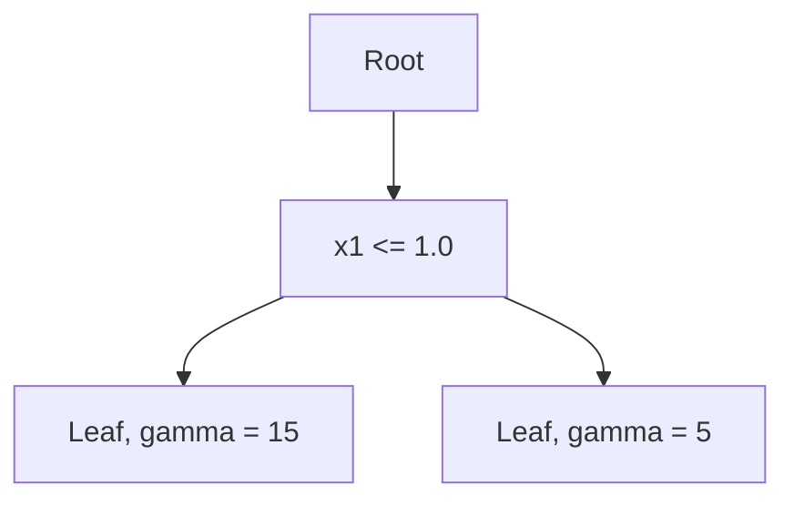

以下是基于您提供的标题和要求，为您撰写的技术博客文章正文内容：

# 基于数据挖掘的气温变化对某旅游业的影响研究

## 1. 背景介绍

### 1.1 问题的由来

旅游业是当今世界经济的重要组成部分。气候变化已成为影响旅游业发展的重要因素之一。近年来,全球气温持续上升,极端天气事件频发,这些气候变化不仅影响旅游目的地的自然环境,还影响游客的出行意愿和体验质量。因此,研究气温变化对旅游业的影响,对于制定应对气候变化的旅游业发展策略具有重要意义。

### 1.2 研究现状

已有研究表明,气温变化会影响旅游业的多个方面,包括旅游目的地的吸引力、旅游设施的运营成本、游客的出行意愿等。一些研究采用问卷调查或访谈的方式,了解游客对气温变化的感知和行为反应;另一些研究则基于历史数据,建立气温与旅游业绩的定量关系模型。然而,这些研究大多局限于特定区域或旅游类型,缺乏对整个旅游产业链的全面考虑。

### 1.3 研究意义

本研究将采用数据挖掘技术,从多源异构数据中发掘气温变化对旅游业各环节的影响规律,构建综合影响评估模型。这不仅有助于全面认识气温变化对旅游业的影响,而且可为制定应对策略提供决策依据。研究成果有望为旅游业的可持续发展提供理论支持和技术手段。

### 1.4 本文结构

本文首先介绍相关核心概念,包括数据挖掘、气温变化及其对旅游业的影响机理。然后阐述所采用的核心算法原理及数学模型,并通过案例分析加以说明。接下来介绍项目实践中的代码实现细节和运行结果。再次探讨本研究在实际应用场景中的价值,并推荐相关工具和资源。最后总结研究成果,展望未来发展趋势和面临的挑战。

## 2. 核心概念与联系

数据挖掘(Data Mining)是从海量数据中发现隐藏信息的过程,涉及数据预处理、模式识别、评估和可视化等多个环节。常用的数据挖掘任务包括分类(Classification)、聚类(Clustering)、关联规则挖掘(Association Rule Mining)等。

气温变化(Temperature Change)是指一定时间尺度上气温的持续升高或降低。影响气温变化的主要因素包括温室气体排放、工业化进程、自然周期性变化等。气温变化会引起冰川融化、海平面上升、极端天气加剧等一系列环境变化。

旅游业(Tourism Industry)是指为满足人们旅游需求而提供相关产品和服务的经济活动的总和。旅游业涵盖交通运输、住宿餐饮、景点景区、旅行社等多个环节。气温变化会通过多种途径影响旅游业,主要包括:

1. **目的地吸引力变化**:气温变化导致旅游资源分布和质量变化,影响目的地的旅游吸引力。

2. **基础设施和运营成本**:极端天气事件增多,对旅游基础设施造成损坏,且运营成本(如制冷/供暖费用)增加。

3. **旅游需求变化**:气温变化改变了游客的出行时间和目的地偏好,影响整体旅游需求。

4. **政策法规调整**:为应对气候变化,政府可能出台相关政策法规,间接影响旅游业运营。

数据挖掘技术可以从多源异构数据(如气象数据、旅游统计数据、在线评论等)中发现隐藏的模式和规律,量化气温变化对旅游业各环节的影响程度,从而为制定应对策略提供依据。

## 3. 核心算法原理及具体操作步骤

### 3.1 算法原理概述

本研究采用的核心算法是基于树模型的集成学习算法 --  Gradient Boosting Decision Tree (GBDT)。它通过构建多棵决策树,并将它们组合成一个强大的模型,用于回归和分类任务。

GBDT算法的基本思想是:从一个初始模型开始,通过梯度下降的方式,不断拟合残差,生成新的决策树,并将其加入到集成模型中。每一棵新树的目标是拟合上一轮模型的残差,从而不断减小模型的预测误差。

GBDT具有以下优点:

1. 能够自动处理特征之间的交互作用,无需人工构造特征组合。
2. 对缺失值具有较强的鲁棒性,无需进行复杂的填充处理。
3. 可以同时处理连续值和离散值特征,适用范围广泛。
4. 相比单棵决策树,集成模型的泛化能力更强。

### 3.2 算法步骤详解

GBDT算法的具体步骤如下:

1. **初始化模型**:从一个常数模型 $F_0(x)$ 开始,作为基础模型。

2. **计算残差**:对于每个训练样本 $(x_i, y_i)$,计算其残差 $r_{i} = y_{i} - F_{m-1}(x_{i})$。

3. **拟合残差**:通过回归树 $h_m(x)$ 拟合残差 $r_i$,得到拟合值 $\gamma_{jm}$,其中 $j$ 为叶节点索引。

4. **更新模型**:将新的回归树加入到集成模型中,更新模型为:

$$F_m(x) = F_{m-1}(x) + \eta \sum_{j=1}^{J} \gamma_{jm}I(x \in R_{jm})$$

其中 $\eta$ 为学习率,控制每棵树对集成模型的影响程度; $J$ 为叶节点数; $R_{jm}$ 为第 $j$ 个叶节点对应的区域; $I(\cdot)$ 为指示函数。

5. **迭代更新**:重复步骤2-4,直至达到停止条件(如最大迭代次数或损失函数收敛)。

在实际应用中,GBDT算法需要调整诸如最大树深度、最小叶节点样本数、学习率等超参数,以获得最佳性能。通常采用网格搜索或贝叶斯优化等方法进行超参数调优。

### 3.3 算法优缺点

**优点**:

1. 集成多棵树的优点,泛化能力强,易过拟合风险低。
2. 自动捕捉特征之间的高阶交互关系。
3. 内置处理缺失值和异常值的机制,无需特殊预处理。

**缺点**:

1. 训练时间开销较大,尤其是在大规模数据集上。
2. 对异常值的鲁棒性较差,需要进行数据清洗。
3. 难以直观解释模型内部的决策过程。

### 3.4 算法应用领域

GBDT算法具有广泛的应用前景,主要包括:

- **金融风险管理**:评估贷款违约风险、信用卡欺诈识别等。
- **计算广告**:点击率预测、在线广告转化率预测等。
- **自然语言处理**:文本分类、情感分析、机器翻译等。
- **计算机视觉**:图像分类、目标检测、人脸识别等。
- **推荐系统**:个性化推荐、内容筛选等。

## 4. 数学模型和公式详细讲解及举例说明

### 4.1 数学模型构建

本研究的目标是构建一个回归模型,预测气温变化对某地区旅游业绩的影响程度。设旅游业绩指标为 $y$,影响因素特征向量为 $\boldsymbol{x} = (x_1, x_2, \ldots, x_p)^T$,其中 $x_i$ 可能包括气温变化相关指标、社会经济指标、政策法规等。我们的目标是找到一个函数 $F^*(\boldsymbol{x})$,使其能很好地拟合训练数据:

$$F^*(\boldsymbol{x}) = \arg\min_{F(x)} \sum_{i=1}^{n} L(y_i, F(\boldsymbol{x}_i))$$

其中 $L(\cdot)$ 为损失函数,通常采用平方损失或绝对损失等;$n$ 为训练样本数量。

对于 GBDT 算法,模型 $F(x)$ 由 $M$ 棵回归树组成:

$$F(\boldsymbol{x}) = \sum_{m=1}^{M} \eta h_m(\boldsymbol{x})$$

其中 $h_m(\boldsymbol{x})$ 为第 $m$ 棵树,由以下形式给出:

$$h_m(\boldsymbol{x}) = \sum_{j=1}^{J_m} \gamma_{jm} I(\boldsymbol{x} \in R_{jm})$$

这里 $J_m$ 为第 $m$ 棵树的叶节点个数;$R_{jm}$ 为第 $j$ 个叶节点对应的区域;$\gamma_{jm}$ 为该叶节点的预测值;$I(\cdot)$ 为指示函数。

### 4.2 公式推导过程

我们以平方损失函数为例,推导 GBDT 算法的训练过程。设第 $m-1$ 轮迭代后的模型为 $F_{m-1}(\boldsymbol{x})$,目标是找到一棵新树 $h_m(\boldsymbol{x})$,使得:

$$\begin{aligned}
\sum_{i=1}^{n} L(y_i, F_{m-1}(\boldsymbol{x}_i) + h_m(\boldsymbol{x}_i)) &= \sum_{i=1}^{n} \left(y_i - F_{m-1}(\boldsymbol{x}_i) - h_m(\boldsymbol{x}_i)\right)^2 \\
&= \sum_{i=1}^{n} \left(r_i - h_m(\boldsymbol{x}_i)\right)^2
\end{aligned}$$

其中 $r_i = y_i - F_{m-1}(\boldsymbol{x}_i)$ 为第 $i$ 个样本的残差。

由于树的结构是固定的,我们只需要确定每个叶节点的最优预测值 $\gamma_{jm}$。通过求导可得:

$$\gamma_{jm} = \arg\min_{\gamma} \sum_{x_i \in R_{jm}} \left(r_i - \gamma\right)^2 = \frac{1}{|R_{jm}|} \sum_{x_i \in R_{jm}} r_i$$

即将该叶节点内所有样本残差的均值作为预测值。

得到新树 $h_m(\boldsymbol{x})$ 后,将其加入到集成模型中,得到新的模型:

$$F_m(\boldsymbol{x}) = F_{m-1}(\boldsymbol{x}) + \eta h_m(\boldsymbol{x})$$

其中 $\eta$ 为学习率,控制新树对集成模型的影响程度。

重复上述过程,直至达到停止条件,即可得到最终的集成模型 $F(\boldsymbol{x})$。

### 4.3 案例分析与讲解

假设我们有如下训练数据:

| 气温变化指数 | 旅游收入(百万美元) | 政策影响指数 | ⋯ |
|--------------|----------------------|---------------|---|
| 0.8          | 120                 | 0.2           | ⋯ |
| 1.2          | 95                  | 0.5           | ⋯ |
| ⋯            | ⋯                    | ⋯             | ⋯ |

我们将气温变化指数、政策影响指数等作为特征向量 $\boldsymbol{x}$,旅游收入作为目标值 $y$,构建 GBDT 回归模型。

假设初始模型为常数 $F_0(\boldsymbol{x}) = 100$,对于第一个样本,残差为 $r_1 = 120 - 100 = 20$。我们构建一棵回归树 $h_1(\boldsymbol{x})$ 来拟合这些残差,如下所示:

这里根据气温变化指数 $x_1$ 将样本分成两组,分别预测残差为 15 和 5。将该树加入到初始模型中,得到新模型:

$$F_1(\boldsymbol{