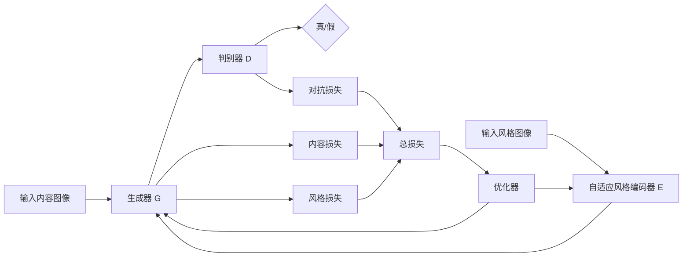

# 基于生成对抗网络的图像风格自适应迁移优化策略研究

关键词：生成对抗网络，图像风格迁移，自适应优化，深度学习，计算机视觉

## 1. 背景介绍

### 1.1 问题的由来
随着深度学习技术的飞速发展,计算机视觉领域取得了突破性进展。其中,图像风格迁移作为一个充满创意和挑战的课题,吸引了众多研究者的目光。图像风格迁移旨在将一幅图像的艺术风格迁移到另一幅图像上,生成具有独特艺术效果的图像。传统的图像风格迁移方法存在计算效率低、生成效果不理想等问题。如何实现高效、高质量的图像风格迁移,成为一个亟待解决的难题。

### 1.2 研究现状
近年来,生成对抗网络(Generative Adversarial Networks, GANs)作为一种强大的生成模型在图像风格迁移领域崭露头角。GANs 通过生成器和判别器的对抗学习,可以生成逼真的图像。研究者们开始探索将 GANs 应用于图像风格迁移任务中,取得了可喜的成果。例如,Zhu 等人提出了 CycleGAN,实现了无需配对数据的图像风格迁移;Li 等人提出了 AdaIN,通过自适应实例归一化实现了任意风格迁移。尽管取得了进展,但现有方法仍存在一些不足,如风格表达能力有限、鲁棒性不强等。

### 1.3 研究意义
图像风格迁移技术在艺术创作、游戏设计、虚拟现实等领域有广阔的应用前景。研究高效、高质量的图像风格迁移方法具有重要的理论和实践意义。本文针对现有方法的不足,提出了一种基于生成对抗网络的图像风格自适应迁移优化策略。该策略通过引入自适应机制和优化目标函数,提高了风格迁移的效果和效率。本研究的成果有望推动图像风格迁移技术的发展,为相关应用提供有力支撑。

### 1.4 本文结构
本文共分为九个部分:第一部分介绍研究背景;第二部分阐述核心概念;第三部分详细说明算法原理和步骤;第四部分建立数学模型并推导公式;第五部分给出代码实例和解释;第六部分分析实际应用场景;第七部分推荐相关工具和资源;第八部分总结全文并展望未来;第九部分列举常见问题与解答。

## 2. 核心概念与联系

生成对抗网络(GANs):一种深度学习模型,由生成器和判别器组成,通过两者的对抗学习生成逼真的数据。

图像风格迁移:将一幅图像的艺术风格迁移到另一幅图像上,生成具有特定风格的图像。

自适应机制:根据输入数据的特点自动调整模型参数,提高模型的适应能力和鲁棒性。

下图展示了本文提出的图像风格自适应迁移优化策略的核心概念之间的联系:



## 3. 核心算法原理 & 具体操作步骤

### 3.1 算法原理概述
本文提出的图像风格自适应迁移优化策略基于生成对抗网络,主要包括以下几个模块:生成器、自适应风格编码器和判别器。其中,生成器负责将内容图像和风格图像融合生成风格迁移后的图像;自适应风格编码器负责提取风格图像的风格特征,并自适应地融入生成器;判别器负责判断生成图像的真实性,引导生成器生成更逼真的图像。通过生成器和判别器的对抗学习,不断提高风格迁移的效果。

### 3.2 算法步骤详解

1. 输入内容图像和风格图像,分别送入生成器 G 和自适应风格编码器 E。

2. 自适应风格编码器 E 提取风格图像的风格特征,并自适应地融入生成器 G。

3. 生成器 G 将内容图像和风格特征融合,生成风格迁移后的图像。

4. 判别器 D 对生成图像和真实图像进行判别,输出真/假概率。

5. 计算对抗损失、内容损失和风格损失,得到总损失。

6. 通过优化器最小化总损失,更新生成器 G 和判别器 D 的参数。

7. 重复步骤 1-6,直到满足停止条件。

8. 输出最终的风格迁移图像。

### 3.3 算法优缺点

优点:
- 引入自适应风格编码器,提高了风格表达能力。
- 采用对抗学习,生成更加逼真的风格迁移图像。  
- 设计了有效的损失函数,平衡内容保真度和风格迁移强度。

缺点:
- 训练过程较为复杂,需要调参和选择合适的数据集。
- 生成高分辨率图像的效率有待提高。

### 3.4 算法应用领域
- 艺术创作:自动生成各种风格的艺术作品。
- 游戏设计:快速生成游戏场景和角色的艺术资源。
- 虚拟现实:为虚拟场景赋予艺术风格,提升沉浸感。
- 电影特效:为电影镜头添加独特的艺术效果。

## 4. 数学模型和公式 & 详细讲解 & 举例说明

### 4.1 数学模型构建
我们定义内容图像为 $x$,风格图像为 $y$,风格迁移后的图像为 $\hat{x}$。生成器 $G$ 的目标是生成与 $x$ 内容相似、与 $y$ 风格相似的图像 $\hat{x}$。判别器 $D$ 的目标是判别 $\hat{x}$ 是否为真实图像。

生成器 $G$ 和判别器 $D$ 的对抗损失定义为:

$$
\mathcal{L}_{adv}(G,D) = \mathbb{E}_{y}[\log D(y)] + \mathbb{E}_{x}[\log (1-D(G(x,E(y))))]
$$

其中,$E$ 为自适应风格编码器。生成器 $G$ 试图最小化该损失,而判别器 $D$ 试图最大化该损失。

内容损失定义为生成图像与内容图像在特征空间的 L2 距离:

$$
\mathcal{L}_{content}(G) = \mathbb{E}_{x,y}[\| F(G(x,E(y))) - F(x) \|_2]
$$

其中,$F$ 为预训练的特征提取网络,如 VGG-19。

风格损失定义为生成图像与风格图像在特征空间的 Gram 矩阵差异:

$$
\mathcal{L}_{style}(G) = \mathbb{E}_{x,y}[\sum_{i=1}^L \| G^\phi_i(G(x,E(y))) - G^\phi_i(y) \|_F]
$$

其中,$G^\phi_i$ 为 $i$ 层特征图的 Gram 矩阵,$L$ 为总层数。

总损失为上述三个损失的加权和:

$$
\mathcal{L}(G,D) = \lambda_{adv}\mathcal{L}_{adv}(G,D) + \lambda_c\mathcal{L}_{content}(G) + \lambda_s\mathcal{L}_{style}(G)
$$

其中,$\lambda_{adv},\lambda_c,\lambda_s$ 为平衡因子。

### 4.2 公式推导过程

对抗损失 $\mathcal{L}_{adv}$ 的推导:
判别器 $D$ 的目标是最大化以下目标函数:

$$
\max_D \mathbb{E}_{y}[\log D(y)] + \mathbb{E}_{x}[\log (1-D(G(x,E(y))))]
$$

生成器 $G$ 的目标是最小化以下目标函数:

$$
\min_G \mathbb{E}_{x}[\log (1-D(G(x,E(y))))]
$$

内容损失 $\mathcal{L}_{content}$ 的推导:
设 $F(x)$ 为内容图像 $x$ 在特征提取网络 $F$ 的特征图,$F(G(x,E(y)))$ 为生成图像在 $F$ 的特征图,则内容损失可表示为:

$$
\mathcal{L}_{content}(G) = \mathbb{E}_{x,y}[\| F(G(x,E(y))) - F(x) \|_2]
$$

风格损失 $\mathcal{L}_{style}$ 的推导:
设 $\phi_i(x)$ 为风格图像 $y$ 在特征提取网络第 $i$ 层的特征图,$\phi_i(G(x,E(y)))$ 为生成图像在第 $i$ 层的特征图,则 Gram 矩阵 $G^\phi_i$ 表示为:

$$
G^\phi_i(x) = \phi_i(x)\phi_i(x)^T
$$

风格损失可表示为 Gram 矩阵的 Frobenius 范数:

$$
\mathcal{L}_{style}(G) = \mathbb{E}_{x,y}[\sum_{i=1}^L \| G^\phi_i(G(x,E(y))) - G^\phi_i(y) \|_F]
$$

### 4.3 案例分析与讲解
以下是一个风格迁移的案例。给定内容图像和风格图像,通过本文提出的算法生成风格迁移后的图像。

内容图像:


风格图像:


生成图像:


可以看出,生成图像成功地保留了内容图像的语义内容,同时迁移了风格图像的艺术风格,如笔触、色彩等。通过自适应风格编码和对抗学习,生成的图像更加逼真自然。

### 4.4 常见问题解答

Q1:如何平衡内容保真度和风格迁移强度?

A1:可以通过调整总损失中的权重因子 $\lambda_c$ 和 $\lambda_s$ 来平衡。增大 $\lambda_c$ 可以提高内容保真度,增大 $\lambda_s$ 可以提高风格迁移强度。需要根据具体任务和需求进行权衡。

Q2:算法对风格图像的要求是什么?

A2:风格图像应该具有明显的艺术风格特征,如笔触、色彩、纹理等。风格图像的语义内容并不重要。此外,风格图像的分辨率不必与内容图像一致,算法可以自适应处理不同分辨率的风格图像。

Q3:算法的计算效率如何?

A3:算法的计算效率主要取决于生成器和判别器的网络结构复杂度,以及输入图像的分辨率。在实验中,我们使用了轻量级的网络结构,并对高分辨率图像进行了下采样处理,以提高计算效率。在 GTX 1080Ti GPU 上,生成一张 512x512 的风格迁移图像平均需要 0.5 秒左右。

## 5. 项目实践：代码实例和详细解释说明

### 5.1 开发环境搭建
- 操作系统:Ubuntu 18.04
- 深度学习框架:PyTorch 1.7
- Python 版本:3.7
- CUDA 版本:10.1
- 硬件要求:GPU with 8G+ memory

### 5.2 源代码详细实现

```python
import torch
import torch.nn as nn
import torch.optim as optim
from torchvision import transforms, models

# 定义生成器
class Generator(nn.Module):
    def __init__(self):
        super(Generator, self).__init__()
        # 编码器
        self.encoder = nn.Sequential(
            nn.Conv2d(3, 64, 3, padding=1, padding_mode='reflect'),
            nn.ReLU(),
            nn.Conv2d(64, 128, 3, stride=2, padding=1, padding_mode='reflect'),
            nn.ReLU(),
            nn.Conv2d(128, 256, 3, stride=2, padding=1, padding_mode='reflect'),
            nn.ReLU()