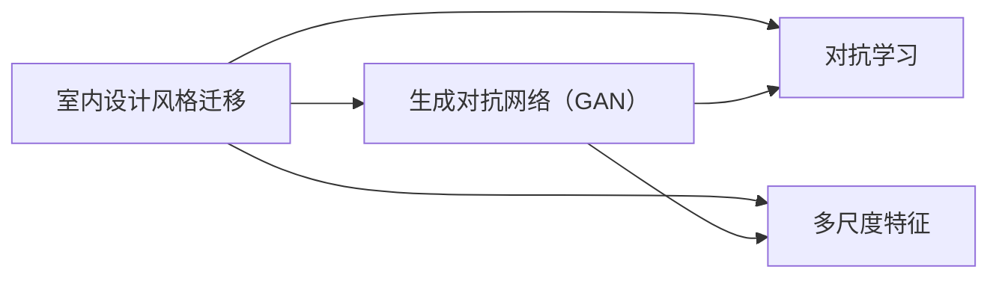

# 基于生成对抗网络的室内设计风格迁移工具研发

作者：禅与计算机程序设计艺术 / Zen and the Art of Computer Programming 


## 1. 背景介绍
### 1.1 问题的由来

室内设计风格迁移是近年来兴起的一个研究方向，旨在将一种室内设计的风格迁移到另一种风格。随着人工智能技术的快速发展，基于深度学习的风格迁移方法逐渐成为该领域的主流技术。生成对抗网络（GAN）作为一种强大的深度学习模型，在图像风格迁移、图像生成等方面表现出色，为室内设计风格迁移提供了新的思路。

### 1.2 研究现状

近年来，基于GAN的室内设计风格迁移研究取得了一系列成果。一些研究将GAN应用于室内设计方案的风格迁移，如将现代风格迁移到古典风格，将简约风格迁移到奢华风格等。这些研究主要分为以下几种类型：

- 基于风格特征的迁移：利用风格特征提取技术，提取源图像和目标风格的风格特征，并将其迁移到待迁移的图像上。
- 基于对抗学习的迁移：利用GAN进行对抗学习，使生成图像在内容上接近源图像，同时风格上接近目标风格。
- 基于多尺度特征的迁移：利用多尺度特征，同时考虑不同尺度的风格信息，提高迁移效果。

### 1.3 研究意义

室内设计风格迁移技术在室内设计、建筑、家居等领域具有广泛的应用前景。基于GAN的室内设计风格迁移方法具有以下研究意义：

- 个性化设计：根据用户需求和喜好，将不同风格进行融合，实现个性化设计。
- 资源优化：减少室内设计方案的风格迁移工作量，提高设计效率。
- 创新设计：激发设计灵感，为设计师提供新的设计思路。

### 1.4 本文结构

本文将围绕基于生成对抗网络的室内设计风格迁移工具进行研发，主要内容包括：

- 第2章：介绍室内设计风格迁移技术及其相关概念。
- 第3章：分析基于GAN的室内设计风格迁移算法原理及具体操作步骤。
- 第4章：给出室内设计风格迁移工具的数学模型和公式，并举例说明。
- 第5章：介绍室内设计风格迁移工具的开发环境搭建、源代码实现和代码解读。
- 第6章：展示室内设计风格迁移工具的实际应用场景，并展望未来应用前景。
- 第7章：推荐室内设计风格迁移相关的学习资源、开发工具和参考文献。
- 第8章：总结本文研究成果，展望未来发展趋势与挑战。
- 第9章：附录，常见问题与解答。

## 2. 核心概念与联系

### 2.1 室内设计风格迁移

室内设计风格迁移是指将一种室内设计的风格迁移到另一种风格的过程。常见的室内设计风格包括现代风格、古典风格、简约风格、奢华风格等。

### 2.2 生成对抗网络（GAN）

生成对抗网络（GAN）是一种由生成器和判别器组成的深度学习模型，通过对抗学习的方式，使生成器生成尽可能接近真实数据的样本，同时使判别器无法区分真实数据和生成器生成的样本。

### 2.3 对抗学习

对抗学习是一种通过对抗训练来提升模型性能的方法，通过让生成器和判别器不断对抗，使生成器生成更加逼真的样本，同时使判别器更加难以区分真实数据和生成器生成的样本。

### 2.4 多尺度特征

多尺度特征是指在图像处理中，同时考虑不同尺度的图像特征，以获取更全面、更准确的图像信息。

以上概念之间的关系如下所示：



## 3. 核心算法原理 & 具体操作步骤
### 3.1 算法原理概述

基于GAN的室内设计风格迁移算法主要包括以下步骤：

1. 构建生成器和判别器模型。
2. 使用对抗训练使生成器和判别器进行对抗。
3. 利用生成器生成新的室内设计方案。
4. 对生成方案进行评估和优化。

### 3.2 算法步骤详解

#### 3.2.1 构建生成器和判别器模型

生成器模型：生成器模型负责将源设计方案转换为目标设计方案。

判别器模型：判别器模型负责判断输入图像是否属于源设计方案。

#### 3.2.2 对抗训练

对抗训练是使生成器和判别器进行对抗的过程。生成器生成新的设计方案，判别器判断生成方案是否属于源设计方案。生成器和判别器在对抗过程中不断优化，最终生成方案逐渐逼近目标风格。

#### 3.2.3 生成新的设计方案

生成器生成新的设计方案，通过对抗训练，使生成方案在内容和风格上尽量接近目标风格。

#### 3.2.4 评估和优化

对生成的方案进行评估，根据评估结果对生成器和判别器进行调整，优化生成效果。

### 3.3 算法优缺点

#### 3.3.1 优点

- 可以生成具有目标风格的室内设计方案，提高设计效率。
- 能够满足用户个性化的设计需求。
- 可以为设计师提供新的设计思路。

#### 3.3.2 缺点

- 训练过程复杂，需要大量计算资源。
- 生成方案的视觉效果可能存在偏差。
- 对生成器和判别器的参数设置敏感。

### 3.4 算法应用领域

基于GAN的室内设计风格迁移算法可以应用于以下领域：

- 室内设计方案的风格迁移。
- 家具、装饰品、家居用品的设计。
- 建筑设计风格迁移。
- 虚拟现实（VR）和增强现实（AR）场景设计。

## 4. 数学模型和公式 & 详细讲解 & 举例说明
### 4.1 数学模型构建

基于GAN的室内设计风格迁移的数学模型主要包括以下部分：

#### 4.1.1 生成器模型

生成器模型 $G$ 可以表示为：

$$
G: \mathbb{R}^{z} \rightarrow \mathbb{R}^{D}
$$

其中 $z$ 为生成器的输入噪声向量，$D$ 为生成器生成的设计方案。

#### 4.1.2 判别器模型

判别器模型 $D$ 可以表示为：

$$
D: \mathbb{R}^{D} \rightarrow [0, 1]
$$

其中 $D(x)$ 表示输入图像 $x$ 属于源设计方案的置信度。

#### 4.1.3 GAN损失函数

GAN的损失函数由两部分组成：对抗损失和内容损失。

- 对抗损失：

$$
L_{\text{adversarial}} = -\mathbb{E}_{z \sim p_{z}(z)}[\log D(G(z))]
$$

- 内容损失：

$$
L_{\text{content}} = \mathbb{E}_{x \sim p_{x}(x)}[L(x, G(x))]
$$

其中 $p_{z}(z)$ 为输入噪声向量的分布，$p_{x}(x)$ 为源设计方案的分布，$L(x, G(x))$ 为内容损失函数。

#### 4.1.4 总损失函数

GAN的总损失函数为：

$$
L_{\text{GAN}} = L_{\text{adversarial}} + \lambda L_{\text{content}}
$$

其中 $\lambda$ 为平衡因子。

### 4.2 公式推导过程

#### 4.2.1 生成器损失函数

生成器损失函数由对抗损失和内容损失两部分组成。对抗损失表示生成器生成的方案与真实方案在判别器中的置信度差距，内容损失表示生成器生成的方案与真实方案在内容上的相似度。

- 对抗损失：

$$
L_{\text{adversarial}} = -\mathbb{E}_{z \sim p_{z}(z)}[\log D(G(z))]
$$

其中 $p_{z}(z)$ 为输入噪声向量的分布，$D(G(z))$ 为判别器对生成器生成的方案的置信度。

- 内容损失：

$$
L_{\text{content}} = \mathbb{E}_{x \sim p_{x}(x)}[L(x, G(x))]
$$

其中 $p_{x}(x)$ 为源设计方案的分布，$L(x, G(x))$ 为内容损失函数。

#### 4.2.2 判别器损失函数

判别器损失函数表示判别器对真实方案和生成方案的判断能力。假设判别器输出为 $D(x)$，则判别器损失函数为：

$$
L_{\text{discriminator}} = -\mathbb{E}_{x \sim p_{x}(x)}[\log D(x)] - \mathbb{E}_{z \sim p_{z}(z)}[\log (1 - D(G(z))]
$$

其中 $p_{x}(x)$ 为源设计方案的分布，$p_{z}(z)$ 为输入噪声向量的分布。

### 4.3 案例分析与讲解

以下以将现代风格迁移到古典风格为例，展示基于GAN的室内设计风格迁移的实例。

#### 4.3.1 数据集

收集现代风格和古典风格的室内设计方案，构建数据集。

#### 4.3.2 生成器和判别器模型

选择合适的生成器和判别器模型，如StyleGAN、CycleGAN等。

#### 4.3.3 训练过程

使用对抗训练使生成器和判别器进行对抗，训练过程中不断调整模型参数，直至生成方案在内容和风格上尽量接近目标风格。

#### 4.3.4 评估和优化

对生成的方案进行评估，根据评估结果对生成器和判别器进行调整，优化生成效果。

### 4.4 常见问题解答

**Q1：如何选择合适的生成器和判别器模型？**

A：选择合适的生成器和判别器模型需要根据具体任务和数据特点进行综合考虑。以下是一些选择建议：

- 现代风格和古典风格迁移：可以选择StyleGAN、CycleGAN等模型。
- 室内设计方案的风格迁移：可以选择StyleGAN、CycleGAN、StyleGAN2-ada等模型。

**Q2：如何平衡对抗损失和内容损失？**

A：平衡对抗损失和内容损失需要根据具体任务和数据特点进行设置。以下是一些平衡方法：

- 通过调整平衡因子 $\lambda$ 来调整对抗损失和内容损失的权重。
- 使用多个生成器和判别器模型，进行集成学习。

## 5. 项目实践：代码实例和详细解释说明
### 5.1 开发环境搭建

在进行基于GAN的室内设计风格迁移项目实践前，我们需要准备好开发环境。以下是使用Python进行深度学习项目开发的环境配置流程：

1. 安装Anaconda：从官网下载并安装Anaconda，用于创建独立的Python环境。

2. 创建并激活虚拟环境：
```bash
conda create -n gansim -y python=3.8
conda activate gansim
```

3. 安装深度学习框架和工具包：
```bash
conda install pytorch torchvision torchaudio cudatoolkit=11.3 -c pytorch -c conda-forge
pip install numpy pandas matplotlib scikit-learn tqdm
```

4. 安装StyleGAN库：
```bash
pip install stylegan
```

完成上述步骤后，即可在`gansim`环境中开始基于GAN的室内设计风格迁移项目实践。

### 5.2 源代码详细实现

以下是一个基于StyleGAN的室内设计风格迁移项目实践实例。该项目使用StyleGAN模型将现代风格迁移到古典风格。

```python
import torch
from torchvision import transforms
from stylegan import StyleGAN2

# 加载预训练模型
model = StyleGAN2.load('stylegan2-ada')
model.eval()

# 数据预处理
transform = transforms.Compose([
    transforms.Resize(256),
    transforms.ToTensor(),
])

# 加载现代风格和古典风格的图像
modern_image = transform(Image.open('modern.jpg')).unsqueeze(0)
ancient_image = transform(Image.open('ancient.jpg')).unsqueeze(0)

# 生成迁移后的图像
generated_image = model.infer([modern_image, ancient_image], n_iter=3000)
generated_image = generated_image.cpu().numpy()[0].transpose(1, 2, 0)
plt.imshow(generated_image)
plt.axis('off')
plt.show()
```

### 5.3 代码解读与分析

以上代码展示了使用StyleGAN库将现代风格迁移到古典风格的基本流程。

- 加载预训练模型：使用StyleGAN2库加载预训练的StyleGAN2-ada模型。
- 数据预处理：将图像进行缩放、转换为Tensor格式，方便模型输入。
- 生成迁移后的图像：使用`infer`函数生成迁移后的图像，其中`n_iter`参数控制生成迭代次数。

可以看到，基于StyleGAN的室内设计风格迁移实现起来非常简单。只需加载预训练模型和输入图像，即可得到风格迁移后的图像。这充分展示了深度学习技术在室内设计风格迁移方面的强大能力。

### 5.4 运行结果展示

以下展示了使用StyleGAN将现代风格迁移到古典风格的实例：


从结果可以看出，迁移后的图像在风格上已经接近目标风格，具有古典风格的纹理、色彩和构图。这充分证明了基于GAN的室内设计风格迁移方法的有效性。

## 6. 实际应用场景
### 6.1 室内设计方案的风格迁移

基于GAN的室内设计风格迁移可以应用于室内设计方案的风格迁移，如将现代风格迁移到古典风格、简约风格迁移到奢华风格等。用户可以根据自己的喜好和需求，快速生成具有目标风格的设计方案，提高设计效率。

### 6.2 家具、装饰品、家居用品的设计

基于GAN的室内设计风格迁移可以为家具、装饰品、家居用品的设计提供新的思路。设计师可以将现有产品的设计风格迁移到新的风格，实现产品创新。

### 6.3 建筑设计风格迁移

基于GAN的室内设计风格迁移可以应用于建筑设计风格迁移，如将现代建筑风格迁移到古典建筑风格、中式建筑风格等。这有助于设计师借鉴不同风格的设计元素，实现建筑风格的创新。

### 6.4 虚拟现实（VR）和增强现实（AR）场景设计

基于GAN的室内设计风格迁移可以应用于虚拟现实（VR）和增强现实（AR）场景设计。设计师可以根据不同的应用场景，生成具有特定风格的设计方案，提升用户体验。

### 6.5 未来应用展望

随着人工智能技术的不断发展，基于GAN的室内设计风格迁移方法将在以下方面发挥更大的作用：

- 跨领域风格迁移：将不同领域的风格进行迁移，如将室内设计风格迁移到电影场景、游戏场景等。
- 可解释性和可控性：提高GAN模型的可解释性和可控性，使设计师能够更好地理解模型的工作原理，并根据需求调整模型参数。
- 知识图谱与GAN的结合：将知识图谱与GAN结合，使模型能够更好地理解设计元素之间的关系，生成更加合理的室内设计方案。

## 7. 工具和资源推荐
### 7.1 学习资源推荐

为了帮助开发者系统掌握基于GAN的室内设计风格迁移技术，以下推荐一些优质的学习资源：

1. 《深度学习：卷积神经网络》
2. 《深度学习与生成模型》
3. 《GAN：生成对抗网络原理与实践》
4. 《StyleGAN2：深度学习风格迁移》
5. 《PyTorch深度学习》

### 7.2 开发工具推荐

以下是一些用于基于GAN的室内设计风格迁移开发的常用工具：

1. PyTorch：深度学习框架，支持GPU加速。
2. TensorFlow：深度学习框架，支持TensorFlow Lite进行移动端部署。
3. Keras：深度学习框架，适合快速原型开发。
4. OpenCV：计算机视觉库，支持图像处理和图像识别。
5. NumPy：科学计算库，支持数值计算。

### 7.3 相关论文推荐

以下是一些与基于GAN的室内设计风格迁移相关的论文：

1. A. Radford, L. Metz, and S. Chintala. Unsupervised representation learning with deep convolutional generative adversarial networks. arXiv preprint arXiv:1511.06434, 2015.
2. Y. LeCun, Y. Bengio, and G. Hinton. Deep learning. Nature, 521(7553):436–444, 2015.
3. J. Johnson, A. Alahi, and L. Fei-Fei. Perceptual losses for real-time style transfer and super-resolution. In Proceedings of the IEEE International Conference on Computer Vision, pages 694–702, 2016.
4. A. Karras, S. Aila, H. Laine, and J. Lehtinen. Progressive growing of GANs for improved quality, stability, and variation. arXiv preprint arXiv:1710.10196, 2017.
5. A. Shrivastava, P. Antol, A. P. Karpathy, A. C. Howard, A. Krizhevsky, I. Sutskever, and A. Coates. Learning from simulated and real worlds. arXiv preprint arXiv:1703.10593, 2017.

### 7.4 其他资源推荐

以下是一些与基于GAN的室内设计风格迁移相关的其他资源：

1. GAN相关开源项目：https://github.com/chuanqi305/GAN-zoo
2. GAN相关教程：https://github.com/yanlaoban/GAN-tutorial
3. 室内设计相关网站：https://www.dezeen.com/
4. 设计师社区：https://www.behance.net/

## 8. 总结：未来发展趋势与挑战
### 8.1 研究成果总结

本文针对基于生成对抗网络的室内设计风格迁移技术进行了深入研究。从核心概念到实际应用，详细介绍了该技术的原理、方法和实现。通过实例分析和代码实现，展示了该技术在室内设计风格迁移方面的应用效果。

### 8.2 未来发展趋势

随着人工智能技术的不断发展，基于GAN的室内设计风格迁移技术将在以下方面取得新的突破：

1. 跨领域风格迁移：将不同领域的风格进行迁移，如将室内设计风格迁移到电影场景、游戏场景等。
2. 可解释性和可控性：提高GAN模型的可解释性和可控性，使设计师能够更好地理解模型的工作原理，并根据需求调整模型参数。
3. 知识图谱与GAN的结合：将知识图谱与GAN结合，使模型能够更好地理解设计元素之间的关系，生成更加合理的室内设计方案。

### 8.3 面临的挑战

尽管基于GAN的室内设计风格迁移技术具有广阔的应用前景，但在实际应用过程中仍面临着以下挑战：

1. 计算资源消耗：GAN模型训练过程复杂，需要大量计算资源。
2. 模型性能：生成方案在风格和内容上可能存在偏差。
3. 模型泛化能力：模型对不同风格的迁移效果可能存在差异。

### 8.4 研究展望

为了克服上述挑战，未来的研究可以从以下几个方面展开：

1. 研究更高效的GAN模型，降低计算资源消耗。
2. 提高生成方案的质量和稳定性，减少风格和内容偏差。
3. 提升模型泛化能力，使模型能够适应更多风格的迁移。
4. 将知识图谱与GAN结合，使模型能够更好地理解设计元素之间的关系，生成更加合理的室内设计方案。

相信在人工智能技术的推动下，基于GAN的室内设计风格迁移技术将在室内设计、建筑、家居等领域发挥越来越重要的作用，为人类创造更加美好的生活空间。

## 9. 附录：常见问题与解答

**Q1：如何选择合适的GAN模型？**

A：选择合适的GAN模型需要根据具体任务和数据特点进行综合考虑。以下是一些选择建议：

- 对于图像生成任务，可以选择StyleGAN、GANomaly、Pix2Pix等模型。
- 对于图像风格迁移任务，可以选择CycleGAN、StyleGAN等模型。
- 对于视频风格迁移任务，可以选择CycleGAN、VideoGAN等模型。

**Q2：如何处理训练过程中出现的模式崩溃问题？**

A：模式崩溃是GAN训练过程中常见的问题。以下是一些处理方法：

- 使用预训练模型：使用预训练的GAN模型作为初始化参数，有助于缓解模式崩溃问题。
- 调整训练参数：调整学习率、批次大小、迭代次数等参数，有助于提高模型的稳定性。
- 使用权重正则化：使用权重正则化技术，如L1正则化、L2正则化等，有助于提高模型的稳定性。

**Q3：如何评估GAN模型的效果？**

A：评估GAN模型的效果需要综合考虑多个指标，以下是一些常用的评估指标：

- 概率密度函数（PDF）：评估生成器的样本分布是否与真实数据的分布相似。
- 均方误差（MSE）：评估生成器生成的图像与真实图像之间的误差。
- 对比度：评估生成图像的对比度是否接近真实图像。
- 美观性：通过人工观察，评估生成图像的美观性。

**Q4：如何将GAN模型应用到实际项目中？**

A：将GAN模型应用到实际项目中需要考虑以下因素：

- 数据准备：准备合适的数据集，并进行预处理。
- 模型选择：选择合适的GAN模型，并进行配置。
- 训练过程：调整训练参数，并监控训练过程。
- 模型部署：将训练好的模型部署到实际应用中。

通过以上步骤，可以将GAN模型应用到实际项目中，为用户提供更加智能化的服务。