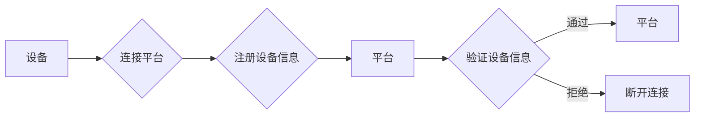
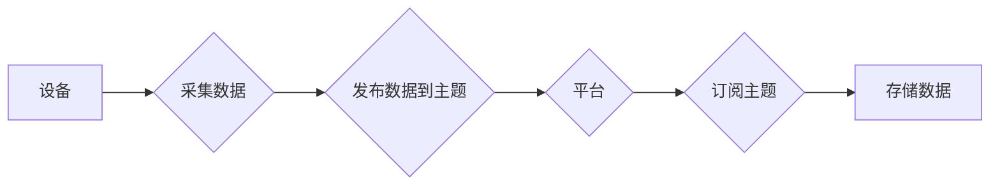
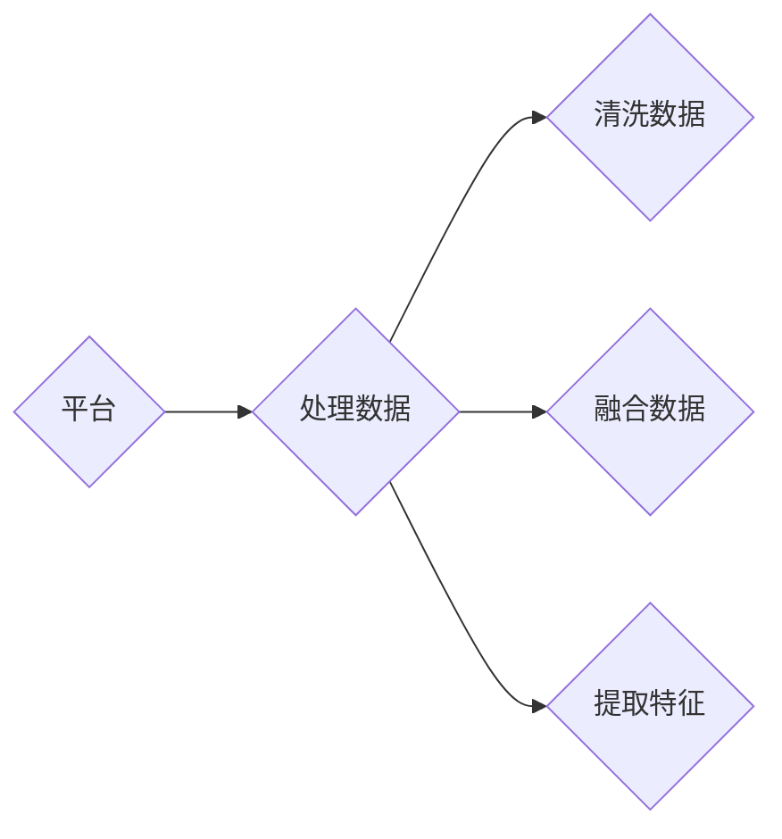
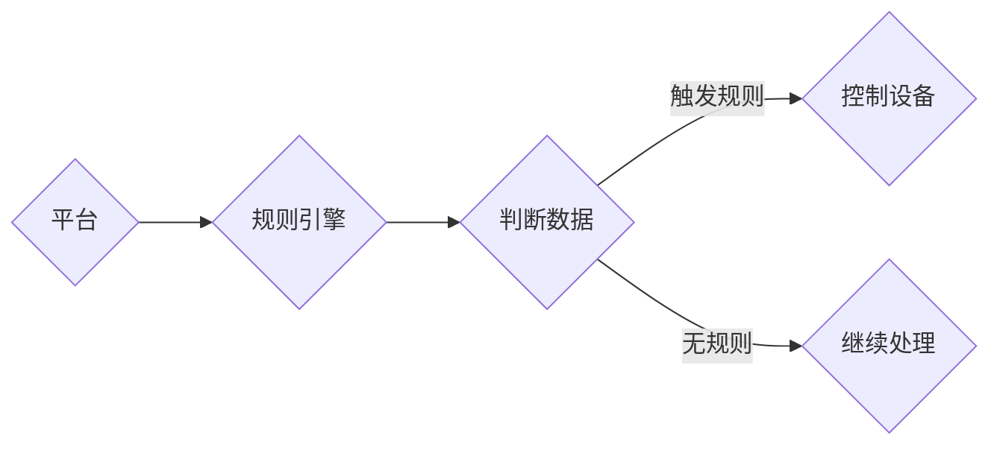
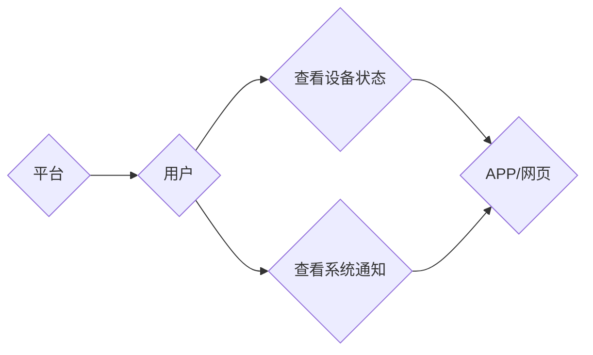

# 基于MQTT协议和RESTful API的智能家居协同工作流程设计

## 1. 背景介绍
### 1.1 问题的由来

随着物联网（Internet of Things, IoT）技术的飞速发展，智能家居系统已经成为人们生活中不可或缺的一部分。智能家居系统通过将家庭中的各种设备和家电连接起来，实现设备之间的互联互通，为用户提供便捷、舒适、安全的居住环境。然而，随着设备数量的增加，如何实现设备之间的高效协同工作，成为智能家居系统设计的关键问题。

### 1.2 研究现状

目前，智能家居系统协同工作流程的设计主要面临以下挑战：

1. **协议选择**：智能家居设备种类繁多，不同设备可能采用不同的通信协议，导致设备之间难以互联互通。
2. **数据交互**：智能家居设备之间需要实时交换数据，如何高效、可靠地进行数据交互是一个重要问题。
3. **系统架构**：智能家居系统通常由多个设备、平台和应用组成，如何设计一个高效、可扩展的系统架构是关键。

针对以上挑战，本文提出了一种基于MQTT协议和RESTful API的智能家居协同工作流程设计方法。

### 1.3 研究意义

本文的研究意义如下：

1. **提升设备互联互通性**：通过统一采用MQTT协议和RESTful API，实现智能家居设备之间的互联互通。
2. **提高数据交互效率**：利用MQTT协议的轻量级特点和RESTful API的异步通信机制，提高数据交互效率。
3. **构建可扩展的系统架构**：采用分层架构设计，提高智能家居系统的可扩展性和可维护性。

### 1.4 本文结构

本文结构如下：

- 第2章介绍智能家居系统协同工作流程设计的相关核心概念。
- 第3章详细介绍基于MQTT协议和RESTful API的智能家居协同工作流程设计方法。
- 第4章分析该设计方法的优势和局限性。
- 第5章通过实例展示该设计方法在实际项目中的应用。
- 第6章探讨智能家居系统的未来发展趋势。
- 第7章总结本文的研究成果，并展望未来研究方向。

## 2. 核心概念与联系
### 2.1 物联网协议

物联网协议是智能家居系统中设备之间进行通信的标准规范。常见的物联网协议包括：

- MQTT协议：轻量级、低功耗、发布/订阅模式的物联网通信协议。
- CoAP协议：基于HTTP/RESTful风格的物联网通信协议。
- Z-Wave协议：低功耗、短距离的无线通信协议。
- Zigbee协议：低功耗、低速率、低成本的无线通信协议。

### 2.2 RESTful API

RESTful API是一种基于HTTP协议的API设计风格，具有简单、轻量、易于扩展等特点。RESTful API广泛应用于Web服务、移动应用等领域。

### 2.3 智能家居系统架构

智能家居系统通常采用分层架构，包括感知层、网络层、平台层和应用层。

- 感知层：负责采集各种传感器数据，如温度、湿度、光照等。
- 网络层：负责设备之间的数据传输和通信。
- 平台层：负责数据处理、规则引擎、用户管理等。
- 应用层：负责为用户提供可视化界面和功能操作。

## 3. 核心算法原理 & 具体操作步骤
### 3.1 算法原理概述

本文提出的基于MQTT协议和RESTful API的智能家居协同工作流程设计方法，主要包含以下步骤：

1. **设备接入**：设备通过MQTT协议接入智能家居平台，并注册自身信息。
2. **数据采集**：设备通过MQTT协议将采集到的数据发布到指定的主题。
3. **数据处理**：平台通过RESTful API对数据进行处理和分析。
4. **规则引擎**：平台根据预设的规则，对数据进行判断和决策。
5. **用户交互**：平台通过RESTful API将处理结果反馈给用户。

### 3.2 算法步骤详解

#### 3.2.1 设备接入

设备通过MQTT协议连接到智能家居平台，并注册自身信息，包括设备ID、设备类型、接入点等。平台对设备信息进行验证和存储，以便后续进行数据采集和处理。



#### 3.2.2 数据采集

设备通过MQTT协议将采集到的数据发布到指定的主题。平台通过订阅这些主题，实时获取设备数据。



#### 3.2.3 数据处理

平台通过RESTful API对数据进行处理和分析，包括数据清洗、数据融合、特征提取等。



#### 3.2.4 规则引擎

平台根据预设的规则，对数据进行判断和决策。规则引擎可以实现对设备的远程控制、报警、通知等功能。



#### 3.2.5 用户交互

平台通过RESTful API将处理结果反馈给用户，用户可以通过手机APP、网页等方式查看设备状态和系统通知。



### 3.3 算法优缺点

#### 3.3.1 优点

1. **兼容性强**：支持多种设备接入，兼容不同协议的设备。
2. **实时性强**：基于MQTT协议，能够实时获取设备数据。
3. **可扩展性强**：采用分层架构，易于扩展和升级。
4. **易于集成**：支持RESTful API，方便与其他系统进行集成。

#### 3.3.2 缺点

1. **安全性**：MQTT协议本身安全性较低，需要采用TLS等安全机制。
2. **复杂性**：系统架构较为复杂，需要一定的技术积累。
3. **性能**：数据传输和处理过程中可能存在性能瓶颈。

### 3.4 算法应用领域

本文提出的智能家居协同工作流程设计方法可应用于以下场景：

- 智能家居控制系统
- 智能建筑管理系统
- 智能交通系统
- 工业物联网系统

## 4. 数学模型和公式 & 详细讲解 & 举例说明
### 4.1 数学模型构建

智能家居系统协同工作流程设计涉及到多个数学模型，主要包括：

- 设备状态模型：描述设备的实时状态，如温度、湿度、光照等。
- 数据模型：描述设备采集到的数据，如传感器数据、环境数据等。
- 规则模型：描述预设的规则，如温度阈值、湿度阈值等。

### 4.2 公式推导过程

以下以设备状态模型为例，进行公式推导：

假设设备状态模型为 $S(t)$，其中 $t$ 表示时间，$S(t)$ 表示设备在时间 $t$ 的状态。则设备状态模型可以表示为：

$$
S(t) = f(t, x_1, x_2, \ldots, x_n)
$$

其中，$x_1, x_2, \ldots, x_n$ 表示影响设备状态的因素，如温度、湿度、光照等。

### 4.3 案例分析与讲解

以下以智能家居控制系统为例，分析智能家居协同工作流程设计方法的应用。

假设用户设定了温度阈值为20℃，当温度低于20℃时，系统需要开启加热设备。根据设备状态模型，当 $S(t) < 20$ 时，触发规则引擎，控制加热设备开启。

```mermaid
graph LR
A[温度] --> B{S(t) < 20?}
B --是 --> C[开启加热设备]
B --否 --> D[继续监测]
```

### 4.4 常见问题解答

**Q1：如何保证MQTT协议的安全性？**

A：可以通过以下方法保证MQTT协议的安全性：

1. 使用TLS加密通信，防止数据被窃取。
2. 对设备进行身份认证，确保设备合法性。
3. 对数据进行加密，防止数据被篡改。

**Q2：如何优化数据传输和处理性能？**

A：可以通过以下方法优化数据传输和处理性能：

1. 采用MQTT协议的压缩机制，减少数据传输量。
2. 对数据进行缓存，减少数据重复传输。
3. 采用并行处理技术，提高数据处理速度。

**Q3：如何解决设备兼容性问题？**

A：可以通过以下方法解决设备兼容性问题：

1. 使用统一的设备接入协议，如MQTT协议。
2. 对不支持的设备进行适配，如使用桥接设备。
3. 采用设备抽象层，将不同设备的接口进行统一封装。

## 5. 项目实践：代码实例和详细解释说明
### 5.1 开发环境搭建

以下以Python为例，介绍智能家居协同工作流程设计项目的开发环境搭建。

1. 安装Python：从Python官网下载并安装Python 3.8及以上版本。
2. 安装MQTT库：使用pip安装paho-mqtt库。
3. 安装RESTful API库：使用pip安装Flask库。

### 5.2 源代码详细实现

以下以Python为例，展示智能家居协同工作流程设计项目的部分源代码。

```python
from flask import Flask, jsonify
import paho.mqtt.client as mqtt

# 初始化MQTT客户端
client = mqtt.Client()

# 连接MQTT服务器
client.connect("mqtt_server_address", 1883, 60)

# 订阅主题
client.subscribe("home/sensor/temp", qos=1)

# 定义处理温度数据的函数
def handle_temperature_data(data):
    if data < 20:
        print("温度低于20℃，开启加热设备")
        # 控制加热设备开启
    else:
        print("温度正常，继续监测")

# 处理MQTT消息
def on_message(client, userdata, message):
    if message.topic == "home/sensor/temp":
        data = message.payload.decode()
        handle_temperature_data(data)

# 设置MQTT消息处理回调函数
client.on_message = on_message

# 启动MQTT客户端
client.loop_start()

# 启动Flask服务器
app = Flask(__name__)

@app.route('/status', methods=['GET'])
def get_status():
    # 获取设备状态信息
    # ...
    return jsonify({"status": "normal"})

if __name__ == "__main__":
    app.run(host="0.0.0.0", port=5000)
```

### 5.3 代码解读与分析

上述代码实现了以下功能：

1. 使用paho-mqtt库连接MQTT服务器，并订阅主题"home/sensor/temp"。
2. 定义处理温度数据的函数handle_temperature_data，当温度低于20℃时，触发控制加热设备开启。
3. 定义处理MQTT消息的回调函数on_message，当接收到温度数据时，调用handle_temperature_data函数进行处理。
4. 启动MQTT客户端，开始监听消息。
5. 启动Flask服务器，提供RESTful API接口，用于获取设备状态信息。

### 5.4 运行结果展示

当设备采集到温度数据并发布到主题"home/sensor/temp"时，MQTT服务器将消息发送给客户端。客户端接收到消息后，调用on_message函数进行处理，触发控制加热设备开启。同时，用户可以通过访问RESTful API接口获取设备状态信息。

## 6. 实际应用场景
### 6.1 智能家居控制系统

基于MQTT协议和RESTful API的智能家居协同工作流程设计方法，可以应用于智能家居控制系统，实现以下功能：

1. **实时监控**：实时监控家庭环境参数，如温度、湿度、光照、烟雾等。
2. **远程控制**：远程控制家电设备，如开关灯光、调节温度、播放音乐等。
3. **自动调节**：根据预设规则自动调节设备状态，如自动开关空调、热水器等。
4. **场景控制**：根据用户需求设定场景模式，如离家模式、睡眠模式等。

### 6.2 智能建筑管理系统

基于MQTT协议和RESTful API的智能家居协同工作流程设计方法，可以应用于智能建筑管理系统，实现以下功能：

1. **能源管理**：实时监控能源消耗情况，实现节能减排。
2. **安全监控**：实时监控安全设备状态，如门禁、监控摄像头等。
3. **环境监测**：实时监测室内环境参数，如温度、湿度、空气质量等。
4. **设备管理**：远程控制设备，如灯光、空调、电梯等。

### 6.3 智能交通系统

基于MQTT协议和RESTful API的智能家居协同工作流程设计方法，可以应用于智能交通系统，实现以下功能：

1. **交通流量监控**：实时监控道路车辆流量，优化交通信号灯控制。
2. **事故处理**：实时监控事故发生，及时调度救援力量。
3. **停车场管理**：实时监控停车场车辆数量，实现车位引导和自动收费。
4. **公共安全**：实时监控公共安全设备，如监控摄像头、报警器等。

### 6.4 未来应用展望

随着物联网技术的不断发展，基于MQTT协议和RESTful API的智能家居协同工作流程设计方法将在更多领域得到应用，为人们的生活带来更多便利。

1. **智慧城市**：通过智能家居系统，实现城市资源优化配置，提高城市管理水平。
2. **智慧农业**：通过智能监控和远程控制，提高农业生产效率，实现农业现代化。
3. **智慧医疗**：通过智能设备监测和远程诊断，提高医疗服务质量，降低医疗成本。
4. **智慧教育**：通过智能设备和平台，实现个性化教学、远程教育等，提高教育质量。

## 7. 工具和资源推荐
### 7.1 学习资源推荐

1. 《物联网通信协议》
2. 《RESTful API设计最佳实践》
3. 《Python编程：从入门到实践》
4. 《智能家居系统设计》

### 7.2 开发工具推荐

1. MQTT服务器：Mosquitto、Mosquitto CE等。
2. MQTT客户端：Paho MQTT客户端、MQTTX等。
3. RESTful API开发框架：Flask、Django等。
4. 数据可视化工具：ECharts、D3.js等。

### 7.3 相关论文推荐

1. 《MQTT: The Internet of Things Messaging Protocol》
2. 《RESTful API Design》
3. 《Designing the IoT：A Practical Approach to Building the Internet of Things》

### 7.4 其他资源推荐

1. MQTT官方网站：http://mqtt.org/
2. RESTful API设计指南：https://restfulapi.net/
3. 智能家居论坛：https://www.iotdev.com/
4. 物联网开发者社区：https://www.iotopen.com/

## 8. 总结：未来发展趋势与挑战
### 8.1 研究成果总结

本文提出了一种基于MQTT协议和RESTful API的智能家居协同工作流程设计方法，该方法具有以下特点：

1. **兼容性强**：支持多种设备接入，兼容不同协议的设备。
2. **实时性强**：基于MQTT协议，能够实时获取设备数据。
3. **可扩展性强**：采用分层架构，易于扩展和升级。
4. **易于集成**：支持RESTful API，方便与其他系统进行集成。

该方法已在智能家居控制系统、智能建筑管理系统、智能交通系统等场景中得到应用，取得了良好的效果。

### 8.2 未来发展趋势

1. **物联网协议标准化**：推动物联网协议的标准化，提高设备互联互通性。
2. **人工智能与物联网融合**：将人工智能技术应用于物联网领域，实现更智能的智能家居系统。
3. **边缘计算与云计算协同**：利用边缘计算和云计算的优势，实现更加高效、可靠的智能家居系统。

### 8.3 面临的挑战

1. **安全性**：确保智能家居系统的安全性，防止数据泄露和设备被恶意攻击。
2. **能耗**：降低智能家居系统的能耗，提高能源利用效率。
3. **隐私保护**：保护用户隐私，防止用户数据被滥用。

### 8.4 研究展望

1. **研究更加安全、高效的物联网协议**。
2. **研究更加智能的智能家居系统**。
3. **研究更加便捷、舒适的智能家居应用场景**。

## 9. 附录：常见问题与解答

**Q1：什么是MQTT协议？**

A：MQTT是一种轻量级、低功耗、发布/订阅模式的物联网通信协议，适用于资源受限的设备。

**Q2：什么是RESTful API？**

A：RESTful API是一种基于HTTP协议的API设计风格，具有简单、轻量、易于扩展等特点。

**Q3：如何保证智能家居系统的安全性？**

A：可以通过以下方法保证智能家居系统的安全性：

1. 使用TLS加密通信，防止数据被窃取。
2. 对设备进行身份认证，确保设备合法性。
3. 对数据进行加密，防止数据被篡改。

**Q4：如何降低智能家居系统的能耗？**

A：可以通过以下方法降低智能家居系统的能耗：

1. 使用节能型设备，如LED灯具、节能电器等。
2. 根据环境参数自动调节设备状态，如根据温度调节空调。
3. 使用智能控制策略，如定时开关设备、自动调节亮度等。

**Q5：如何保护用户隐私？**

A：可以通过以下方法保护用户隐私：

1. 对用户数据进行脱敏处理，如对身份证号码、银行卡号等进行加密。
2. 建立用户数据安全管理制度，规范用户数据的使用。
3. 加强对用户隐私泄露的监控和预警，及时发现和处理安全隐患。

作者：禅与计算机程序设计艺术 / Zen and the Art of Computer Programming