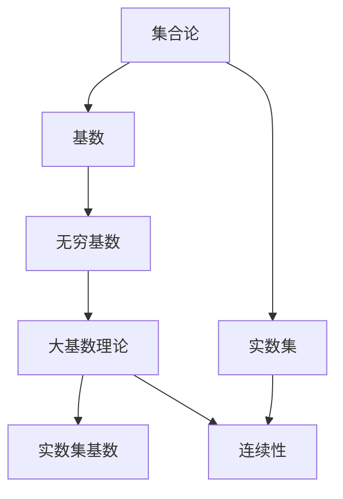
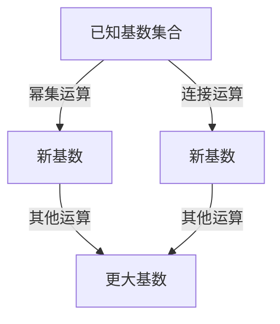

# 集合论导引：大基数对于实数集理论的影响

## 1. 背景介绍

### 1.1 问题的由来

实数集是数学中一个基础且重要的概念,它描述了一条无限延伸的连续数直线。在经典的康托尔集合论中,实数集被认为是不可数的,即它的基数大于自然数集的基数。然而,随着20世纪初期大基数理论的发展,人们发现存在比实数集更大的基数。这种新的发现引发了对实数集本质的重新思考和探讨。

### 1.2 研究现状

大基数理论是20世纪初期由哥特洛布·弗雷格(Gottlob Frege)、乔治·坎托尔(Georg Cantor)和阿隆佐·丘奇(Alonzo Church)等人发展起来的一个新兴数学分支。它研究了超越实数集基数的更大基数,并建立了一个庞大的基数阶层体系。在这个体系中,实数集的基数只是最小的无穷基数,而存在无数个更大的基数。

大基数理论的发展为实数集理论带来了新的视角和挑战。一方面,它扩展了人们对无穷概念的认识,另一方面也引发了对实数集本质的重新审视。例如,人们开始质疑实数集是否真的是连续的,以及连续性的定义是否需要修正。

### 1.3 研究意义

探讨大基数对实数集理论的影响,不仅有助于我们更深入地理解实数集的本质特征,还可能引领数学理论的新发展。具体来说,这一研究领域具有以下重要意义:

1. **基础理论建构**: 重新审视实数集的基础理论,有助于构建更一致、更完备的数学基础理论体系。

2. **连续性概念重塑**: 大基数理论可能会促使我们重新定义连续性的概念,从而影响实数集的表征方式。

3. **新数学分支孕育**: 探索大基数对实数集的影响,可能会催生新的数学分支,推动数学理论的创新发展。

4. **应用领域拓展**: 实数集理论的变革可能会影响相关的应用领域,如计算机科学、物理学等,促进这些领域的理论创新。

### 1.4 本文结构

本文将从大基数理论的角度,系统地探讨大基数对实数集理论的影响。全文共分为八个部分:

1. 背景介绍
2. 核心概念与联系
3. 核心算法原理与具体操作步骤
4. 数学模型和公式详细讲解与举例说明
5. 项目实践:代码实例和详细解释说明
6. 实际应用场景
7. 工具和资源推荐
8. 总结:未来发展趋势与挑战

## 2. 核心概念与联系

在探讨大基数对实数集理论的影响之前,我们需要先了解一些核心概念及其相互联系。

### 2.1 集合论

集合论是研究集合性质的一个数学分支,是现代数学的基础理论之一。它为数学提供了一套统一的语言和概念体系,使得不同领域的数学理论能够在同一框架下进行探讨和发展。

### 2.2 基数

基数是衡量集合"大小"的一个概念,用来区分有限集合和无限集合。有限集合的基数就是集合中元素的个数,而无限集合的基数则需要通过特殊的方法来确定。

### 2.3 无穷基数

无穷基数是用来描述无限集合"大小"的一种基数。最小的无穷基数是可数无穷基数,它描述了可数无限集合(如自然数集)的大小。而实数集的基数则是不可数无穷基数,大于可数无穷基数。

### 2.4 大基数理论

大基数理论是20世纪初期发展起来的一个新兴数学分支,它研究了比实数集基数更大的基数,并建立了一个庞大的基数阶层体系。在这个体系中,实数集的基数只是最小的无穷基数,而存在无数个更大的基数。

### 2.5 实数集基数

实数集基数是描述实数集"大小"的一个无穷基数。在经典的康托尔集合论中,实数集被认为是不可数的,即它的基数大于自然数集的基数(可数无穷基数)。然而,在大基数理论的视角下,实数集的基数只是最小的无穷基数,而存在更大的基数。

### 2.6 连续性

连续性是实数集的一个重要特征,它描述了实数集中任意两个不同的实数之间,总存在第三个实数。这种连续性使得实数集能够表示任意的数值,是实数集在科学计算和分析中得以广泛应用的关键所在。然而,大基数理论可能会促使我们重新定义连续性的概念。

通过上述概念的介绍,我们可以看到,大基数理论与实数集理论存在密切的联系。大基数理论为我们提供了一个新的视角来审视实数集的本质特征,如基数和连续性,这可能会对实数集理论产生深远的影响。

## 3. 核心算法原理与具体操作步骤

### 3.1 算法原理概述

大基数理论中的核心算法是构造更大基数的方法。这些算法通过对已知基数进行一系列的集合论运算,如幂集运算、连接运算等,来生成新的、更大的基数。

其中,最著名的算法是康托尔对角线论证法。该算法通过构造一个对角线集合,证明了实数集的基数大于自然数集的基数,从而揭示了实数集的不可数性。

### 3.2 算法步骤详解

以康托尔对角线论证法为例,我们来详细解释一下算法的具体步骤:

1. 首先,假设实数集是可数的,即它与自然数集之间存在一一对应的双射关系。
2. 接下来,我们构造一个由所有实数组成的无限矩阵,其中每一行对应于一个实数。
3. 然后,我们沿着矩阵的对角线,构造一个新的实数序列,其中每个元素都不同于矩阵中对应行的实数。
4. 最后,我们证明这个新构造的实数序列中的任何一个实数,都不属于原始的无限矩阵,从而得出矛盾。

通过这个算法,康托尔证明了实数集的基数必然大于自然数集的基数,即实数集是不可数的。这个结论为后来大基数理论的发展奠定了基础。

### 3.3 算法优缺点

康托尔对角线论证法的优点在于思路清晰、证明严谨,为实数集的不可数性提供了一个简洁而有力的论证。然而,这一算法也存在一些缺点和局限性:

1. **局限于特定情况**: 该算法主要用于证明实数集的不可数性,对于构造更大的基数,它的作用有限。
2. **思维困难**: 虽然算法本身相对简单,但是涉及到对无穷概念的操作,对初学者来说可能会有一定的思维障碍。
3. **存在反直觉性**: 算法的结论(实数集是不可数的)与我们的直觉(实数集应该是连续的)相悖,这可能会引起一定的困惑和质疑。

### 3.4 算法应用领域

康托尔对角线论证法虽然主要用于证明实数集的不可数性,但它所体现的思想和方法也被广泛应用于其他数学领域,如逻辑学、计算理论等。

例如,在计算理论中,对角线论证法被用于证明某些函数是不可计算的,即不存在任何算法能够计算出这些函数的值。这种思路与康托尔的论证非常相似,都是通过构造一个对角线对象来引出矛盾,从而证明所要证明的命题。

此外,对角线论证法也被应用于证明某些形式语言是不可判定的,即不存在任何算法能够判断一个给定的字符串是否属于该形式语言。这对于计算机科学中的一些理论问题,如停机问题等,具有重要意义。

总的来说,尽管康托尔对角线论证法最初是为了证明实数集的不可数性而提出的,但它所体现的思想和方法在数学和计算机科学的多个领域都有广泛的应用。

## 4. 数学模型和公式详细讲解与举例说明

### 4.1 数学模型构建

为了更好地理解和描述大基数理论中的概念和运算,我们需要构建一些数学模型。这些模型通常基于集合论和逻辑学的基础理论,并引入一些特殊的符号和公理来表示无穷概念。

其中,最著名的数学模型是 ZFC 公理系统(Zermelo-Fraenkel 公理系统加上选择公理)。ZFC 公理系统为集合论提供了一个坚实的公理化基础,使得我们能够在这个框架下严格地定义和操作无穷集合,包括实数集和更大的基数。

$$
\begin{align}
\text{ZFC 公理系统} = \{ &\text{扩展性公理}, \text{并集公理}, \text{对合公理},\
                         &\text{幂集公理}, \text{无穷公理},\
                         &\text{替换公理}, \text{基础公理}, \text{选择公理} \}
\end{align}
$$

在 ZFC 公理系统中,我们可以严格地定义实数集、基数等概念,并对它们进行各种集合论运算,如幂集运算、连接运算等。这为大基数理论的发展奠定了坚实的数学基础。

### 4.2 公式推导过程

在大基数理论中,我们通常需要利用一系列的公式和推导过程来构造新的基数,或者证明某些基数之间的大小关系。

以康托尔对角线论证法为例,我们可以用公式的形式来表示其推导过程:

1. 假设实数集 $\mathbb{R}$ 是可数的,即存在一个双射 $f: \mathbb{N} \rightarrow \mathbb{R}$,将自然数集 $\mathbb{N}$ 与实数集 $\mathbb{R}$ 一一对应。

2. 构造一个由所有实数组成的无限矩阵 $M$,其中第 $i$ 行第 $j$ 列的元素为 $f(i)$ 的第 $j$ 位小数。

   $$
   M = \begin{pmatrix}
   0.a_{11} & a_{12} & a_{13} & \cdots \
   0.a_{21} & a_{22} & a_{23} & \cdots \
   0.a_{31} & a_{32} & a_{33} & \cdots \
   \vdots & \vdots & \vdots & \ddots
   \end{pmatrix}
   $$

3. 构造一个新的实数 $r$,其小数部分在对角线上与矩阵 $M$ 中的每一个对角线元素都不同。

   $$
   r = 0.b_1b_2b_3\cdots, \quad b_i \neq a_{ii}
   $$

4. 由于 $r$ 不属于矩阵 $M$ 中的任何一行,因此 $r$ 不能被双射 $f$ 映射到,这与假设 $f$ 是双射矛盾。

5. 因此,我们得出结论:实数集 $\mathbb{R}$ 是不可数的,它的基数大于自然数集 $\mathbb{N}$ 的基数。

通过这个推导过程,我们可以看到公式在大基数理论中的重要作用。它不仅能够精确地表达概念和命题,还能够指导我们进行严格的数学推理和证明。

### 4.3 案例分析与讲解

为了更好地理解大基数理论中的概念和方法,我们来分析一个具体的案例。

假设我们有两个无限集合 $A$ 和 $B$,