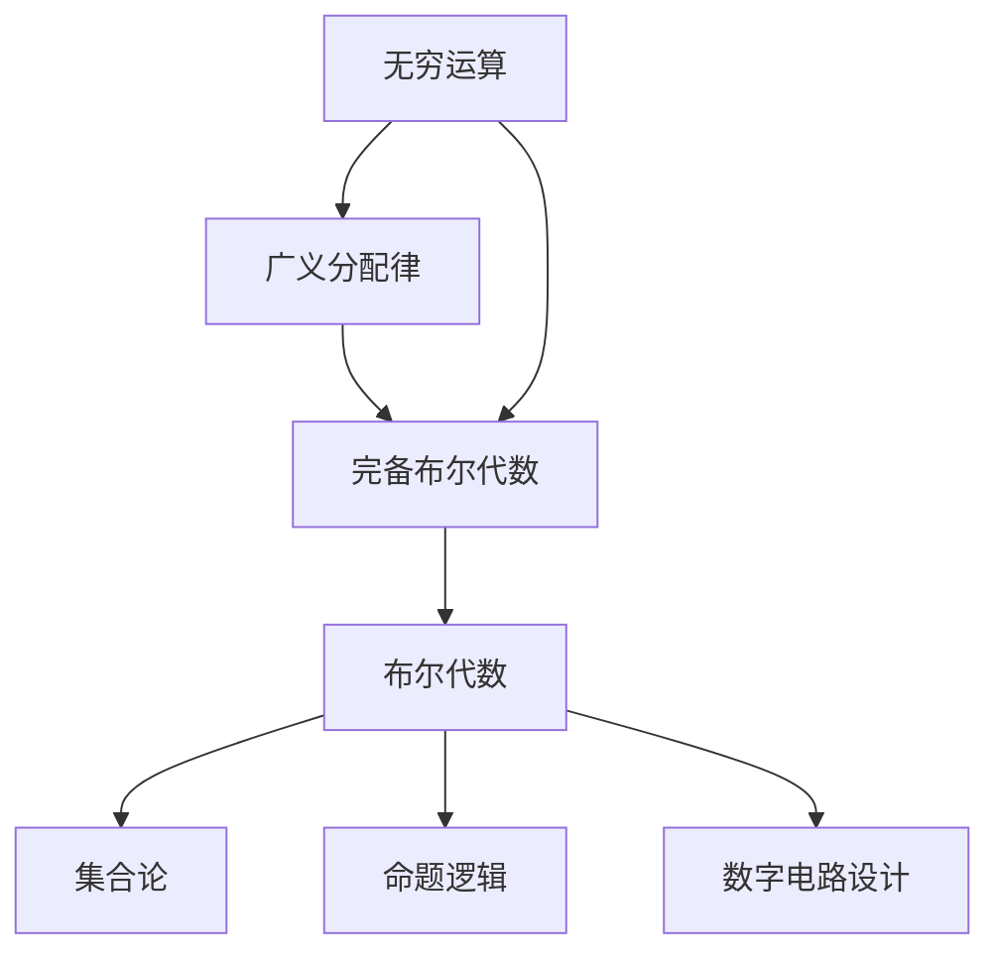

以下是根据您的要求撰写的技术博客文章《集合论导引：完备布尔代数广义分配律》的正文内容：

# 集合论导引：完备布尔代数广义分配律

## 1. 背景介绍

### 1.1 问题的由来

集合论作为数学的一个基础分支,在计算机科学、逻辑学和人工智能等诸多领域扮演着重要角色。其中,布尔代数是集合论的核心组成部分,广泛应用于数字电路设计、数据库查询优化、自动推理等领域。完备布尔代数的概念进一步扩展了传统布尔代数的表达能力,引入了无穷运算,使其能够处理更加复杂的逻辑问题。

在完备布尔代数中,广义分配律是一个基础性的公理,它描述了无穷并运算与无穷交运算之间的相互分配关系。广义分配律的成立与否对于构建完备布尔代数的代数结构至关重要,因此深入研究广义分配律的性质及其在不同情况下的适用性,对于发展集合论和相关应用领域具有重要意义。

### 1.2 研究现状

早在20世纪初,数学家就开始探索完备布尔代数的理论基础。1936年,Alfred Tarski证明了在可数完备情况下,广义分配律对于布尔代数的成立。然而,在非可数情况下,广义分配律是否仍然成立一直存在争议。

1963年,Tarski的学生Steven Givant发表论文,通过构造一个反例证明了在非可数完备布尔代数中,广义分配律不成立。这一发现引发了学术界的广泛关注和讨论。

近年来,随着计算机科学和人工智能的快速发展,对于完备布尔代数的研究需求日益增加。广义分配律的适用性问题再次成为热点话题,吸引了众多学者的关注。

### 1.3 研究意义 

深入研究广义分配律在完备布尔代数中的适用性,对于发展集合论的理论基础和相关应用领域具有重要意义:

1. **理论意义**:完善完备布尔代数的公理体系,厘清广义分配律在不同情况下的成立条件,为集合论的发展奠定坚实的数学基础。

2. **应用意义**:广义分配律在数字电路设计、数据库查询优化、自动推理等领域具有广泛应用。明确其适用范围有助于相关算法和系统的优化和改进。

3. **教学意义**:广义分配律是集合论和布尔代数的核心概念,对于培养学生的数学逻辑思维和建模能力至关重要。

### 1.4 本文结构

本文将系统地介绍完备布尔代数广义分配律的相关理论、性质和应用。文章主要包括以下几个部分:

1. 核心概念与联系
2. 核心算法原理与具体操作步骤
3. 数学模型和公式详细讲解与举例说明
4. 项目实践:代码实例和详细解释说明
5. 实际应用场景
6. 工具和资源推荐
7. 总结:未来发展趋势与挑战
8. 附录:常见问题与解答

## 2. 核心概念与联系

在深入探讨广义分配律之前,我们需要先了解一些核心概念和它们之间的联系,为后续内容奠定基础。

- **布尔代数**是集合论和命题逻辑的代数表示,描述了集合运算(并、交、补运算)和逻辑运算(与、或、非运算)之间的对应关系。它是数字电路设计的理论基础。

- **完备布尔代数**在传统布尔代数的基础上,引入了无穷运算(无穷并、无穷交),扩展了其表达能力,使其能够处理更加复杂的逻辑问题。

- **广义分配律**是完备布尔代数的一个基础公理,描述了无穷并运算与无穷交运算之间的相互分配关系。它对于构建完备布尔代数的代数结构至关重要。

这些概念之间存在着紧密的联系,共同构成了集合论和相关应用领域的理论基础。掌握它们有助于我们更好地理解和应用广义分配律。

## 3. 核心算法原理与具体操作步骤

### 3.1 算法原理概述

广义分配律描述了无穷并运算与无穷交运算之间的相互分配关系,其一般形式可表示为:

$$
\bigcup_{i \in I} \left( \bigcap_{j \in J} A_{ij} \right) = \bigcap_{f \in J^I} \left( \bigcup_{i \in I} A_{i,f(i)} \right)
$$

其中,I和J是任意非空索引集,$A_{ij}$是一个双重索引的集合族。

左侧表达式表示先对每个固定的i值进行无穷交运算,再对所有i值进行无穷并运算;而右侧表达式则是先对每个固定的函数f进行无穷并运算,再对所有可能的函数f进行无穷交运算。

当广义分配律成立时,这两种运算序列的结果是相等的。然而,如前所述,在非可数情况下,广义分配律不一定成立,这就需要我们仔细分析其适用条件。

### 3.2 算法步骤详解

为了判断广义分配律在特定情况下是否成立,我们需要遵循以下步骤:

1. **确定索引集I和J的基数**:首先需要确定索引集I和J的基数(可数或非可数)。这是因为广义分配律在可数和非可数情况下的适用性不同。

2. **构造集合族$A_{ij}$**:根据具体问题,构造一个双重索引的集合族$A_{ij}$,其中i∈I,j∈J。

3. **计算左侧表达式**:对每个固定的i值,先进行无穷交运算$\bigcap_{j \in J} A_{ij}$,得到一个集合。再对所有i值进行无穷并运算$\bigcup_{i \in I}$,得到最终结果。

4. **计算右侧表达式**:构造从I到J的所有可能函数的集合$J^I$。对每个固定的函数f∈$J^I$,先进行无穷并运算$\bigcup_{i \in I} A_{i,f(i)}$,得到一个集合。再对所有可能的函数f进行无穷交运算$\bigcap_{f \in J^I}$,得到最终结果。

5. **比较两侧结果**:如果左侧和右侧的结果相等,则说明在该特定情况下,广义分配律成立。否则,广义分配律不成立。

通过上述步骤,我们可以针对不同的索引集基数和集合族,判断广义分配律在特定情况下的适用性。

### 3.3 算法优缺点

**优点**:

- 算法步骤清晰,易于实现和理解。
- 能够有效判断广义分配律在特定情况下的适用性。
- 为构建完备布尔代数的代数结构提供了理论依据。

**缺点**:

- 对于大规模的索引集和复杂的集合族,计算过程可能会变得非常繁琐。
- 需要事先确定索引集的基数,在某些情况下可能难以判断。
- 算法本身无法解释广义分配律不成立的根本原因,需要结合其他理论进行分析。

### 3.4 算法应用领域

广义分配律的适用性判断算法在以下领域具有重要应用:

1. **集合论和布尔代数**:作为完备布尔代数的基础公理,广义分配律的适用性直接关系到完备布尔代数的构建和发展。

2. **数字电路设计**:布尔代数是数字电路设计的理论基础,广义分配律的适用性对于优化电路设计和简化逻辑门电路具有重要意义。

3. **数据库查询优化**:在数据库查询优化中,广义分配律可用于简化复杂的联接和选择操作,提高查询效率。

4. **自动推理和知识表示**:在人工智能领域,广义分配律可用于构建更加强大的知识表示和推理系统。

5. **其他应用领域**:广义分配律还可能在其他涉及集合运算和逻辑运算的领域发挥作用,如图论、形式化方法等。

通过对广义分配律适用性的深入研究,我们可以为这些应用领域提供更加可靠和高效的理论支持。

## 4. 数学模型和公式详细讲解与举例说明

### 4.1 数学模型构建

为了更好地理解和应用广义分配律,我们需要构建一个严格的数学模型。完备布尔代数可以被建模为一个六元组$(B, \cup, \cap, ^{c}, 0, 1)$,其中:

- B是一个非空集合
- $\cup$和$\cap$分别表示无穷并运算和无穷交运算
- $^{c}$表示集合补运算
- 0和1分别表示全空集和全集

在这个模型中,我们引入了以下公理:

1. **交换律**:$A \cup B = B \cup A$,  $A \cap B = B \cap A$
2. **结合律**:$(A \cup B) \cup C = A \cup (B \cup C)$,  $(A \cap B) \cap C = A \cap (B \cap C)$
3. **分配律**:$A \cup (B \cap C) = (A \cup B) \cap (A \cup C)$,  $A \cap (B \cup C) = (A \cap B) \cup (A \cap C)$
4. **补运算律**:$A \cup A^{c} = 1$,  $A \cap A^{c} = 0$
5. **广义分配律**:$\bigcup_{i \in I} \left( \bigcap_{j \in J} A_{ij} \right) = \bigcap_{f \in J^I} \left( \bigcup_{i \in I} A_{i,f(i)} \right)$

通过这些公理,我们可以推导出完备布尔代数的其他性质,并研究广义分配律在不同情况下的适用性。

### 4.2 公式推导过程

接下来,我们将通过一个具体例子,推导广义分配律在可数情况下的成立性。

假设索引集I和J都是可数的,即$I = \{i_1, i_2, i_3, \ldots\}$,  $J = \{j_1, j_2, j_3, \ldots\}$。我们构造一个双重索引的集合族$A_{ij}$,其中$i \in I$,  $j \in J$。

**步骤1**:计算左侧表达式

$$
\begin{aligned}
\bigcup_{i \in I} \left( \bigcap_{j \in J} A_{ij} \right) &= \bigcup_{i \in I} \left( A_{i,j_1} \cap A_{i,j_2} \cap A_{i,j_3} \cap \ldots \right) \
&= \left( A_{i_1,j_1} \cap A_{i_1,j_2} \cap A_{i_1,j_3} \cap \ldots \right) \cup \left( A_{i_2,j_1} \cap A_{i_2,j_2} \cap A_{i_2,j_3} \cap \ldots \right) \cup \ldots
\end{aligned}
$$

**步骤2**:计算右侧表达式

首先,我们需要构造从I到J的所有可能函数的集合$J^I$。由于I和J都是可数的,因此$J^I$也是可数的。

对于每个函数$f \in J^I$,我们有:

$$
\bigcup_{i \in I} A_{i,f(i)} = A_{i_1,f(i_1)} \cup A_{i_2,f(i_2)} \cup A_{i_3,f(i_3)} \cup \ldots
$$

然后,我们对所有可能的函数f进行无穷交运算:

$$
\begin{aligned}
\bigcap_{f \in J^I} \left( \bigcup_{i \in I} A_{i,f(i)} \right) &= \bigcap_{f \in J^I} \left( A_{i_1,f(i_1)} \cup A_{i_2,f(i_2)} \cup A_{i_3,f(i_3)} \cup \ldots \right) \
&= \left( A_{