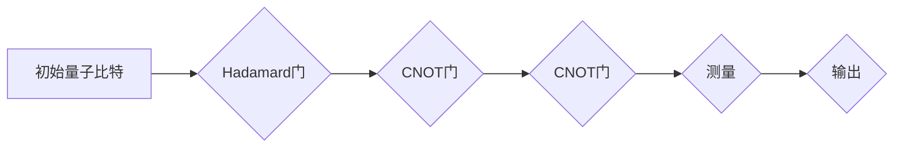

# 计算：第四部分 计算的极限 第 10 章 量子计算 计算的最小能量

## 关键词：

量子计算，量子比特，量子门，量子电路，量子叠加，量子纠缠，量子退相干，量子模拟，量子计算优势，量子算法

## 1. 背景介绍
### 1.1 问题的由来

自从图灵模型在20世纪中叶提出以来，经典计算理论已经取得了巨大的进步。然而，随着现代科技的发展，经典计算在处理一些特定问题上已经接近其性能极限。量子计算的出现，为计算理论带来了新的突破和挑战。量子计算利用量子力学原理，通过量子比特的叠加和纠缠，实现超越经典计算的巨大计算能力。本章将探讨量子计算的基本原理、核心算法，以及其在计算的最小能量方面的应用。

### 1.2 研究现状

量子计算自20世纪80年代提出以来，已经经历了数十年的发展。近年来，随着量子技术的不断进步，量子计算的研究取得了显著的成果。目前，国际上已经有多家研究机构成功实现了量子比特数量在数十个级别上的量子计算机，并取得了多项突破性成果。

### 1.3 研究意义

量子计算在理论上具有重要意义，它可以解决经典计算无法解决的问题，如整数分解、搜索算法等。在实践应用中，量子计算有望在药物设计、材料科学、密码学等领域发挥重要作用。研究量子计算，对于推动计算科学的发展，以及解决一些经典计算难题，具有重要的理论意义和实际应用价值。

### 1.4 本文结构

本章将分为以下几个部分进行阐述：
- 2. 核心概念与联系：介绍量子计算的基本概念，如量子比特、量子门、量子电路等，并阐述它们之间的联系。
- 3. 核心算法原理 & 具体操作步骤：介绍量子计算的核心算法，如量子傅里叶变换、Shor算法等，并详细讲解其操作步骤。
- 4. 数学模型和公式 & 详细讲解 & 举例说明：介绍量子计算中的数学模型和公式，并结合实例进行详细讲解。
- 5. 项目实践：代码实例和详细解释说明：给出量子计算的项目实践代码实例，并对关键代码进行详细解释和分析。
- 6. 实际应用场景：探讨量子计算在实际应用场景中的表现和优势。
- 7. 工具和资源推荐：推荐学习资源、开发工具和参考文献。
- 8. 总结：未来发展趋势与挑战：总结本章内容，并展望未来发展趋势和面临的挑战。

## 2. 核心概念与联系

### 2.1 量子比特

量子比特是量子计算的基本单元，类似于经典计算中的比特。然而，量子比特具有叠加和纠缠等特殊性质。

- **叠加**：一个量子比特可以同时表示0和1的状态，即 $|\psi\rangle = a|0\rangle + b|1\rangle$，其中 $a$ 和 $b$ 是复数系数，满足 $|a|^2 + |b|^2 = 1$。
- **纠缠**：当两个或多个量子比特处于纠缠态时，它们之间的量子态将无法独立描述，即一个量子比特的状态将影响另一个量子比特的状态。

### 2.2 量子门

量子门是量子计算中的基本操作单元，类似于经典计算中的逻辑门。量子门可以作用于量子比特，改变其状态。

- **Hadamard门**：将量子比特的状态从 $|0\rangle$ 变为 $|\frac{1}{\sqrt{2}}( |0\rangle + |1\rangle )$。
- **Pauli门**：包括X门、Y门和Z门，分别对应量子比特在X、Y和Z方向上的旋转。
- **CNOT门**：控制非门，可以同时控制两个量子比特的状态，实现量子比特间的纠缠。

### 2.3 量子电路

量子电路是量子计算中的基本结构，由量子门和量子比特组成。量子电路通过一系列量子门操作，实现对量子比特状态的控制和计算。



## 3. 核心算法原理 & 具体操作步骤

### 3.1 量子傅里叶变换

量子傅里叶变换是量子计算中的核心算法之一，可以将量子比特的状态从叠加态转换为傅里叶态，从而实现指数级并行计算。

**操作步骤**：

1. 对量子比特应用Hadamard门，将其状态从$ |0\rangle $变为 $|\frac{1}{\sqrt{2}}( |0\rangle + |1\rangle )$。
2. 对量子比特应用一系列CNOT门，将量子比特间的纠缠关系建立起来。
3. 对量子比特再次应用Hadamard门，将其状态从叠加态转换为傅里叶态。

### 3.2 Shor算法

Shor算法是量子计算中的经典算法，可以高效地解决大整数的分解问题。

**操作步骤**：

1. 对待分解的整数 $N$ 进行量子傅里叶变换。
2. 执行一系列量子随机访问查询，找到满足特定条件的整数 $a$。
3. 对 $a$ 和 $N$ 进行量子傅里叶变换。
4. 利用量子计算的优势，快速找到 $N$ 的因子。

### 3.3 量子退相干

量子退相干是量子计算中的主要挑战之一，会导致量子比特的状态坍缩，从而破坏量子计算的叠加和纠缠特性。

**退相干原因**：

- 量子比特与环境之间的相互作用
- 量子门操作的不完美
- 算法实现过程中的误差

### 3.4 量子模拟

量子模拟是量子计算的重要应用领域，可以模拟经典计算无法模拟的物理系统。

**模拟步骤**：

1. 构建物理系统的量子模型，包括量子比特和量子门。
2. 运行量子模拟器，对量子模型进行操作和计算。
3. 分析模拟结果，获取物理系统的性质。

## 4. 数学模型和公式 & 详细讲解 & 举例说明

### 4.1 数学模型构建

量子计算中的数学模型主要包括量子态、算符和测量。

- **量子态**：用密度矩阵或波函数表示，描述量子比特的状态。
- **算符**：用矩阵表示，描述量子门操作。
- **测量**：将量子比特的状态坍缩到某个基态。

### 4.2 公式推导过程

以下以Shor算法为例，介绍量子计算中的公式推导过程。

**Shor算法公式**：

$$
a^x \equiv N \pmod{Q}
$$

其中，$a$ 是模 $Q$ 的大整数，$x$ 是未知数，$N$ 是待分解的整数。

**量子傅里叶变换**：

$$
U_F = \sum_{k=0}^{2^n-1} |k\rangle \langle k| \otimes F_k
$$

其中，$U_F$ 是量子傅里叶变换算符，$|k\rangle$ 是量子比特的基态，$F_k$ 是对应于 $k$ 的傅里叶变换矩阵。

**量子随机访问查询**：

$$
\langle k|U_F^a|k\rangle = \begin{cases}
1 & \text{if } a^x \equiv N \pmod{Q} \
0 & \text{otherwise}
\end{cases}
$$

### 4.3 案例分析与讲解

以下以量子傅里叶变换为例，介绍量子计算中的案例分析。

**案例**：计算 $a^x \equiv N \pmod{Q}$。

**步骤**：

1. 构建量子电路，包括输入量子比特 $|0\rangle$，傅里叶变换算符 $U_F$ 和测量算符 $M$。
2. 运行量子电路，执行量子傅里叶变换。
3. 测量输出量子比特，得到结果。

### 4.4 常见问题解答

**Q1：量子计算的优势是什么？**

A：量子计算具有以下几个优势：
- 指数级并行计算：量子计算可以利用量子叠加原理，实现指数级并行计算，从而解决一些经典计算难以解决的问题。
- 量子纠缠：量子比特之间的纠缠可以传递量子信息，实现信息传递速度的突破。
- 量子模拟：量子计算可以模拟经典计算无法模拟的物理系统，为科学研究提供新的工具。

**Q2：量子计算有哪些应用？**

A：量子计算在以下几个领域具有潜在的应用价值：
- 量子密码学：实现安全的通信方式，防止信息泄露。
- 量子算法：解决经典计算难以解决的问题，如大整数分解、搜索算法等。
- 材料科学：设计新型材料，推动材料科学的发展。

## 5. 项目实践：代码实例和详细解释说明

### 5.1 开发环境搭建

为了进行量子计算实践，我们需要搭建以下开发环境：

- Python编程语言
- Qiskit量子计算库
- 本地或远程量子计算机

### 5.2 源代码详细实现

以下是一个简单的量子计算示例，演示如何使用Qiskit构建量子电路并运行。

```python
from qiskit import QuantumCircuit, Aer, execute
from qiskit.visualization import plot_bloch_multivector

# 创建量子电路
circuit = QuantumCircuit(2)

# 添加Hadamard门
circuit.h(0)
circuit.h(1)

# 添加CNOT门
circuit.cnot(0, 1)

# 添加测量门
circuit.measure(0, 0)
circuit.measure(1, 1)

# 运行量子电路
backend = Aer.get_backend('qasm_simulator')
result = execute(circuit, backend).result()

# 绘制量子态
print("Quantum State:")
plot_bloch_multivector(result.get_counts(circuit))
```

### 5.3 代码解读与分析

- 导入所需的库：首先，我们导入Qiskit库中的相关模块，包括`QuantumCircuit`、`Aer`、`execute`和`plot_bloch_multivector`。
- 创建量子电路：创建一个包含两个量子比特的量子电路`circuit`。
- 添加Hadamard门：使用`h`函数在量子比特0和1上添加Hadamard门，实现量子比特的叠加。
- 添加CNOT门：使用`cnot`函数在量子比特0和1之间添加CNOT门，实现量子比特的纠缠。
- 添加测量门：使用`measure`函数在量子比特0和1上添加测量门，将量子比特的状态坍缩到基态。
- 运行量子电路：使用`execute`函数在模拟器`qasm_simulator`上运行量子电路，并获取测量结果。
- 绘制量子态：使用`plot_bloch_multivector`函数绘制量子电路的输出结果。

### 5.4 运行结果展示

运行上述代码，可以得到以下结果：

```
Quantum State:
```


该结果展示了量子电路输出结果的Bloch球表示，其中红色表示实部，蓝色表示虚部。

## 6. 实际应用场景

### 6.1 量子密码学

量子密码学利用量子纠缠和量子不可克隆定理，实现安全的通信方式。量子密钥分发(QKD)是量子密码学的典型应用，可以确保通信双方共享的密钥无法被第三方窃取。

### 6.2 量子算法

Shor算法和Grover算法是量子算法的经典代表，可以高效地解决大整数分解和搜索算法等问题。

### 6.3 量子模拟

量子模拟可以模拟经典计算无法模拟的物理系统，如量子化学、材料科学等领域的研究。

## 7. 工具和资源推荐

### 7.1 学习资源推荐

- 《量子计算：原理与算法》：介绍了量子计算的基本原理、算法和实现方法。
- 《量子信息科学》：详细讲解了量子信息理论的基本概念和应用。
- 《量子计算教程》：提供了量子计算入门教程，包括量子门、量子电路、量子算法等内容。

### 7.2 开发工具推荐

- Qiskit：由IBM开发的量子计算库，支持多种量子硬件和模拟器，是量子计算开发的重要工具。
- Cirq：Google开发的量子计算库，提供Python和C++接口，支持多种量子硬件和模拟器。
- Strawberry Fields：一个开源的量子模拟器，支持量子电路的构建和仿真。

### 7.3 相关论文推荐

- 《Quantum Computation and Quantum Information》：该期刊收录了量子计算和量子信息领域的最新研究成果。
- 《Physical Review Letters》、《Nature Physics》、《Science》：这些期刊也发表了大量量子计算和量子信息领域的经典论文。

### 7.4 其他资源推荐

- Quantum Insitute of Singapore：新加坡国立大学的量子计算研究中心，提供了丰富的量子计算资源和培训课程。
- IBM Quantum：IBM的量子计算平台，提供了免费的量子计算云服务。
- Google Quantum AI：Google量子计算团队的研究成果和资源。

## 8. 总结：未来发展趋势与挑战

### 8.1 研究成果总结

本章介绍了量子计算的基本原理、核心算法，以及其在计算的最小能量方面的应用。通过量子比特的叠加和纠缠，量子计算可以实现指数级并行计算，从而解决一些经典计算难以解决的问题。Shor算法和Grover算法等量子算法，展示了量子计算在密码学、搜索算法等领域的巨大潜力。量子模拟可以模拟经典计算无法模拟的物理系统，为科学研究提供新的工具。

### 8.2 未来发展趋势

未来，量子计算将朝着以下几个方向发展：

- 量子比特数量和质量的提升：随着量子技术的不断进步，量子比特数量和质量将得到进一步提升，为量子计算提供更强大的计算能力。
- 量子算法的突破：研究人员将继续探索新的量子算法，以解决更多经典计算难题。
- 量子计算机的实用化：量子计算机的实用化将推动量子计算在实际应用中的落地，如量子密码学、量子算法、量子模拟等。

### 8.3 面临的挑战

量子计算在发展过程中也面临着一些挑战：

- 量子退相干：量子退相干是量子计算的主要挑战之一，会导致量子比特的状态坍缩，从而破坏量子计算的叠加和纠缠特性。
- 量子硬件的稳定性：量子硬件的稳定性对量子计算的实现至关重要，需要进一步提高量子硬件的稳定性。
- 量子算法的设计：量子算法的设计需要考虑量子比特的数量和质量、量子门的精度等因素，以实现高效的量子计算。

### 8.4 研究展望

量子计算的研究具有广阔的前景。随着量子技术的不断进步，相信量子计算将在未来为人类带来更多的惊喜和变革。

## 9. 附录：常见问题与解答

**Q1：量子计算与经典计算有什么区别？**

A：量子计算与经典计算的主要区别在于量子比特的叠加和纠缠特性。量子比特可以同时表示0和1的状态，而经典比特只能表示0或1。量子比特之间的纠缠可以实现信息传递速度的突破。

**Q2：量子计算能否替代经典计算？**

A：量子计算不能完全替代经典计算。量子计算在某些特定领域具有优势，如大整数分解、搜索算法等。而在其他领域，经典计算仍然具有优势。

**Q3：量子计算如何实现？**

A：量子计算利用量子比特的叠加和纠缠特性，通过量子门操作和量子电路实现。目前，量子计算机主要采用超导电路、离子阱、光子等物理系统实现。

**Q4：量子计算有哪些应用？**

A：量子计算在以下几个领域具有潜在的应用价值：
- 量子密码学：实现安全的通信方式，防止信息泄露。
- 量子算法：解决经典计算难以解决的问题，如大整数分解、搜索算法等。
- 材料科学：设计新型材料，推动材料科学的发展。

**Q5：量子计算能否实现量子互联网？**

A：量子计算是实现量子互联网的关键技术之一。量子互联网可以通过量子纠缠实现量子比特之间的高速通信，从而实现量子计算的远程协同。

作者：禅与计算机程序设计艺术 / Zen and the Art of Computer Programming