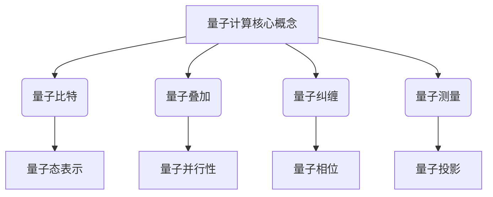
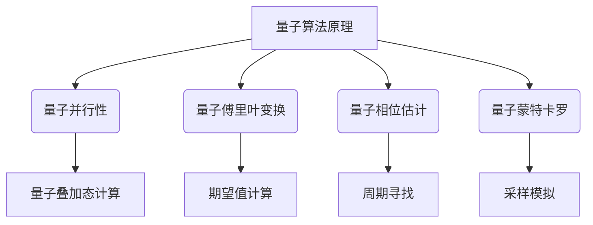

# 计算：第四部分 计算的极限 第 10 章 量子计算 量子优势

## 1. 背景介绍

### 1.1 问题的由来

在过去几十年中，计算机科学的发展主要依赖于半导体技术的进步。随着摩尔定律的日益失效,传统的基于硅的计算机架构面临着严峻的挑战。为了突破这一瓶颈,量子计算机应运而生,它利用量子力学的奇特性质,为计算机科学带来了全新的发展机遇。

量子计算的核心思想是利用量子态的叠加和纠缠等独特性质,来执行一种全新的计算模式。与经典计算机不同,量子计算机可以同时处理多个量子态的叠加,从而在特定问题上展现出惊人的计算优势。

然而,构建一台实用的量子计算机并非易事。它需要解决诸多技术挑战,如量子态的制备、操控和测量、量子纠错等。尽管如此,量子计算的巨大潜力仍然吸引着全球科学家的不懈努力。

### 1.2 研究现状

近年来,量子计算领域取得了长足的进步。谷歌、IBM、英特尔等科技巨头都在量子计算领域投入了大量资源。2019年,谷歌宣布实现了"量子优势",其53位量子计算机在特定任务上比最先进的经典计算机快上亿亿倍。

与此同时,量子算法的研究也取得了重大突破。例如,量子傅里叶变换、量子相位估计、量子蒙特卡罗方法等算法,在一些特定问题上展现出了显著的优势。

然而,实现通用量子计算机仍然是一个巨大的挑战。目前的量子计算机只能处理有限的量子比特,而且受到噪声和量子去相干的影响。因此,发展更加可靠和可扩展的量子硬件和软件架构,是当前研究的重点方向。

### 1.3 研究意义

量子计算的研究对于推动科技进步具有重大意义。它不仅有望解决一些经典计算无法有效解决的难题,如整数分解、量子化学模拟等,还可能在人工智能、材料科学、金融建模等领域产生深远影响。

此外,量子计算的发展也将促进量子信息科学的整体进步,包括量子通信、量子密码学等相关领域。它们将为我们带来更加安全、高效的信息处理和传输方式。

因此,量子计算的研究不仅是一项具有挑战性的科学探索,更是一个可能改变未来科技格局的关键领域。

### 1.4 本文结构

本文将全面介绍量子计算的核心概念、算法原理、数学模型,并通过实际案例和代码实现,深入探讨量子计算的优势和应用前景。文章结构如下:

1. 背景介绍
2. 核心概念与联系
3. 核心算法原理与具体操作步骤
4. 数学模型和公式详细讲解与举例说明
5. 项目实践:代码实例和详细解释说明
6. 实际应用场景
7. 工具和资源推荐
8. 总结:未来发展趋势与挑战
9. 附录:常见问题与解答

## 2. 核心概念与联系

量子计算的核心概念包括量子比特(qubit)、量子叠加、量子纠缠和量子测量等。这些概念与经典计算有着根本的区别,也是量子计算展现出巨大计算优势的基础。



### 2.1 量子比特(Qubit)

量子比特是量子计算的基本单位,相当于经典计算中的比特。但与经典比特只能取0或1不同,量子比特可以处于0和1的叠加态,即同时具有0和1的性质。

量子比特的状态可以用一个复数的矢量来表示,例如$\alpha|0\rangle + \beta|1\rangle$,其中$\alpha$和$\beta$是复数,满足$|\alpha|^2 + |\beta|^2 = 1$。这种叠加态使量子比特可以同时编码多个状态,从而实现量子并行性。

### 2.2 量子叠加

量子叠加是指量子系统可以同时存在于多个量子态的线性叠加状态。例如,一个量子比特可以处于$\frac{1}{\sqrt{2}}|0\rangle + \frac{1}{\sqrt{2}}|1\rangle$的叠加态,同时具有0和1的性质。

量子叠加使得量子计算机可以同时处理多个输入,从而在某些问题上展现出惊人的并行计算能力。这种并行性不同于经典计算机的并行,后者只是在不同时间切换不同的输入。

### 2.3 量子纠缠

量子纠缠是指两个或多个量子系统之间存在着不可分割的相关性。纠缠态无法用单个量子系统的状态来描述,而必须将它们视为一个整体。

量子纠缠是量子计算机实现巨大计算优势的关键因素之一。利用量子纠缠,可以在量子算法中实现一些经典算法无法实现的操作,如量子傅里叶变换、量子相位估计等。

### 2.4 量子测量

量子测量是指对量子系统进行观测,从而获取其状态信息的过程。测量会使量子态发生坍缩,从叠加态坍缩到特定的基态。

在量子计算中,测量是获取计算结果的关键步骤。但由于测量的随机性,量子算法通常需要多次运行,并对结果进行统计分析,以获取期望的输出。

这些核心概念相互关联、相辅相成,共同构建了量子计算的理论基础。掌握这些概念,对于理解量子计算的工作原理和算法设计至关重要。

## 3. 核心算法原理与具体操作步骤

量子计算算法的设计原理与经典算法存在根本差异。它们利用量子力学的独特性质,如量子叠加、量子纠缠等,在特定问题上展现出惊人的计算优势。



### 3.1 算法原理概述

#### 3.1.1 量子并行性

量子并行性是量子算法展现计算优势的核心原理之一。由于量子比特可以处于叠加态,因此量子计算机可以同时对多个输入进行操作,实现并行计算。

例如,在量子搜索算法中,输入被编码到量子态的叠加中,算法可以同时对所有可能的解进行操作,从而大大加快了搜索速度。

#### 3.1.2 量子傅里叶变换

量子傅里叶变换(QFT)是量子算法中一种重要的子程序,它可以高效地计算一个量子态的傅里叶变换。QFT在许多量子算法中扮演着关键角色,如素数检测、相位估计等。

#### 3.1.3 量子相位估计

量子相位估计是一种用于估计一个幺正算子的特征值的算法。它是许多重要量子算法的基础,如整数分解、量子模拟等。相位估计算法利用QFT和控制量子线路,可以高精度地近似特征值。

#### 3.1.4 量子蒙特卡罗

量子蒙特卡罗方法是一种利用量子计算机进行随机采样和模拟的算法范式。它可以应用于各种问题,如量子化学模拟、机器学习等。相比经典蒙特卡罗方法,量子版本可以提供更高的采样效率和准确性。

### 3.2 算法步骤详解

以量子相位估计算法为例,我们详细介绍其工作原理和具体步骤。

#### 3.2.1 问题描述

给定一个幺正算子$U$和一个量子态$|\psi\rangle$,目标是估计$U$关于$|\psi\rangle$的特征值$e^{2\pi i\phi}$,其中$\phi \in [0,1)$是一个未知的相位。

#### 3.2.2 算法步骤

1. **初始化**:准备一个$(n+m)$个量子比特的量子态$|0\rangle^{\otimes n}|\psi\rangle$,其中$n$个辅助比特用于存储相位估计值,$m$个比特编码$|\psi\rangle$。

2. **量子傅里叶变换**:对辅助比特应用QFT,得到$\frac{1}{2^{n/2}}\sum_{k=0}^{2^n-1}|k\rangle|\psi\rangle$。

3. **控制幺正算子**:对每一个基态$|k\rangle$,应用$U^{2^mk}$的控制门操作,得到$\frac{1}{2^{n/2}}\sum_{k=0}^{2^n-1}e^{2\pi i k\phi 2^m}|k\rangle|\psi\rangle$。

4. **反向QFT**:对辅助比特应用反向QFT,得到$\sum_{\tilde{\phi}}f(\tilde{\phi}-\phi)|\tilde{\phi}\rangle|\psi\rangle$,其中$f$是一个周期为$2^{-m}$的函数,峰值位于$\tilde{\phi}=\phi$处。

5. **测量**:测量辅助比特,以$\Omega(1/\epsilon)$的概率得到一个$\epsilon$精度的$\phi$的近似值$\tilde{\phi}$。

该算法的时间复杂度为$O(n^3)$,其中$n$是辅助比特的数目,决定了相位估计的精度。通过反复运行算法并取中位数,可以进一步提高精度。

### 3.3 算法优缺点

量子相位估计算法展现出了量子计算的巨大优势,但也存在一些局限性。

**优点**:

- 高效性:相比经典算法的$O(1/\epsilon)$复杂度,量子版本只需$O(\log(1/\epsilon))$就可以达到同样的精度。
- 广泛应用:相位估计是许多重要量子算法的基础,如整数分解、量子模拟等。

**缺点**:

- 量子错误累积:由于量子纠错的困难,算法过程中的噪声会导致错误的积累,影响结果的准确性。
- 量子硬件要求:需要足够多的量子比特和高保真度的量子门操作,对量子硬件提出了很高的要求。

### 3.4 算法应用领域

量子相位估计算法及其变种在多个领域都有重要应用,包括但不限于:

- **整数分解**:通过估计模运算的周期,可以高效地分解大整数,从而破解RSA等加密系统。
- **量子化学模拟**:利用相位估计来求解分子的能量本征值,可以高效地模拟量子化学过程。
- **线性系统求解**:可以用于快速求解一些特殊的线性方程组,如量子线性系统算法。
- **机器学习**:量子相位估计可以加速一些机器学习算法的训练过程,如量子主成分分析、量子支持向量机等。

总的来说,量子相位估计算法是量子计算中一个非常通用和重要的子程序,它为解决一些经典算法难以高效处理的问题提供了新的途径。

## 4. 数学模型和公式详细讲解与举例说明

量子计算的理论基础建立在量子力学之上,因此数学模型和公式在量子算法的描述和分析中扮演着关键角色。

```mermaid
graph TD
    A[数学模型和公式] --> B(量子态表示)
    A --> C(量子门操作)
    A --> D(量子测量)
    A --> E(量子复杂度)
    B --> F[矢量和张量]
    C --> G[酉矩阵]