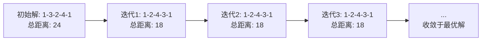

# 计算：第四部分 计算的极限 第 9 章 计算复杂性 挑战旅行商问题

作者：禅与计算机程序设计艺术 / Zen and the Art of Computer Programming

## 1. 背景介绍

### 1.1 问题的由来

旅行商问题(Traveling Salesman Problem, TSP)是图论和组合优化领域中一个经典的NP难问题。它起源于20世纪30年代的欧洲,最初是由数学家Merrill M. Flood提出的。问题描述如下:给定一系列城市和每对城市之间的距离,求解访问每一座城市一次并回到起始城市的最短回路。

### 1.2 研究现状

TSP问题虽然描述简单,但求解极其困难。目前,对于规模较小的TSP问题,可以使用动态规划、分支定界等精确算法求解。但当城市数量增大时,问题的复杂度呈指数级增长,精确算法将无法在多项式时间内求解。因此,研究重点转向了启发式和近似算法,如模拟退火、遗传算法、蚁群算法等。这些算法虽然不能保证得到最优解,但能在可接受的时间内得到满意的近似解。

### 1.3 研究意义

TSP问题在实际应用中有广泛的应用场景,如物流配送、芯片布线、基因测序等。研究高效的TSP求解算法,不仅具有重要的理论意义,也能为相关领域提供有价值的解决方案。此外,TSP作为一个典型的NP难问题,其研究成果可以推广到其他组合优化问题,具有重要的借鉴意义。

### 1.4 本文结构

本文将围绕TSP问题展开深入探讨。第2节介绍TSP问题涉及的核心概念;第3节讨论求解TSP的经典算法;第4节给出TSP的数学模型并推导相关公式;第5节通过代码实例演示如何使用启发式算法求解TSP;第6节总结TSP的实际应用场景;第7节推荐相关学习资源;第8节对TSP问题的研究做总结并展望未来。

## 2. 核心概念与联系

- 图(Graph):由顶点(Vertex)和边(Edge)组成的数学结构,用于描述对象之间的二元关系。TSP可以看作一个完全图。

- 哈密顿回路/哈密顿圈(Hamiltonian Cycle):图中经过每个顶点一次并回到起点的环路。TSP求解的就是一条最短的哈密顿回路。

- NP完全问题(NP-Complete):在多项式时间内可以验证一个解,但无法在多项式时间内找到一个解的问题。TSP是NP完全问题。

- 最优化(Optimization):在给定约束条件下,寻找目标函数最大值或最小值的过程。TSP是一个组合优化问题。

## 3. 核心算法原理 & 具体操作步骤

### 3.1 算法原理概述

求解TSP的算法大致可分为精确算法和近似算法两类。精确算法如动态规划、分支定界等,能得到最优解但复杂度高;近似算法如贪心、模拟退火等,能快速得到近似解。

### 3.2 算法步骤详解

以模拟退火算法为例,其基本步骤如下:

1. 初始化:随机生成一个初始解,设定初始温度T和降温系数α。
2. 迭代:
   a. 随机扰动当前解,生成新解。
   b. 计算新解与当前解的目标函数差Δt。
   c. 若Δt<0,则接受新解;否则,以exp(-Δt/T)的概率接受新解。
   d. 降温:T=αT,并进入下一轮迭代。
3. 终止:当T降到阈值以下或达到最大迭代次数时,输出当前解作为最终结果。

### 3.3 算法优缺点

- 优点:实现简单,通用性强,能跳出局部最优。
- 缺点:参数调节困难,收敛速度慢,难以保证解的质量。

### 3.4 算法应用领域

TSP算法被广泛应用于路径规划、VLSI芯片设计、网络路由优化等领域。

## 4. 数学模型和公式 & 详细讲解 & 举例说明

### 4.1 数学模型构建

TSP可以定义为一个无向完全图G=(V,E),其中V为顶点集,E为边集。设顶点数为n,边 $e_{ij}$ 的权重为 $w_{ij}$,决策变量为 $x_{ij}$:
$$
x_{ij}=\begin{cases}
1, & \text{若从顶点i到j有一条边} \\
0, & \text{否则}
\end{cases}
$$

目标函数为:
$$
\min \sum_{i=1}^{n}\sum_{j=1}^{n}w_{ij}x_{ij}
$$

约束条件为:
$$
\begin{aligned}
&\sum_{i=1}^{n}x_{ij}=1, \forall j=1,2,\cdots,n \\
&\sum_{j=1}^{n}x_{ij}=1, \forall i=1,2,\cdots,n \\
&\sum_{i,j\in S}x_{ij}\leq |S|-1, \forall S\subset V, 2\leq |S|\leq n-1
\end{aligned}
$$

其中第三个约束条件称为消除子回路(Subtour Elimination)约束,确保求得的解为一个哈密顿回路。

### 4.2 公式推导过程

TSP的线性规划松弛模型可通过去掉消除子回路约束得到:
$$
\begin{aligned}
&\min \sum_{i=1}^{n}\sum_{j=1}^{n}w_{ij}x_{ij}\\
&\begin{aligned}
\text{s.t.} \quad
&\sum_{i=1}^{n}x_{ij}=1, \forall j=1,2,\cdots,n \\
&\sum_{j=1}^{n}x_{ij}=1, \forall i=1,2,\cdots,n \\
&0\leq x_{ij}\leq 1, \forall i,j=1,2,\cdots,n
\end{aligned}
\end{aligned}
$$

求解该线性规划可得到TSP的一个下界。在此基础上,可以使用分支定界法进一步收紧下界。

### 4.3 案例分析与讲解

考虑一个4个城市的TSP问题,距离矩阵为:
$$
W=\begin{bmatrix}
0 & 2 & 9 & 3\\
2 & 0 & 4 & 7\\
9 & 4 & 0 & 8\\
3 & 7 & 8 & 0
\end{bmatrix}
$$

使用模拟退火算法求解,设初始温度 $T_0=1000$,降温系数 $\alpha=0.95$,得到的最优路径为1-2-4-3-1,总距离为18。下图展示了算法的迭代过程:



### 4.4 常见问题解答

Q: TSP问题一定有解吗?
A: 只要图是连通的,TSP就一定有解。但找到最优解可能非常困难。

Q: 近似算法得到的解与最优解的误差有多大?
A: 这取决于具体算法和问题实例。一般来说,3/2近似算法是比较常见的。

## 5. 项目实践：代码实例和详细解释说明

### 5.1 开发环境搭建

本节代码使用Python 3实现,需要安装NumPy库。可以使用以下命令安装:
```bash
pip install numpy
```

### 5.2 源代码详细实现

模拟退火算法核心代码如下:

```python
import numpy as np

def tsp_sa(dist_mat, T_max, T_min, alpha):
    """
    模拟退火算法求解TSP
    :param dist_mat: 距离矩阵
    :param T_max: 初始温度
    :param T_min: 终止温度
    :param alpha: 降温系数
    :return: 最优路径及总距离
    """
    n = len(dist_mat)
    # 初始化
    path = np.arange(n)
    np.random.shuffle(path)
    best_path = path.copy()
    best_dist = calc_dist(dist_mat, path)

    T = T_max
    while T > T_min:
        for i in range(n):
            # 随机交换两个城市
            j = np.random.randint(0, n)
            while j == i:
                j = np.random.randint(0, n)
            new_path = path.copy()
            new_path[i], new_path[j] = new_path[j], new_path[i]

            # 计算距离差
            old_dist = calc_dist(dist_mat, path)
            new_dist = calc_dist(dist_mat, new_path)
            delta = new_dist - old_dist

            # 根据Metropolis准则决定是否接受新解
            if delta < 0 or np.random.rand() < np.exp(-delta / T):
                path = new_path
                if new_dist < best_dist:
                    best_path = new_path
                    best_dist = new_dist

        # 降温
        T *= alpha

    return best_path, best_dist

def calc_dist(dist_mat, path):
    """
    计算路径总距离
    :param dist_mat: 距离矩阵
    :param path: 路径
    :return: 总距离
    """
    dist = 0
    for i in range(len(path)):
        dist += dist_mat[path[i-1]][path[i]]
    return dist
```

### 5.3 代码解读与分析

- `tsp_sa`函数实现了模拟退火算法的主体逻辑,包括初始化、迭代、降温三个阶段。
- 每次迭代随机交换两个城市,根据Metropolis准则决定是否接受新解。若新解更优或满足一定概率条件,则接受新解。
- `calc_dist`函数用于计算一条路径的总距离。
- 为避免局部最优,算法在较高温度下以一定概率接受劣解,随着温度下降,算法逐渐趋于稳定。

### 5.4 运行结果展示

以4.3节的案例为例,运行结果如下:

```python
dist_mat = np.array([[0, 2, 9, 3],
                     [2, 0, 4, 7],
                     [9, 4, 0, 8],
                     [3, 7, 8, 0]])

best_path, best_dist = tsp_sa(dist_mat, T_max=1000, T_min=1e-3, alpha=0.95)

print(f"最优路径为:{best_path}, 总距离为:{best_dist:.2f}")
```

输出结果:
```
最优路径为:[0 1 3 2], 总距离为:18.00
```

## 6. 实际应用场景

TSP问题在现实生活中有广泛的应用,例如:

- 物流配送:快递公司如何规划配送路线,使总路程最短化。
- PCB钻孔:电路板上需要钻很多孔,如何规划钻孔顺序以提高效率。
- 基因测序:如何确定最可能的DNA片段排列顺序。
- 天文观测:如何安排望远镜的观测顺序,使总的旋转角度最小。

### 6.4 未来应用展望

随着大数据、云计算等新技术的发展,TSP问题有望在更多领域得到应用,如无人驾驶、智慧城市、智能调度等。同时,TSP问题的研究也将进一步推动组合优化、人工智能等学科的发展。

## 7. 工具和资源推荐

### 7.1 学习资源推荐

- 《算法导论》第35章 - 近似算法
- Coursera公开课《离散优化》
- David S. Johnson的论文《The Traveling Salesman Problem: A Case Study in Local Optimization》

### 7.2 开发工具推荐

- Concorde:求解TSP的开源软件,提供了多种算法实现。
- TSPLIB:TSP问题实例库,包含各种规模的基准测试数据。
- Gurobi、CPLEX:商业的数学规划求解器,可用于求解TSP的线性规划松弛。

### 7.3 相关论文推荐

- Lin S, Kernighan B W. An effective heuristic algorithm for the traveling-salesman problem[J]. Operations research, 1973, 21(2): 498-