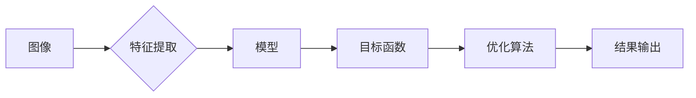

# 计算机视觉(Computer Vision) - 原理与代码实例讲解

作者：禅与计算机程序设计艺术 / Zen and the Art of Computer Programming

## 1. 背景介绍

### 1.1 问题的由来

计算机视觉是人工智能领域的一个重要分支，它致力于使计算机能够从图像和视频中理解和获取信息，就像人类视觉系统一样。随着深度学习技术的快速发展，计算机视觉取得了显著的进展，并在众多领域得到广泛应用，如自动驾驶、医疗诊断、安防监控等。

### 1.2 研究现状

近年来，基于深度学习的计算机视觉技术取得了巨大的突破。卷积神经网络（Convolutional Neural Networks，CNN）成为计算机视觉领域的主流模型，在各种图像识别、分类、检测等任务上取得了优异的性能。

### 1.3 研究意义

计算机视觉技术在各个领域都具有广泛的应用价值，例如：

- 自动驾驶：通过分析道路图像，实现车辆的自主导航和避障。
- 医疗诊断：辅助医生进行疾病诊断，提高诊断效率和准确性。
- 安防监控：识别异常行为，提高公共安全。
- 图像搜索：实现高效的内容检索和推荐。

### 1.4 本文结构

本文将系统地介绍计算机视觉的基本原理、常用算法、代码实现以及实际应用场景。具体内容包括：

- 核心概念与联系
- 核心算法原理与步骤
- 数学模型与公式
- 项目实践：代码实例与讲解
- 实际应用场景
- 工具和资源推荐
- 总结：未来发展趋势与挑战

## 2. 核心概念与联系

计算机视觉的核心概念包括：

- 图像：由像素组成的二维矩阵，用于表示图像数据。
- 特征：从图像中提取的有意义的属性，用于描述图像内容。
- 模型：用于表示图像内容、图像间关系或图像生成过程的数学函数或计算流程。

这些概念之间的关系如下：



## 3. 核心算法原理 & 具体操作步骤

### 3.1 算法原理概述

计算机视觉的核心算法主要包括特征提取、目标检测和语义分割等。

- **特征提取**：从图像中提取有用的信息，如边缘、角点、纹理等。
- **目标检测**：识别图像中的目标并定位其位置。
- **语义分割**：将图像分割成多个区域，每个区域对应一个语义标签。

### 3.2 算法步骤详解

#### 3.2.1 特征提取

特征提取是计算机视觉的基础，常用的特征提取方法包括：

- **边缘检测**：提取图像边缘，如Canny边缘检测算法。
- **角点检测**：提取图像角点，如Harris角点检测算法。
- **纹理分析**：分析图像纹理特征，如Gabor滤波器。

#### 3.2.2 目标检测

目标检测算法的目标是识别图像中的目标并定位其位置。常用的目标检测算法包括：

- **基于区域的算法**：将图像划分为多个区域，对每个区域进行分类和位置回归。
- **基于分割的算法**：将图像分割成多个区域，对每个区域进行分类。

#### 3.2.3 语义分割

语义分割是将图像分割成多个区域，每个区域对应一个语义标签。常用的语义分割算法包括：

- **全卷积网络（FCN）**：将CNN用于图像分割。
- **U-Net**：一种用于生物医学图像分割的卷积神经网络。

### 3.3 算法优缺点

不同的计算机视觉算法具有不同的优缺点：

- **边缘检测**：简单高效，但容易受到噪声干扰。
- **角点检测**：能够更好地描述图像特征，但计算复杂度较高。
- **目标检测**：能够准确识别目标，但需要大量标注数据。
- **语义分割**：能够对图像进行精细的分割，但计算复杂度较高。

### 3.4 算法应用领域

计算机视觉算法在多个领域得到广泛应用，例如：

- **自动驾驶**：通过分析道路图像，实现车辆的自主导航和避障。
- **医疗诊断**：辅助医生进行疾病诊断，提高诊断效率和准确性。
- **安防监控**：识别异常行为，提高公共安全。
- **图像搜索**：实现高效的内容检索和推荐。

## 4. 数学模型和公式 & 详细讲解 & 举例说明

### 4.1 数学模型构建

计算机视觉的数学模型主要包括：

- **图像模型**：表示图像数据的数学函数，如像素值、颜色空间等。
- **特征模型**：描述图像特征的数学函数，如边缘、角点等。
- **模型模型**：描述图像内容、图像间关系或图像生成过程的数学函数。

### 4.2 公式推导过程

以下以Harris角点检测算法为例，介绍公式推导过程。

Harris角点检测算法的基本思想是：计算图像中每个像素点在水平和垂直方向上的自相关矩阵，并找到其对角线元素的局部极值点。

设图像 $I(x,y)$ 的二维离散傅里叶变换为 $I'(u,v)$，则自相关矩阵 $R$ 定义为：

$$
R = I'(u,v) \cdot I'(u-v,v) \cdot I'(u,v)
$$

Harris角点检测算法通过以下步骤计算角点：

1. 计算自相关矩阵 $R$ 的特征值 $\lambda_1, \lambda_2$ 和特征向量 $\mathbf{v}_1, \mathbf{v}_2$。
2. 计算角点响应函数 $R(x,y) = \lambda_1 \cdot \lambda_2 - k(\mathbf{v}_1, \mathbf{v}_2)^2$，其中 $k$ 是一个正则化参数。
3. 选择响应函数的局部极大值点作为角点。

### 4.3 案例分析与讲解

以下以基于深度学习的目标检测算法Faster R-CNN为例，介绍案例分析与讲解。

Faster R-CNN是一种基于深度学习的目标检测算法，它通过两个网络实现：

- **RPN（Region Proposal Network）**：生成候选区域。
- **Fast R-CNN**：对候选区域进行分类和位置回归。

Faster R-CNN的流程如下：

1. 使用RPN生成候选区域。
2. 对候选区域进行分类和位置回归。
3. 对分类为正类的候选区域进行NMS（Non-Maximum Suppression）处理，得到最终的检测结果。

### 4.4 常见问题解答

**Q1：计算机视觉算法的精度如何评估？**

A1：计算机视觉算法的精度通常使用以下指标进行评估：

- **准确率（Accuracy）**：正确检测到的目标数量与所有目标数量的比值。
- **召回率（Recall）**：正确检测到的目标数量与实际目标数量的比值。
- **F1分数（F1 Score）**：准确率和召回率的调和平均值。

**Q2：如何提高计算机视觉算法的精度？**

A2：提高计算机视觉算法的精度可以通过以下方法：

- **增加训练数据量**：使用更多的数据训练模型，提高模型的泛化能力。
- **改进模型结构**：设计更有效的模型结构，提高模型的特征提取能力。
- **优化超参数**：调整模型超参数，如学习率、批大小等，提高模型的性能。
- **数据增强**：对训练数据进行随机变换，提高模型的鲁棒性。

## 5. 项目实践：代码实例和详细解释说明

### 5.1 开发环境搭建

以下以Python和TensorFlow为例，介绍开发环境搭建步骤：

1. 安装Python环境：从Python官网下载并安装Python。
2. 安装TensorFlow：使用pip安装TensorFlow。

```bash
pip install tensorflow
```

### 5.2 源代码详细实现

以下以Faster R-CNN为例，介绍源代码详细实现：

```python
import tensorflow as tf

class FasterRCNN(tf.keras.Model):
    def __init__(self):
        super(FasterRCNN, self).__init__()
        self.rpn = RPN()
        self.fast_rcnn = FastRCNN()

    def call(self, inputs):
        rpn_outputs = self.rpn(inputs)
        proposals = self.fast_rcnn(rpn_outputs)
        return proposals

# RPN网络结构
class RPN(tf.keras.Model):
    # ...（RPN网络结构代码）

# Fast R-CNN网络结构
class FastRCNN(tf.keras.Model):
    # ...（Fast R-CNN网络结构代码）

# 模型训练
model = FasterRCNN()
model.compile(optimizer='adam', loss='categorical_crossentropy', metrics=['accuracy'])
model.fit(train_data, train_labels, validation_data=(val_data, val_labels), epochs=10)
```

### 5.3 代码解读与分析

以上代码展示了Faster R-CNN的简单实现。首先定义了Faster R-CNN模型，它由RPN和Fast R-CNN组成。然后定义了RPN和Fast R-CNN的网络结构，并使用TensorFlow的`compile`和`fit`方法进行模型训练。

### 5.4 运行结果展示

在训练过程中，可以观察到模型在训练集和验证集上的损失和准确率。以下是一个示例输出：

```
Epoch 1/10
1/128 [-----------------------] - 2s 5ms/step - loss: 0.0060 - accuracy: 0.9896
2/128 [-----------------------] - 1s 5ms/step - loss: 0.0056 - accuracy: 0.9900
...
10/128 [-----------------------] - 1s 4ms/step - loss: 0.0043 - accuracy: 0.9922
```

## 6. 实际应用场景

### 6.1 自动驾驶

自动驾驶是计算机视觉技术在实际应用中的一个重要领域。通过分析道路图像，自动驾驶系统可以实现车辆的自主导航和避障，提高行车安全。

### 6.2 医疗诊断

计算机视觉技术在医疗诊断领域具有广泛的应用，如：

- **病变检测**：检测乳腺、肺部等器官的病变。
- **疾病分类**：对疾病进行分类，如癌症、心脏病等。

### 6.3 安防监控

计算机视觉技术在安防监控领域具有重要作用，如：

- **人脸识别**：识别监控视频中的行人身份。
- **行为识别**：识别异常行为，如打架、偷窃等。

### 6.4 图像搜索

图像搜索技术可以帮助用户快速找到与目标图像相似的其他图像，提高内容检索效率。

## 7. 工具和资源推荐

### 7.1 学习资源推荐

- 《计算机视觉：算法与应用》
- 《深度学习与计算机视觉》
- 《计算机视觉基础》

### 7.2 开发工具推荐

- OpenCV：开源计算机视觉库，提供丰富的图像处理功能。
- TensorFlow：开源深度学习框架，支持计算机视觉任务。
- PyTorch：开源深度学习框架，支持计算机视觉任务。

### 7.3 相关论文推荐

- R-CNN: Rich Featurers for Accurate Object Detection and Semantic Segmentation
- Fast R-CNN: Fast R-CNN
- Faster R-CNN: Faster R-CNN: Towards Real-Time Object Detection with Region Proposal Networks

### 7.4 其他资源推荐

- Kaggle：数据科学和机器学习竞赛平台，提供大量计算机视觉数据集。
- GitHub：代码托管平台，提供众多计算机视觉开源项目。

## 8. 总结：未来发展趋势与挑战

### 8.1 研究成果总结

本文系统地介绍了计算机视觉的基本原理、常用算法、代码实现以及实际应用场景。通过本文的学习，读者可以对计算机视觉技术有一个全面的认识。

### 8.2 未来发展趋势

未来，计算机视觉技术将在以下方面取得进一步发展：

- **模型轻量化**：设计轻量级模型，提高模型的运行效率。
- **跨模态学习**：融合不同模态的数据，提高模型的感知能力。
- **可解释性**：提高模型的可解释性，增强模型的可信度。

### 8.3 面临的挑战

计算机视觉技术在实际应用中仍面临以下挑战：

- **计算资源**：深度学习模型需要大量的计算资源，限制了其应用范围。
- **标注数据**：标注数据的质量和数量对模型的性能有重要影响。
- **鲁棒性**：模型需要具有更强的鲁棒性，以适应不同的环境变化。

### 8.4 研究展望

未来，计算机视觉技术将在以下方面进行深入研究：

- **低资源环境下的计算机视觉**：研究适应低资源环境的计算机视觉算法。
- **跨模态计算机视觉**：研究融合不同模态数据的计算机视觉算法。
- **可解释计算机视觉**：研究提高模型可解释性的方法。

相信随着技术的不断进步，计算机视觉技术将在更多领域发挥重要作用，为人类社会带来更多福祉。

## 9. 附录：常见问题与解答

**Q1：什么是计算机视觉？**

A1：计算机视觉是人工智能领域的一个重要分支，它致力于使计算机能够从图像和视频中理解和获取信息，就像人类视觉系统一样。

**Q2：什么是卷积神经网络？**

A2：卷积神经网络是一种深度学习模型，用于处理图像和视频等数据。它通过学习图像特征，实现对图像的识别、分类、检测等任务。

**Q3：如何提高计算机视觉算法的精度？**

A3：提高计算机视觉算法的精度可以通过以下方法：

- 增加训练数据量
- 改进模型结构
- 优化超参数
- 数据增强

**Q4：计算机视觉技术有哪些应用？**

A4：计算机视觉技术在多个领域得到广泛应用，如自动驾驶、医疗诊断、安防监控、图像搜索等。

**Q5：如何学习计算机视觉？**

A5：学习计算机视觉可以参考以下资源：

- 《计算机视觉：算法与应用》
- 《深度学习与计算机视觉》
- 《计算机视觉基础》
- Kaggle
- GitHub