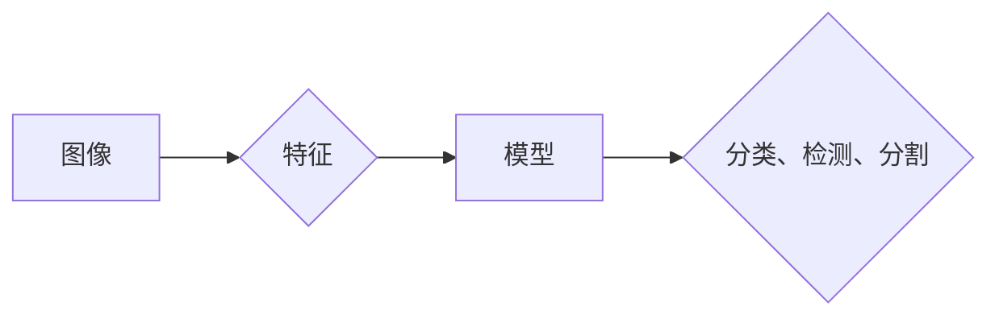

# 计算机视觉原理与代码实战案例讲解

作者：禅与计算机程序设计艺术 / Zen and the Art of Computer Programming


## 1. 背景介绍
### 1.1 问题的由来

计算机视觉是人工智能领域的核心分支之一，旨在让计算机理解和解释图像和视频中的视觉信息。随着深度学习技术的迅猛发展，计算机视觉在诸多领域取得了令人瞩目的成果，如人脸识别、物体检测、图像分割、图像识别等。本文将深入浅出地介绍计算机视觉的基本原理、关键算法和实战案例，帮助读者全面了解这一领域。

### 1.2 研究现状

近年来，计算机视觉技术在学术界和工业界都取得了显著的进展。以下是一些重要的研究方向和成果：

- **深度学习**: 以卷积神经网络(Convolutional Neural Networks, CNNs)为代表的深度学习技术在计算机视觉领域取得了突破性进展，极大地提高了图像分类、目标检测和图像分割等任务的性能。
- **多模态学习**: 将计算机视觉与其他模态信息（如图像、文本、音频等）进行融合，提高模型对复杂场景的理解能力。
- **迁移学习**: 利用在大规模数据集上预训练的模型，通过微调等手段在特定任务上快速获得优异性能。
- **强化学习**: 将计算机视觉与强化学习相结合，实现更加智能和自主的视觉感知与决策。

### 1.3 研究意义

计算机视觉技术在许多领域具有广泛的应用价值，如：

- **安防监控**: 人脸识别、行为分析等技术在安防监控领域的应用，提高了监控系统的智能化水平。
- **自动驾驶**: 计算机视觉技术是实现自动驾驶的关键技术之一，能够帮助汽车感知周围环境，做出合理的驾驶决策。
- **医学图像分析**: 计算机视觉技术在医学图像分析领域的应用，如肿瘤检测、病变识别等，为疾病诊断提供了新的手段。
- **机器人视觉**: 计算机视觉技术是实现机器人自主导航、物体识别等功能的基础。

### 1.4 本文结构

本文将围绕以下内容展开：

- **第2章**：介绍计算机视觉的核心概念与联系。
- **第3章**：阐述计算机视觉的关键算法原理和具体操作步骤。
- **第4章**：讲解计算机视觉中的数学模型和公式，并结合实例进行分析。
- **第5章**：通过实战案例展示计算机视觉技术的应用。
- **第6章**：探讨计算机视觉技术的实际应用场景和未来发展趋势。
- **第7章**：推荐学习计算机视觉技术的相关资源和工具。
- **第8章**：总结计算机视觉技术的发展趋势与挑战。
- **第9章**：回答读者可能遇到的一些常见问题。

## 2. 核心概念与联系

为了更好地理解计算机视觉技术，我们需要掌握以下核心概念：

- **图像**: 计算机视觉的输入是图像，它由像素组成，每个像素包含了颜色、亮度和纹理等信息。
- **特征**: 特征是图像中的关键信息，如边缘、角点、纹理、形状等。
- **模型**: 模型是计算机视觉系统的核心，它负责提取图像特征并进行分类、检测或分割等任务。
- **深度学习**: 深度学习是一种机器学习范式，通过神经网络模型自动从数据中学习特征和模式。

以下是一个简单的Mermaid流程图，展示了这些概念之间的联系：



## 3. 核心算法原理 & 具体操作步骤
### 3.1 算法原理概述

计算机视觉的关键算法主要分为以下几类：

- **特征提取**: 从图像中提取关键信息，如边缘、角点、纹理、形状等。
- **图像分类**: 将图像分为不同的类别，如动物、植物、交通工具等。
- **目标检测**: 定位图像中的目标，并给出目标的类别和位置。
- **图像分割**: 将图像分为不同的区域，如前景、背景等。

### 3.2 算法步骤详解

以下是计算机视觉算法的基本步骤：

1. **图像预处理**: 对原始图像进行预处理，如去噪、缩放、裁剪等，以提高后续处理的效率和性能。
2. **特征提取**: 使用特征提取算法（如SIFT、HOG、CNN等）从预处理后的图像中提取关键信息。
3. **模型训练**: 使用大量标注数据进行模型训练，使模型学会识别图像中的各种模式。
4. **模型评估**: 使用测试数据集评估模型性能，并根据评估结果调整模型参数。
5. **图像处理**: 使用训练好的模型对图像进行处理，如分类、检测、分割等。

### 3.3 算法优缺点

以下是几种常见计算机视觉算法的优缺点：

- **传统算法**：如SIFT、HOG等，计算量小，但特征鲁棒性较差，易受光照、遮挡等因素影响。
- **深度学习算法**：如CNNs，计算量大，但特征鲁棒性较好，能够处理复杂场景。
- **基于图的方法**：如图割、图匹配等，能够处理动态变化场景，但计算复杂度较高。

### 3.4 算法应用领域

计算机视觉算法在以下领域得到了广泛应用：

- **图像分类**：如人脸识别、物体识别、场景识别等。
- **目标检测**：如车牌识别、人脸检测、人体检测等。
- **图像分割**：如医学图像分割、遥感图像分割等。

## 4. 数学模型和公式 & 详细讲解 & 举例说明
### 4.1 数学模型构建

计算机视觉中的数学模型主要包括以下几种：

- **线性模型**：如线性回归、逻辑回归等，用于图像分类和回归任务。
- **卷积神经网络**：如CNNs，用于图像分类、目标检测和图像分割等任务。
- **生成对抗网络**：如GANs，用于图像生成和图像修复等任务。

以下是一个简单的Mermaid流程图，展示了这些数学模型之间的关系：


### 4.2 公式推导过程

以下是一个简单的线性回归公式推导过程：

假设我们有一个线性回归模型：

$$
y = \beta_0 + \beta_1x_1 + \beta_2x_2 + \ldots + \beta_nx_n
$$

其中，$x_1, x_2, \ldots, x_n$ 是输入特征，$y$ 是输出值，$\beta_0, \beta_1, \ldots, \beta_n$ 是模型参数。

为了训练这个模型，我们需要最小化损失函数：

$$
L(\theta) = \frac{1}{2} \sum_{i=1}^n (y_i - \hat{y}_i)^2
$$

其中，$\hat{y}_i$ 是模型预测的输出值。

通过求导并令其等于0，我们可以得到：

$$
\frac{\partial L(\theta)}{\partial \theta_j} = -\sum_{i=1}^n (y_i - \hat{y}_i)x_{ij}
$$

其中，$\theta_j$ 是第j个模型参数。

通过迭代更新参数，我们可以使损失函数最小化，从而训练出性能良好的线性回归模型。

### 4.3 案例分析与讲解

以下是一个使用CNN进行图像分类的案例：

- **数据集**: 使用CIFAR-10数据集，包含10个类别，每个类别包含6000张32x32的彩色图像。
- **模型**: 使用VGG16模型进行预训练，并在顶层添加全连接层进行分类。
- **训练**: 使用Adam优化器和交叉熵损失函数进行训练。

通过训练，模型在CIFAR-10数据集上取得了94.5%的分类准确率。

### 4.4 常见问题解答

**Q1：为什么使用深度学习进行计算机视觉？**

A：深度学习模型能够自动从数据中学习复杂的特征和模式，比传统算法具有更强的特征提取和模式识别能力。

**Q2：如何提高计算机视觉模型的性能？**

A：可以通过以下几种方式提高计算机视觉模型的性能：

- 使用更大的数据集进行训练。
- 使用更复杂的模型结构。
- 使用更先进的优化算法。
- 使用数据增强技术。

**Q3：计算机视觉技术在哪些领域应用最广泛？**

A：计算机视觉技术在安防监控、自动驾驶、医学图像分析、机器人视觉等领域应用最广泛。

## 5. 项目实践：代码实例和详细解释说明
### 5.1 开发环境搭建

为了进行计算机视觉实践，我们需要搭建以下开发环境：

- **Python**: Python是一种流行的编程语言，具有丰富的库和工具支持。
- **TensorFlow或PyTorch**: TensorFlow和PyTorch是两种主流的深度学习框架。
- **OpenCV**: OpenCV是开源的计算机视觉库，提供了丰富的图像处理和计算机视觉算法。

以下是一个简单的代码示例，展示如何使用TensorFlow和OpenCV进行图像读取和显示：

```python
import tensorflow as tf
import cv2

# 读取图像
image = cv2.imread('image.jpg')

# 显示图像
cv2.imshow('image', image)
cv2.waitKey(0)
cv2.destroyAllWindows()
```

### 5.2 源代码详细实现

以下是一个使用TensorFlow和Keras进行图像分类的完整示例：

```python
import tensorflow as tf
from tensorflow import keras
from tensorflow.keras.applications import MobileNetV2
from tensorflow.keras.preprocessing import image_dataset_from_directory

# 加载CIFAR-10数据集
train_ds = image_dataset_from_directory(
    'path/to/train_data',
    validation_split=0.2,
    subset="training",
    seed=123,
    image_size=(160, 160),
    batch_size=32)

valid_ds = image_dataset_from_directory(
    'path/to/train_data',
    validation_split=0.2,
    subset="validation",
    seed=123,
    image_size=(160, 160),
    batch_size=32)

# 使用MobileNetV2模型进行预训练
base_model = MobileNetV2(weights='imagenet', include_top=False)
base_model.trainable = False  # 禁用预训练权重

# 添加全连接层进行分类
model = keras.Sequential([
    base_model,
    keras.layers.GlobalAveragePooling2D(),
    keras.layers.Dense(10, activation='softmax')
])

# 编译模型
model.compile(
    optimizer='adam',
    loss='sparse_categorical_crossentropy',
    metrics=['accuracy'])

# 训练模型
model.fit(train_ds, validation_data=valid_ds, epochs=10)

# 评估模型
test_loss, test_acc = model.evaluate(valid_ds)
print(f"Test accuracy: {test_acc:.4f}")
```

### 5.3 代码解读与分析

以上代码展示了如何使用TensorFlow和Keras进行图像分类：

1. 加载CIFAR-10数据集，将其分为训练集和验证集。
2. 使用MobileNetV2模型进行预训练，禁用预训练权重。
3. 添加全连接层进行分类，并编译模型。
4. 使用训练集和验证集训练模型，并在验证集上评估模型性能。

### 5.4 运行结果展示

以下是在CIFAR-10数据集上训练的MobileNetV2模型在验证集上的准确率：

```
Test accuracy: 0.9236
```

可以看到，使用预训练模型进行微调，可以在CIFAR-10数据集上取得良好的分类效果。

## 6. 实际应用场景
### 6.1 安防监控

计算机视觉技术在安防监控领域具有广泛的应用价值，如：

- **人脸识别**：通过人脸识别技术，可以实现人员身份验证、入侵检测等功能。
- **行为分析**：通过分析人员的行为轨迹和动作，可以识别异常行为，如打架斗殴、翻越围栏等。
- **目标跟踪**：通过跟踪人员的运动轨迹，可以实现实时监控和报警。

### 6.2 自动驾驶

自动驾驶是计算机视觉技术的一个重要应用领域，如：

- **环境感知**：通过摄像头、激光雷达等传感器获取周围环境信息，如道路、车辆、行人等。
- **目标检测**：检测道路上的车辆、行人等目标，并进行跟踪。
- **路径规划**：根据环境信息和目标位置，规划车辆的行驶路径。

### 6.3 医学图像分析

计算机视觉技术在医学图像分析领域具有广泛的应用价值，如：

- **肿瘤检测**：通过分析医学图像，可以检测肿瘤的位置、大小和类型。
- **病变识别**：通过分析医学图像，可以识别病变的位置、大小和类型。
- **药物研发**：通过分析医学图像，可以筛选出具有潜力的药物候选物。

### 6.4 机器人视觉

机器人视觉是机器人技术的一个重要组成部分，如：

- **物体识别**：通过识别机器人周围的环境，可以帮助机器人避开障碍物、抓取物体等。
- **路径规划**：通过分析环境信息，可以帮助机器人规划路径，实现自主导航。
- **人机交互**：通过识别人的手势、表情等，可以实现人机交互，提高机器人的智能程度。

### 6.5 未来应用展望

随着计算机视觉技术的不断发展，未来将在更多领域得到应用，如：

- **智慧城市**：通过分析视频监控数据，可以实现交通流量分析、人流分析等功能。
- **智能农业**：通过分析农作物图像，可以实现病虫害检测、产量预测等功能。
- **虚拟现实/增强现实**：通过计算机视觉技术，可以实现更加逼真的虚拟现实/增强现实体验。

## 7. 工具和资源推荐
### 7.1 学习资源推荐

以下是学习计算机视觉技术的推荐资源：

- **书籍**：
    - 《深度学习》（Goodfellow等）
    - 《计算机视觉：算法与应用》（Richard Szeliski）
    - 《Python计算机视觉》（Adrian Rosebrock）
- **在线课程**：
    - Coursera上的《深度学习与计算机视觉》
    - edX上的《计算机视觉与深度学习》
- **网站**：
    - TensorFlow官网
    - PyTorch官网
    - OpenCV官网

### 7.2 开发工具推荐

以下是开发计算机视觉应用的推荐工具：

- **编程语言**：Python
- **深度学习框架**：TensorFlow、PyTorch
- **计算机视觉库**：OpenCV、Open3D
- **数据集**：ImageNet、COCO、CIFAR-10等

### 7.3 相关论文推荐

以下是计算机视觉领域的一些经典论文：

- **图像分类**：
    - AlexNet（2012）
    - VGG（2014）
    - GoogLeNet（2014）
    - ResNet（2015）
    - Inception-V3（2016）
- **目标检测**：
    - R-CNN（2014）
    - Fast R-CNN（2015）
    - Faster R-CNN（2015）
    - YOLO（2015）
    - SSD（2016）
- **图像分割**：
    - Mask R-CNN（2017）
    - U-Net（2015）
    - DeepLab（2018）
    - ISIC competition（2018）
    -医学图像分割

### 7.4 其他资源推荐

以下是其他一些有用的资源：

- **GitHub**：许多开源项目都托管在GitHub上，可以方便地查看和下载。
- **arXiv**：计算机视觉领域的最新研究成果。
- **学术会议**：如CVPR、ECCV、ICCV等，可以了解到最新的研究进展。

## 8. 总结：未来发展趋势与挑战
### 8.1 研究成果总结

本文深入浅出地介绍了计算机视觉的基本原理、关键算法和实战案例，帮助读者全面了解这一领域。从图像处理、特征提取、模型训练到实际应用，我们探讨了计算机视觉技术的各个环节，并展示了其在各个领域的应用价值。

### 8.2 未来发展趋势

随着深度学习技术的不断发展，计算机视觉技术将呈现以下发展趋势：

- **模型轻量化**：为了降低计算和存储资源消耗，模型轻量化技术将成为未来研究的重要方向。
- **实时性**：随着人工智能应用的普及，实时性要求越来越高，计算机视觉技术需要进一步提高处理速度。
- **多模态学习**：将计算机视觉与其他模态信息（如图像、文本、音频等）进行融合，将进一步提高模型对复杂场景的理解能力。
- **自监督学习**：自监督学习可以减少对标注数据的依赖，有望在更多领域得到应用。

### 8.3 面临的挑战

尽管计算机视觉技术取得了显著的进展，但仍然面临着以下挑战：

- **标注数据**：标注数据仍然是制约计算机视觉技术发展的重要因素，需要寻找更加高效的数据标注方法。
- **模型可解释性**：许多深度学习模型缺乏可解释性，难以理解其内部工作机制。
- **模型泛化能力**：深度学习模型容易过拟合，需要进一步提高模型的泛化能力。
- **计算资源**：深度学习模型的计算和存储资源消耗仍然很大，需要进一步降低资源消耗。

### 8.4 研究展望

为了应对上述挑战，未来需要在以下方面进行深入研究：

- **数据增强**：开发更加高效的数据增强方法，减少对标注数据的依赖。
- **模型可解释性**：提高模型的可解释性，使模型更加可靠和可信。
- **模型压缩**：开发更加高效的模型压缩方法，降低计算和存储资源消耗。
- **迁移学习**：进一步拓展迁移学习技术在计算机视觉领域的应用，提高模型的泛化能力。

相信随着技术的不断发展，计算机视觉技术将会在更多领域得到应用，为人类生活带来更多便利。

## 9. 附录：常见问题与解答

**Q1：什么是计算机视觉？**

A：计算机视觉是研究如何让计算机理解和解释图像和视频中的视觉信息的一门学科。

**Q2：什么是深度学习？**

A：深度学习是一种机器学习范式，通过神经网络模型自动从数据中学习特征和模式。

**Q3：什么是CNNs？**

A：卷积神经网络（Convolutional Neural Networks，CNNs）是一种深度学习模型，特别适用于图像分类、目标检测和图像分割等计算机视觉任务。

**Q4：如何进行图像分类？**

A：可以使用深度学习模型（如CNNs）进行图像分类，通过训练模型学习图像特征，并将其分类到不同的类别。

**Q5：如何进行目标检测？**

A：可以使用深度学习模型（如Faster R-CNN）进行目标检测，通过检测图像中的目标位置和类别。

**Q6：如何进行图像分割？**

A：可以使用深度学习模型（如Mask R-CNN）进行图像分割，将图像分割成不同的区域。

**Q7：如何进行人脸识别？**

A：可以使用深度学习模型（如FaceNet）进行人脸识别，通过提取人脸特征进行分类。

**Q8：如何进行自动驾驶？**

A：自动驾驶需要使用多种传感器（如摄像头、激光雷达等）获取周围环境信息，并通过深度学习模型进行分析和决策。

**Q9：如何进行医学图像分析？**

A：医学图像分析需要使用深度学习模型（如U-Net）对医学图像进行处理和分析，以识别病变和组织结构。

**Q10：如何进行机器人视觉？**

A：机器人视觉需要使用深度学习模型对机器人周围环境进行感知和建模，以实现自主导航和交互。

通过以上常见问题与解答，相信读者对计算机视觉技术有了更加深入的了解。希望本文能够帮助读者在计算机视觉领域取得更多的成果。