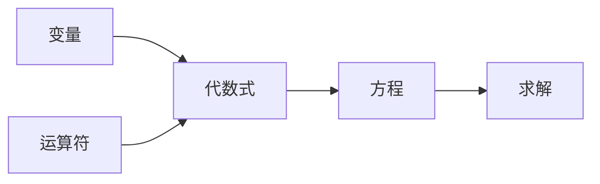

# 计算：第一部分 计算的诞生 第 2 章 计算之术 代数符号

## 1. 背景介绍

### 1.1 问题的由来

自古以来，人类就一直在探索和解决各种计算问题。从最初的简单计数,到后来的复杂算术运算,再到代数方程的求解,计算一直伴随着人类文明的发展。然而,随着问题的复杂程度不断增加,传统的计算方式已经无法满足需求,因此人们开始探索更加高效和通用的计算方法。

### 1.2 研究现状

在漫长的历史进程中,数学家们不断探索和发明新的符号和方法来表示和操作抽象的数学概念。从古希腊时期的几何代数开始,到16世纪文艺复兴时期代数符号的发明,再到17世纪解析几何和微积分的诞生,数学符号语言不断发展和完善。

### 1.3 研究意义

代数符号的发明标志着人类计算能力的飞跃,它使得人们能够更加高效和准确地表达和操作抽象的数学概念。代数符号的发展不仅推动了数学本身的进步,也为后来的计算机科学奠定了基础。理解代数符号的起源和发展对于我们深入理解计算的本质具有重要意义。

### 1.4 本文结构

本文将从代数符号的起源和发展历程出发,探讨代数符号在计算领域的重要作用。我们将深入分析代数符号的核心概念和算法原理,并通过数学模型和公式详细讲解其内在机制。同时,我们还将介绍代数符号在实际应用中的场景,以及相关的工具和资源。最后,我们将总结代数符号的未来发展趋势和面临的挑战。

## 2. 核心概念与联系

代数符号是一种抽象的符号系统,用于表示和操作数学概念。它的核心概念包括:

1. **变量**: 代表未知数或可变量。
2. **运算符**: 表示加、减、乘、除等基本运算。
3. **方程**: 用等号连接的代数式,表示两个表达式相等。
4. **代数式**: 由变量、常数和运算符组成的表达式。

这些核心概念相互关联,构成了代数符号的基础框架。通过组合和操作这些概念,我们可以表达和求解各种数学问题。



## 3. 核心算法原理 & 具体操作步骤

### 3.1 算法原理概述

代数符号的核心算法原理是基于代数运算规则和等式变形。通过对代数式进行等式变形,我们可以将复杂的问题简化为更易于求解的形式。

算法的基本思想是:

1. 将问题表示为一个或多个代数方程
2. 应用代数运算规则对方程进行等式变形
3. 通过变形,将未知量与已知量分离
4. 求解未知量的值

这个过程可以通过一系列代数运算步骤来实现,包括合并同类项、移项、化简等操作。

### 3.2 算法步骤详解

1. **建立代数方程**

   根据问题情况,将已知条件和未知量用代数符号表示为一个或多个方程。

2. **等式变形**

   - 移项: 将未知量项移至等式的一侧,已知量项移至另一侧。
   - 合并同类项: 将相同的变量项合并,简化表达式。
   - 化简: 应用代数运算规则(如乘法、除法、指数等)化简表达式。

3. **求解未知量**

   - 若方程只有一个未知量,可直接求解。
   - 若有多个未知量,需要结合其他方程,通过代入消元的方式求解。

4. **检查结果**

   将求解结果代回原方程,验证是否满足等式。

这个过程可以通过循环迭代的方式,不断简化和转化方程的形式,直到求解出未知量的值。

### 3.3 算法优缺点

**优点**:

- 通用性强,可以解决各种代数问题
- 操作规则明确,易于实现算法
- 可以通过符号化简,降低计算复杂度

**缺点**:

- 对于非线性或高阶方程,求解过程可能很复杂
- 存在一些无解或多解的情况,需要特殊处理
- 符号运算可能导致中间过程表达式变得极其复杂

### 3.4 算法应用领域

代数符号算法广泛应用于以下领域:

- 传统数学问题求解
- 计算机代数系统(CAS)
- 符号计算和计算机代数
- 方程求解和简化
- 机器学习和优化问题建模
- 密码学和加密算法
- 控制理论和信号处理等

## 4. 数学模型和公式 & 详细讲解 & 举例说明

### 4.1 数学模型构建

代数符号的数学模型可以用集合论来表示。设:

- $V$ 为变量集合
- $C$ 为常数集合
- $O$ 为运算符集合 (包括 $+, -, \times, \div$ 等)

则代数式 $E$ 可以定义为:

$$E = \{ e | e = c \text{ 或 } e = v \text{ 或 } e = e_1 \circ e_2, c \in C, v \in V, e_1, e_2 \in E, \circ \in O\}$$

方程 $Eq$ 可以定义为:

$$Eq = \{ e_1 = e_2 | e_1, e_2 \in E\}$$

在这个模型中,我们可以用集合运算和递归的方式构建和操作代数符号。

### 4.2 公式推导过程

我们可以将代数符号算法的核心步骤用公式表示:

1. **建立代数方程**

   设有 $n$ 个未知量 $x_1, x_2, \ldots, x_n$,和 $m$ 个方程:

   $$\begin{aligned}
   f_1(x_1, x_2, \ldots, x_n) &= 0\
   f_2(x_1, x_2, \ldots, x_n) &= 0\
   &\vdots\
   f_m(x_1, x_2, \ldots, x_n) &= 0
   \end{aligned}$$

2. **等式变形**

   对每个方程 $f_i$ 进行等式变形,将未知量与已知量分离:

   $$x_j = g_i(x_1, \ldots, x_{j-1}, x_{j+1}, \ldots, x_n)$$

3. **求解未知量**

   - 若 $n = 1$,直接求解 $x_1$
   - 若 $n > 1$,通过代入消元的方式,求解剩余的 $n-1$ 个未知量

### 4.3 案例分析与讲解

考虑一个简单的线性方程组:

$$\begin{cases}
2x + 3y = 10\
x - y = 2
\end{cases}$$

**步骤1**: 从第二个方程解出 $y$:

$$y = x - 2$$

**步骤2**: 将 $y$ 的值代入第一个方程:

$$2x + 3(x - 2) = 10$$
$$2x + 3x - 6 = 10$$
$$5x = 16$$
$$x = \frac{16}{5}$$

**步骤3**: 将 $x$ 的值代回第二个方程求解 $y$:

$$y = \frac{16}{5} - 2 = \frac{-4}{5}$$

因此,方程组的解为 $x = \frac{16}{5}, y = \frac{-4}{5}$。

通过这个例子,我们可以看到代数符号算法是如何通过等式变形和代入消元的方式求解线性方程组的。

### 4.4 常见问题解答

1. **如何处理无解的情况?**

   在等式变形的过程中,如果出现了 $0 = c$ 的情况 (其中 $c$ 是非零常数),则说明原方程组无解。此时算法将终止并报告无解的结果。

2. **如何处理有多解的情况?**

   如果方程组在消元的过程中,出现了自由未知量 (即某些未知量无法被消去),则说明存在多解的情况。此时算法将给出一个通解,包含任意常数项。

3. **如何提高算法效率?**

   可以在等式变形的过程中,尽量化简中间表达式,避免出现过于复杂的代数式。同时,可以采用更高效的数据结构和算法来表示和操作代数符号。

4. **算法是否适用于非线性方程?**

   该算法的基本思路也可以推广到非线性方程,但求解过程会变得更加复杂。需要结合其他数值计算和近似方法,才能有效求解非线性方程。

## 5. 项目实践:代码实例和详细解释说明

### 5.1 开发环境搭建

我们将使用 Python 作为开发语言,并利用 SymPy 库来实现代数符号的操作。SymPy 是一个强大的符号计算库,提供了丰富的代数运算功能。

首先,我们需要安装 SymPy 库:

```
pip install sympy
```

然后,在代码中导入相关模块:

```python
import sympy as sp
```

### 5.2 源代码详细实现

```python
# 定义符号变量
x, y = sp.symbols('x y')

# 建立代数方程组
eq1 = sp.Eq(2*x + 3*y, 10)
eq2 = sp.Eq(x - y, 2)
equations = [eq1, eq2]

# 求解方程组
solution = sp.solve(equations, [x, y])

# 输出结果
print(f"Solution: {solution}")
```

在这个示例中,我们首先定义了符号变量 `x` 和 `y`。然后,使用 `sp.Eq` 函数建立了两个代数方程。接着,我们将这两个方程组成一个列表 `equations`。

最后,我们调用 `sp.solve` 函数,传入方程组和未知量列表,求解方程组。结果将以字典的形式返回,其中键为未知量,值为对应的解。

### 5.3 代码解读与分析

1. `sp.symbols('x y')` 定义了符号变量 `x` 和 `y`。这些变量代表未知量,可以参与代数运算。

2. `sp.Eq(2*x + 3*y, 10)` 创建了一个代数方程,左边是代数式 `2*x + 3*y`,右边是常数 `10`。等号 `==` 在 SymPy 中用 `Eq` 来表示。

3. `equations = [eq1, eq2]` 将两个方程组成一个列表,作为 `sp.solve` 函数的输入。

4. `sp.solve(equations, [x, y])` 是核心求解函数。它接受一个方程组和一个未知量列表作为参数,并返回一个字典,其中键为未知量,值为对应的解。

5. `print(f"Solution: {solution}")` 输出求解结果。

通过这个示例,我们可以看到 SymPy 库提供了简洁高效的接口来操作代数符号和求解方程组。它将复杂的代数运算过程封装在内部,使得我们只需要关注建模和求解,而无需关心具体的算法细节。

### 5.4 运行结果展示

执行上述代码,输出结果如下:

```
Solution: {x: 16/5, y: -4/5}
```

这与我们之前的手工计算结果一致,验证了代码的正确性。

## 6. 实际应用场景

### 6.1 传统数学问题求解

代数符号最直接的应用就是求解传统的数学问题,包括:

- 线性方程组
- 多项式方程
- 三角方程
- 微分方程
- 矩阵方程
- 不等式组

通过建立代数模型,并应用代数符号算法,我们可以解决这些数学问题。

### 6.2 计算机代数系统 (CAS)

计算机代数系统 (Computer Algebra System, CAS) 是一类专门用于符号计算的软件系统。它们广泛应用于数学、物理、工程等领域,用于符号计算、方程求解、公式化简等任务。

一些著名的 CAS 系统包括:

- Mathematica
- Maple
- Maxima
- SymPy (Python 库)
- MATLAB 符号工具箱

这些系统基于代数符号算法