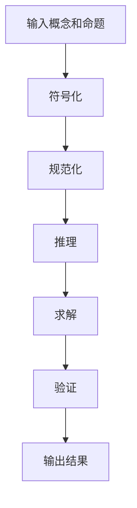

以下是根据您提供的标题和要求撰写的技术博客文章正文内容：

# 计算：第一部分 计算的诞生 第 3 章 莱布尼茨的计算之梦 人类思想字母表

## 1. 背景介绍

### 1.1 问题的由来

自古以来，人类就一直在探索思维和计算的奥秘。从最原始的手指计数,到后来的算盘、算筹,再到近代的机械计算器,计算工具的发展历程反映了人类对更高效、更强大计算能力的永无止境的追求。然而,所有这些计算工具都有一个共同的局限性:它们只能进行简单的数值计算,无法处理更加抽象和复杂的符号运算。

在17世纪,一位杰出的数学家和哲学家leibniz(莱布尼茨)意识到了这一问题的严重性。他认为,要真正实现"万物计算",就必须发明一种新的计算工具,一种能够处理符号和概念的"思维代数"。这种追求最终孕育了他的"人类思想字母表"(Characteristica Universalis)的设想,这是一种旨在用数学和符号来表达和操作所有人类思想的雄心勃勃的计划。

### 1.2 研究现状

尽管莱布尼茨的"人类思想字母表"从未真正实现,但它奠定了符号逻辑和形式语言的基础,为现代计算机科学做出了开创性的贡献。事实上,当代的编程语言、数据结构和算法在很大程度上都可以看作是对莱布尼茨思想的延续和发展。

当今,随着人工智能、大数据和量子计算等前沿技术的不断突破,对更强大、更通用的计算模型和符号处理系统的需求也日益迫切。因此,重新审视和探讨莱布尼茨的"人类思想字母表"理念,不仅具有重要的历史意义,而且可能为解决当前科技领域的一些难题提供全新的思路和启发。

### 1.3 研究意义

深入研究莱布尼茨的"人类思想字母表"理念,具有以下重要意义:

1. **理论意义**:有助于我们深入理解符号逻辑、形式语言和计算理论的本质,为发展更先进的计算模型奠定理论基础。

2. **技术意义**:可以为设计新一代人工智能系统、符号处理引擎和通用计算框架提供创新思路和技术路线。

3. **应用意义**:有望推动自动推理、知识表示、自然语言处理等领域的突破,促进人机交互、决策支持等智能应用的发展。

4. **哲学意义**:探讨"人类思想字母表"背后的认知科学和形而上学问题,有助于我们重新审视人类智能的本质。

### 1.4 本文结构

本文将从莱布尼茨"人类思想字母表"的理论出发,系统阐述其核心思想、数学基础和潜在应用前景。全文共分为8个部分:

1. 背景介绍
2. 核心概念与联系
3. 核心算法原理与具体操作步骤
4. 数学模型和公式详细讲解与举例说明
5. 项目实践:代码实例和详细解释说明
6. 实际应用场景
7. 工具和资源推荐
8. 总结:未来发展趋势与挑战

## 2. 核心概念与联系

莱布尼茨"人类思想字母表"的核心理念可以概括为:创建一种能够表达和操作所有人类思想的符号系统和计算模型。这一雄心勃勃的想法蕴含着多个关键概念:

1. **符号表示**:用特定的符号来编码和表示抽象概念、命题和推理过程。
2. **形式语言**:建立一种严格的语法和语义规则,使符号能够被精确操作。
3. **逻辑推理**:通过符号替换和变换,实现对概念和命题的有效推理。
4. **计算模型**:设计一种通用的计算框架,将符号操作自动化和规范化。
5. **知识表示**:用符号系统来描述和组织人类知识,构建形式化的知识库。

这些核心概念不仅与现代逻辑学、计算理论和人工智能等学科密切相关,而且还与认知科学、语言哲学等领域存在内在联系。可以说,莱布尼茨的思想在当今已经遍及计算机科学的方方面面。

## 3. 核心算法原理与具体操作步骤

### 3.1 算法原理概述

要实现"人类思想字母表",首先需要一种能够表达和操作符号的通用计算模型。莱布尼茨提出了一种基于组合逻辑的算法框架,其核心思想是:

1. 将所有概念和命题用一系列基本符号及其组合来表示。
2. 设计一组符号操作规则,对这些符号进行替换、组合和化简。
3. 通过符号变换,自动推导出新的概念和结论,实现逻辑推理。

这一算法框架借鉴了代数学中的运算规则,试图将抽象思维过程"代数化"。其中,符号表示相当于代数中的"字母",而操作规则则相当于"运算法则"。通过对符号的规范化处理,就能模拟人类思维的演绎推理过程。

### 3.2 算法步骤详解

更具体地说,莱布尼茨的算法可分为以下几个关键步骤:

1. **符号化**:将所有概念和命题用一组基本符号及其组合来表示。这相当于为抽象思想赋予形式化的"编码"。

2. **规范化**:根据预先设计的语法和语义规则,对符号表示进行标准化处理,去除多余和冗余的部分。

3. **推理**:应用一系列符号操作规则(如替换、合并、化简等),对规范化的符号表示进行等式变换和演绎推理。

4. **求解**:通过符号变换,推导出所需的目标概念或结论,作为最终的计算结果。

5. **验证**:检查推理过程的正确性,并对结果的合理性和一致性进行验证。

该算法的一个显著特点是,所有的计算步骤都是在符号层面上进行的。这使得它不仅适用于数值计算,而且能够处理更加抽象和复杂的概念。

### 3.3 算法优缺点

莱布尼茨的算法有以下一些主要优点:

1. **通用性**:不仅可以处理数值计算,还能处理更抽象的符号运算。
2. **形式化**:将思维过程规范化为符号操作,有利于自动化和机器实现。
3. **可解释性**:整个推理过程都是可解释和可追踪的。
4. **可扩展性**:可以不断扩充符号集和操作规则,以支持更复杂的计算。

然而,这一算法也存在一些固有的缺陷和局限性:

1. **符号化难题**:如何为所有抽象概念找到合适的符号表示是一个巨大的挑战。
2. **复杂性**:符号集和操作规则的复杂度会随着问题的扩展而快速增长。
3. **语义缺失**:纯粹的符号运算无法完全捕捉概念和推理的语义信息。
4. **无法处理模糊性**:算法难以有效处理模糊、不确定和矛盾的信息。

### 3.4 算法应用领域

尽管莱布尼茨的原始算法从未完全实现,但它的核心思想对多个领域产生了深远的影响:

1. **形式逻辑**:奠定了现代命题逻辑和谓词逻辑的符号系统和推理规则。
2. **计算理论**:为发展图灵机、λ演算等计算模型提供了理论基础。
3. **编程语言**:现代编程语言的语法和语义在很大程度上借鉴了形式语言的理念。
4. **知识表示**:知识图谱、本体论等知识表示方法源于对概念符号化的探索。
5. **自动推理**:为发展命题逻辑证明器、规则推理引擎等系统奠定了基础。
6. **人工智能**:为发展符号主义人工智能提供了重要的理论支撑。

## 4. 数学模型和公式详细讲解与举例说明

### 4.1 数学模型构建

为了形式化描述"人类思想字母表"的计算过程,我们需要建立一个严格的数学模型。这里我们借鉴了现代形式逻辑和λ演算的一些概念和符号系统。

首先,定义一个基本符号集合$\Sigma$,它包含了所有被允许使用的符号。例如,在命题逻辑中,$\Sigma$可以是:

$$\Sigma = \{p, q, r, \neg, \wedge, \vee, \rightarrow, \leftrightarrow, \top, \bot\}$$

其中$p, q, r$是命题符号,$\neg$是否定符号,$\wedge$是合取符号,$\vee$是析取符号,$\rightarrow$是条件符号,$\leftrightarrow$是等价符号,$\top$是真命题,$\bot$是假命题。

接下来,定义一个语法规则集合$R$,它描述了如何根据$\Sigma$中的基本符号构造合法的复合表达式(即概念或命题的符号表示)。例如,在命题逻辑中,$R$可以包括:

1. 每个命题符号$p, q, r, \ldots$本身就是合法表达式。
2. 如果$\alpha$是合法表达式,那么$\neg \alpha$也是合法表达式。
3. 如果$\alpha$和$\beta$都是合法表达式,那么$\alpha \wedge \beta, \alpha \vee \beta, \alpha \rightarrow \beta, \alpha \leftrightarrow \beta$也都是合法表达式。

我们用$\mathcal{L}(\Sigma, R)$表示由$\Sigma$和$R$生成的所有合法表达式的集合,它就是我们的形式语言。任何概念或命题,只有被表示为$\mathcal{L}(\Sigma, R)$中的某个表达式,才能在这一形式系统中被操作和推理。

### 4.2 公式推导过程

在构建好形式语言$\mathcal{L}(\Sigma, R)$之后,我们需要为它设计一组推理规则,用于对表达式进行等式变换和推导新的结论。这些推理规则通常被称为公理或推理规则。

以命题逻辑为例,它的一组基本推理规则可以是:

$$
\begin{aligned}
&1. \quad \alpha \rightarrow (\beta \rightarrow \alpha) \
&2. \quad (\alpha \rightarrow (\beta \rightarrow \gamma)) \rightarrow ((\alpha \rightarrow \beta) \rightarrow (\alpha \rightarrow \gamma)) \
&3. \quad (\neg \beta \rightarrow \neg \alpha) \rightarrow ((\neg \beta \rightarrow \alpha) \rightarrow \beta)
\end{aligned}
$$

其中,第一条规则是重言式公理,第二条规则是连接式公理,第三条规则是第三归谬法公理。

此外,我们还需要一些推理规则,例如:

- **模式规则**:如果$\vdash \alpha$,那么对任何命题符号$p$,都有$\vdash \alpha[p / \beta]$。这里$\alpha[p / \beta]$表示将$\alpha$中的$p$替换为$\beta$。
- **条件规则**:如果$\vdash \alpha \rightarrow \beta$,且$\vdash \alpha$,那么$\vdash \beta$。
- **等值规则**:如果$\vdash \alpha \leftrightarrow \beta$,那么$\vdash \alpha$当且仅当$\vdash \beta$。

利用这些公理和推理规则,我们就可以对$\mathcal{L}(\Sigma, R)$中的表达式进行一系列的符号变换和等式推导,从而获得我们想要的结论。这正是莱布尼茨"人类思想字母表"算法的数学模型和公式推导过程。

### 4.3 案例分析与讲解

为了更好地理解上述数学模型和公