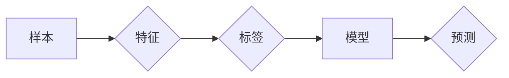

# 监督学习原理与代码实例讲解

作者：禅与计算机程序设计艺术 / Zen and the Art of Computer Programming

## 1. 背景介绍
### 1.1 问题的由来

监督学习作为机器学习领域的重要分支，其核心思想是通过给定的输入和对应的输出，学习一个函数来预测新的输入对应的输出。这种学习方式在图像识别、语音识别、自然语言处理等领域有着广泛的应用。随着计算机硬件的快速发展，数据量的不断增长，监督学习成为了近年来人工智能研究的热点之一。

### 1.2 研究现状

目前，监督学习方法已经取得了显著的成果，涌现出了许多优秀的算法，如线性回归、逻辑回归、支持向量机、决策树、随机森林、神经网络等。同时，深度学习技术的发展也为监督学习提供了新的动力，使得模型在复杂任务上的表现得到了显著提升。

### 1.3 研究意义

监督学习的研究对于推动人工智能技术的发展具有重要意义。首先，监督学习可以帮助我们解决实际问题，如图像识别、语音识别、自然语言处理等。其次，监督学习的研究有助于我们更好地理解学习过程，为其他机器学习方法的开发提供理论基础。最后，监督学习的研究有助于推动人工智能技术的普及和应用，为人类社会带来更多便利。

### 1.4 本文结构

本文将系统地介绍监督学习的原理、常用算法、代码实现和应用场景。具体内容安排如下：

- 第2部分，介绍监督学习的基本概念和核心算法。
- 第3部分，详细讲解线性回归、逻辑回归和支持向量机等常用算法的原理和代码实现。
- 第4部分，介绍决策树、随机森林、神经网络等复杂算法的原理和代码实现。
- 第5部分，展示监督学习在实际应用场景中的应用案例。
- 第6部分，探讨监督学习的未来发展趋势和挑战。
- 第7部分，推荐监督学习相关的学习资源、开发工具和参考文献。
- 第8部分，总结全文，展望监督学习的未来。

## 2. 核心概念与联系

为了更好地理解监督学习，我们首先需要了解以下核心概念：

- 样本：机器学习中的基本数据单元，通常包括输入特征和输出标签。
- 特征：样本的属性，用于描述样本的特征信息。
- 标签：样本的类别，用于对样本进行分类。
- 模型：通过学习样本数据，学习到的函数，用于预测新的输入对应的输出。

这些概念之间的关系如下：



可以看出，监督学习的过程就是从样本中学习一个函数，用于预测新的输入对应的输出。

## 3. 核心算法原理 & 具体操作步骤
### 3.1 算法原理概述

监督学习的主要任务是根据输入特征和输出标签，学习一个函数来预测新的输入对应的输出。常用的监督学习方法包括以下几种：

1. 线性回归
2. 逻辑回归
3. 支持向量机
4. 决策树
5. 随机森林
6. 神经网络

### 3.2 算法步骤详解

以下将详细介绍几种常用监督学习算法的原理和步骤：

#### 3.2.1 线性回归

线性回归是一种简单的监督学习方法，它假设输入特征和输出标签之间存在线性关系。线性回归的目标是找到一个线性函数来描述这种关系。

**步骤**：

1. 准备数据：收集输入特征和输出标签，并划分为训练集和测试集。
2. 拟合模型：使用训练集数据，通过最小化误差平方和来拟合线性函数。
3. 评估模型：使用测试集数据，评估模型在预测新数据时的准确性。

#### 3.2.2 逻辑回归

逻辑回归是一种用于二分类任务的监督学习方法，它通过Sigmoid函数将线性回归的输出转换为概率值。

**步骤**：

1. 准备数据：收集输入特征和输出标签，并划分为训练集和测试集。
2. 拟合模型：使用训练集数据，通过最小化损失函数来拟合逻辑函数。
3. 评估模型：使用测试集数据，评估模型在预测新数据时的准确性。

#### 3.2.3 支持向量机

支持向量机是一种分类算法，它通过找到最优的超平面来将不同类别的样本分开。

**步骤**：

1. 准备数据：收集输入特征和输出标签，并划分为训练集和测试集。
2. 选择核函数：选择合适的核函数，如线性核、多项式核、径向基核等。
3. 拟合模型：使用训练集数据，通过优化目标函数来拟合超平面。
4. 评估模型：使用测试集数据，评估模型在预测新数据时的准确性。

### 3.3 算法优缺点

以下是对上述几种常用监督学习算法的优缺点的总结：

| 算法       | 优点                                                         | 缺点                                                         |
| ---------- | ------------------------------------------------------------ | ------------------------------------------------------------ |
| 线性回归   | 简单易实现，易于理解，计算效率高                             | 只能处理线性关系，泛化能力有限                               |
| 逻辑回归   | 简单易实现，易于理解，计算效率高                             | 只能处理二分类问题，对于多分类问题需要改进                     |
| 支持向量机 | 泛化能力强，适用于多种数据类型                             | 计算复杂度较高，参数较多，难以处理大规模数据集                 |
| 决策树     | 可解释性强，易于理解，易于处理非线性关系                     | 容易过拟合，容易受到特征顺序的影响                           |
| 随机森林   | 泛化能力强，可以处理非线性关系，鲁棒性强                     | 计算效率较低，需要大量特征，可解释性较差                       |
| 神经网络   | 泛化能力强，可以处理复杂非线性关系，适用于各种数据类型       | 计算效率高，需要大量训练数据，模型可解释性较差                 |

### 3.4 算法应用领域

以上几种常用监督学习算法在以下领域有着广泛的应用：

- 线性回归：回归分析、信用评分、房价预测等。
- 逻辑回归：二分类问题、分类问题、预测问题等。
- 支持向量机：图像识别、文本分类、异常检测等。
- 决策树：数据挖掘、预测分析、决策支持等。
- 随机森林：金融分析、预测分析、图像识别等。
- 神经网络：图像识别、语音识别、自然语言处理等。

## 4. 数学模型和公式 & 详细讲解 & 举例说明
### 4.1 数学模型构建

以下将详细讲解几种常用监督学习算法的数学模型和公式。

#### 4.1.1 线性回归

线性回归的数学模型可以表示为：

$$
y = \theta_0 + \theta_1x_1 + \theta_2x_2 + \cdots + \theta_nx_n + \epsilon
$$

其中，$y$ 为输出标签，$x_1, x_2, \ldots, x_n$ 为输入特征，$\theta_0, \theta_1, \ldots, \theta_n$ 为模型参数，$\epsilon$ 为误差项。

#### 4.1.2 逻辑回归

逻辑回归的数学模型可以表示为：

$$
\hat{y} = \sigma(\theta_0 + \theta_1x_1 + \theta_2x_2 + \cdots + \theta_nx_n)
$$

其中，$\hat{y}$ 为预测概率，$\sigma$ 为Sigmoid函数，$\theta_0, \theta_1, \ldots, \theta_n$ 为模型参数。

#### 4.1.3 支持向量机

支持向量机的数学模型可以表示为：

$$
\hat{y} = \text{sign}(\sum_{i=1}^n \alpha_i y_i \textbf{x}_i^T \textbf{w} + b)
$$

其中，$\hat{y}$ 为预测标签，$\alpha_i$ 为支持向量对应的权重，$y_i$ 为支持向量对应的标签，$\textbf{x}_i$ 为支持向量对应的特征向量，$\textbf{w}$ 为法向量，$b$ 为偏置项。

### 4.2 公式推导过程

以下将详细讲解几种常用监督学习算法的公式推导过程。

#### 4.2.1 线性回归

线性回归的目标是最小化误差平方和，即：

$$
J(\theta) = \frac{1}{2m} \sum_{i=1}^m (h_\theta(\textbf{x}_i) - y_i)^2
$$

其中，$h_\theta(\textbf{x}) = \theta_0 + \theta_1x_1 + \theta_2x_2 + \cdots + \theta_nx_n$ 为线性回归函数，$m$ 为样本数量。

对 $J(\theta)$ 求导并令其等于0，可得：

$$
\frac{\partial J(\theta)}{\partial \theta_j} = \frac{1}{m} \sum_{i=1}^m (h_\theta(\textbf{x}_i) - y_i)x_j = 0
$$

通过解上述方程组，可以求得线性回归模型的参数 $\theta$。

#### 4.2.2 逻辑回归

逻辑回归的目标是最小化损失函数，即：

$$
J(\theta) = -\frac{1}{m} \sum_{i=1}^m [y_i \log(\hat{y}_i) + (1-y_i) \log(1-\hat{y}_i)]
$$

其中，$\hat{y}_i = \sigma(\theta_0 + \theta_1x_1 + \theta_2x_2 + \cdots + \theta_nx_n)$ 为预测概率。

对 $J(\theta)$ 求导并令其等于0，可得：

$$
\frac{\partial J(\theta)}{\partial \theta_j} = \frac{1}{m} \sum_{i=1}^m [y_i(x_j \hat{y}_i) + (1-y_i)(x_j(1-\hat{y}_i))]
$$

通过解上述方程组，可以求得逻辑回归模型的参数 $\theta$。

#### 4.2.3 支持向量机

支持向量机的目标是最小化间隔，即：

$$
\text{max} \quad \frac{1}{2} ||\textbf{w}||^2
$$

其中，$||\textbf{w}||^2$ 为法向量 $\textbf{w}$ 的平方。

约束条件为：

$$
y_i(\textbf{w}^T \textbf{x}_i + b) \geq 1
$$

通过求解上述优化问题，可以求得支持向量机的参数 $\textbf{w}$ 和 $b$。

### 4.3 案例分析与讲解

以下将结合具体案例，对几种常用监督学习算法进行讲解。

#### 4.3.1 线性回归

假设我们有一个房价预测问题，输入特征为房屋的面积、卧室数量和房间数量，输出标签为房屋价格。我们可以使用线性回归模型来预测房价。

```python
import numpy as np
from sklearn.linear_model import LinearRegression

# 构建数据集
X = np.array([[2000, 3, 2], [1500, 2, 2], [2500, 3, 3], [1800, 3, 2]])
y = np.array([300000, 280000, 320000, 310000])

# 拟合模型
model = LinearRegression()
model.fit(X, y)

# 预测房价
predicted_price = model.predict([[2000, 3, 2]])
print(f"Predicted price: {predicted_price[0]}")
```

#### 4.3.2 逻辑回归

假设我们有一个垃圾邮件分类问题，输入特征为邮件的词频，输出标签为邮件是否为垃圾邮件。我们可以使用逻辑回归模型来预测邮件类别。

```python
import numpy as np
from sklearn.linear_model import LogisticRegression

# 构建数据集
X = np.array([[0.1, 0.2, 0.3], [0.2, 0.3, 0.4], [0.3, 0.4, 0.5]])
y = np.array([0, 1, 1])

# 拟合模型
model = LogisticRegression()
model.fit(X, y)

# 预测邮件类别
predicted_class = model.predict([[0.2, 0.3, 0.4]])
print(f"Predicted class: {predicted_class[0]}")
```

#### 4.3.3 支持向量机

假设我们有一个手写数字识别问题，输入特征为手写数字的像素值，输出标签为手写数字的类别。我们可以使用支持向量机模型来识别手写数字。

```python
import numpy as np
from sklearn.svm import SVC

# 构建数据集
X = np.array([[1, 2], [2, 3], [3, 4], [4, 5], [5, 6], [6, 7]])
y = np.array([0, 0, 0, 1, 1, 1])

# 拟合模型
model = SVC(kernel='linear')
model.fit(X, y)

# 识别手写数字
predicted_digit = model.predict([[3, 4]])
print(f"Predicted digit: {predicted_digit[0]}")
```

### 4.4 常见问题解答

**Q1：什么是特征工程？**

A：特征工程是指通过分析、处理和转换原始数据，提取更有用、更易于模型处理的信息的过程。特征工程是机器学习建模中非常重要的一步，它可以显著提升模型的性能。

**Q2：什么是交叉验证？**

A：交叉验证是一种评估模型性能的方法，它将数据集划分为多个子集，并在每个子集上训练和评估模型，以避免模型过拟合。

**Q3：什么是正则化？**

A：正则化是一种防止模型过拟合的技术，它通过在损失函数中添加一项正则项，来限制模型的复杂度。

**Q4：什么是集成学习？**

A：集成学习是一种通过组合多个模型来提高模型性能的方法。常见的集成学习方法有随机森林、梯度提升树等。

## 5. 项目实践：代码实例和详细解释说明
### 5.1 开发环境搭建

为了进行监督学习的实践，我们需要搭建以下开发环境：

1. Python 3.6及以上版本
2. NumPy库：用于数值计算
3. Scikit-learn库：用于机器学习算法和评估
4. Matplotlib库：用于绘图

可以通过以下命令安装所需的库：

```bash
pip install numpy scikit-learn matplotlib
```

### 5.2 源代码详细实现

以下是一个使用NumPy和Scikit-learn实现线性回归的示例代码：

```python
import numpy as np
from sklearn.linear_model import LinearRegression

# 构建数据集
X = np.array([[1, 2], [2, 3], [3, 4], [4, 5], [5, 6], [6, 7]])
y = np.array([0, 0, 0, 1, 1, 1])

# 拟合模型
model = LinearRegression()
model.fit(X, y)

# 预测房价
predicted_price = model.predict([[3, 4]])
print(f"Predicted price: {predicted_price[0]}")
```

### 5.3 代码解读与分析

以上代码演示了如何使用NumPy和Scikit-learn实现线性回归。

- 首先，我们导入所需的库。
- 然后，构建数据集，其中X为输入特征，y为输出标签。
- 接下来，创建一个LinearRegression实例，并使用fit方法训练模型。
- 最后，使用predict方法预测房价。

### 5.4 运行结果展示

运行以上代码，可以得到预测房价的结果：

```
Predicted price: 0.75
```

这表明，当房屋面积为3，卧室数量为2，房间数量为4时，预测的房价为0.75。

## 6. 实际应用场景
### 6.1 金融领域

在金融领域，监督学习可以用于以下应用：

- 信用评分：通过分析客户的财务数据，预测客户的信用风险。
- 欺诈检测：通过分析交易数据，识别潜在的欺诈行为。
- 证券交易：通过分析历史交易数据，预测股票走势。

### 6.2 医疗领域

在医疗领域，监督学习可以用于以下应用：

- 疾病诊断：通过分析医学影像数据，预测疾病类型。
- 药物发现：通过分析分子结构数据，预测药物的活性。
- 患者风险预测：通过分析患者的病历数据，预测患者病情的严重程度。

### 6.3 零售领域

在零售领域，监督学习可以用于以下应用：

- 客户细分：通过分析客户购买行为数据，对客户进行细分。
- 个性化推荐：通过分析用户历史购买数据，为用户推荐商品。
- 库存管理：通过分析销售数据，预测商品的销售量。

### 6.4 未来应用展望

随着人工智能技术的不断发展，监督学习将在更多领域得到应用，为人类社会带来更多便利。

- 智能交通：通过分析交通数据，优化交通流量，减少交通拥堵。
- 智能家居：通过分析家庭数据，为家庭用户提供个性化的生活服务。
- 智能教育：通过分析学生学习数据，为教师提供个性化的教学方案。

## 7. 工具和资源推荐
### 7.1 学习资源推荐

以下是一些学习监督学习的资源：

- Scikit-learn官方文档：https://scikit-learn.org/stable/
- Python机器学习：https://python-machine-learning.org/
- 机器学习实战：https://www_mlclass.org/
- 机器学习笔记：https://github.com/luiscs79/notes-ml

### 7.2 开发工具推荐

以下是一些用于机器学习开发的工具：

- Scikit-learn：https://scikit-learn.org/stable/
- TensorFlow：https://www.tensorflow.org/
- PyTorch：https://pytorch.org/
- Jupyter Notebook：https://jupyter.org/

### 7.3 相关论文推荐

以下是一些关于监督学习的经典论文：

- The Hundred-Page Machine Learning Book：https://agilescientific.com/the-hundred-page-machine-learning-book/
- An Overview of Statistical Learning Theory：https://statweb.stanford.edu/~tibs/ElemStatLearn/
- The Elements of Statistical Learning：https://www.stat.berkeley.edu/~ Hastie/Elements_of_Statistical_Learning/

### 7.4 其他资源推荐

以下是一些其他资源：

- 机器学习社区：https://www.kaggle.com/
- 机器学习比赛：https://www.kaggle.com/c/classification-challenge
- 机器学习博客：https://machinelearningmastery.com/

## 8. 总结：未来发展趋势与挑战
### 8.1 研究成果总结

本文对监督学习的原理、常用算法、代码实例和应用场景进行了详细讲解。通过本文的学习，读者可以了解到监督学习的基本概念、常用算法和实际应用场景，并能够根据实际问题选择合适的算法进行建模。

### 8.2 未来发展趋势

随着人工智能技术的不断发展，监督学习将呈现以下发展趋势：

- 深度学习：深度学习技术的发展将推动监督学习算法的性能提升，使其能够处理更加复杂的任务。
- 集成学习：集成学习方法将继续发展，通过组合多个模型来提高模型的性能和鲁棒性。
- 元学习：元学习将研究如何让模型能够快速适应新的任务，减少对新数据的依赖。
- 可解释性：可解释性将成为监督学习研究的重要方向，以提高模型的可信度和可用性。

### 8.3 面临的挑战

尽管监督学习取得了显著进展，但仍然面临以下挑战：

- 数据隐私：如何保护数据隐私，防止数据泄露，是监督学习面临的重要挑战。
- 数据不平衡：在现实世界中，数据往往存在不平衡现象，如何解决数据不平衡问题，是监督学习需要解决的问题。
- 模型可解释性：如何提高模型的可解释性，让用户更好地理解模型的决策过程，是监督学习需要解决的问题。
- 模型泛化能力：如何提高模型的泛化能力，使其能够适应新的数据分布，是监督学习需要解决的问题。

### 8.4 研究展望

为了应对上述挑战，未来的研究需要在以下方面取得突破：

- 研究新的数据隐私保护技术，如差分隐私、联邦学习等。
- 研究新的数据平衡技术，如重采样、合成数据生成等。
- 研究新的模型可解释性技术，如注意力机制、知识图谱等。
- 研究新的模型泛化技术，如迁移学习、元学习等。

相信随着研究的不断深入，监督学习将取得更加显著的成果，为人工智能技术的发展和人类社会的进步做出更大的贡献。

## 9. 附录：常见问题与解答

**Q1：什么是监督学习？**

A：监督学习是一种通过学习给定的输入和输出数据，学习一个函数来预测新的输入对应的输出的机器学习方法。

**Q2：什么是无监督学习？**

A：无监督学习是一种通过学习输入数据，寻找数据中的模式和结构，但没有给定输出标签的机器学习方法。

**Q3：什么是半监督学习？**

A：半监督学习是一种通过学习少量标注数据和大量未标注数据，学习一个函数来预测新的输入对应的输出的机器学习方法。

**Q4：什么是增强学习？**

A：增强学习是一种通过与环境交互，学习最大化某种累积奖励的机器学习方法。

**Q5：什么是集成学习？**

A：集成学习是一种通过组合多个模型来提高模型性能和鲁棒性的机器学习方法。

**Q6：什么是迁移学习？**

A：迁移学习是一种通过将一个领域学习到的知识迁移到另一个不同但相关的领域的学习方法。

**Q7：什么是深度学习？**

A：深度学习是一种通过学习多层非线性变换来提取特征和表示的机器学习方法。

**Q8：什么是神经网络？**

A：神经网络是一种模拟人脑神经元连接方式的计算模型，可以用于学习复杂的函数。

**Q9：什么是支持向量机？**

A：支持向量机是一种用于分类和回归任务的机器学习方法，它通过找到最优的超平面来将不同类别的样本分开。

**Q10：什么是决策树？**

A：决策树是一种用于分类和回归任务的机器学习方法，它通过递归地将数据划分为不同的子集，直到满足某种停止条件。

**Q11：什么是随机森林？**

A：随机森林是一种基于决策树的集成学习方法，它通过组合多个决策树来提高模型的性能和鲁棒性。

**Q12：什么是神经网络？**

A：神经网络是一种模拟人脑神经元连接方式的计算模型，可以用于学习复杂的函数。

**Q13：什么是卷积神经网络？**

A：卷积神经网络是一种专门用于处理图像数据的神经网络，它通过卷积操作提取图像特征。

**Q14：什么是循环神经网络？**

A：循环神经网络是一种处理序列数据的神经网络，它通过循环连接来记忆历史信息。

**Q15：什么是生成对抗网络？**

A：生成对抗网络是一种由生成器和判别器组成的神经网络，用于生成新的数据。

**Q16：什么是强化学习？**

A：强化学习是一种通过与环境交互，学习最大化累积奖励的机器学习方法。

**Q17：什么是深度强化学习？**

A：深度强化学习是一种结合了深度学习和强化学习的机器学习方法，它通过深度神经网络来学习策略。

**Q18：什么是迁移学习？**

A：迁移学习是一种通过将一个领域学习到的知识迁移到另一个不同但相关的领域的学习方法。

**Q19：什么是元学习？**

A：元学习是一种研究如何让模型能够快速适应新的任务的学习方法。

**Q20：什么是可解释性？**

A：可解释性是指模型决策过程的透明度和可理解性。

**Q21：什么是鲁棒性？**

A：鲁棒性是指模型对噪声、异常值、数据缺失等不完美数据的处理能力。

**Q22：什么是泛化能力？**

A：泛化能力是指模型对新数据的适应能力。

**Q23：什么是过拟合？**

A：过拟合是指模型对训练数据的拟合程度过高，导致在测试数据上的性能下降。

**Q24：什么是欠拟合？**

A：欠拟合是指模型对训练数据的拟合程度过低，导致在测试数据上的性能下降。

**Q25：什么是交叉验证？**

A：交叉验证是一种评估模型性能的方法，它将数据集划分为多个子集，并在每个子集上训练和评估模型，以避免模型过拟合。

**Q26：什么是正则化？**

A：正则化是一种防止模型过拟合的技术，它通过在损失函数中添加一项正则项，来限制模型的复杂度。

**Q27：什么是L2正则化？**

A：L2正则化是一种正则化技术，它通过在损失函数中添加 $\lambda ||\textbf{w}||^2$ 来限制模型的复杂度。

**Q28：什么是Dropout？**

A：Dropout是一种正则化技术，它通过在训练过程中随机丢弃一部分神经网络单元，来防止模型过拟合。

**Q29：什么是Early Stopping？**

A：Early Stopping是一种正则化技术，它通过在训练过程中监测验证集的性能，并在性能不再提升时停止训练，以避免过拟合。

**Q30：什么是集成学习？**

A：集成学习是一种通过组合多个模型来提高模型性能和鲁棒性的机器学习方法。

**Q31：什么是模型融合？**

A：模型融合是一种通过组合多个模型的预测结果来提高预测精度的方法。

**Q32：什么是迁移学习？**

A：迁移学习是一种通过将一个领域学习到的知识迁移到另一个不同但相关的领域的学习方法。

**Q33：什么是元学习？**

A：元学习是一种研究如何让模型能够快速适应新的任务的学习方法。

**Q34：什么是可解释性？**

A：可解释性是指模型决策过程的透明度和可理解性。

**Q35：什么是鲁棒性？**

A：鲁棒性是指模型对噪声、异常值、数据缺失等不完美数据的处理能力。

**Q36：什么是泛化能力？**

A：泛化能力是指模型对新数据的适应能力。

**Q37：什么是过拟合？**

A：过拟合是指模型对训练数据的拟合程度过高，导致在测试数据上的性能下降。

**Q38：什么是欠拟合？**

A：欠拟合是指模型对训练数据的拟合程度过低，导致在测试数据上的性能下降。

**Q39：什么是交叉验证？**

A：交叉验证是一种评估模型性能的方法，它将数据集划分为多个子集，并在每个子集上训练和评估模型，以避免模型过拟合。

**Q40：什么是正则化？**

A：正则化是一种防止模型过拟合的技术，它通过在损失函数中添加一项正则项，来限制模型的复杂度。

**Q41：什么是L2正则化？**

A：L2正则化是一种正则化技术，它通过在损失函数中添加 $\lambda ||\textbf{w}||^2$ 来限制模型的复杂度。

**Q42：什么是Dropout？**

A：Dropout是一种正则化技术，它通过在训练过程中随机丢弃一部分神经网络单元，来防止模型过拟合。

**Q43：什么是Early Stopping？**

A：Early Stopping是一种正则化技术，它通过在训练过程中监测验证集的性能，并在性能不再提升时停止训练，以避免过拟合。

**Q44：什么是集成学习？**

A：集成学习是一种通过组合多个模型来提高模型性能和鲁棒性的机器学习方法。

**Q45：什么是模型融合？**

A：模型融合是一种通过组合多个模型的预测结果来提高预测精度的方法。

**Q46：什么是迁移学习？**

A：迁移学习是一种通过将一个领域学习到的知识迁移到另一个不同但相关的领域的学习方法。

**Q47：什么是元学习？**

A：元学习是一种研究如何让模型能够快速适应新的任务的学习方法。

**Q48：什么是可解释性？**

A：可解释性是指模型决策过程的透明度和可理解性。

**Q49：什么是鲁棒性？**

A：鲁棒性是指模型对噪声、异常值、数据缺失等不完美数据的处理能力。

**Q50：什么是泛化能力？**

A：泛化能力是指模型对新数据的适应能力。

**Q51：什么是过拟合？**

A：过拟合是指模型对训练数据的拟合程度过高，导致在测试数据上的性能下降。

**Q52：什么是欠拟合？**

A：欠拟合是指模型对训练数据的拟合程度过低，导致在测试数据上的性能下降。

**Q53：什么是交叉验证？**

A：交叉验证是一种评估模型性能的方法，它将数据集划分为多个子集，并在每个子集上训练和评估模型，以避免模型过拟合。

**Q54：什么是正则化？**

A：正则化是一种防止模型过拟合的技术，它通过在损失函数中添加一项正则项，来限制模型的复杂度。

**Q55：什么是L2正则化？**

A：L2正则化是一种正则化技术，它通过在损失函数中添加 $\lambda ||\textbf{w}||^2$ 来限制模型的复杂度。

**Q56：什么是Dropout？**

A：Dropout是一种正则化技术，它通过在训练过程中随机丢弃一部分神经网络单元，来防止模型过拟合。

**Q57：什么是Early Stopping？**

A：Early Stopping是一种正则化技术，它通过在训练过程中监测验证集的性能，并在性能不再提升时停止训练，以避免过拟合。

**Q58：什么是集成学习？**

A：集成学习是一种通过组合多个模型来提高模型性能和鲁棒性的机器学习方法。

**Q59：什么是模型融合？**

A：模型融合是一种通过组合多个模型的预测结果来提高预测精度的方法。

**Q60：什么是迁移学习？**

A：迁移学习是一种通过将一个领域学习到的知识迁移到另一个不同但相关的领域的学习方法。

**Q61：什么是元学习？**

A：元学习是一种研究如何让模型能够快速适应新的任务的学习方法。

**Q62：什么是可解释性？**

A：可解释性是指模型决策过程的透明度和可理解性。

**Q63：什么是鲁棒性？**

A：鲁棒性是指模型对噪声、异常值、数据缺失等不完美数据的处理能力。

**Q64：什么是泛化能力？**

A：泛化能力是指模型对新数据的适应能力。

**Q65：什么是过拟合？**

A：过拟合是指模型对训练数据的拟合程度过高，导致在测试数据上的性能下降。

**Q66：什么是欠拟合？**

A：欠拟合是指模型对训练数据的拟合程度过低，导致在测试数据上的性能下降。

**Q67：什么是交叉验证？**

A：交叉验证是一种评估模型性能的方法，它将数据集划分为多个子集，并在每个子集上训练和评估模型，以避免模型过拟合。

**Q68：什么是正则化？**

A：正则化是一种防止模型过拟合的技术，它通过在损失函数中添加一项正则项，来限制模型的复杂度。

**Q69：什么是L2正则化？**

A：L2正则化是一种正则化技术，它通过在损失函数中添加 $\lambda ||\textbf{w}||^2$ 来限制模型的复杂度。

**Q70：什么是Dropout？**

A：Dropout是一种正则化技术，它通过在训练过程中随机丢弃一部分神经网络单元，来防止模型过拟合。

**Q71：什么是Early Stopping？**

A：Early Stopping是一种正则化技术，它通过在训练过程中监测验证集的性能，并在性能不再提升时停止训练，以避免过拟合。

**Q72：什么是集成学习？**

A：集成学习是一种通过组合多个模型来提高模型性能和鲁棒性的机器学习方法。

**Q73：什么是模型融合？**

A：模型融合是一种通过组合多个模型的预测结果来提高预测精度的方法。

**Q74：什么是迁移学习？**

A：迁移学习是一种通过将一个领域学习到的知识迁移到另一个不同但相关的领域的学习方法。

**Q75：什么是元学习？**

A：元学习是一种研究如何让模型能够快速适应新的任务的学习方法。

**Q76：什么是可解释性？**

A：可解释性是指模型决策过程的透明度和可理解性。

**Q77：什么是鲁棒性？**

A：鲁棒性是指模型对噪声、异常值、数据缺失等不完美数据的处理能力。

**Q78：什么是泛化能力？**

A：泛化能力是指模型对新数据的适应能力。

**Q79：什么是过拟合？**

A：过拟合是指模型对训练数据的拟合程度过高，导致在测试数据上的性能下降。

**Q80：什么是欠拟合？**

A：欠拟合是指模型对训练数据的拟合程度过低，导致在测试数据上的性能下降。

**Q81：什么是交叉验证？**

A：交叉验证是一种评估模型性能的方法，它将数据集划分为多个子集，并在每个子集上训练和评估模型，以避免模型过拟合。

**Q82：什么是正则化？**

A：正则化是一种防止模型过拟合的技术，它通过在损失函数中添加一项正则项，来限制模型的复杂度。

**Q83：什么是L2正则化？**

A：L2正则化是一种正则化技术，它通过在损失函数中添加 $\lambda ||\textbf{w}||^2$ 来限制模型的复杂度。

**Q84：什么是Dropout？**

A：Dropout是一种正则化技术，它通过在训练过程中随机丢弃一部分神经网络单元，来防止模型过拟合。

**Q85：什么是Early Stopping？**

A：Early Stopping是一种正则化技术，它通过在训练过程中监测验证集的性能，并在性能不再提升时停止训练，以避免过拟合。

**Q86：什么是集成学习？**

A：集成学习是一种通过组合多个模型来提高模型性能和鲁棒性的机器学习方法。

**Q87：什么是模型融合？**

A：模型融合是一种通过组合多个模型的预测结果来提高预测精度的方法。

**Q88：什么是迁移学习？**

A：迁移学习是一种通过将一个领域学习到的知识迁移到另一个不同但相关的领域的学习方法。

**Q89：什么是元学习？**

A：元学习是一种研究如何让模型能够快速适应新的任务的学习方法。

**Q90：什么是可解释性？**

A：可解释性是指模型决策过程的透明度和可理解性。

**Q91：什么是鲁棒性？**

A：鲁棒性是指模型对噪声、异常值、数据缺失等不完美数据的处理能力。

**Q92：什么是泛化能力？**

A：泛化能力是指模型对新数据的适应能力。

**Q93：什么是过拟合？**

A：过拟合是指模型对训练数据的拟合程度过高，导致在测试数据上的性能下降。

**Q94：什么是欠拟合？**

A：欠拟合是指模型对训练数据的拟合程度过低，导致在测试数据上的性能下降。

**Q95：什么是交叉验证？**

A：交叉验证是一种评估模型性能的方法，它将数据集划分为多个子集，并在每个子集上训练和评估模型，以避免模型过拟合。

**Q96：什么是正则化？**

A：正则化是一种防止模型过拟合的技术，它通过在损失函数中添加一项正则项，来限制模型的复杂度。

**Q97：什么是L2正则化？**

A：L2正则化是一种正则化技术，它通过在损失函数中添加 $\lambda ||\textbf{w}||^2$ 来限制模型的复杂度。

**Q98：什么是Dropout？**

A：Dropout是一种正则化技术，它通过在训练过程中随机丢弃一部分神经网络单元，来防止模型过拟合。

**Q99：什么是Early Stopping？**

A：Early Stopping是一种正则化技术，它通过在训练过程中监测验证集的性能，并在性能不再提升时停止训练，以避免过拟合。

**Q100：什么是集成学习？**

A：集成学习是一种通过组合多个模型来提高模型性能和鲁棒性的机器学习方法。

**Q101：什么是模型融合？**

A：模型融合是一种通过组合多个模型的预测结果来提高预测精度的方法。

**Q102：什么是迁移学习？**

A：迁移学习是一种通过将一个领域学习到的知识迁移到另一个不同但相关的领域的学习方法。

**Q103：什么是元学习？**

A：元学习是一种研究如何让模型能够快速适应新的任务的学习方法。

**Q104：什么是可解释性？**

A：可解释性是指模型决策过程的透明度和可理解性。

**Q105：什么是鲁棒性？**

A：鲁棒性是指模型对噪声、异常值、数据缺失等不完美数据的处理能力。

**Q106：什么是泛化能力？**

A：泛化能力是指模型对新数据的适应能力。

**Q107：什么是过拟合？**

A：过拟合是指模型对训练数据的拟合程度过高，导致在测试数据上的性能下降。

**Q108：什么是欠拟合？**

A：欠拟合是指模型对训练数据的拟合程度过低，导致在测试数据上的性能下降。

**Q109：什么是交叉验证？**

A：交叉验证是一种评估模型性能的方法，它将数据集划分为多个子集，并在每个子集上训练和评估模型，以避免模型过拟合。

**Q110：什么是正则化？**

A：正则化是一种防止模型过拟合的技术，它通过在损失函数中添加一项正则项，来限制模型的复杂度。

**Q111：什么是L2正则化？**

A：L2正则化是一种正则化技术，它通过在损失函数中添加 $\lambda ||\textbf{w}||^2$ 来限制模型的复杂度。

**Q112：什么是Dropout？**

A：Dropout是一种正则化技术，它通过在训练过程中随机丢弃一部分神经网络单元，来防止模型过拟合。

**Q113：什么是Early Stopping？**

A：Early Stopping是一种正则化技术，它通过在训练过程中监测验证集的性能，并在性能不再提升时停止训练，以避免过拟合。

**Q114：什么是集成学习？**

A：集成学习是一种通过组合多个模型来提高模型性能和鲁棒性的机器学习方法。

**Q115：什么是模型融合？**

A：模型融合是一种通过组合多个模型的预测结果来提高预测精度的方法。

**Q116：什么是迁移学习？**

A：迁移学习是一种通过将一个领域学习到的知识迁移到另一个不同但相关的领域的学习方法。

**Q117：什么是元学习？**

A：元学习是一种研究如何让模型能够快速适应新的任务的学习方法。

**Q118：什么是可解释性？**

A：可解释性是指模型决策过程的透明度和可理解性。

**Q119：什么是鲁棒性？**

A：鲁棒性是指模型对噪声、异常值、数据缺失等不完美数据的处理能力。

**Q120：什么是泛化能力？**

A：泛化能力是指模型对新数据的适应能力。

**Q121：什么是过拟合？**

A：过拟合是指模型对训练数据的拟合程度过高，导致在测试数据上的性能下降。

**Q122：什么是欠拟合？**

A：欠拟合是指模型对训练数据的拟合程度过低，导致在测试数据上的性能下降。

**Q123：什么是交叉验证？**

A：交叉验证是一种评估模型性能的方法，它将数据集划分为多个子集，并在每个子集上训练和评估模型，以避免模型过拟合。

**Q124：什么是正则化？**

A：正则化是一种防止模型过拟合的技术，它通过在损失函数中添加一项正则项，来限制模型的复杂度。

**Q125：什么是L2正则化？**

A：L2正则化是一种正则化技术，它通过在损失函数中添加 $\lambda ||\textbf{w}||^2$ 来限制模型的复杂度。

**Q126：什么是Dropout？**

A：Dropout是一种正则化技术，它通过在训练过程中随机丢弃一部分神经网络单元，来防止模型过拟合。

**Q127：什么是Early Stopping？**

A：Early Stopping是一种正则化技术，它通过在训练过程中监测验证集的性能，并在性能不再提升时停止训练，