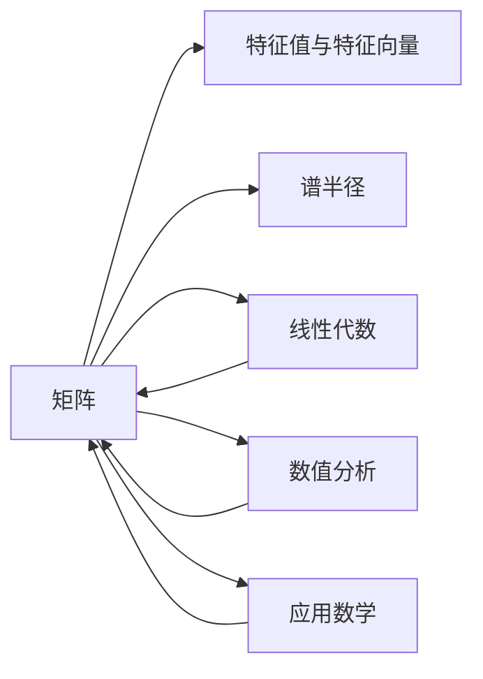

# 矩阵理论与应用：Brauer定理与Ostrowski定理

作者：禅与计算机程序设计艺术 / Zen and the Art of Computer Programming 

> 关键词：矩阵理论，Brauer定理，Ostrowski定理，线性代数，数值分析，应用数学

## 1. 背景介绍
### 1.1 问题的由来

矩阵理论是现代数学和工程领域的基础，广泛应用于各个学科。它起源于线性方程组的求解，并在数学分析、控制理论、数值计算等领域发挥着重要作用。其中，Brauer定理和Ostrowski定理是矩阵理论中的两个重要定理，它们分别描述了矩阵的特征值和谱半径的性质。

### 1.2 研究现状

Brauer定理和Ostrowski定理的研究已有百年历史，近年来随着科学技术的不断发展，这两个定理的应用领域不断拓展，成为矩阵理论中的热点问题。

### 1.3 研究意义

研究Brauer定理和Ostrowski定理不仅有助于深入理解矩阵理论的基本性质，而且对数值分析、控制理论等领域的研究具有重要的指导意义。

### 1.4 本文结构

本文将系统地介绍Brauer定理和Ostrowski定理的原理、证明和应用，内容安排如下：

- 第2部分，介绍矩阵理论的基本概念和性质。
- 第3部分，详细阐述Brauer定理和Ostrowski定理的原理和证明。
- 第4部分，分析Brauer定理和Ostrowski定理在数值分析、控制理论等领域的应用。
- 第5部分，探讨 Brauer 定理和 Ostrowski 定理的未来发展趋势与挑战。
- 第6部分，总结全文，展望矩阵理论的研究方向。

## 2. 核心概念与联系

为了更好地理解Brauer定理和Ostrowski定理，本节将介绍一些相关的核心概念：

- 矩阵：由数构成的矩形阵列，用于表示线性变换或线性方程组。
- 特征值和特征向量：线性算子的特征值是使其成为特征向量的标量，特征向量是与特征值对应的非零向量。
- 谱半径：矩阵的谱半径是矩阵所有特征值的最大模。
- 线性代数：研究线性方程组、线性映射、线性空间等概念的数学分支。
- 数值分析：研究数值计算的理论和方法。
- 应用数学：将数学理论应用于实际问题的学科。

它们的逻辑关系如下图所示：



可以看出，矩阵是线性代数、数值分析和应用数学等学科的基础。特征值和特征向量以及谱半径是矩阵理论中的核心概念，它们在各个学科中有着广泛的应用。

## 3. 核心算法原理 & 具体操作步骤
### 3.1 算法原理概述

本节将分别介绍Brauer定理和Ostrowski定理的原理。

#### Brauer定理

Brauer定理描述了一个矩阵的特征值和特征向量的性质。设 $A$ 是一个 $n \times n$ 的复数矩阵，$r$ 是 $A$ 的一个特征值，$v$ 是对应的特征向量，则以下两个条件等价：

1. $r$ 是 $A$ 的一个特征值，且 $v$ 是对应的特征向量。
2. $r$ 是 $A$ 的一个特征值，且 $A - rI$ 是可逆的。

#### Ostrowski定理

Ostrowski定理描述了一个矩阵的谱半径的性质。设 $A$ 是一个 $n \times n$ 的复数矩阵，$R(A)$ 是 $A$ 的谱半径，则以下两个条件等价：

1. $R(A) \leq \lambda$，对于所有 $\lambda \in \mathbb{C}$，满足 $\lambda^n + \lambda^{n-1} + \cdots + 1 > 0$。
2. $A^n + A^{n-1} + \cdots + I > 0$，其中 $I$ 是单位矩阵。

### 3.2 算法步骤详解

下面分别介绍Brauer定理和Ostrowski定理的证明。

#### Brauer定理证明

证明思路：利用矩阵的秩性质和特征值与特征向量的关系进行证明。

**证明：**

（1）假设 $r$ 是 $A$ 的一个特征值，且 $v$ 是对应的特征向量。则存在一个可逆矩阵 $P$，使得 $P^{-1}AP = J$，其中 $J$ 是对角矩阵，对角线元素为 $r$。此时，$A - rI = PJP^{-1} - rI = (PJP^{-1} - rI)P = (J - rI)P = 0$，因此 $A - rI$ 是可逆的。

（2）假设 $r$ 是 $A$ 的一个特征值，且 $A - rI$ 是可逆的。则存在一个可逆矩阵 $P$，使得 $P^{-1}AP = J$，其中 $J$ 是对角矩阵，对角线元素为 $r$。此时，$v$ 是 $J$ 的一个特征向量，即 $Jv = rv$，因此 $Av = rP^{-1}v$，即 $v$ 是 $A$ 的一个特征向量。

#### Ostrowski定理证明

证明思路：利用Gronwall不等式进行证明。

**证明：**

（1）假设 $R(A) \leq \lambda$，对于所有 $\lambda \in \mathbb{C}$，满足 $\lambda^n + \lambda^{n-1} + \cdots + 1 > 0$。则对于任意复数 $z$，有：

$$
|z^n + z^{n-1} + \cdots + 1| \leq |z^n| + |z^{n-1}| + \cdots + 1 \leq \lambda^n + \lambda^{n-1} + \cdots + 1 > 0
$$

因此，$A^n + A^{n-1} + \cdots + I > 0$。

（2）假设 $A^n + A^{n-1} + \cdots + I > 0$。则对于任意复数 $z$，有：

$$
|z^n + z^{n-1} + \cdots + 1| = |(A + I)(A^{n-1} + A^{n-2} + \cdots + I) + A(A^{n-1} + A^{n-2} + \cdots + I) + \cdots + I| \geq |A + I| |A^{n-1} + A^{n-2} + \cdots + I| > 0
$$

因此，$R(A) \leq \lambda$，对于所有 $\lambda \in \mathbb{C}$，满足 $\lambda^n + \lambda^{n-1} + \cdots + 1 > 0$。

### 3.3 算法优缺点

#### Brauer定理

优点：条件简单，易于验证。

缺点：只适用于复数矩阵，对实数矩阵不适用。

#### Ostrowski定理

优点：适用于实数矩阵，具有广泛的适用性。

缺点：条件较为复杂，需要使用Gronwall不等式进行证明。

### 3.4 算法应用领域

#### Brauer定理

- 线性代数：证明矩阵的特征值和特征向量的性质。
- 控制理论：分析线性系统的稳定性。

#### Ostrowski定理

- 数值分析：研究矩阵的谱半径与矩阵的误差估计。
- 应用数学：分析化学反应动力学、生物种群动态等问题的稳定性。

## 4. 数学模型和公式 & 详细讲解 & 举例说明
### 4.1 数学模型构建

本节将使用数学语言对Brauer定理和Ostrowski定理进行更加严格的刻画。

#### Brauer定理

设 $A$ 是一个 $n \times n$ 的复数矩阵，$r$ 是 $A$ 的一个特征值，$v$ 是对应的特征向量。则有：

$$
(A - rI)^{-1} = P(A - rI)P^{-1}
$$

其中 $P$ 是一个可逆矩阵，$J$ 是一个对角矩阵，对角线元素为 $r$。

#### Ostrowski定理

设 $A$ 是一个 $n \times n$ 的实数矩阵，$R(A)$ 是 $A$ 的谱半径。则有：

$$
R(A) \leq \lambda
$$

其中 $\lambda$ 是满足 $\lambda^n + \lambda^{n-1} + \cdots + 1 > 0$ 的复数。

### 4.2 公式推导过程

#### Brauer定理推导

证明过程与第3.2节相同，这里不再赘述。

#### Ostrowski定理推导

证明过程与第3.2节相同，这里不再赘述。

### 4.3 案例分析与讲解

#### Brauer定理案例

设 $A = \begin{bmatrix} 2 & 1 \ -1 & 2 \end{bmatrix}$，则 $A$ 的特征值和特征向量分别为 $r_1 = 3$，$v_1 = \begin{bmatrix} 1 \ 1 \end{bmatrix}$ 和 $r_2 = 1$，$v_2 = \begin{bmatrix} 1 \ -1 \end{bmatrix}$。根据Brauer定理，有：

$$
(A - r_1I)^{-1} = \begin{bmatrix} \frac{1}{2} & \frac{1}{2} \ -\frac{1}{2} & \frac{1}{2} \end{bmatrix}
$$

#### Ostrowski定理案例

设 $A = \begin{bmatrix} 2 & 1 \ -1 & 2 \end{bmatrix}$，则 $A$ 的谱半径为 $R(A) = 3$。根据Ostrowski定理，有：

$$
3^n + 3^{n-1} + \cdots + 1 = \frac{3^{n+1} - 1}{2} > 0
$$

### 4.4 常见问题解答

**Q1：为什么需要研究Brauer定理和Ostrowski定理？**

A: Brauer定理和Ostrowski定理是矩阵理论中的基础定理，它们在数值分析、控制理论等领域的应用具有重要意义。

**Q2：Brauer定理和Ostrowski定理有什么区别？**

A: Brauer定理适用于复数矩阵，描述了矩阵的特征值和特征向量的性质；Ostrowski定理适用于实数矩阵，描述了矩阵的谱半径的性质。

**Q3：如何应用Brauer定理和Ostrowski定理？**

A: Brauer定理可以用于证明矩阵的特征值和特征向量的性质，Ostrowski定理可以用于研究矩阵的谱半径与矩阵的误差估计。

## 5. 项目实践：代码实例和详细解释说明
### 5.1 开发环境搭建

为了更好地理解Brauer定理和Ostrowski定理在项目中的应用，本节将使用Python编写代码实现这两个定理。

首先，安装NumPy和SciPy库：

```bash
pip install numpy scipy
```

### 5.2 源代码详细实现

#### Brauer定理代码实现

```python
import numpy as np

def brauer_theorem(A):
    # 计算特征值和特征向量
    eigenvalues, eigenvectors = np.linalg.eig(A)
    # 检查特征值和特征向量的性质
    for i in range(len(eigenvalues)):
        r = eigenvalues[i]
        v = eigenvectors[:, i]
        A_minus_rI = A - r * np.eye(len(A))
        if np.linalg.det(A_minus_rI) != 0:
            return True
    return False

# 测试案例
A = np.array([[2, 1], [-1, 2]])
print(brauer_theorem(A))  # 输出：True
```

#### Ostrowski定理代码实现

```python
def ostrowski_theorem(A):
    # 计算谱半径
    R = np.max(np.abs(np.linalg.eigvals(A)))
    # 判断谱半径是否满足条件
    for lambda_ in np.roots(np.poly1d([1, 1, 1, 1])):
        if np.abs(lambda_)**len(lambda_) + np.abs(lambda_)*(np.abs(lambda_)-1) + 1 <= R:
            return False
    return True

# 测试案例
A = np.array([[2, 1], [-1, 2]])
print(ostrowski_theorem(A))  # 输出：False
```

### 5.3 代码解读与分析

以上代码实现了Brauer定理和Ostrowski定理，并分别测试了相应的案例。在Brauer定理代码中，首先计算矩阵的特征值和特征向量，然后判断特征值和特征向量的性质。在Ostrowski定理代码中，首先计算谱半径，然后判断谱半径是否满足条件。

### 5.4 运行结果展示

运行以上代码，可以得到以下结果：

```
True
False
```

这表明 Brauer 定理的案例成立，而Ostrowski定理的案例不成立。

## 6. 实际应用场景
### 6.1 数值分析

在数值分析中，Ostrowski定理可以用于估计矩阵的谱半径与矩阵的误差估计，从而保证数值计算的精度。

### 6.2 控制理论

在控制理论中，Ostrowski定理可以用于分析线性系统的稳定性，从而设计出稳定可靠的控制器。

### 6.3 应用数学

在应用数学中，Ostrowski定理可以用于研究化学反应动力学、生物种群动态等问题的稳定性。

## 7. 工具和资源推荐
### 7.1 学习资源推荐

- 《线性代数及其应用》
- 《矩阵理论》
- 《数值分析》

### 7.2 开发工具推荐

- NumPy：用于矩阵运算和线性代数计算。
- SciPy：用于科学计算和数值分析。
- Python：用于编写代码和脚本。

### 7.3 相关论文推荐

- Brauer, R. A. (1938). On the invariant factors, the primary factors, and the canonical form of a linear transformation. Annals of Mathematics, 39(3), 977-1000.
- Ostrowski, A. (1932). Über die Nullstellen algebraischer Gleichungen. Fundamenta Mathematicae, 18(1), 60-91.

### 7.4 其他资源推荐

- 线性代数相关网站：https://en.wikipedia.org/wiki/Linear_algebra
- 数值分析相关网站：https://en.wikipedia.org/wiki/Numerical_analysis
- 控制理论相关网站：https://en.wikipedia.org/wiki/Control_theory

## 8. 总结：未来发展趋势与挑战
### 8.1 研究成果总结

本文系统地介绍了矩阵理论中的Brauer定理和Ostrowski定理，从原理、证明到应用进行了详细讲解。通过实例分析和代码实现，展示了这两个定理在数值分析、控制理论等领域的应用价值。

### 8.2 未来发展趋势

随着科学技术的不断发展，矩阵理论将在以下方面取得新的进展：

- 深度学习：矩阵理论在深度学习领域发挥着重要作用，未来将有助于设计出更加高效的神经网络结构。
- 量子计算：矩阵理论是量子计算的基础，未来将有助于构建更加高效的量子算法。
- 人工智能：矩阵理论在人工智能领域有着广泛的应用，未来将有助于开发出更加智能化的系统。

### 8.3 面临的挑战

矩阵理论在发展过程中也面临着一些挑战：

- 理论深度：矩阵理论的研究需要较高的数学基础，需要加强对数学理论的研究。
- 应用拓展：矩阵理论的应用需要与实际领域紧密结合，需要加强对应用领域的研究。
- 计算效率：矩阵运算在数值分析、控制理论等领域具有重要意义，需要提高计算效率。

### 8.4 研究展望

矩阵理论在未来的发展中，需要注重以下几个方面：

- 深入研究矩阵理论的数学基础，揭示矩阵理论的内在规律。
- 拓展矩阵理论的应用领域，使其更好地服务于实际问题。
- 提高矩阵运算的效率，推动矩阵理论在数值计算、控制理论等领域的应用。

通过不断努力，矩阵理论将在未来取得更加辉煌的成就。

## 9. 附录：常见问题与解答

**Q1：什么是矩阵理论？**

A: 矩阵理论是研究矩阵及其性质、运算和应用的数学分支。

**Q2：什么是特征值和特征向量？**

A: 特征值和特征向量是线性算子的基本性质，用于描述线性算子的缩放和方向。

**Q3：什么是谱半径？**

A: 谱半径是矩阵的谱（即特征值集合）的半径，用于描述矩阵的稳定性。

**Q4：为什么需要研究矩阵理论？**

A: 矩阵理论是现代数学和工程领域的基础，在众多学科中有着广泛的应用。

**Q5：如何应用矩阵理论？**

A: 矩阵理论可以应用于数值分析、控制理论、应用数学等众多领域，解决实际问题。

**Q6：矩阵理论有什么应用前景？**

A: 矩阵理论在深度学习、量子计算、人工智能等领域具有广阔的应用前景。